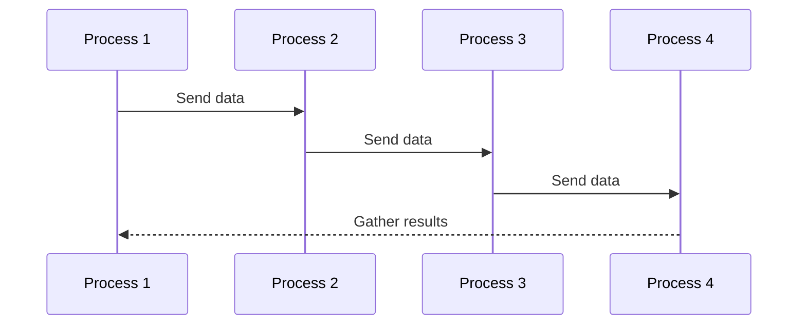
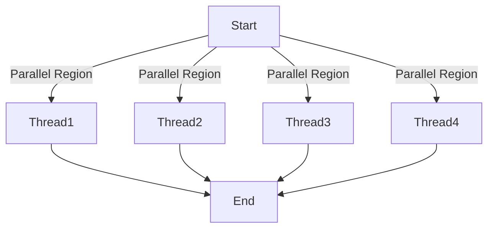

## 14.1 High-Performance Computing Applications

High-Performance Computing (HPC) is a field that leverages the power of parallel processing to solve complex computational problems. In this section, we will delve into how C++ design patterns can be applied to performance-critical systems, focusing on parallel computing with MPI (Message Passing Interface) and OpenMP (Open Multi-Processing). By the end of this guide, you'll have a comprehensive understanding of how to harness the power of C++ for high-performance applications.

### Introduction to High-Performance Computing

High-Performance Computing involves the use of supercomputers and parallel processing techniques for solving advanced computation problems. These applications range from scientific simulations, financial modeling, to complex data analysis tasks. The goal is to achieve high throughput and low latency, enabling the processing of large datasets and complex calculations in a fraction of the time it would take on a single processor.

#### Key Concepts in HPC

1. **Parallel Processing**: The simultaneous use of multiple compute resources to solve a computational problem.
2. **Scalability**: The ability of a system to handle increased load by adding resources.
3. **Efficiency**: The ratio of useful work performed by a computer system to the total resources used.

### C++ in High-Performance Computing

C++ is a preferred language in HPC due to its performance efficiency, rich set of libraries, and support for both low-level and high-level programming. It allows developers to write code that is both close to the hardware and abstract enough to manage complex systems.

#### Advantages of Using C++ in HPC

- **Performance**: C++ provides fine-grained control over system resources, enabling optimizations that are crucial for HPC.
- **Portability**: C++ code can be compiled on various platforms, making it suitable for diverse HPC environments.
- **Rich Libraries**: C++ has a vast ecosystem of libraries that support scientific computing, data analysis, and more.

### Design Patterns in High-Performance Computing

Design patterns provide reusable solutions to common problems in software design. In HPC, design patterns help in structuring code for parallel execution, managing resources efficiently, and ensuring scalability.

#### Common Design Patterns in HPC

1. **Parallel Patterns**: Patterns that facilitate parallel execution, such as Fork-Join and MapReduce.
2. **Data Management Patterns**: Patterns that optimize data storage and retrieval, such as Data Locality and Data Partitioning.
3. **Synchronization Patterns**: Patterns that manage access to shared resources, such as Mutex and Semaphore.

### Parallel Computing with MPI

MPI is a standardized and portable message-passing system designed to function on a wide variety of parallel computing architectures. It is widely used in HPC for its ability to efficiently manage communication between processes running on different nodes.

#### Key Features of MPI

- **Process Management**: MPI provides mechanisms for process creation, communication, and synchronization.
- **Communication Models**: Supports point-to-point and collective communication.
- **Scalability**: Efficiently handles communication in large-scale systems.

#### Implementing MPI in C++

To demonstrate the use of MPI in C++, let's consider a simple example of parallel matrix multiplication. This example will illustrate how to distribute work across multiple processes and gather the results.

```cpp
#include <mpi.h>
#include <iostream>
#include <vector>

// Function to perform matrix multiplication
void matrixMultiply(const std::vector<std::vector<int>>& A, const std::vector<std::vector<int>>& B, std::vector<std::vector<int>>& C, int start, int end) {
    int N = A.size();
    for (int i = start; i < end; ++i) {
        for (int j = 0; j < N; ++j) {
            C[i][j] = 0;
            for (int k = 0; k < N; ++k) {
                C[i][j] += A[i][k] * B[k][j];
            }
        }
    }
}

int main(int argc, char** argv) {
    MPI_Init(&argc, &argv);

    int world_size;
    MPI_Comm_size(MPI_COMM_WORLD, &world_size);

    int world_rank;
    MPI_Comm_rank(MPI_COMM_WORLD, &world_rank);

    const int N = 4; // Size of the matrix
    std::vector<std::vector<int>> A(N, std::vector<int>(N, 1));
    std::vector<std::vector<int>> B(N, std::vector<int>(N, 1));
    std::vector<std::vector<int>> C(N, std::vector<int>(N, 0));

    int rows_per_process = N / world_size;
    int start = world_rank * rows_per_process;
    int end = (world_rank + 1) * rows_per_process;

    // Perform matrix multiplication
    matrixMultiply(A, B, C, start, end);

    // Gather results from all processes
    if (world_rank != 0) {
        MPI_Send(&C[start][0], rows_per_process * N, MPI_INT, 0, 0, MPI_COMM_WORLD);
    } else {
        for (int p = 1; p < world_size; ++p) {
            MPI_Recv(&C[p * rows_per_process][0], rows_per_process * N, MPI_INT, p, 0, MPI_COMM_WORLD, MPI_STATUS_IGNORE);
        }
    }

    if (world_rank == 0) {
        std::cout << "Resultant Matrix C:" << std::endl;
        for (const auto& row : C) {
            for (int elem : row) {
                std::cout << elem << " ";
            }
            std::cout << std::endl;
        }
    }

    MPI_Finalize();
    return 0;
}
```

**Explanation of the Code:**

- **MPI Initialization**: The program begins by initializing the MPI environment using `MPI_Init`.
- **Process Management**: We determine the number of processes and the rank of each process using `MPI_Comm_size` and `MPI_Comm_rank`.
- **Matrix Multiplication**: The work is divided among processes, with each process responsible for computing a portion of the result matrix.
- **Communication**: Non-root processes send their computed results to the root process, which gathers and combines them.
- **Finalization**: The MPI environment is finalized with `MPI_Finalize`.

### Parallel Computing with OpenMP

OpenMP is an API that supports multi-platform shared memory multiprocessing programming in C, C++, and Fortran. It is used to develop parallel applications on shared memory architectures.

#### Key Features of OpenMP

- **Ease of Use**: OpenMP uses compiler directives to parallelize code, making it easy to implement.
- **Scalability**: Supports dynamic adjustment of the number of threads.
- **Portability**: OpenMP is supported by most compilers, ensuring code portability.

#### Implementing OpenMP in C++

Let's explore how to use OpenMP to parallelize a simple loop for vector addition.

```cpp
#include <iostream>
#include <vector>
#include <omp.h>

int main() {
    const int N = 1000;
    std::vector<int> A(N, 1);
    std::vector<int> B(N, 2);
    std::vector<int> C(N, 0);

    // Parallelize the loop using OpenMP
    #pragma omp parallel for
    for (int i = 0; i < N; ++i) {
        C[i] = A[i] + B[i];
    }

    // Display the result
    std::cout << "Vector C:" << std::endl;
    for (int i = 0; i < 10; ++i) { // Display first 10 elements
        std::cout << C[i] << " ";
    }
    std::cout << std::endl;

    return 0;
}
```

**Explanation of the Code:**

- **OpenMP Directive**: The `#pragma omp parallel for` directive is used to parallelize the loop. OpenMP automatically distributes iterations across available threads.
- **Vector Addition**: Each thread computes a portion of the resultant vector `C`.
- **Result Display**: The first 10 elements of the resultant vector are displayed.

### Design Considerations for HPC Applications

When designing HPC applications, several considerations must be taken into account to ensure optimal performance and scalability.

#### Data Locality

Data locality refers to the access patterns of data in memory. Optimizing data locality can significantly improve cache performance and reduce memory access latency.

#### Load Balancing

Load balancing ensures that all processors or threads are utilized efficiently, preventing some from being idle while others are overloaded. This is crucial for achieving maximum performance in parallel applications.

#### Synchronization

Proper synchronization is necessary to manage access to shared resources and prevent race conditions. However, excessive synchronization can lead to performance bottlenecks.

### Visualizing Parallel Computing with MPI and OpenMP

To better understand the flow of parallel computing with MPI and OpenMP, let's visualize the process using Mermaid.js diagrams.

#### MPI Process Communication



**Diagram Description**: This sequence diagram illustrates the communication flow between processes in an MPI application. Each process sends data to the next, and the final process gathers the results.

#### OpenMP Thread Execution



**Diagram Description**: This flowchart represents the execution of threads in an OpenMP application. The parallel region is executed by multiple threads concurrently.

### Try It Yourself

To deepen your understanding of MPI and OpenMP, try modifying the provided code examples:

1. **MPI Example**: Increase the size of the matrices and observe how the performance scales with the number of processes.
2. **OpenMP Example**: Experiment with different numbers of threads and observe the impact on performance.

### Further Reading

For more information on MPI and OpenMP, consider the following resources:

- [MPI Forum](https://www.mpi-forum.org/): The official site for the MPI standard.
- [OpenMP Official Website](https://www.openmp.org/): The official site for the OpenMP API.

### Knowledge Check

Before we conclude, let's reinforce what we've learned with some questions:

1. What are the key advantages of using C++ in high-performance computing?
2. How does MPI facilitate communication between processes in a parallel application?
3. What is the role of OpenMP in parallel computing?
4. Explain the importance of data locality in HPC applications.
5. How can load balancing improve the performance of parallel applications?

### Conclusion

High-Performance Computing is a critical field that leverages the power of parallel processing to solve complex problems efficiently. By applying design patterns and using tools like MPI and OpenMP, C++ developers can create scalable and performant applications. Remember, this is just the beginning. As you continue to explore HPC, you'll discover new techniques and optimizations that will enhance your skills and capabilities. Keep experimenting, stay curious, and enjoy the journey!

## Quiz Time!



### What is a key advantage of using C++ in high-performance computing?

- [x] Performance efficiency
- [ ] Simplified syntax
- [ ] Limited library support
- [ ] Lack of portability

> **Explanation:** C++ offers performance efficiency, which is crucial for high-performance computing applications.

### Which of the following is a feature of MPI?

- [x] Process management
- [ ] Compiler directives
- [ ] Shared memory support
- [ ] Automatic parallelization

> **Explanation:** MPI provides mechanisms for process management, communication, and synchronization.

### What does OpenMP primarily support?

- [x] Shared memory multiprocessing
- [ ] Message passing
- [ ] Distributed computing
- [ ] Network communication

> **Explanation:** OpenMP is designed for shared memory multiprocessing programming.

### How does data locality impact HPC applications?

- [x] Improves cache performance
- [ ] Increases memory access latency
- [ ] Reduces computational complexity
- [ ] Decreases parallelism

> **Explanation:** Optimizing data locality improves cache performance and reduces memory access latency.

### What is the purpose of load balancing in parallel applications?

- [x] To ensure efficient utilization of processors
- [ ] To increase synchronization overhead
- [ ] To reduce data locality
- [ ] To simplify code complexity

> **Explanation:** Load balancing ensures that all processors or threads are utilized efficiently, preventing some from being idle.

### Which directive is used in OpenMP to parallelize a loop?

- [x] `#pragma omp parallel for`
- [ ] `#pragma omp single`
- [ ] `#pragma omp master`
- [ ] `#pragma omp critical`

> **Explanation:** The `#pragma omp parallel for` directive is used to parallelize loops in OpenMP.

### What is a common design pattern used in HPC?

- [x] Fork-Join
- [ ] Singleton
- [ ] Observer
- [ ] Decorator

> **Explanation:** Fork-Join is a common parallel pattern used in high-performance computing.

### What does MPI stand for?

- [x] Message Passing Interface
- [ ] Multi-Processing Interface
- [ ] Memory Parallel Interface
- [ ] Multi-Platform Integration

> **Explanation:** MPI stands for Message Passing Interface, a standard for parallel computing.

### True or False: OpenMP is used for distributed computing.

- [ ] True
- [x] False

> **Explanation:** OpenMP is used for shared memory multiprocessing, not distributed computing.

### Which of the following is a synchronization pattern?

- [x] Mutex
- [ ] Factory
- [ ] Strategy
- [ ] Adapter

> **Explanation:** Mutex is a synchronization pattern used to manage access to shared resources.


