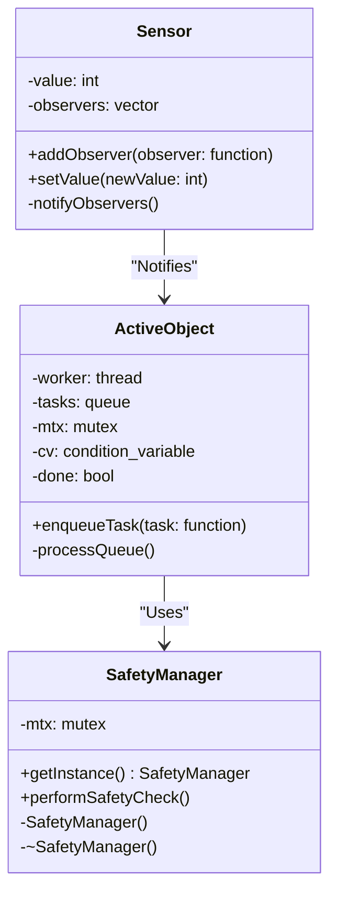

## 14.10 Autonomous Systems and Robotics

Autonomous systems and robotics represent a pinnacle of modern engineering, where software meets hardware to create intelligent, self-operating machines. In this section, we delve into the role of C++ design patterns in developing these systems, focusing on real-time processing, sensor integration, and safety-critical design patterns. Let's explore how these elements come together to form the backbone of autonomous systems and robotics.

### Real-Time Processing and Control

Real-time processing is a crucial aspect of autonomous systems and robotics, where timely and deterministic responses are required. In this context, C++ provides the performance and control necessary for implementing real-time systems.

#### Key Concepts in Real-Time Systems

1. **Determinism**: The ability to produce predictable outputs within a specified time frame.
2. **Latency**: The delay between an input being received and the corresponding output being produced.
3. **Jitter**: The variability in latency, which needs to be minimized in real-time systems.

#### C++ Features for Real-Time Systems

C++ offers several features that make it suitable for real-time applications:

- **Low-Level Memory Management**: C++ allows precise control over memory allocation and deallocation, which is crucial for minimizing latency.
- **Concurrency Support**: With features like `std::thread` and synchronization primitives, C++ supports concurrent execution, which is essential for handling multiple real-time tasks.
- **Efficient Execution**: C++ compiles to machine code, offering high execution speed and efficiency.

#### Design Patterns for Real-Time Systems

Several design patterns are particularly useful in real-time systems:

- **Active Object Pattern**: Decouples method execution from method invocation to enhance concurrency.
- **Reactor Pattern**: Handles service requests that are delivered concurrently to an application by one or more clients.
- **State Pattern**: Manages state-dependent behavior, which is common in robotics.

#### Code Example: Implementing the Active Object Pattern

```cpp
#include <iostream>
#include <thread>
#include <queue>
#include <mutex>
#include <condition_variable>
#include <functional>

class ActiveObject {
public:
    ActiveObject() : done(false) {
        worker = std::thread([this]() { this->processQueue(); });
    }

    ~ActiveObject() {
        {
            std::lock_guard<std::mutex> lock(mtx);
            done = true;
        }
        cv.notify_all();
        worker.join();
    }

    void enqueueTask(std::function<void()> task) {
        {
            std::lock_guard<std::mutex> lock(mtx);
            tasks.push(task);
        }
        cv.notify_one();
    }

private:
    void processQueue() {
        while (true) {
            std::function<void()> task;
            {
                std::unique_lock<std::mutex> lock(mtx);
                cv.wait(lock, [this]() { return !tasks.empty() || done; });
                if (done && tasks.empty()) break;
                task = tasks.front();
                tasks.pop();
            }
            task();
        }
    }

    std::thread worker;
    std::queue<std::function<void()>> tasks;
    std::mutex mtx;
    std::condition_variable cv;
    bool done;
};

// Usage
int main() {
    ActiveObject ao;
    ao.enqueueTask([]() { std::cout << "Task 1 executed\n"; });
    ao.enqueueTask([]() { std::cout << "Task 2 executed\n"; });
    return 0;
}
```

In this example, the `ActiveObject` class manages a queue of tasks, executing them in a separate thread. This pattern is useful for managing asynchronous operations in real-time systems.

### Sensor Integration

Sensors are the eyes and ears of autonomous systems, providing the data necessary for decision-making. Integrating sensors effectively is crucial for the functionality of robotics systems.

#### Types of Sensors in Robotics

1. **Proximity Sensors**: Detect objects nearby, used for obstacle avoidance.
2. **Vision Sensors**: Capture images or video, used for navigation and object recognition.
3. **Inertial Sensors**: Measure acceleration and rotation, used for stabilization and control.

#### Challenges in Sensor Integration

- **Data Fusion**: Combining data from multiple sensors to create a coherent understanding of the environment.
- **Latency**: Ensuring sensor data is processed in a timely manner.
- **Noise and Calibration**: Dealing with sensor inaccuracies and ensuring data reliability.

#### Design Patterns for Sensor Integration

- **Observer Pattern**: Used for implementing event-driven systems where sensors notify observers of data changes.
- **Decorator Pattern**: Enhances sensor data with additional processing, such as filtering or transformation.

#### Code Example: Implementing the Observer Pattern

```cpp
#include <iostream>
#include <vector>
#include <functional>

class Sensor {
public:
    void addObserver(std::function<void(int)> observer) {
        observers.push_back(observer);
    }

    void setValue(int newValue) {
        value = newValue;
        notifyObservers();
    }

private:
    void notifyObservers() {
        for (auto& observer : observers) {
            observer(value);
        }
    }

    int value;
    std::vector<std::function<void(int)>> observers;
};

// Usage
int main() {
    Sensor sensor;
    sensor.addObserver([](int value) { std::cout << "Observer 1: Value = " << value << "\n"; });
    sensor.addObserver([](int value) { std::cout << "Observer 2: Value = " << value << "\n"; });

    sensor.setValue(42);
    return 0;
}
```

In this example, the `Sensor` class uses the Observer pattern to notify registered observers whenever the sensor value changes. This pattern is ideal for handling real-time updates from sensors.

### Safety-Critical Design Patterns

Safety is paramount in autonomous systems, especially in robotics, where failures can lead to physical harm or damage. Safety-critical design patterns help ensure systems operate reliably under all conditions.

#### Key Concepts in Safety-Critical Systems

1. **Fault Tolerance**: The ability to continue operation in the presence of faults.
2. **Redundancy**: Using multiple components to provide backup in case of failure.
3. **Fail-Safe**: Ensuring that failures result in a safe state.

#### Design Patterns for Safety-Critical Systems

- **Singleton Pattern**: Ensures a class has only one instance, useful for managing shared resources.
- **Decorator Pattern**: Adds safety checks and logging to existing components.
- **Command Pattern**: Encapsulates commands as objects, allowing for undo and redo operations.

#### Code Example: Implementing the Singleton Pattern

```cpp
#include <iostream>
#include <mutex>

class SafetyManager {
public:
    static SafetyManager& getInstance() {
        static SafetyManager instance;
        return instance;
    }

    void performSafetyCheck() {
        std::lock_guard<std::mutex> lock(mtx);
        std::cout << "Performing safety check\n";
    }

private:
    SafetyManager() = default;
    ~SafetyManager() = default;
    SafetyManager(const SafetyManager&) = delete;
    SafetyManager& operator=(const SafetyManager&) = delete;

    std::mutex mtx;
};

// Usage
int main() {
    SafetyManager& manager = SafetyManager::getInstance();
    manager.performSafetyCheck();
    return 0;
}
```

In this example, the `SafetyManager` class uses the Singleton pattern to ensure that safety checks are managed through a single instance. This pattern is useful for coordinating safety-critical operations.

### Visualizing Autonomous Systems and Robotics

To better understand the architecture of autonomous systems and robotics, let's visualize the interaction between components using a class diagram.



**Diagram Description**: This class diagram illustrates the relationships between the `Sensor`, `ActiveObject`, and `SafetyManager` classes. The `Sensor` class notifies the `ActiveObject` of changes, while the `ActiveObject` uses the `SafetyManager` to perform safety checks.

### Try It Yourself

Experiment with the code examples provided by modifying them to suit different scenarios:

- **Modify the Active Object Pattern**: Add more complex tasks to the queue and observe how the system handles them.
- **Enhance the Observer Pattern**: Implement additional observers that perform different actions based on sensor data.
- **Extend the Singleton Pattern**: Introduce additional safety checks and logging mechanisms.

### References and Links

- [Real-Time Systems](https://en.wikipedia.org/wiki/Real-time_computing)
- [Observer Pattern](https://en.wikipedia.org/wiki/Observer_pattern)
- [Singleton Pattern](https://en.wikipedia.org/wiki/Singleton_pattern)

### Knowledge Check

- **What is the primary goal of real-time processing in autonomous systems?**
- **How does the Observer pattern facilitate sensor integration?**
- **Why is the Singleton pattern useful in safety-critical systems?**

### Embrace the Journey

Remember, mastering autonomous systems and robotics is a journey. As you progress, you'll encounter more complex challenges and opportunities to innovate. Keep experimenting, stay curious, and enjoy the journey!

## Quiz Time!



### What is the primary goal of real-time processing in autonomous systems?

- [x] To produce predictable outputs within a specified time frame
- [ ] To maximize computational efficiency
- [ ] To minimize code complexity
- [ ] To ensure data security

> **Explanation:** Real-time processing aims to produce predictable outputs within a specified time frame, which is crucial for the timely and deterministic responses required in autonomous systems.

### Which C++ feature is crucial for minimizing latency in real-time systems?

- [x] Low-Level Memory Management
- [ ] High-Level Abstractions
- [ ] Dynamic Typing
- [ ] Garbage Collection

> **Explanation:** Low-level memory management in C++ allows precise control over memory allocation and deallocation, which is crucial for minimizing latency in real-time systems.

### What is the purpose of the Active Object pattern?

- [x] To decouple method execution from method invocation
- [ ] To manage shared resources
- [ ] To encapsulate commands as objects
- [ ] To provide a unified interface to a set of interfaces

> **Explanation:** The Active Object pattern decouples method execution from method invocation to enhance concurrency, making it suitable for real-time systems.

### How does the Observer pattern facilitate sensor integration?

- [x] By notifying observers of data changes
- [ ] By encapsulating commands as objects
- [ ] By providing a unified interface to a set of interfaces
- [ ] By managing shared resources

> **Explanation:** The Observer pattern facilitates sensor integration by notifying registered observers of data changes, which is ideal for handling real-time updates from sensors.

### Why is the Singleton pattern useful in safety-critical systems?

- [x] It ensures a class has only one instance
- [ ] It enhances concurrency
- [ ] It encapsulates commands as objects
- [ ] It provides a unified interface to a set of interfaces

> **Explanation:** The Singleton pattern ensures a class has only one instance, which is useful for managing shared resources and coordinating safety-critical operations.

### What is a common challenge in sensor integration?

- [x] Data Fusion
- [ ] High-Level Abstractions
- [ ] Dynamic Typing
- [ ] Garbage Collection

> **Explanation:** Data fusion, which involves combining data from multiple sensors to create a coherent understanding of the environment, is a common challenge in sensor integration.

### What is the role of the SafetyManager class in the Singleton pattern example?

- [x] To manage safety checks through a single instance
- [ ] To enhance concurrency
- [ ] To encapsulate commands as objects
- [ ] To provide a unified interface to a set of interfaces

> **Explanation:** The SafetyManager class manages safety checks through a single instance, ensuring that safety-critical operations are coordinated effectively.

### Which design pattern is ideal for handling real-time updates from sensors?

- [x] Observer Pattern
- [ ] Singleton Pattern
- [ ] Command Pattern
- [ ] Decorator Pattern

> **Explanation:** The Observer pattern is ideal for handling real-time updates from sensors by notifying registered observers of data changes.

### What is a key concept in safety-critical systems?

- [x] Fault Tolerance
- [ ] High-Level Abstractions
- [ ] Dynamic Typing
- [ ] Garbage Collection

> **Explanation:** Fault tolerance, which is the ability to continue operation in the presence of faults, is a key concept in safety-critical systems.

### True or False: The Active Object pattern is used to encapsulate commands as objects.

- [ ] True
- [x] False

> **Explanation:** False. The Active Object pattern is used to decouple method execution from method invocation, not to encapsulate commands as objects.


