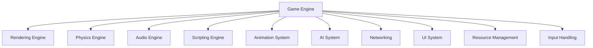
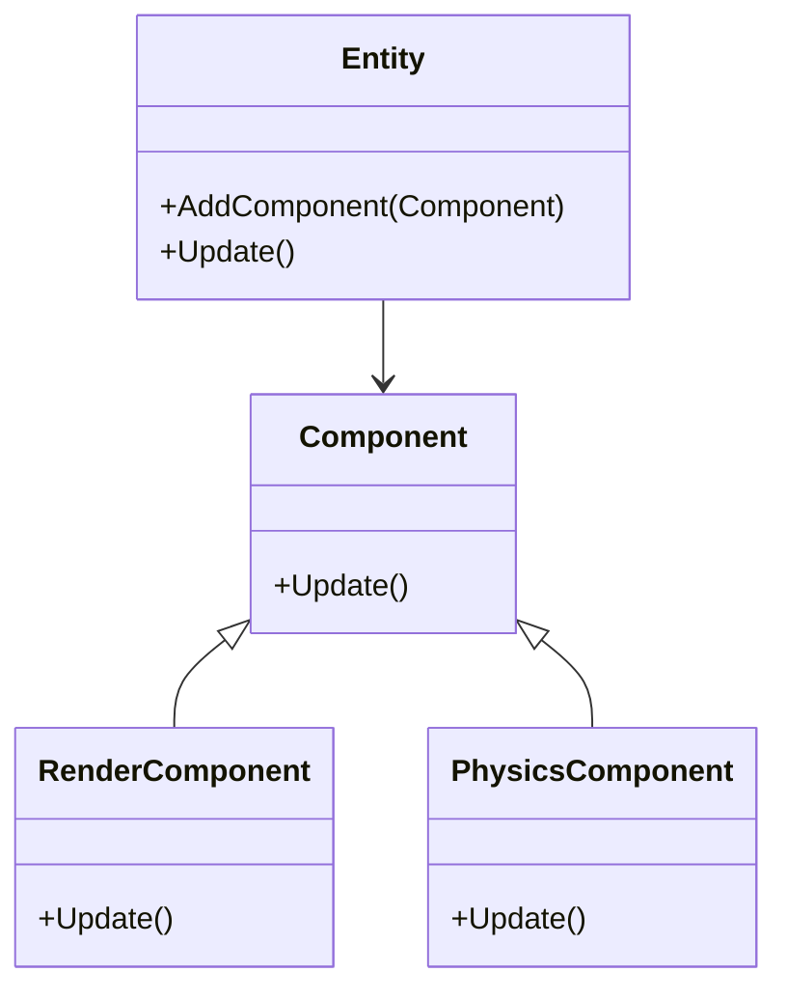

## 14.2 Game Development with C++

Game development is a complex and multifaceted discipline that requires a deep understanding of both software engineering principles and creative processes. C++ has long been a preferred language for game development due to its performance, control over system resources, and rich ecosystem of libraries and tools. In this section, we will delve into the architecture of game engines, real-time considerations, and the application of design patterns in popular engines like Unreal Engine.

### Game Engine Architectures

A game engine is a software framework designed for the creation and development of video games. It provides a suite of tools and functionalities that streamline the game development process, allowing developers to focus on creating engaging content rather than reinventing the wheel. Let's explore the core components of a game engine architecture.

#### Core Components of a Game Engine

1. **Rendering Engine**: Responsible for drawing graphics on the screen. It handles tasks such as lighting, shading, and texture mapping. Modern rendering engines leverage GPUs for high-performance rendering.

2. **Physics Engine**: Simulates physical interactions in the game world, such as collisions, gravity, and rigid body dynamics. This component ensures that objects behave in a realistic manner.

3. **Audio Engine**: Manages sound effects and music. It provides capabilities for 3D audio spatialization, sound mixing, and audio playback.

4. **Scripting Engine**: Allows developers to write game logic and behaviors using scripting languages. This component often supports dynamic loading and execution of scripts.

5. **Animation System**: Handles the movement and transformation of characters and objects. It supports skeletal animation, morph targets, and inverse kinematics.

6. **AI System**: Provides tools for creating intelligent behaviors in non-player characters (NPCs). This includes pathfinding, decision-making, and state machines.

7. **Networking**: Facilitates multiplayer gameplay by managing data exchange between clients and servers. It handles synchronization, latency compensation, and data serialization.

8. **User Interface (UI) System**: Manages the creation and rendering of user interfaces, such as menus and HUDs. It supports interactive elements like buttons and sliders.

9. **Resource Management**: Manages the loading, unloading, and caching of game assets, such as textures, models, and sounds. Efficient resource management is crucial for performance.

10. **Input Handling**: Captures and processes input from various devices, such as keyboards, mice, gamepads, and touchscreens.

#### Diagram: Game Engine Architecture



*Figure 1: Core components of a game engine architecture.*

### Real-Time Considerations

Real-time systems are those that require timely processing and response to external events. In the context of game development, real-time considerations are paramount to ensure smooth gameplay and an immersive experience. Let's explore some key aspects of real-time systems in game development.

#### Frame Rate and Performance

The frame rate, measured in frames per second (FPS), is a critical metric in game development. A higher frame rate results in smoother animations and a more responsive experience. To achieve a stable frame rate, developers must optimize their code and manage resources efficiently.

- **Optimization Techniques**: Use profiling tools to identify bottlenecks, optimize algorithms, and reduce unnecessary computations. Consider level-of-detail (LOD) techniques to reduce the complexity of distant objects.

- **Parallel Processing**: Leverage multi-threading and parallel processing to distribute workloads across multiple CPU cores. Use C++ concurrency libraries, such as `std::thread` and `std::async`, to implement parallelism.

- **Graphics Optimization**: Utilize GPU features like instancing and occlusion culling to optimize rendering. Minimize draw calls and use efficient shaders.

#### Latency and Input Responsiveness

Latency refers to the delay between a player's input and the corresponding action in the game. Minimizing latency is crucial for a responsive gaming experience.

- **Input Handling**: Process input events as soon as they are received. Use low-level APIs to capture input with minimal delay.

- **Network Latency**: For multiplayer games, implement latency compensation techniques, such as client-side prediction and server reconciliation, to mitigate the effects of network lag.

#### Memory Management

Efficient memory management is essential in real-time systems to prevent frame drops and ensure stability.

- **Dynamic Memory Allocation**: Minimize the use of dynamic memory allocation during gameplay. Use memory pools and custom allocators to manage memory efficiently.

- **Garbage Collection**: In scripting languages with garbage collection, manage object lifetimes carefully to avoid performance spikes during collection cycles.

### Patterns in Unreal Engine and Other Game Engines

Design patterns play a crucial role in the architecture of game engines. They provide reusable solutions to common problems and help maintain code quality and scalability. Let's explore some design patterns commonly used in Unreal Engine and other game engines.

#### Component-Based Architecture

The component-based architecture is a design pattern that promotes composition over inheritance. It allows developers to create complex behaviors by combining reusable components.

- **Intent**: Enable flexible and modular design by composing objects from interchangeable components.

- **Key Participants**: 
  - **Entity**: Represents a game object.
  - **Component**: Encapsulates specific functionality, such as rendering or physics.
  - **System**: Manages and updates components of a specific type.

- **Applicability**: Use when you need to create diverse game objects with varying behaviors.

- **Sample Code Snippet**:

```cpp
class Component {
public:
    virtual void Update() = 0;
};

class RenderComponent : public Component {
public:
    void Update() override {
        // Render logic
    }
};

class PhysicsComponent : public Component {
public:
    void Update() override {
        // Physics logic
    }
};

class Entity {
    std::vector<std::unique_ptr<Component>> components;
public:
    void AddComponent(std::unique_ptr<Component> component) {
        components.push_back(std::move(component));
    }
    void Update() {
        for (auto& component : components) {
            component->Update();
        }
    }
};

// Usage
Entity player;
player.AddComponent(std::make_unique<RenderComponent>());
player.AddComponent(std::make_unique<PhysicsComponent>());
player.Update();
```

- **Design Considerations**: This pattern promotes code reuse and flexibility but can lead to increased complexity if not managed properly.

#### State Pattern

The state pattern is used to manage the state of game objects and their behavior changes over time.

- **Intent**: Allow an object to alter its behavior when its internal state changes.

- **Key Participants**:
  - **Context**: Maintains an instance of a state subclass.
  - **State**: Defines an interface for encapsulating behavior associated with a particular state.

- **Applicability**: Use when an object needs to change its behavior based on its state.

- **Sample Code Snippet**:

```cpp
class State {
public:
    virtual void HandleInput() = 0;
};

class IdleState : public State {
public:
    void HandleInput() override {
        // Handle input in idle state
    }
};

class RunningState : public State {
public:
    void HandleInput() override {
        // Handle input in running state
    }
};

class Character {
    std::unique_ptr<State> state;
public:
    void SetState(std::unique_ptr<State> newState) {
        state = std::move(newState);
    }
    void HandleInput() {
        state->HandleInput();
    }
};

// Usage
Character character;
character.SetState(std::make_unique<IdleState>());
character.HandleInput();
character.SetState(std::make_unique<RunningState>());
character.HandleInput();
```

- **Design Considerations**: This pattern simplifies state management but can lead to a proliferation of state classes.

#### Observer Pattern

The observer pattern is used to implement event-driven systems, such as UI updates and game events.

- **Intent**: Define a one-to-many dependency between objects so that when one object changes state, all its dependents are notified.

- **Key Participants**:
  - **Subject**: Maintains a list of observers and notifies them of state changes.
  - **Observer**: Defines an interface for receiving updates from the subject.

- **Applicability**: Use when changes to one object require updates to other objects.

- **Sample Code Snippet**:

```cpp
class Observer {
public:
    virtual void Update() = 0;
};

class Subject {
    std::vector<Observer*> observers;
public:
    void Attach(Observer* observer) {
        observers.push_back(observer);
    }
    void Notify() {
        for (auto observer : observers) {
            observer->Update();
        }
    }
};

class Player : public Observer {
public:
    void Update() override {
        // Update player state
    }
};

// Usage
Subject gameEvent;
Player player;
gameEvent.Attach(&player);
gameEvent.Notify();
```

- **Design Considerations**: This pattern decouples subjects and observers but can introduce complexity in managing observer lists.

### Try It Yourself

To deepen your understanding, try modifying the code examples provided:

- **Component-Based Architecture**: Add a new component type, such as an `AudioComponent`, and integrate it into the `Entity` class.
- **State Pattern**: Implement additional states for the `Character`, such as `JumpingState` or `AttackingState`, and test state transitions.
- **Observer Pattern**: Create a new observer class that reacts to different events and attach it to the `Subject`.

### Visualizing Game Engine Patterns

To better understand the relationships between components in a game engine, let's visualize the component-based architecture using a class diagram.



*Figure 2: Class diagram of a component-based architecture in a game engine.*

### Knowledge Check

Before we conclude, let's reinforce your understanding with some questions:

1. What is the primary role of a rendering engine in a game engine architecture?
2. How does the component-based architecture promote flexibility in game development?
3. What are some common techniques for optimizing frame rate in real-time systems?
4. Explain the purpose of the state pattern in managing game object behavior.
5. How does the observer pattern facilitate event-driven systems in game development?

### Embrace the Journey

Game development with C++ is a challenging yet rewarding journey. As you continue to explore and experiment with different architectures and patterns, remember that the key to success lies in understanding the underlying principles and applying them creatively. Keep pushing the boundaries of what's possible, and enjoy the process of bringing your ideas to life!

## Quiz Time!



### What is the primary role of a rendering engine in a game engine architecture?

- [x] To draw graphics on the screen
- [ ] To manage sound effects and music
- [ ] To simulate physical interactions
- [ ] To handle user input

> **Explanation:** The rendering engine is responsible for drawing graphics on the screen, handling tasks such as lighting, shading, and texture mapping.

### How does the component-based architecture promote flexibility in game development?

- [x] By composing objects from interchangeable components
- [ ] By using inheritance to extend functionality
- [ ] By centralizing all game logic in a single class
- [ ] By minimizing the number of classes

> **Explanation:** The component-based architecture promotes flexibility by allowing developers to create complex behaviors by combining reusable components, rather than relying on inheritance.

### What are some common techniques for optimizing frame rate in real-time systems?

- [x] Profiling and optimizing algorithms
- [x] Using level-of-detail techniques
- [ ] Increasing the number of draw calls
- [ ] Ignoring memory management

> **Explanation:** Profiling and optimizing algorithms, as well as using level-of-detail techniques, are common methods for optimizing frame rate in real-time systems.

### Explain the purpose of the state pattern in managing game object behavior.

- [x] To allow an object to alter its behavior when its internal state changes
- [ ] To centralize all game logic in a single class
- [ ] To minimize the number of state classes
- [ ] To handle user input directly

> **Explanation:** The state pattern allows an object to change its behavior based on its internal state, facilitating state management and reducing conditional logic.

### How does the observer pattern facilitate event-driven systems in game development?

- [x] By defining a one-to-many dependency between objects
- [ ] By centralizing all event logic in a single class
- [ ] By minimizing the number of observers
- [ ] By handling user input directly

> **Explanation:** The observer pattern facilitates event-driven systems by defining a one-to-many dependency between objects, allowing changes in one object to trigger updates in others.

### What is a critical metric in game development that affects smooth animations and responsiveness?

- [x] Frame rate
- [ ] Memory usage
- [ ] Number of classes
- [ ] Code complexity

> **Explanation:** Frame rate, measured in frames per second (FPS), is a critical metric that affects smooth animations and responsiveness in game development.

### What technique can be used to minimize latency in multiplayer games?

- [x] Client-side prediction
- [ ] Increasing the number of draw calls
- [ ] Centralizing all game logic in a single class
- [ ] Ignoring network latency

> **Explanation:** Client-side prediction is a technique used to minimize latency in multiplayer games by predicting the outcome of player actions on the client side.

### What is the purpose of the AI system in a game engine?

- [x] To provide tools for creating intelligent behaviors in NPCs
- [ ] To manage sound effects and music
- [ ] To handle user input
- [ ] To draw graphics on the screen

> **Explanation:** The AI system provides tools for creating intelligent behaviors in non-player characters (NPCs), including pathfinding and decision-making.

### What is the role of the scripting engine in a game engine?

- [x] To allow developers to write game logic and behaviors using scripting languages
- [ ] To simulate physical interactions
- [ ] To manage sound effects and music
- [ ] To handle user input

> **Explanation:** The scripting engine allows developers to write game logic and behaviors using scripting languages, supporting dynamic loading and execution of scripts.

### True or False: The observer pattern decouples subjects and observers but can introduce complexity in managing observer lists.

- [x] True
- [ ] False

> **Explanation:** True. The observer pattern decouples subjects and observers, allowing for flexible event-driven systems, but it can introduce complexity in managing the list of observers.


