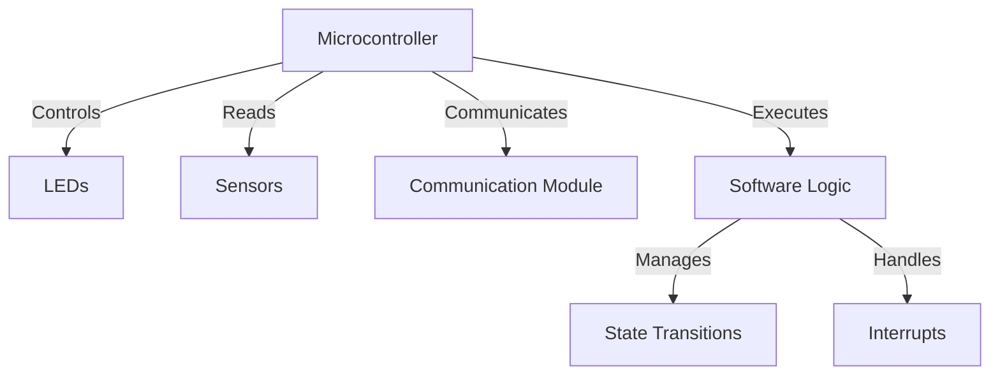

## 14.3 Embedded Systems Programming

Embedded systems programming is a specialized field that requires a deep understanding of both software and hardware. In this section, we will explore the unique challenges and considerations when developing software for embedded systems using C++. We will cover constraints in embedded environments, strategies for writing efficient and reliable code, and the importance of memory and power management.

### Introduction to Embedded Systems

Embedded systems are computer systems with dedicated functions within larger mechanical or electrical systems. They are embedded as part of a complete device, often including hardware and mechanical parts. Common examples include microcontrollers in automobiles, home appliances, medical devices, and industrial machines.

#### Characteristics of Embedded Systems

- **Real-Time Operation**: Many embedded systems operate in real-time, meaning they must process data and respond to inputs within a strict time frame.
- **Resource Constraints**: Embedded systems often have limited processing power, memory, and storage.
- **Power Efficiency**: Especially in battery-operated devices, power consumption is a critical consideration.
- **Reliability and Stability**: Embedded systems must operate reliably over long periods, often without human intervention.

### Constraints in Embedded Environments

Embedded systems face several constraints that impact how software is developed. Understanding these constraints is crucial for writing efficient and reliable code.

#### Limited Resources

Embedded systems typically have limited CPU power, memory, and storage. This requires developers to write highly optimized code that makes efficient use of available resources.

- **CPU Constraints**: Limited processing power necessitates efficient algorithms and careful management of CPU cycles.
- **Memory Constraints**: Memory is often limited, requiring careful allocation and deallocation of resources.
- **Storage Constraints**: Persistent storage may be limited, impacting how data is stored and retrieved.

#### Real-Time Requirements

Many embedded systems must meet real-time requirements, meaning they must respond to inputs or events within a specific time frame. This requires precise timing and scheduling of tasks.

- **Deterministic Behavior**: Ensuring that the system behaves predictably under all conditions.
- **Interrupt Handling**: Efficient handling of interrupts to ensure timely responses to external events.

#### Power Consumption

Power efficiency is critical, especially in battery-powered devices. Developers must minimize power consumption while maintaining performance.

- **Low-Power Modes**: Utilizing low-power modes to conserve energy when the system is idle.
- **Efficient Code**: Writing code that minimizes CPU usage and power consumption.

### Writing Efficient and Reliable Code

Writing efficient and reliable code for embedded systems requires a combination of good programming practices, optimization techniques, and the use of appropriate design patterns.

#### Code Optimization Techniques

- **Algorithm Optimization**: Choose algorithms that are efficient in terms of time and space complexity.
- **Loop Optimization**: Minimize the number of iterations and reduce the complexity of operations within loops.
- **Inline Functions**: Use inline functions to reduce function call overhead.
- **Memory Management**: Use memory efficiently by minimizing allocations and deallocations.

#### Design Patterns for Embedded Systems

Design patterns can help manage complexity and improve the reliability of embedded systems software. Some patterns are particularly useful in this context:

- **State Pattern**: Useful for managing state transitions in systems with complex state machines.
- **Observer Pattern**: Ideal for event-driven systems where components need to react to changes in state.
- **Singleton Pattern**: Ensures that a class has only one instance, useful for managing shared resources.

#### Example: Implementing the State Pattern

The State Pattern is particularly useful in embedded systems for managing state transitions. Let's consider an example of a simple traffic light system.

```cpp
#include <iostream>
#include <memory>

// Abstract State class
class TrafficLightState {
public:
    virtual void handle() = 0;
};

// Concrete State classes
class RedState : public TrafficLightState {
public:
    void handle() override {
        std::cout << "Red Light - Stop" << std::endl;
    }
};

class GreenState : public TrafficLightState {
public:
    void handle() override {
        std::cout << "Green Light - Go" << std::endl;
    }
};

class YellowState : public TrafficLightState {
public:
    void handle() override {
        std::cout << "Yellow Light - Caution" << std::endl;
    }
};

// Context class
class TrafficLight {
private:
    std::unique_ptr<TrafficLightState> state;
public:
    void setState(TrafficLightState* newState) {
        state.reset(newState);
    }
    void request() {
        state->handle();
    }
};

int main() {
    TrafficLight trafficLight;
    trafficLight.setState(new RedState());
    trafficLight.request();
    trafficLight.setState(new GreenState());
    trafficLight.request();
    trafficLight.setState(new YellowState());
    trafficLight.request();
    return 0;
}
```

In this example, the `TrafficLight` class uses the State Pattern to manage transitions between different light states. Each state is represented by a class that implements the `TrafficLightState` interface.

### Memory and Power Considerations

Memory and power management are critical aspects of embedded systems programming. Efficient use of memory and power can significantly impact the performance and reliability of an embedded system.

#### Memory Management

- **Static vs. Dynamic Memory**: Prefer static memory allocation over dynamic allocation to avoid fragmentation and ensure predictability.
- **Memory Pools**: Use memory pools to manage dynamic memory efficiently and reduce fragmentation.
- **Stack Usage**: Minimize stack usage by avoiding deep recursion and large local variables.

#### Power Management

- **Low-Power Modes**: Implement low-power modes to reduce power consumption during idle periods.
- **Peripheral Management**: Turn off unused peripherals to save power.
- **Efficient Algorithms**: Use algorithms that minimize CPU usage and reduce power consumption.

### Try It Yourself

To deepen your understanding of embedded systems programming, try modifying the traffic light example to include additional states, such as a flashing yellow light for caution. Experiment with different state transitions and observe how the system behaves.

### Visualizing Embedded Systems Architecture

Below is a diagram representing a typical embedded system architecture, including the interaction between hardware and software components.



**Diagram Description**: This diagram illustrates the interaction between a microcontroller and various components in an embedded system. The microcontroller controls LEDs, reads data from sensors, communicates via a communication module, and executes software logic that manages state transitions and handles interrupts.

### References and Further Reading

- [Embedded Systems - Wikipedia](https://en.wikipedia.org/wiki/Embedded_system)
- [Real-Time Operating Systems (RTOS) - FreeRTOS](https://www.freertos.org/)
- [Design Patterns in C++ - Refactoring Guru](https://refactoring.guru/design-patterns/cpp)

### Knowledge Check

1. What are the main constraints in embedded systems programming?
2. How can design patterns help in developing embedded systems software?
3. What is the importance of power management in embedded systems?

### Embrace the Journey

Remember, mastering embedded systems programming is a journey. As you continue to explore and experiment with different techniques and patterns, you'll become more adept at creating efficient and reliable embedded systems. Keep pushing the boundaries of what's possible, and enjoy the process of learning and discovery!

## Quiz Time!



### What is a key characteristic of embedded systems?

- [x] Real-time operation
- [ ] Unlimited resources
- [ ] High power consumption
- [ ] Frequent human intervention

> **Explanation:** Embedded systems often operate in real-time, processing data and responding to inputs within strict time frames.

### Which design pattern is useful for managing state transitions in embedded systems?

- [x] State Pattern
- [ ] Singleton Pattern
- [ ] Observer Pattern
- [ ] Factory Pattern

> **Explanation:** The State Pattern is ideal for managing state transitions in systems with complex state machines.

### What is a common constraint in embedded systems?

- [x] Limited resources
- [ ] Unlimited storage
- [ ] High processing power
- [ ] Abundant memory

> **Explanation:** Embedded systems typically have limited CPU power, memory, and storage, requiring optimized code.

### How can power consumption be minimized in embedded systems?

- [x] Implementing low-power modes
- [ ] Increasing CPU usage
- [ ] Using large algorithms
- [ ] Keeping all peripherals active

> **Explanation:** Utilizing low-power modes and turning off unused peripherals can help conserve energy.

### What is an advantage of using memory pools in embedded systems?

- [x] Reducing fragmentation
- [ ] Increasing stack usage
- [ ] Decreasing predictability
- [ ] Maximizing dynamic allocation

> **Explanation:** Memory pools manage dynamic memory efficiently and reduce fragmentation.

### Which of the following is NOT a characteristic of embedded systems?

- [ ] Real-time operation
- [x] Unlimited processing power
- [ ] Power efficiency
- [ ] Reliability and stability

> **Explanation:** Embedded systems often have limited processing power, making efficient code crucial.

### What is a benefit of using inline functions in embedded systems?

- [x] Reducing function call overhead
- [ ] Increasing memory usage
- [ ] Decreasing code efficiency
- [ ] Slowing down execution

> **Explanation:** Inline functions can reduce the overhead associated with function calls, improving performance.

### What is the role of the microcontroller in an embedded system?

- [x] Controls and manages hardware components
- [ ] Provides unlimited storage
- [ ] Consumes maximum power
- [ ] Requires frequent maintenance

> **Explanation:** The microcontroller controls and manages various hardware components within an embedded system.

### Which of the following is a power management technique in embedded systems?

- [x] Turning off unused peripherals
- [ ] Keeping all peripherals active
- [ ] Increasing CPU usage
- [ ] Maximizing power consumption

> **Explanation:** Turning off unused peripherals helps conserve power in embedded systems.

### True or False: Embedded systems often require frequent human intervention.

- [ ] True
- [x] False

> **Explanation:** Embedded systems are designed to operate reliably over long periods, often without human intervention.


