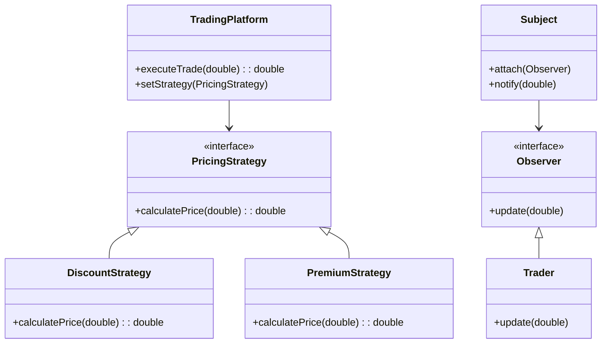

## 14.4 Financial Systems and Trading Platforms

In the world of finance, milliseconds can mean millions. The design and implementation of financial systems and trading platforms demand a meticulous approach to ensure low latency, robustness, and accuracy. This section delves into the critical aspects of developing such systems using C++, a language renowned for its performance and efficiency. We'll explore key design patterns, real-time data processing techniques, and strategies to maintain system robustness and accuracy.

### Introduction to Financial Systems and Trading Platforms

Financial systems and trading platforms are integral to the global economy, facilitating transactions worth trillions of dollars daily. These systems must handle vast amounts of data in real-time, making performance and reliability paramount.

#### Key Characteristics of Financial Systems

1. **Low Latency**: The speed at which a system processes data can significantly impact trading outcomes. Low-latency systems are essential for high-frequency trading (HFT) and other time-sensitive applications.

2. **Robustness**: Financial systems must be resilient to failures and capable of recovering quickly to prevent data loss and ensure continuous operation.

3. **Accuracy**: Precision in data processing and calculations is crucial, as even minor errors can lead to significant financial discrepancies.

4. **Scalability**: As trading volumes grow, systems must scale efficiently to handle increased loads without sacrificing performance.

5. **Security**: Protecting sensitive financial data from unauthorized access and cyber threats is a top priority.

### Implementing Low-Latency Systems

Low latency is a critical requirement for financial systems, especially in trading platforms where speed can determine profitability. Achieving low latency involves optimizing every aspect of the system, from network communication to data processing.

#### Techniques for Reducing Latency

1. **Efficient Network Communication**: Use protocols like UDP for faster data transmission, as it reduces the overhead associated with TCP's connection-oriented nature.

2. **Optimized Data Structures**: Choose data structures that minimize access times. For example, use arrays instead of linked lists for better cache locality.

3. **Concurrency and Parallelism**: Leverage multi-threading and parallel processing to distribute workloads and reduce processing time.

4. **Hardware Acceleration**: Utilize hardware features such as SIMD (Single Instruction, Multiple Data) and GPUs for parallel processing of large datasets.

5. **Minimized Context Switching**: Reduce the frequency of context switches by using thread affinity and processor pinning to keep threads on the same CPU core.

#### Code Example: Optimizing Network Communication

```cpp
#include <iostream>
#include <boost/asio.hpp>

using boost::asio::ip::udp;

void sendData(const std::string& message, const std::string& host, int port) {
    boost::asio::io_context io_context;
    udp::socket socket(io_context, udp::endpoint(udp::v4(), 0));
    udp::resolver resolver(io_context);
    udp::resolver::results_type endpoints = resolver.resolve(udp::v4(), host, std::to_string(port));

    socket.send_to(boost::asio::buffer(message), *endpoints.begin());
}

int main() {
    sendData("Trade Order", "localhost", 12345);
    return 0;
}
```

> **Explanation**: This example demonstrates using Boost.Asio for UDP communication, which can help reduce latency in network operations.

### Ensuring Robustness and Accuracy

Robustness and accuracy are non-negotiable in financial systems. A robust system can handle unexpected conditions gracefully, while accuracy ensures that financial transactions are processed correctly.

#### Strategies for Robustness

1. **Error Handling**: Implement comprehensive error handling to manage exceptions and recover from failures without data loss.

2. **Redundancy**: Use redundant systems and data replication to ensure availability and reliability.

3. **Testing and Validation**: Conduct rigorous testing, including unit tests, integration tests, and stress tests, to validate system behavior under various conditions.

4. **Monitoring and Logging**: Implement real-time monitoring and logging to detect and diagnose issues promptly.

#### Techniques for Ensuring Accuracy

1. **Precision in Calculations**: Use appropriate data types and libraries for high-precision arithmetic, such as `boost::multiprecision`.

2. **Data Validation**: Validate input data to prevent erroneous transactions and ensure data integrity.

3. **Consistent State Management**: Use design patterns like the State pattern to manage system states consistently and avoid race conditions.

#### Code Example: Error Handling and Logging

```cpp
#include <iostream>
#include <fstream>
#include <stdexcept>

void logError(const std::string& message) {
    std::ofstream logFile("error.log", std::ios_base::app);
    logFile << message << std::endl;
}

void processTransaction(double amount) {
    try {
        if (amount < 0) {
            throw std::invalid_argument("Negative transaction amount");
        }
        // Process transaction
    } catch (const std::exception& e) {
        logError(e.what());
    }
}

int main() {
    processTransaction(-100.0);
    return 0;
}
```

> **Explanation**: This example shows basic error handling and logging, which are crucial for maintaining robustness in financial systems.

### Real-Time Data Processing

Real-time data processing is a cornerstone of financial systems, enabling timely decision-making and execution of trades. C++ offers powerful tools and libraries to handle real-time data efficiently.

#### Key Concepts in Real-Time Processing

1. **Data Streams**: Process continuous streams of data with minimal latency, using techniques like stream processing and event-driven architectures.

2. **Asynchronous I/O**: Use asynchronous I/O operations to avoid blocking and improve system responsiveness.

3. **Message Queues**: Implement message queues to decouple data producers and consumers, allowing for scalable and fault-tolerant data processing.

4. **Time-Series Data**: Handle time-series data efficiently using specialized libraries and data structures.

#### Code Example: Asynchronous Data Processing

```cpp
#include <iostream>
#include <boost/asio.hpp>

using boost::asio::ip::tcp;

void handleData(const std::string& data) {
    std::cout << "Processing data: " << data << std::endl;
}

void startServer(boost::asio::io_context& io_context, int port) {
    tcp::acceptor acceptor(io_context, tcp::endpoint(tcp::v4(), port));
    tcp::socket socket(io_context);

    acceptor.async_accept(socket, [&](const boost::system::error_code& error) {
        if (!error) {
            std::array<char, 128> buffer;
            boost::system::error_code read_error;
            size_t length = socket.read_some(boost::asio::buffer(buffer), read_error);
            if (!read_error) {
                handleData(std::string(buffer.data(), length));
            }
        }
    });

    io_context.run();
}

int main() {
    boost::asio::io_context io_context;
    startServer(io_context, 12345);
    return 0;
}
```

> **Explanation**: This example uses Boost.Asio for asynchronous data processing, enabling the server to handle incoming data without blocking.

### Design Patterns in Financial Systems

Design patterns play a crucial role in structuring financial systems to meet the demands of low latency, robustness, and accuracy. Let's explore some patterns particularly relevant to these systems.

#### Strategy Pattern

**Intent**: Define a family of algorithms, encapsulate each one, and make them interchangeable. The Strategy pattern lets the algorithm vary independently from clients that use it.

**Applicability**: Use the Strategy pattern when you need different algorithms for specific tasks, such as pricing models or risk assessments.

**Key Participants**:
- **Strategy**: Declares an interface common to all supported algorithms.
- **ConcreteStrategy**: Implements the algorithm using the Strategy interface.
- **Context**: Maintains a reference to a Strategy object and uses it to call the algorithm.

**Code Example**:

```cpp
#include <iostream>
#include <memory>

class PricingStrategy {
public:
    virtual double calculatePrice(double basePrice) const = 0;
    virtual ~PricingStrategy() = default;
};

class DiscountStrategy : public PricingStrategy {
public:
    double calculatePrice(double basePrice) const override {
        return basePrice * 0.9; // 10% discount
    }
};

class PremiumStrategy : public PricingStrategy {
public:
    double calculatePrice(double basePrice) const override {
        return basePrice * 1.2; // 20% premium
    }
};

class TradingPlatform {
private:
    std::unique_ptr<PricingStrategy> strategy;
public:
    void setStrategy(std::unique_ptr<PricingStrategy> newStrategy) {
        strategy = std::move(newStrategy);
    }

    double executeTrade(double basePrice) {
        return strategy->calculatePrice(basePrice);
    }
};

int main() {
    TradingPlatform platform;
    platform.setStrategy(std::make_unique<DiscountStrategy>());
    std::cout << "Discounted Price: " << platform.executeTrade(100.0) << std::endl;

    platform.setStrategy(std::make_unique<PremiumStrategy>());
    std::cout << "Premium Price: " << platform.executeTrade(100.0) << std::endl;

    return 0;
}
```

> **Explanation**: This example demonstrates the Strategy pattern, allowing the trading platform to switch between different pricing strategies dynamically.

#### Observer Pattern

**Intent**: Define a one-to-many dependency between objects so that when one object changes state, all its dependents are notified and updated automatically.

**Applicability**: Use the Observer pattern for implementing event-driven systems, such as notifying traders of market changes.

**Key Participants**:
- **Subject**: Knows its observers and provides an interface for attaching and detaching them.
- **Observer**: Defines an updating interface for objects that should be notified of changes in a subject.
- **ConcreteSubject**: Stores state of interest to ConcreteObserver objects and sends notifications.
- **ConcreteObserver**: Maintains a reference to a ConcreteSubject object and implements the Observer interface.

**Code Example**:

```cpp
#include <iostream>
#include <vector>
#include <memory>

class Observer {
public:
    virtual void update(double price) = 0;
    virtual ~Observer() = default;
};

class Subject {
private:
    std::vector<std::shared_ptr<Observer>> observers;
public:
    void attach(const std::shared_ptr<Observer>& observer) {
        observers.push_back(observer);
    }

    void notify(double price) {
        for (auto& observer : observers) {
            observer->update(price);
        }
    }
};

class Trader : public Observer {
public:
    void update(double price) override {
        std::cout << "Trader notified of price change: " << price << std::endl;
    }
};

int main() {
    Subject market;
    auto trader1 = std::make_shared<Trader>();
    market.attach(trader1);

    market.notify(105.0);

    return 0;
}
```

> **Explanation**: This example illustrates the Observer pattern, where traders are notified of price changes in the market.

### Try It Yourself

To deepen your understanding, try modifying the code examples provided:

1. **Network Communication**: Experiment with different protocols and see how they affect latency.
2. **Error Handling**: Add more detailed logging and error recovery mechanisms.
3. **Asynchronous Processing**: Implement a client that sends data to the server and processes the response.
4. **Strategy Pattern**: Create additional pricing strategies and switch between them dynamically.
5. **Observer Pattern**: Add more observers and simulate a market with multiple traders.

### Visualizing Financial Systems Architecture

To better understand the architecture of financial systems, let's visualize a typical trading platform using a class diagram.



> **Diagram Description**: This class diagram represents the architecture of a trading platform using the Strategy and Observer patterns. The `TradingPlatform` class uses different `PricingStrategy` implementations, while the `Subject` class manages `Observer` instances like `Trader`.

### References and Further Reading

- [Boost.Asio Documentation](https://www.boost.org/doc/libs/1_75_0/doc/html/boost_asio.html)
- [C++ Design Patterns](https://en.wikipedia.org/wiki/Software_design_pattern)
- [High-Frequency Trading Systems](https://www.investopedia.com/terms/h/high-frequency-trading.asp)

### Knowledge Check

To reinforce your learning, consider the following questions:

- How can you further reduce latency in a financial system?
- What are the benefits of using the Strategy pattern in trading platforms?
- How does the Observer pattern facilitate real-time data processing?

### Conclusion

Building financial systems and trading platforms in C++ requires a deep understanding of low-latency design, robustness, and accuracy. By leveraging design patterns like Strategy and Observer, and optimizing for real-time data processing, we can create systems that meet the demanding requirements of the financial industry. Remember, this is just the beginning. As you progress, you'll build more complex and efficient systems. Keep experimenting, stay curious, and enjoy the journey!

## Quiz Time!



### What is the primary goal of low-latency systems in financial platforms?

- [x] To process data as quickly as possible to gain a competitive advantage.
- [ ] To ensure data is stored securely.
- [ ] To minimize the cost of data processing.
- [ ] To enhance user interface design.

> **Explanation:** Low-latency systems aim to process data quickly to gain a competitive edge, especially in high-frequency trading.

### Which design pattern is used to define a family of algorithms and make them interchangeable?

- [x] Strategy Pattern
- [ ] Observer Pattern
- [ ] Singleton Pattern
- [ ] Factory Pattern

> **Explanation:** The Strategy pattern allows defining a family of algorithms, encapsulating each one, and making them interchangeable.

### What is the benefit of using UDP over TCP in financial systems?

- [x] Lower latency due to reduced overhead.
- [ ] Guaranteed delivery of packets.
- [ ] Built-in error correction.
- [ ] Easier to implement.

> **Explanation:** UDP has lower latency because it is connectionless and has less overhead compared to TCP.

### How does the Observer pattern facilitate real-time data processing?

- [x] By notifying dependent objects automatically when the subject changes state.
- [ ] By encapsulating algorithms for data processing.
- [ ] By ensuring a single instance of a class.
- [ ] By managing object creation.

> **Explanation:** The Observer pattern notifies dependent objects automatically when the subject changes state, which is useful for real-time data processing.

### Which of the following is a technique to ensure robustness in financial systems?

- [x] Redundancy
- [ ] Using only synchronous processing
- [ ] Minimizing error handling
- [ ] Avoiding testing

> **Explanation:** Redundancy ensures robustness by providing backup systems and data replication.

### What is a key characteristic of financial systems?

- [x] Low Latency
- [ ] High Latency
- [ ] Minimal Security
- [ ] Limited Scalability

> **Explanation:** Low latency is crucial for financial systems, especially in trading platforms.

### Which C++ library is commonly used for asynchronous I/O operations in financial systems?

- [x] Boost.Asio
- [ ] Qt
- [ ] OpenCV
- [ ] Eigen

> **Explanation:** Boost.Asio is commonly used for asynchronous I/O operations in C++.

### What is the role of the `Subject` in the Observer pattern?

- [x] To maintain a list of observers and notify them of state changes.
- [ ] To encapsulate algorithms.
- [ ] To define a family of algorithms.
- [ ] To manage object creation.

> **Explanation:** The `Subject` maintains a list of observers and notifies them of state changes in the Observer pattern.

### Which pattern is suitable for managing different pricing strategies in a trading platform?

- [x] Strategy Pattern
- [ ] Observer Pattern
- [ ] Singleton Pattern
- [ ] Factory Pattern

> **Explanation:** The Strategy pattern is suitable for managing different pricing strategies.

### True or False: Financial systems prioritize user interface design over data processing speed.

- [ ] True
- [x] False

> **Explanation:** Financial systems prioritize data processing speed over user interface design, especially in trading platforms.


