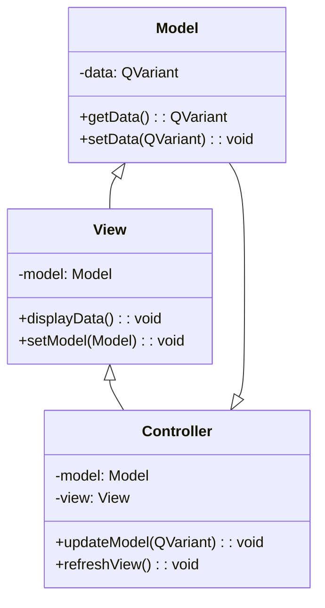

## 14.5 GUI Applications with Qt

In the realm of C++ development, creating graphical user interfaces (GUIs) is a crucial skill, especially for applications that require user interaction. Qt, a comprehensive C++ framework, stands out as a powerful tool for building cross-platform GUI applications. In this section, we will delve into the essentials of designing interfaces with Qt, focusing on the Model-View-Controller (MVC) pattern and the signal-slot mechanism, which are pivotal in creating responsive and maintainable applications.

### Introduction to Qt

Qt is a free and open-source widget toolkit for creating graphical user interfaces as well as cross-platform applications that run on various software and hardware platforms. It is widely used for developing applications with a graphical user interface (GUI) and is also used for developing non-GUI programs such as command-line tools and consoles for servers. Qt is notable for its rich set of widgets, cross-platform capabilities, and ease of use.

#### Key Features of Qt

- **Cross-Platform Development**: Qt allows developers to write code once and deploy it across multiple platforms, including Windows, macOS, Linux, iOS, and Android.
- **Rich Set of Widgets**: Qt provides a comprehensive set of UI components that can be customized to fit the needs of any application.
- **Signal-Slot Mechanism**: A powerful feature that enables communication between objects, making it easier to implement event-driven programming.
- **Model-View-Controller (MVC) Architecture**: Qt supports MVC architecture, which helps in separating the data, user interface, and control logic, leading to more organized and maintainable code.

### Designing Interfaces with Qt

Designing interfaces with Qt involves using its extensive library of widgets and tools to create intuitive and responsive user interfaces. Qt Designer, a tool provided by Qt, allows developers to design UIs visually, which can then be integrated into C++ code.

#### Using Qt Designer

Qt Designer is a powerful tool that allows developers to design and build GUIs using a drag-and-drop interface. It generates XML-based UI files that can be converted into C++ code using the `uic` (User Interface Compiler) tool.

**Steps to Use Qt Designer:**

1. **Create a New Form**: Start by creating a new form in Qt Designer. You can choose from various templates such as Main Window, Dialog, or Widget.
2. **Drag and Drop Widgets**: Use the widget box to drag and drop widgets onto the form. Customize their properties using the property editor.
3. **Set Layouts**: Organize widgets using layouts to ensure that the UI is responsive and adapts to different screen sizes.
4. **Connect Signals and Slots**: Use the signal-slot editor to connect signals from widgets to slots in your application logic.

### Model-View-Controller Patterns in Qt

The Model-View-Controller (MVC) pattern is a design pattern that separates an application into three interconnected components: Model, View, and Controller. This separation helps manage complex applications by dividing the responsibilities of data management, user interface, and control logic.

#### Components of MVC in Qt

- **Model**: Represents the data and the business logic of the application. In Qt, models are often implemented using classes derived from `QAbstractItemModel`, `QAbstractListModel`, or `QAbstractTableModel`.
- **View**: Displays the data to the user. Qt provides several view classes such as `QListView`, `QTableView`, and `QTreeView` that can be used to present data in different formats.
- **Controller**: Handles the input from the user and updates the model and view accordingly. In Qt, the controller logic is often embedded within the view or the application logic.

#### Implementing MVC in Qt

To implement the MVC pattern in Qt, follow these steps:

1. **Define the Model**: Create a class that inherits from one of Qt's model classes. Implement the necessary methods to provide data to the view.
2. **Create the View**: Use one of Qt's view classes to display the data. Set the model for the view using the `setModel()` method.
3. **Implement the Controller Logic**: Connect signals and slots to handle user interactions and update the model and view as needed.

**Example: Implementing a Simple MVC Application**

Let's create a simple application that displays a list of items using the MVC pattern.

```cpp
#include <QApplication>
#include <QListView>
#include <QStringListModel>

int main(int argc, char *argv[]) {
    QApplication app(argc, argv);

    // Model
    QStringListModel model;
    QStringList itemList;
    itemList << "Item 1" << "Item 2" << "Item 3";
    model.setStringList(itemList);

    // View
    QListView listView;
    listView.setModel(&model);
    listView.show();

    return app.exec();
}
```

In this example, we create a `QStringListModel` to serve as the model, a `QListView` as the view, and connect them using the `setModel()` method. The application displays a simple list of items.

### Signal and Slot Mechanisms

The signal-slot mechanism is a core feature of Qt that allows communication between objects. It is a type-safe way of implementing the observer pattern, where signals are emitted by objects and slots are functions that respond to these signals.

#### How Signals and Slots Work

- **Signals**: Signals are emitted by objects when they change state or when an event occurs. They are declared in the class definition using the `signals` keyword.
- **Slots**: Slots are functions that can be called in response to a signal. They are declared using the `slots` keyword.

#### Connecting Signals and Slots

To connect a signal to a slot, use the `QObject::connect()` function. This function takes the sender object, the signal, the receiver object, and the slot as parameters.

**Example: Connecting Signals and Slots**

```cpp
#include <QApplication>
#include <QPushButton>

int main(int argc, char *argv[]) {
    QApplication app(argc, argv);

    QPushButton button("Click Me");
    QObject::connect(&button, &QPushButton::clicked, &app, &QApplication::quit);

    button.show();
    return app.exec();
}
```

In this example, we create a `QPushButton` and connect its `clicked` signal to the `quit` slot of the `QApplication`. When the button is clicked, the application quits.

### Advanced Qt Features

Beyond the basics, Qt offers advanced features that can enhance the functionality and performance of your applications.

#### Custom Widgets

Qt allows developers to create custom widgets by subclassing existing widgets and reimplementing their event handlers. This provides flexibility in designing unique user interfaces.

**Example: Creating a Custom Widget**

```cpp
#include <QWidget>
#include <QPainter>

class CustomWidget : public QWidget {
protected:
    void paintEvent(QPaintEvent *event) override {
        QPainter painter(this);
        painter.setBrush(Qt::blue);
        painter.drawRect(10, 10, 100, 100);
    }
};
```

In this example, we create a custom widget by subclassing `QWidget` and reimplementing the `paintEvent()` method to draw a blue rectangle.

#### Multithreading in Qt

Qt provides support for multithreading, which can be used to improve the performance of applications by offloading tasks to separate threads. Qt's `QThread` class and the `QtConcurrent` module are commonly used for multithreading.

**Example: Using QThread**

```cpp
#include <QThread>
#include <QDebug>

class WorkerThread : public QThread {
protected:
    void run() override {
        qDebug() << "Running in a separate thread!";
    }
};

int main() {
    WorkerThread thread;
    thread.start();
    thread.wait();
    return 0;
}
```

In this example, we create a `WorkerThread` class that inherits from `QThread` and reimplement the `run()` method to perform tasks in a separate thread.

### Visualizing Qt's MVC Architecture

To better understand the MVC architecture in Qt, let's visualize the relationships between the Model, View, and Controller components.



**Diagram Description**: This class diagram illustrates the relationships between the Model, View, and Controller in a typical Qt MVC architecture. The Model holds the data, the View displays the data, and the Controller manages the interactions between the Model and the View.

### Best Practices for Qt Development

When developing GUI applications with Qt, consider the following best practices:

- **Use Layouts**: Always use layouts to organize widgets. This ensures that the UI is responsive and adapts to different screen sizes.
- **Leverage Qt's MVC Support**: Use Qt's model-view classes to separate data from the UI, making the application more maintainable.
- **Optimize Signal-Slot Connections**: Minimize the number of signal-slot connections to improve performance. Use direct connections for time-critical operations.
- **Profile and Optimize**: Use Qt's profiling tools to identify performance bottlenecks and optimize your code accordingly.
- **Keep UI Responsive**: Offload long-running tasks to separate threads to keep the UI responsive.

### Try It Yourself

Experiment with the code examples provided in this section. Try modifying the list of items in the MVC example or creating a custom widget with different shapes and colors. Explore Qt's documentation to learn more about its extensive features and capabilities.

### References and Further Reading

- [Qt Documentation](https://doc.qt.io/): Official documentation for Qt, including tutorials and examples.
- [Model/View Programming](https://doc.qt.io/qt-5/model-view-programming.html): Detailed guide on implementing MVC architecture in Qt.
- [Signals and Slots](https://doc.qt.io/qt-5/signalsandslots.html): Comprehensive explanation of the signal-slot mechanism in Qt.

### Knowledge Check

To reinforce your understanding of GUI applications with Qt, consider the following questions:

- How does the MVC pattern help in organizing code in Qt applications?
- What are the advantages of using the signal-slot mechanism in Qt?
- How can custom widgets enhance the functionality of a Qt application?
- What are some best practices for developing responsive UIs with Qt?

### Conclusion

Designing GUI applications with Qt is a rewarding endeavor that combines the power of C++ with the flexibility of a comprehensive framework. By mastering the MVC pattern and the signal-slot mechanism, you can create robust, scalable, and interactive applications. Remember, this is just the beginning. As you continue to explore Qt, you'll discover new ways to enhance your applications and deliver exceptional user experiences. Keep experimenting, stay curious, and enjoy the journey!

## Quiz Time!



### What is the primary advantage of using Qt for GUI applications?

- [x] Cross-platform development
- [ ] Low-level hardware access
- [ ] Built-in database management
- [ ] Integrated web server

> **Explanation:** Qt allows developers to write code once and deploy it across multiple platforms, making it ideal for cross-platform development.

### In Qt's MVC architecture, what is the role of the Model?

- [x] Represents the data and business logic
- [ ] Displays the data to the user
- [ ] Handles user input
- [ ] Manages signal-slot connections

> **Explanation:** The Model in MVC architecture is responsible for managing the data and business logic of the application.

### How are signals and slots connected in Qt?

- [x] Using the QObject::connect() function
- [ ] Through direct function calls
- [ ] By inheriting from QSignalEmitter
- [ ] Using the QSignalMapper class

> **Explanation:** Signals and slots in Qt are connected using the QObject::connect() function, which establishes a communication link between objects.

### What is the purpose of using layouts in Qt?

- [x] To ensure the UI is responsive and adapts to different screen sizes
- [ ] To define the color scheme of the application
- [ ] To manage database connections
- [ ] To handle network requests

> **Explanation:** Layouts in Qt are used to organize widgets in a way that ensures the UI is responsive and adapts to different screen sizes.

### Which Qt class is commonly used for multithreading?

- [x] QThread
- [ ] QMutex
- [ ] QTimer
- [ ] QEventLoop

> **Explanation:** QThread is the class commonly used in Qt for creating and managing threads.

### What is a key benefit of using custom widgets in Qt?

- [x] Flexibility in designing unique user interfaces
- [ ] Automatic data synchronization
- [ ] Built-in network communication
- [ ] Enhanced security features

> **Explanation:** Custom widgets allow developers to create unique user interfaces by subclassing existing widgets and customizing their behavior.

### What is the function of the `setModel()` method in Qt's MVC pattern?

- [x] It sets the model for a view
- [ ] It initializes the application
- [ ] It connects signals and slots
- [ ] It starts a new thread

> **Explanation:** The `setModel()` method is used to associate a model with a view in Qt's MVC pattern, allowing the view to display the model's data.

### How can you keep a Qt application's UI responsive during long-running tasks?

- [x] Offload tasks to separate threads
- [ ] Use more signal-slot connections
- [ ] Increase the application's priority
- [ ] Reduce the number of widgets

> **Explanation:** Offloading long-running tasks to separate threads ensures that the UI remains responsive by preventing the main thread from being blocked.

### What is the primary purpose of the signal-slot mechanism in Qt?

- [x] To enable communication between objects
- [ ] To manage database transactions
- [ ] To handle file I/O operations
- [ ] To render graphics

> **Explanation:** The signal-slot mechanism in Qt is designed to enable communication between objects, facilitating event-driven programming.

### True or False: Qt Designer can generate C++ code directly from UI designs.

- [x] True
- [ ] False

> **Explanation:** Qt Designer generates XML-based UI files that can be converted into C++ code using the `uic` tool.


