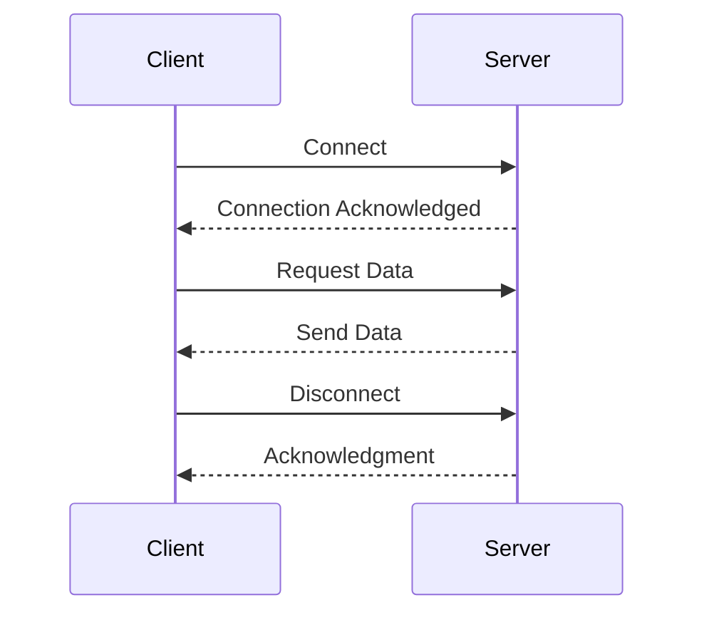

## 14.6 Networked Applications

In today's interconnected world, networked applications form the backbone of modern software systems. From web services to distributed databases, understanding how to design and implement networked applications is crucial for software engineers and architects. In this section, we will delve into the principles of building networked applications using C++, focusing on client-server architectures, concurrency management, and scalable network design.

### Introduction to Networked Applications

Networked applications are software systems that communicate over a network to perform tasks. These applications can range from simple client-server models to complex distributed systems. The key to building effective networked applications lies in understanding the underlying architecture, managing concurrency, and ensuring scalability.

### Client-Server Architecture

The client-server architecture is a foundational model for networked applications. In this model, clients request services from servers, which process the requests and return responses. This architecture is prevalent in web applications, email services, and many other networked systems.

#### Key Concepts

- **Client**: The client is the entity that initiates communication by sending requests to the server. Clients can be web browsers, mobile apps, or any software that requires data from a server.
- **Server**: The server is responsible for processing client requests and returning appropriate responses. Servers can handle multiple clients simultaneously and often provide services such as data storage, computation, or resource management.

#### Implementing a Simple Client-Server Model in C++

Let's start by implementing a basic client-server model using C++ and the Boost.Asio library, which provides a robust framework for network programming.

**Server Code Example:**

```cpp
#include <iostream>
#include <boost/asio.hpp>

using boost::asio::ip::tcp;

void start_server() {
    try {
        boost::asio::io_context io_context;
        tcp::acceptor acceptor(io_context, tcp::endpoint(tcp::v4(), 12345));

        std::cout << "Server is running on port 12345..." << std::endl;

        while (true) {
            tcp::socket socket(io_context);
            acceptor.accept(socket);

            std::string message = "Hello from server!";
            boost::system::error_code ignored_error;
            boost::asio::write(socket, boost::asio::buffer(message), ignored_error);
        }
    } catch (std::exception& e) {
        std::cerr << "Exception: " << e.what() << std::endl;
    }
}

int main() {
    start_server();
    return 0;
}
```

**Client Code Example:**

```cpp
#include <iostream>
#include <boost/asio.hpp>

using boost::asio::ip::tcp;

void start_client() {
    try {
        boost::asio::io_context io_context;
        tcp::resolver resolver(io_context);
        tcp::resolver::results_type endpoints = resolver.resolve("127.0.0.1", "12345");

        tcp::socket socket(io_context);
        boost::asio::connect(socket, endpoints);

        char reply[1024];
        size_t reply_length = boost::asio::read(socket, boost::asio::buffer(reply, 1024));
        std::cout << "Reply from server: ";
        std::cout.write(reply, reply_length);
        std::cout << std::endl;
    } catch (std::exception& e) {
        std::cerr << "Exception: " << e.what() << std::endl;
    }
}

int main() {
    start_client();
    return 0;
}
```

In this example, the server listens on port 12345 and sends a greeting message to any client that connects. The client connects to the server and reads the message.

### Dealing with Concurrency and Synchronization

Concurrency is a critical aspect of networked applications, especially when dealing with multiple clients simultaneously. Proper concurrency management ensures that applications remain responsive and efficient.

#### Concurrency Challenges

- **Race Conditions**: Occur when multiple threads access shared data concurrently, leading to unpredictable results.
- **Deadlocks**: Happen when two or more threads are waiting indefinitely for resources held by each other.
- **Starvation**: Occurs when a thread is perpetually denied access to resources, preventing it from making progress.

#### Concurrency in C++

C++ provides several mechanisms to handle concurrency, including threads, mutexes, and condition variables. The Standard Library's `<thread>` and `<mutex>` headers offer a simple yet powerful way to manage concurrency.

**Example: Using Threads and Mutexes**

```cpp
#include <iostream>
#include <thread>
#include <mutex>
#include <vector>

std::mutex mtx;

void print_message(const std::string& message) {
    std::lock_guard<std::mutex> lock(mtx);
    std::cout << message << std::endl;
}

int main() {
    std::vector<std::thread> threads;
    for (int i = 0; i < 5; ++i) {
        threads.emplace_back(print_message, "Hello from thread " + std::to_string(i));
    }

    for (auto& thread : threads) {
        thread.join();
    }

    return 0;
}
```

In this example, multiple threads print messages concurrently. The `std::mutex` ensures that only one thread accesses the `std::cout` stream at a time, preventing race conditions.

#### Synchronization Techniques

- **Mutexes**: Used to protect shared data from concurrent access.
- **Condition Variables**: Allow threads to wait for certain conditions to be met.
- **Atomic Operations**: Provide lock-free synchronization for simple operations.

### Scalable Network Design

Scalability is the ability of a networked application to handle increased load by adding resources. Designing scalable applications involves several considerations, including load balancing, distributed systems, and efficient resource management.

#### Load Balancing

Load balancing distributes incoming network traffic across multiple servers to ensure no single server becomes a bottleneck. This can be achieved through hardware load balancers or software solutions like Nginx or HAProxy.

#### Distributed Systems

Distributed systems consist of multiple interconnected components that work together to provide a service. These systems offer several advantages, including fault tolerance, scalability, and resource sharing.

**Key Concepts in Distributed Systems:**

- **Replication**: Duplicating data across multiple nodes to ensure availability and fault tolerance.
- **Sharding**: Dividing data into smaller, manageable pieces distributed across multiple nodes.
- **Consistency Models**: Ensuring data consistency across distributed nodes, such as eventual consistency or strong consistency.

#### Efficient Resource Management

Efficient resource management is crucial for scalable networked applications. This involves optimizing CPU, memory, and network usage to handle increased loads effectively.

**Example: Asynchronous I/O with Boost.Asio**

Asynchronous I/O allows applications to perform other tasks while waiting for I/O operations to complete, improving resource utilization.

```cpp
#include <iostream>
#include <boost/asio.hpp>

using boost::asio::ip::tcp;

void handle_client(tcp::socket socket) {
    auto message = std::make_shared<std::string>("Hello from async server!");
    boost::asio::async_write(socket, boost::asio::buffer(*message),
        [message](boost::system::error_code ec, std::size_t /*length*/) {
            if (!ec) {
                std::cout << "Message sent: " << *message << std::endl;
            }
        });
}

void start_async_server() {
    try {
        boost::asio::io_context io_context;
        tcp::acceptor acceptor(io_context, tcp::endpoint(tcp::v4(), 12345));

        std::cout << "Async server is running on port 12345..." << std::endl;

        acceptor.async_accept(
            [&acceptor](boost::system::error_code ec, tcp::socket socket) {
                if (!ec) {
                    handle_client(std::move(socket));
                }
                start_async_server();
            });

        io_context.run();
    } catch (std::exception& e) {
        std::cerr << "Exception: " << e.what() << std::endl;
    }
}

int main() {
    start_async_server();
    return 0;
}
```

In this example, the server uses asynchronous I/O to handle client connections, allowing it to serve multiple clients concurrently without blocking.

### Visualizing Networked Application Architecture

To better understand the architecture of networked applications, let's visualize a typical client-server model using a sequence diagram.



This diagram illustrates the basic interaction between a client and a server, highlighting the connection, data exchange, and disconnection phases.

### Try It Yourself

Now that we've covered the basics of networked applications, it's time to experiment with the code examples provided. Try modifying the server to handle multiple clients simultaneously or implement a simple chat application using the client-server model.

### Knowledge Check

- What are the key components of a client-server architecture?
- How do mutexes help in managing concurrency?
- What is the role of load balancing in scalable network design?
- How does asynchronous I/O improve resource utilization?

### Conclusion

Building networked applications in C++ requires a solid understanding of client-server architectures, concurrency management, and scalable design principles. By mastering these concepts, you can create robust, efficient, and scalable networked applications that meet the demands of modern software systems.

## Quiz Time!



### What is the primary role of a server in a client-server architecture?

- [x] To process client requests and return responses
- [ ] To initiate communication with clients
- [ ] To balance network traffic across multiple clients
- [ ] To provide a graphical user interface

> **Explanation:** In a client-server architecture, the server's primary role is to process requests from clients and return the appropriate responses.

### Which C++ library is commonly used for network programming?

- [x] Boost.Asio
- [ ] STL
- [ ] OpenCV
- [ ] Qt

> **Explanation:** Boost.Asio is a popular library for network programming in C++, providing robust support for asynchronous I/O operations.

### What is a race condition?

- [x] A situation where multiple threads access shared data concurrently, leading to unpredictable results
- [ ] A method for balancing network traffic
- [ ] A technique for optimizing memory usage
- [ ] A type of network protocol

> **Explanation:** A race condition occurs when multiple threads access shared data concurrently, leading to unpredictable and incorrect results.

### What is the purpose of load balancing in networked applications?

- [x] To distribute incoming network traffic across multiple servers
- [ ] To ensure data consistency across distributed nodes
- [ ] To manage client connections efficiently
- [ ] To encrypt data transmissions

> **Explanation:** Load balancing distributes incoming network traffic across multiple servers to prevent any single server from becoming a bottleneck.

### Which synchronization technique allows threads to wait for certain conditions to be met?

- [x] Condition Variables
- [ ] Mutexes
- [ ] Atomic Operations
- [ ] Threads

> **Explanation:** Condition variables allow threads to wait for specific conditions to be met before proceeding, facilitating synchronization.

### What is sharding in distributed systems?

- [x] Dividing data into smaller, manageable pieces distributed across multiple nodes
- [ ] Duplicating data across multiple nodes
- [ ] Ensuring data consistency across nodes
- [ ] Encrypting data for secure transmission

> **Explanation:** Sharding involves dividing data into smaller, manageable pieces that are distributed across multiple nodes to improve performance and scalability.

### How does asynchronous I/O improve resource utilization?

- [x] By allowing applications to perform other tasks while waiting for I/O operations to complete
- [ ] By encrypting data transmissions
- [ ] By ensuring data consistency
- [ ] By balancing network traffic

> **Explanation:** Asynchronous I/O allows applications to perform other tasks while waiting for I/O operations to complete, improving resource utilization and efficiency.

### What is the main advantage of using threads in C++?

- [x] To enable concurrent execution of code
- [ ] To encrypt data transmissions
- [ ] To balance network traffic
- [ ] To manage client connections

> **Explanation:** Threads enable the concurrent execution of code, allowing multiple tasks to be performed simultaneously, improving efficiency and responsiveness.

### What is the role of replication in distributed systems?

- [x] To duplicate data across multiple nodes for availability and fault tolerance
- [ ] To divide data into smaller pieces
- [ ] To encrypt data transmissions
- [ ] To balance network traffic

> **Explanation:** Replication involves duplicating data across multiple nodes to ensure availability and fault tolerance in distributed systems.

### True or False: Mutexes are used to protect shared data from concurrent access.

- [x] True
- [ ] False

> **Explanation:** Mutexes are used to protect shared data from concurrent access, preventing race conditions and ensuring data integrity.



Remember, mastering networked applications in C++ is a journey. Keep experimenting, stay curious, and enjoy the process of building robust and scalable networked systems!
