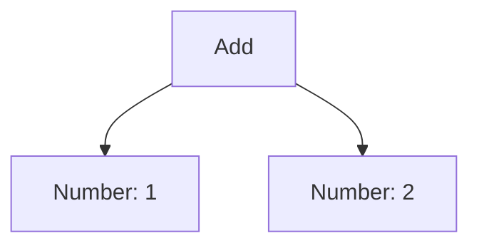

## 14.7 Designing a Compiler Front-End

Designing a compiler front-end is a fascinating and intricate task that involves several key components: parsing, syntax analysis, and the construction of abstract syntax trees (ASTs). This section will guide you through these concepts, providing a comprehensive understanding of how to implement interpreters and code generators in C++. Whether you're building a compiler from scratch or enhancing an existing one, mastering these techniques will be invaluable.

### Introduction to Compiler Design

A compiler is a program that translates source code written in a high-level programming language into machine code, bytecode, or another high-level language. The front-end of a compiler is responsible for analyzing the source code to ensure it is syntactically correct and transforming it into an intermediate representation that can be further processed by the compiler's back-end.

### Key Concepts in Compiler Front-End Design

Before diving into the specifics of parsing and syntax analysis, let's establish a foundational understanding of the key concepts involved in designing a compiler front-end.

#### Lexical Analysis

Lexical analysis, or scanning, is the first phase of a compiler. It involves reading the source code and converting it into a sequence of tokens. Tokens are the smallest units of meaning, such as keywords, identifiers, operators, and literals.

#### Syntax Analysis

Syntax analysis, or parsing, is the process of analyzing the sequence of tokens to determine its grammatical structure. This phase ensures that the source code adheres to the syntax rules of the programming language.

#### Abstract Syntax Tree (AST)

An abstract syntax tree is a tree representation of the syntactic structure of the source code. Each node in the tree represents a construct occurring in the source code. ASTs are used to facilitate further analysis and transformation of the code.

### Parsing and Syntax Analysis

Parsing is a critical component of the compiler front-end. It involves analyzing the sequence of tokens produced by the lexical analyzer and constructing an abstract syntax tree (AST). Let's explore the different types of parsers and how they work.

#### Types of Parsers

There are two main types of parsers: top-down parsers and bottom-up parsers.

1. **Top-Down Parsers**: These parsers start from the root of the parse tree and work their way down to the leaves. They include recursive descent parsers and LL parsers.

2. **Bottom-Up Parsers**: These parsers start from the leaves of the parse tree and work their way up to the root. They include LR parsers and shift-reduce parsers.

#### Recursive Descent Parsing

Recursive descent parsing is a top-down parsing technique that uses a set of recursive procedures to process the input. Each procedure corresponds to a non-terminal in the grammar.

```cpp
// Example of a simple recursive descent parser in C++
#include <iostream>
#include <string>

class Parser {
public:
    explicit Parser(const std::string& input) : input(input), pos(0) {}

    void parse() {
        expr();
        if (pos != input.length()) {
            throw std::runtime_error("Unexpected input");
        }
    }

private:
    std::string input;
    size_t pos;

    void expr() {
        term();
        while (pos < input.length() && (input[pos] == '+' || input[pos] == '-')) {
            pos++;
            term();
        }
    }

    void term() {
        if (pos < input.length() && std::isdigit(input[pos])) {
            pos++;
        } else {
            throw std::runtime_error("Expected a digit");
        }
    }
};

int main() {
    try {
        Parser parser("1+2-3");
        parser.parse();
        std::cout << "Parsing successful!" << std::endl;
    } catch (const std::runtime_error& e) {
        std::cerr << "Parsing error: " << e.what() << std::endl;
    }
    return 0;
}
```

In this example, the `Parser` class processes a simple arithmetic expression consisting of digits and the `+` and `-` operators. The `expr()` function handles expressions, while the `term()` function handles individual terms.

#### LL Parsing

LL parsers are a type of top-down parser that read input from left to right and produce a leftmost derivation. They are often implemented using recursive descent parsing.

#### LR Parsing

LR parsers are a type of bottom-up parser that read input from left to right and produce a rightmost derivation in reverse. They are more powerful than LL parsers and can handle a wider range of grammars.

### Implementing Interpreters and Code Generators

Once the syntax analysis phase is complete and an AST has been constructed, the next step is to implement interpreters and code generators. These components are responsible for executing the code or translating it into another form.

#### Interpreters

An interpreter directly executes the instructions in the source code without converting them to machine code. It traverses the AST and performs the operations specified by the nodes.

```cpp
// Example of a simple interpreter for arithmetic expressions
#include <iostream>
#include <string>
#include <memory>

class Expr {
public:
    virtual ~Expr() = default;
    virtual int evaluate() const = 0;
};

class Number : public Expr {
public:
    explicit Number(int value) : value(value) {}
    int evaluate() const override { return value; }

private:
    int value;
};

class Add : public Expr {
public:
    Add(std::unique_ptr<Expr> left, std::unique_ptr<Expr> right)
        : left(std::move(left)), right(std::move(right)) {}

    int evaluate() const override {
        return left->evaluate() + right->evaluate();
    }

private:
    std::unique_ptr<Expr> left, right;
};

int main() {
    auto expr = std::make_unique<Add>(
        std::make_unique<Number>(1),
        std::make_unique<Number>(2)
    );

    std::cout << "Result: " << expr->evaluate() << std::endl;
    return 0;
}
```

In this example, we define an `Expr` class hierarchy to represent arithmetic expressions. The `Number` class represents numeric literals, while the `Add` class represents addition operations. The `evaluate()` function recursively evaluates the expression.

#### Code Generators

A code generator translates the intermediate representation (such as an AST) into machine code, bytecode, or another high-level language. This process involves traversing the AST and emitting the corresponding instructions.

```cpp
// Example of a simple code generator for arithmetic expressions
#include <iostream>
#include <string>
#include <memory>

class CodeGenerator {
public:
    void generate(const Expr& expr) {
        std::cout << "MOV R0, " << expr.evaluate() << std::endl;
    }
};

int main() {
    auto expr = std::make_unique<Add>(
        std::make_unique<Number>(1),
        std::make_unique<Number>(2)
    );

    CodeGenerator generator;
    generator.generate(*expr);
    return 0;
}
```

In this example, the `CodeGenerator` class generates assembly-like instructions for the arithmetic expression. The `generate()` function emits a `MOV` instruction to move the result of the expression into a register.

### Abstract Syntax Trees (ASTs)

An abstract syntax tree is a crucial data structure in the compiler front-end. It represents the hierarchical structure of the source code and is used for further analysis and transformation.

#### Constructing an AST

Constructing an AST involves defining a set of classes to represent the various constructs in the source code. Each class corresponds to a node in the tree.

```cpp
// Example of constructing an AST for arithmetic expressions
#include <iostream>
#include <string>
#include <memory>

class Expr {
public:
    virtual ~Expr() = default;
    virtual void print() const = 0;
};

class Number : public Expr {
public:
    explicit Number(int value) : value(value) {}
    void print() const override { std::cout << value; }

private:
    int value;
};

class Add : public Expr {
public:
    Add(std::unique_ptr<Expr> left, std::unique_ptr<Expr> right)
        : left(std::move(left)), right(std::move(right)) {}

    void print() const override {
        std::cout << "(";
        left->print();
        std::cout << " + ";
        right->print();
        std::cout << ")";
    }

private:
    std::unique_ptr<Expr> left, right;
};

int main() {
    auto expr = std::make_unique<Add>(
        std::make_unique<Number>(1),
        std::make_unique<Number>(2)
    );

    expr->print();
    std::cout << std::endl;
    return 0;
}
```

In this example, we define an `Expr` class hierarchy to represent arithmetic expressions. The `Number` class represents numeric literals, while the `Add` class represents addition operations. The `print()` function recursively prints the expression.

#### Visualizing the AST

Visualizing the AST can help understand the structure of the source code and identify potential issues. Let's use a Mermaid.js diagram to represent the AST for the expression `1 + 2`.



In this diagram, the `Add` node represents the addition operation, while the `Number` nodes represent the numeric literals. The edges indicate the relationships between the nodes.

### Design Considerations

When designing a compiler front-end, there are several important considerations to keep in mind.

#### Error Handling

Error handling is a critical aspect of compiler design. The compiler should provide meaningful error messages that help the programmer identify and fix issues in the source code.

#### Performance

Performance is another important consideration. The compiler should be efficient in terms of both time and space. Techniques such as memoization and caching can help improve performance.

#### Extensibility

Extensibility is crucial for maintaining and enhancing the compiler over time. The design should allow for easy addition of new language features and optimizations.

### Differences and Similarities

It's important to understand the differences and similarities between various parsing techniques and data structures used in compiler design.

#### Parsing Techniques

- **Recursive Descent Parsing**: Simple and easy to implement, but limited in terms of the grammars it can handle.
- **LL Parsing**: More powerful than recursive descent parsing, but still limited compared to LR parsing.
- **LR Parsing**: The most powerful parsing technique, capable of handling a wide range of grammars.

#### Data Structures

- **Abstract Syntax Tree (AST)**: Represents the hierarchical structure of the source code.
- **Parse Tree**: Represents the syntactic structure of the source code, including all the details of the grammar.

### Try It Yourself

Experiment with the code examples provided in this section. Try modifying the grammar and adding new constructs to the parser and interpreter. For example, you could add support for multiplication and division operations, or implement a more complex expression language.

### Knowledge Check

Let's reinforce what we've learned with a few questions:

- What is the purpose of lexical analysis in a compiler?
- How does a recursive descent parser work?
- What is the difference between an abstract syntax tree and a parse tree?
- How can error handling be improved in a compiler front-end?
- What are some techniques for optimizing the performance of a compiler?

### Embrace the Journey

Designing a compiler front-end is a challenging but rewarding task. As you gain experience, you'll develop a deeper understanding of the intricacies of compiler design and the various techniques used to implement efficient and robust compilers. Remember, this is just the beginning. Keep experimenting, stay curious, and enjoy the journey!

## Quiz Time!



### What is the primary role of a compiler front-end?

- [x] Analyzing source code and transforming it into an intermediate representation
- [ ] Generating machine code
- [ ] Optimizing code for performance
- [ ] Linking object files

> **Explanation:** The compiler front-end is responsible for analyzing the source code and transforming it into an intermediate representation, which is then processed by the back-end.

### Which parsing technique is most powerful in handling a wide range of grammars?

- [ ] Recursive descent parsing
- [ ] LL parsing
- [x] LR parsing
- [ ] Top-down parsing

> **Explanation:** LR parsing is the most powerful parsing technique, capable of handling a wide range of grammars compared to recursive descent and LL parsing.

### What is an abstract syntax tree (AST)?

- [x] A tree representation of the syntactic structure of the source code
- [ ] A sequence of tokens
- [ ] A list of machine instructions
- [ ] A graph of dependencies

> **Explanation:** An AST is a tree representation of the syntactic structure of the source code, used for further analysis and transformation.

### What is the difference between an AST and a parse tree?

- [x] An AST represents the hierarchical structure, while a parse tree includes all grammar details
- [ ] An AST includes all grammar details, while a parse tree represents the hierarchical structure
- [ ] An AST is used for lexical analysis, while a parse tree is used for syntax analysis
- [ ] An AST is more detailed than a parse tree

> **Explanation:** An AST represents the hierarchical structure of the source code, while a parse tree includes all the details of the grammar.

### How can error handling be improved in a compiler front-end?

- [x] Providing meaningful error messages
- [ ] Ignoring errors
- [ ] Terminating the program immediately
- [ ] Logging errors without user feedback

> **Explanation:** Providing meaningful error messages helps the programmer identify and fix issues in the source code.

### What is the purpose of lexical analysis?

- [x] Converting source code into a sequence of tokens
- [ ] Generating machine code
- [ ] Optimizing code for performance
- [ ] Linking object files

> **Explanation:** Lexical analysis converts the source code into a sequence of tokens, which are the smallest units of meaning.

### Which of the following is a top-down parsing technique?

- [x] Recursive descent parsing
- [ ] LR parsing
- [ ] Shift-reduce parsing
- [ ] Bottom-up parsing

> **Explanation:** Recursive descent parsing is a top-down parsing technique that uses a set of recursive procedures to process the input.

### What is the role of an interpreter in a compiler?

- [x] Directly executing the instructions in the source code
- [ ] Generating machine code
- [ ] Optimizing code for performance
- [ ] Linking object files

> **Explanation:** An interpreter directly executes the instructions in the source code without converting them to machine code.

### What is a key consideration when designing a compiler front-end?

- [x] Extensibility
- [ ] Ignoring performance
- [ ] Avoiding error handling
- [ ] Limiting language features

> **Explanation:** Extensibility is crucial for maintaining and enhancing the compiler over time, allowing for easy addition of new language features and optimizations.

### True or False: An interpreter translates source code into machine code.

- [ ] True
- [x] False

> **Explanation:** An interpreter directly executes the instructions in the source code without translating them into machine code.


