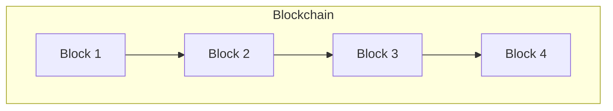

## 14.9 Blockchain Applications with C++

Blockchain technology has revolutionized the way we think about data integrity, security, and decentralization. As expert software engineers and architects, understanding how to build blockchain applications with C++ can open up new avenues for innovation. In this section, we'll delve into the intricacies of blockchain development using C++, focusing on consensus algorithms, cryptography, smart contracts, and decentralized applications (dApps).

### Introduction to Blockchain Technology

Blockchain is a distributed ledger technology that allows data to be stored across a network of computers in a way that ensures data integrity and security. Each block in the chain contains a list of transactions, and once a block is added to the chain, its data cannot be altered retroactively without altering all subsequent blocks, which requires consensus from the network majority.

#### Key Concepts

- **Decentralization**: Unlike traditional databases, blockchains do not have a central authority. This decentralization enhances security and transparency.
- **Immutability**: Once data is written on a blockchain, it cannot be changed, ensuring a permanent and tamper-proof record.
- **Consensus Mechanisms**: These are protocols used to achieve agreement on a single data value among distributed processes or systems.

### Why C++ for Blockchain Development?

C++ is a powerful language that offers several advantages for blockchain development:

- **Performance**: C++ is known for its high performance and efficiency, which is crucial for handling the complex computations required in blockchain operations.
- **Control Over System Resources**: With C++, developers have fine-grained control over system resources, which is essential for optimizing blockchain nodes.
- **Robust Libraries**: C++ has a rich set of libraries for cryptography and networking, which are vital components of blockchain technology.

### Building Blockchain Solutions with C++

#### Designing a Blockchain Architecture

To build a blockchain application, we need to design an architecture that supports the core functionalities of a blockchain. Let's break down the essential components:

1. **Block Structure**: Each block should contain a timestamp, a list of transactions, a hash of the previous block, and a nonce for proof-of-work.
2. **Blockchain**: A chain of blocks linked together, where each block references the previous block.
3. **Nodes**: Participants in the network that maintain a copy of the blockchain and validate transactions.
4. **Consensus Algorithm**: A protocol to agree on the validity of transactions and the order in which they are added to the blockchain.

#### Implementing a Basic Blockchain in C++

Let's start by implementing a simple blockchain in C++ to understand the basic structure and operations.

```cpp
#include <iostream>
#include <vector>
#include <ctime>
#include <sstream>
#include <openssl/sha.h>

// Function to compute SHA256 hash
std::string sha256(const std::string& str) {
    unsigned char hash[SHA256_DIGEST_LENGTH];
    SHA256_CTX sha256;
    SHA256_Init(&sha256);
    SHA256_Update(&sha256, str.c_str(), str.size());
    SHA256_Final(hash, &sha256);
    std::stringstream ss;
    for (int i = 0; i < SHA256_DIGEST_LENGTH; ++i) {
        ss << std::hex << static_cast<int>(hash[i]);
    }
    return ss.str();
}

class Block {
public:
    std::string previousHash;
    std::string data;
    std::time_t timestamp;
    std::string hash;
    int nonce;

    Block(std::string data, std::string previousHash)
        : data(data), previousHash(previousHash), timestamp(std::time(0)), nonce(0) {
        hash = calculateHash();
    }

    std::string calculateHash() const {
        std::stringstream ss;
        ss << previousHash << data << timestamp << nonce;
        return sha256(ss.str());
    }

    void mineBlock(int difficulty) {
        std::string target(difficulty, '0');
        while (hash.substr(0, difficulty) != target) {
            nonce++;
            hash = calculateHash();
        }
        std::cout << "Block mined: " << hash << std::endl;
    }
};

class Blockchain {
public:
    Blockchain() {
        chain.emplace_back(Block("Genesis Block", "0"));
    }

    void addBlock(Block newBlock) {
        newBlock.previousHash = getLastBlock().hash;
        newBlock.mineBlock(difficulty);
        chain.push_back(newBlock);
    }

    Block getLastBlock() const {
        return chain.back();
    }

private:
    std::vector<Block> chain;
    int difficulty = 4;
};

int main() {
    Blockchain myBlockchain;
    myBlockchain.addBlock(Block("Block 1 Data", myBlockchain.getLastBlock().hash));
    myBlockchain.addBlock(Block("Block 2 Data", myBlockchain.getLastBlock().hash));

    return 0;
}
```

### Consensus Algorithms

Consensus algorithms are crucial for maintaining the integrity and security of a blockchain. They ensure that all nodes in the network agree on the state of the blockchain.

#### Proof of Work (PoW)

Proof of Work is the most well-known consensus algorithm, used by Bitcoin. It requires nodes to solve complex mathematical puzzles to validate transactions and create new blocks.

- **Advantages**: High security due to computational difficulty.
- **Disadvantages**: Energy-intensive and slow.

#### Proof of Stake (PoS)

Proof of Stake is an alternative to PoW that selects validators based on the number of coins they hold and are willing to "stake" as collateral.

- **Advantages**: More energy-efficient than PoW.
- **Disadvantages**: Can lead to centralization if a few entities hold most of the coins.

#### Implementing a Simple PoW in C++

Let's enhance our blockchain implementation with a basic Proof of Work mechanism.

```cpp
void Block::mineBlock(int difficulty) {
    std::string target(difficulty, '0');
    while (hash.substr(0, difficulty) != target) {
        nonce++;
        hash = calculateHash();
    }
    std::cout << "Block mined: " << hash << std::endl;
}
```

### Cryptography in Blockchain

Cryptography is a fundamental aspect of blockchain technology, ensuring data security and integrity.

#### Hash Functions

Hash functions are used to create a unique identifier for each block. They are deterministic, fast, and produce a fixed-size output.

#### Public Key Cryptography

Public key cryptography is used to secure transactions. Each user has a public and private key pair, where the public key is used to receive funds, and the private key is used to sign transactions.

#### Implementing Cryptographic Functions in C++

Using the OpenSSL library, we can implement cryptographic functions in our blockchain application.

```cpp
#include <openssl/sha.h>

// Function to compute SHA256 hash
std::string sha256(const std::string& str) {
    unsigned char hash[SHA256_DIGEST_LENGTH];
    SHA256_CTX sha256;
    SHA256_Init(&sha256);
    SHA256_Update(&sha256, str.c_str(), str.size());
    SHA256_Final(hash, &sha256);
    std::stringstream ss;
    for (int i = 0; i < SHA256_DIGEST_LENGTH; ++i) {
        ss << std::hex << static_cast<int>(hash[i]);
    }
    return ss.str();
}
```

### Smart Contracts and Decentralized Applications (dApps)

Smart contracts are self-executing contracts with the terms of the agreement directly written into code. They run on the blockchain, ensuring transparency and trust.

#### Developing Smart Contracts

While C++ is not typically used for writing smart contracts (languages like Solidity are more common), C++ can be used to create environments where smart contracts execute, such as in the EOS.IO blockchain.

#### Implementing Smart Contracts

To illustrate, let's consider a simple smart contract scenario where we manage a token ledger.

```cpp
#include <iostream>
#include <map>

class TokenContract {
public:
    void createAccount(const std::string& account) {
        if (ledger.find(account) == ledger.end()) {
            ledger[account] = 0;
            std::cout << "Account created: " << account << std::endl;
        } else {
            std::cout << "Account already exists." << std::endl;
        }
    }

    void transfer(const std::string& from, const std::string& to, int amount) {
        if (ledger[from] >= amount) {
            ledger[from] -= amount;
            ledger[to] += amount;
            std::cout << "Transferred " << amount << " tokens from " << from << " to " << to << std::endl;
        } else {
            std::cout << "Insufficient balance." << std::endl;
        }
    }

    void mint(const std::string& account, int amount) {
        ledger[account] += amount;
        std::cout << "Minted " << amount << " tokens to " << account << std::endl;
    }

    void balanceOf(const std::string& account) const {
        auto it = ledger.find(account);
        if (it != ledger.end()) {
            std::cout << "Balance of " << account << ": " << it->second << " tokens" << std::endl;
        } else {
            std::cout << "Account not found." << std::endl;
        }
    }

private:
    std::map<std::string, int> ledger;
};

int main() {
    TokenContract contract;
    contract.createAccount("Alice");
    contract.createAccount("Bob");
    contract.mint("Alice", 100);
    contract.transfer("Alice", "Bob", 50);
    contract.balanceOf("Alice");
    contract.balanceOf("Bob");

    return 0;
}
```

### Decentralized Applications (dApps)

dApps are applications that run on a blockchain network rather than a centralized server. They leverage smart contracts to execute operations.

#### Building a dApp with C++

To build a dApp, we need to integrate blockchain functionality with a user interface. While C++ is primarily used for backend operations, it can be combined with other technologies to create a full-fledged dApp.

### Visualizing Blockchain Architecture

Let's visualize the basic structure of a blockchain using a Mermaid.js diagram.



**Diagram Description:** This diagram represents a simple blockchain with four blocks. Each block is linked to the previous one, forming a chain.

### Design Considerations

When developing blockchain applications with C++, consider the following:

- **Security**: Ensure robust cryptographic practices to protect data integrity and user privacy.
- **Scalability**: Design your application to handle increased load as the network grows.
- **Interoperability**: Consider how your blockchain will interact with other systems and networks.

### Differences and Similarities

Blockchain applications can be complex, and it's essential to understand the differences and similarities between various blockchain technologies and consensus algorithms. For instance, PoW and PoS serve the same purpose but differ significantly in implementation and resource requirements.

### Try It Yourself

Experiment with the code examples provided. Try modifying the difficulty level in the Proof of Work implementation or adding new features to the smart contract. This hands-on approach will deepen your understanding of blockchain development with C++.

### References and Links

- [OpenSSL Documentation](https://www.openssl.org/docs/)
- [Bitcoin Whitepaper](https://bitcoin.org/bitcoin.pdf)
- [Ethereum Whitepaper](https://ethereum.org/en/whitepaper/)
- [EOS.IO Technical Whitepaper](https://eos.io/)

### Knowledge Check

- What are the key components of a blockchain?
- How does Proof of Work differ from Proof of Stake?
- What role does cryptography play in blockchain technology?
- How can C++ be used in developing smart contracts?

### Embrace the Journey

Remember, blockchain technology is continually evolving. As you explore blockchain applications with C++, stay curious and open to new ideas. The knowledge you gain here is just the beginning of your journey into the world of decentralized systems.

## Quiz Time!



### What is the primary advantage of using C++ for blockchain development?

- [x] High performance and efficiency
- [ ] Easy syntax and readability
- [ ] Built-in blockchain libraries
- [ ] Automatic memory management

> **Explanation:** C++ is known for its high performance and efficiency, which is crucial for handling the complex computations required in blockchain operations.

### Which consensus algorithm is known for being energy-intensive?

- [x] Proof of Work (PoW)
- [ ] Proof of Stake (PoS)
- [ ] Delegated Proof of Stake (DPoS)
- [ ] Byzantine Fault Tolerance (BFT)

> **Explanation:** Proof of Work (PoW) is energy-intensive because it requires solving complex mathematical puzzles.

### What is the role of cryptography in blockchain technology?

- [x] Ensuring data security and integrity
- [ ] Simplifying transaction processes
- [ ] Reducing transaction fees
- [ ] Increasing network speed

> **Explanation:** Cryptography ensures data security and integrity by protecting data from unauthorized access and tampering.

### What is a smart contract?

- [x] A self-executing contract with terms written into code
- [ ] A physical contract stored on the blockchain
- [ ] A contract that requires manual execution
- [ ] A contract that cannot be altered

> **Explanation:** A smart contract is a self-executing contract with the terms of the agreement directly written into code.

### Which language is commonly used for writing smart contracts on Ethereum?

- [ ] C++
- [x] Solidity
- [ ] Python
- [ ] Java

> **Explanation:** Solidity is the most commonly used language for writing smart contracts on the Ethereum blockchain.

### What is a dApp?

- [x] A decentralized application that runs on a blockchain network
- [ ] A desktop application for blockchain management
- [ ] A data analysis tool for blockchain
- [ ] A digital asset platform

> **Explanation:** A dApp, or decentralized application, runs on a blockchain network rather than a centralized server.

### What is the purpose of a nonce in a blockchain block?

- [x] To help solve the mathematical puzzle in PoW
- [ ] To store transaction data
- [ ] To identify the block creator
- [ ] To timestamp the block

> **Explanation:** The nonce is used in the Proof of Work algorithm to solve the mathematical puzzle required to mine a block.

### How does Proof of Stake select validators?

- [x] Based on the number of coins they hold and are willing to stake
- [ ] Randomly from all network participants
- [ ] Based on computational power
- [ ] Through a voting process

> **Explanation:** Proof of Stake selects validators based on the number of coins they hold and are willing to stake as collateral.

### What is the main difference between PoW and PoS?

- [x] PoW relies on computational puzzles, while PoS relies on coin holdings
- [ ] PoW is faster than PoS
- [ ] PoS is more secure than PoW
- [ ] PoS requires more energy than PoW

> **Explanation:** PoW relies on solving computational puzzles, while PoS selects validators based on their coin holdings.

### True or False: C++ can be used to create environments where smart contracts execute.

- [x] True
- [ ] False

> **Explanation:** C++ can be used to create environments where smart contracts execute, such as in the EOS.IO blockchain.


