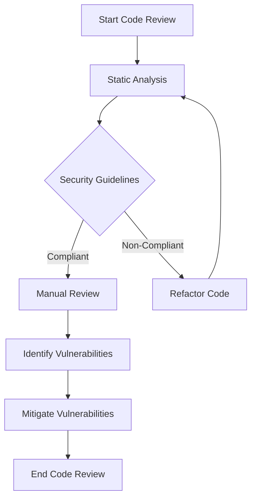

## 15.1 Secure Coding Practices

In the realm of software development, security is paramount. As C++ developers, we must adopt secure coding practices to safeguard our applications from vulnerabilities and potential exploits. In this section, we will explore various secure coding practices, focusing on avoiding common vulnerabilities and conducting effective code reviews for security.

### Introduction to Secure Coding Practices

Secure coding practices involve writing code that is resilient against attacks and vulnerabilities. These practices are essential in preventing unauthorized access, data breaches, and other security threats. In C++, secure coding requires a deep understanding of the language's features and potential pitfalls.

### Understanding Common Vulnerabilities

Before diving into secure coding practices, it's crucial to understand the common vulnerabilities that can affect C++ applications:

1. **Buffer Overflows**: Occur when data exceeds the buffer's boundary, potentially leading to arbitrary code execution.
2. **Dangling Pointers**: Result from pointers that reference memory locations that have been freed, leading to undefined behavior.
3. **Integer Overflows**: Happen when arithmetic operations exceed the maximum value a data type can hold, causing unexpected results.
4. **Race Conditions**: Arise in concurrent applications when multiple threads access shared resources without proper synchronization.
5. **Injection Attacks**: Occur when untrusted data is used to modify the execution of a program, such as SQL injection.
6. **Improper Access Control**: Leads to unauthorized access to resources or data.

### Secure Coding Practices

#### 1. Memory Safety

Memory management is a critical aspect of C++ programming. To ensure memory safety:

- **Use Smart Pointers**: Prefer `std::unique_ptr` and `std::shared_ptr` over raw pointers to manage dynamic memory automatically.

```cpp
#include <memory>

void example() {
    std::unique_ptr<int> ptr = std::make_unique<int>(10);
    // Automatically deallocated when out of scope
}
```

- **Avoid Dangling Pointers**: Ensure that pointers are set to `nullptr` after deletion.

```cpp
int* ptr = new int(5);
delete ptr;
ptr = nullptr; // Prevents dangling pointer
```

- **Boundary Checks**: Always check array and buffer boundaries to prevent overflows.

```cpp
void safeCopy(char* dest, const char* src, size_t size) {
    if (strlen(src) < size) {
        strcpy(dest, src);
    } else {
        // Handle error
    }
}
```

#### 2. Input Validation

Input validation is crucial to prevent injection attacks and ensure data integrity:

- **Sanitize Inputs**: Always sanitize user inputs to remove potentially harmful data.

```cpp
#include <regex>

bool isValidInput(const std::string& input) {
    std::regex pattern("^[a-zA-Z0-9]+$");
    return std::regex_match(input, pattern);
}
```

- **Use Safe Functions**: Prefer safer alternatives like `strncpy` over `strcpy`.

```cpp
char dest[10];
strncpy(dest, src, sizeof(dest) - 1);
dest[sizeof(dest) - 1] = '\0'; // Ensure null-termination
```

#### 3. Error and Exception Handling

Proper error and exception handling can prevent unexpected application behavior:

- **Use Exceptions**: Prefer exceptions over error codes for error handling.

```cpp
try {
    // Code that might throw
} catch (const std::exception& e) {
    // Handle exception
}
```

- **RAII for Resource Management**: Use RAII (Resource Acquisition Is Initialization) to manage resources safely.

```cpp
class File {
public:
    File(const std::string& filename) {
        file = fopen(filename.c_str(), "r");
        if (!file) throw std::runtime_error("File not found");
    }
    ~File() {
        if (file) fclose(file);
    }
private:
    FILE* file;
};
```

#### 4. Concurrency Safety

Concurrency issues can lead to race conditions and data corruption:

- **Use Mutexes**: Protect shared resources with mutexes.

```cpp
#include <mutex>

std::mutex mtx;
void threadSafeFunction() {
    std::lock_guard<std::mutex> lock(mtx);
    // Access shared resource
}
```

- **Avoid Deadlocks**: Ensure that locks are acquired in a consistent order.

#### 5. Code Review for Security

Code reviews are an integral part of secure software development. They help identify potential vulnerabilities and improve code quality:

- **Establish Guidelines**: Define security guidelines for code reviews.
- **Automate Checks**: Use static analysis tools to automate security checks.
- **Focus on Critical Areas**: Pay special attention to areas handling sensitive data or complex logic.

### Visualizing Secure Coding Practices

To better understand secure coding practices, let's visualize the flow of a secure code review process:



**Figure 1**: Secure Code Review Process

### Try It Yourself

To reinforce your understanding, try modifying the code examples provided. For instance, experiment with different smart pointer types or implement additional input validation checks.

### References and Further Reading

For more information on secure coding practices, consider the following resources:

- [CERT C++ Secure Coding Standard](https://wiki.sei.cmu.edu/confluence/display/cplusplus/SEI+CERT+C%2B%2B+Coding+Standard)
- [OWASP Secure Coding Practices](https://owasp.org/www-project-secure-coding-practices-quick-reference-guide/)
- [ISO/IEC TS 17961:2013 - C Secure Coding Rules](https://www.iso.org/standard/61134.html)

### Knowledge Check

To test your understanding of secure coding practices, consider the following questions:

1. What is the primary purpose of using smart pointers in C++?
2. How can input validation prevent injection attacks?
3. Why is RAII important in resource management?
4. What are the benefits of using exceptions over error codes?
5. How can code reviews enhance application security?

### Embrace the Journey

Remember, mastering secure coding practices is an ongoing journey. As you continue to develop your skills, you'll build more secure and robust C++ applications. Stay curious, keep learning, and enjoy the process!

## Quiz Time!



### What is a common vulnerability in C++ applications?

- [x] Buffer Overflow
- [ ] Null Pointer Dereference
- [ ] Type Mismatch
- [ ] Syntax Error

> **Explanation:** Buffer overflow is a common vulnerability where data exceeds the buffer's boundary, potentially leading to arbitrary code execution.

### Which smart pointer ensures exclusive ownership of a resource?

- [x] `std::unique_ptr`
- [ ] `std::shared_ptr`
- [ ] `std::weak_ptr`
- [ ] `std::auto_ptr`

> **Explanation:** `std::unique_ptr` ensures exclusive ownership, meaning only one smart pointer can own the resource at a time.

### How can you prevent dangling pointers?

- [x] Set pointers to `nullptr` after deletion
- [ ] Use raw pointers
- [ ] Avoid using pointers
- [ ] Use `std::auto_ptr`

> **Explanation:** Setting pointers to `nullptr` after deletion helps prevent dangling pointers by ensuring they do not reference invalid memory.

### What is the purpose of input validation?

- [x] To ensure data integrity and prevent injection attacks
- [ ] To improve code readability
- [ ] To optimize performance
- [ ] To reduce code complexity

> **Explanation:** Input validation ensures data integrity and prevents injection attacks by sanitizing user inputs.

### Which technique is used to manage resources safely in C++?

- [x] RAII (Resource Acquisition Is Initialization)
- [ ] Manual memory management
- [ ] Garbage collection
- [ ] Reference counting

> **Explanation:** RAII is a technique that ensures resources are properly released by tying their lifecycle to the scope of an object.

### What is the benefit of using exceptions over error codes?

- [x] They provide a structured way to handle errors
- [ ] They improve performance
- [ ] They reduce code size
- [ ] They simplify syntax

> **Explanation:** Exceptions provide a structured way to handle errors, allowing for cleaner and more maintainable code.

### How can you ensure thread safety in concurrent applications?

- [x] Use mutexes to protect shared resources
- [ ] Avoid using threads
- [ ] Use global variables
- [ ] Rely on compiler optimizations

> **Explanation:** Mutexes are used to protect shared resources in concurrent applications, ensuring thread safety.

### What is the role of code reviews in secure software development?

- [x] To identify potential vulnerabilities and improve code quality
- [ ] To increase development speed
- [ ] To reduce code size
- [ ] To simplify syntax

> **Explanation:** Code reviews help identify potential vulnerabilities and improve code quality by providing a second set of eyes on the code.

### Which of the following is a static analysis tool?

- [x] Clang-Tidy
- [ ] GDB
- [ ] Valgrind
- [ ] Make

> **Explanation:** Clang-Tidy is a static analysis tool used to automate security checks and improve code quality.

### True or False: Secure coding practices are only necessary for large applications.

- [x] False
- [ ] True

> **Explanation:** Secure coding practices are necessary for applications of all sizes to prevent vulnerabilities and ensure security.


