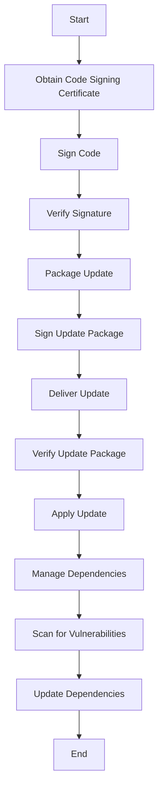

## 15.10 Secure Deployment Practices

In today's rapidly evolving digital landscape, ensuring the security of software deployments is paramount. This section delves into secure deployment practices for C++ applications, focusing on three critical areas: code signing, secure update mechanisms, and dependency management. By mastering these practices, developers can safeguard their applications against unauthorized modifications, ensure the integrity of updates, and manage dependencies effectively.

### Code Signing

Code signing is a crucial practice in software deployment that ensures the authenticity and integrity of the code. It involves digitally signing executables and scripts to confirm the software's origin and verify that it hasn't been tampered with since it was signed.

#### Understanding Code Signing

**Code Signing Certificates**: These are digital certificates issued by trusted Certificate Authorities (CAs) that verify the identity of the software publisher. When software is signed with a code signing certificate, it assures users that the software is from a legitimate source.

**Digital Signatures**: A digital signature is a cryptographic value that is calculated from the data and a secret key known only to the signer. It provides a way to verify the authenticity of the signed data.

**Hash Functions**: Hash functions are used to create a unique hash value from the software code. This hash value is then encrypted with the private key of the publisher to create the digital signature.

#### Implementing Code Signing in C++

To implement code signing in C++, follow these steps:

1. **Obtain a Code Signing Certificate**: Purchase a code signing certificate from a trusted CA. This certificate will be used to sign your applications.

2. **Sign the Code**: Use a code signing tool to apply the digital signature to your software. For Windows applications, tools like `SignTool` can be used, while `codesign` is used for macOS applications.

3. **Verify the Signature**: After signing, verify the signature to ensure it was applied correctly. This can be done using the same tools used for signing.

4. **Distribute the Signed Code**: Once signed, distribute your software. Users can verify the signature to ensure the software's authenticity.

```cpp
// Example: Using SignTool to sign a Windows executable
// Command to sign an executable
system("signtool sign /a /t http://timestamp.digicert.com /fd SHA256 MyApp.exe");

// Command to verify the signature
system("signtool verify /pa MyApp.exe");
```

#### Benefits of Code Signing

- **Authenticity**: Confirms the software's origin.
- **Integrity**: Ensures the software hasn't been altered.
- **Trust**: Builds user trust by reducing security warnings during installation.

### Secure Update Mechanisms

Keeping software up-to-date is essential for security and functionality. Secure update mechanisms ensure that updates are delivered safely and reliably.

#### Designing Secure Update Mechanisms

**Update Verification**: Always verify updates before applying them. This involves checking the digital signature of the update package to ensure it is from a trusted source.

**Secure Channels**: Use secure channels like HTTPS to deliver updates. This prevents man-in-the-middle attacks that could alter the update package.

**Rollback Mechanisms**: Implement rollback mechanisms to revert to a previous version if an update fails or introduces issues.

#### Implementing Secure Updates in C++

1. **Package the Update**: Create an update package that includes the new version of your software.

2. **Sign the Update**: Use code signing to sign the update package. This ensures its authenticity and integrity.

3. **Deliver the Update**: Use a secure channel to deliver the update package to users.

4. **Verify and Apply the Update**: On the client side, verify the update package's signature before applying it. If the signature is valid, proceed with the update.

```cpp
// Example: Verifying an update package
bool verifyUpdatePackage(const std::string& packagePath) {
    // Simulate signature verification
    // In practice, use a library to verify the digital signature
    return true; // Assume the signature is valid
}

void applyUpdate(const std::string& packagePath) {
    if (verifyUpdatePackage(packagePath)) {
        // Apply the update
        std::cout << "Update applied successfully." << std::endl;
    } else {
        std::cout << "Update verification failed." << std::endl;
    }
}
```

#### Best Practices for Secure Updates

- **Regular Updates**: Release updates regularly to address security vulnerabilities and improve functionality.
- **User Notifications**: Notify users about available updates and provide clear instructions for installation.
- **Fallback Options**: Provide users with the option to manually download and install updates if automatic updates fail.

### Dependency Management

Managing dependencies is a critical aspect of secure software deployment. It involves ensuring that all third-party libraries and components are up-to-date and free from vulnerabilities.

#### Effective Dependency Management

**Version Control**: Use version control systems to manage dependencies. This allows you to track changes and revert to previous versions if necessary.

**Dependency Scanning**: Regularly scan dependencies for known vulnerabilities using tools like `OWASP Dependency-Check` or `Snyk`.

**Minimal Dependencies**: Minimize the number of dependencies to reduce the attack surface. Only include libraries that are essential for your application.

#### Implementing Dependency Management in C++

1. **List Dependencies**: Create a list of all the dependencies used in your project, including their versions.

2. **Use a Package Manager**: Use a package manager like `vcpkg` or `Conan` to manage dependencies. These tools simplify the process of installing and updating libraries.

3. **Scan for Vulnerabilities**: Use automated tools to scan dependencies for vulnerabilities and receive alerts when updates are available.

4. **Update Regularly**: Regularly update dependencies to their latest versions to benefit from security patches and improvements.

```cpp
// Example: Using vcpkg to manage dependencies
// Install a library
system("vcpkg install boost");

// List installed libraries
system("vcpkg list");
```

#### Best Practices for Dependency Management

- **Regular Audits**: Conduct regular audits of your dependencies to ensure they are up-to-date and secure.
- **Automated Updates**: Automate the process of checking for updates and applying them to reduce manual effort.
- **Documentation**: Document all dependencies and their versions to maintain a clear record for future reference.

### Visualizing Secure Deployment Practices

To better understand the flow of secure deployment practices, let's visualize the process using a flowchart.



**Figure 1: Secure Deployment Practices Flowchart**

### References and Further Reading

- [Microsoft Code Signing](https://docs.microsoft.com/en-us/windows/win32/seccrypto/cryptography-tools)
- [OWASP Dependency-Check](https://owasp.org/www-project-dependency-check/)
- [Snyk Vulnerability Scanner](https://snyk.io/)

### Knowledge Check

Before we conclude, let's reinforce our understanding with a few questions.

- **What is the primary purpose of code signing?**
- **Why is it important to use secure channels for delivering updates?**
- **How can dependency management help in securing software deployments?**

### Embrace the Journey

Remember, secure deployment is an ongoing process that requires vigilance and continuous improvement. As you implement these practices, you'll enhance the security and reliability of your C++ applications. Keep exploring, stay informed about the latest security trends, and enjoy the journey of building secure software!

## Quiz Time!



### What is the primary purpose of code signing?

- [x] To verify the authenticity and integrity of the software
- [ ] To increase the software's performance
- [ ] To reduce the software's size
- [ ] To enhance the software's user interface

> **Explanation:** Code signing ensures that the software is from a legitimate source and hasn't been tampered with.

### Which tool is commonly used for code signing on Windows?

- [x] SignTool
- [ ] codesign
- [ ] OpenSSL
- [ ] GPG

> **Explanation:** SignTool is used for signing Windows applications, while codesign is used for macOS.

### What is a key benefit of using secure channels for updates?

- [x] Preventing man-in-the-middle attacks
- [ ] Improving update speed
- [ ] Reducing update size
- [ ] Enhancing user interface

> **Explanation:** Secure channels like HTTPS prevent unauthorized interception and modification of update packages.

### Why is dependency management important in secure deployment?

- [x] It helps ensure all components are up-to-date and free from vulnerabilities
- [ ] It reduces the software's size
- [ ] It improves the software's performance
- [ ] It enhances the software's user interface

> **Explanation:** Managing dependencies ensures that all third-party libraries are secure and current.

### Which package manager can be used for managing C++ dependencies?

- [x] vcpkg
- [ ] npm
- [ ] pip
- [ ] gem

> **Explanation:** vcpkg is a package manager for C++ libraries.

### What should be done if an update verification fails?

- [x] Do not apply the update
- [ ] Apply the update anyway
- [ ] Restart the application
- [ ] Notify the user to ignore the error

> **Explanation:** If an update verification fails, it may indicate tampering, so the update should not be applied.

### What is a rollback mechanism in the context of updates?

- [x] A way to revert to a previous version if an update fails
- [ ] A method to speed up updates
- [ ] A tool for managing dependencies
- [ ] A feature to enhance user interface

> **Explanation:** Rollback mechanisms allow reverting to a stable version if an update causes issues.

### How often should dependencies be audited for vulnerabilities?

- [x] Regularly
- [ ] Once a year
- [ ] Only when a new version is released
- [ ] Never

> **Explanation:** Regular audits help ensure that dependencies remain secure and up-to-date.

### What is the role of a Certificate Authority in code signing?

- [x] To issue digital certificates that verify the identity of the software publisher
- [ ] To improve the software's performance
- [ ] To reduce the software's size
- [ ] To enhance the software's user interface

> **Explanation:** Certificate Authorities issue certificates that confirm the legitimacy of the software publisher.

### True or False: Secure deployment practices are a one-time effort.

- [ ] True
- [x] False

> **Explanation:** Secure deployment is an ongoing process that requires continuous vigilance and improvement.


