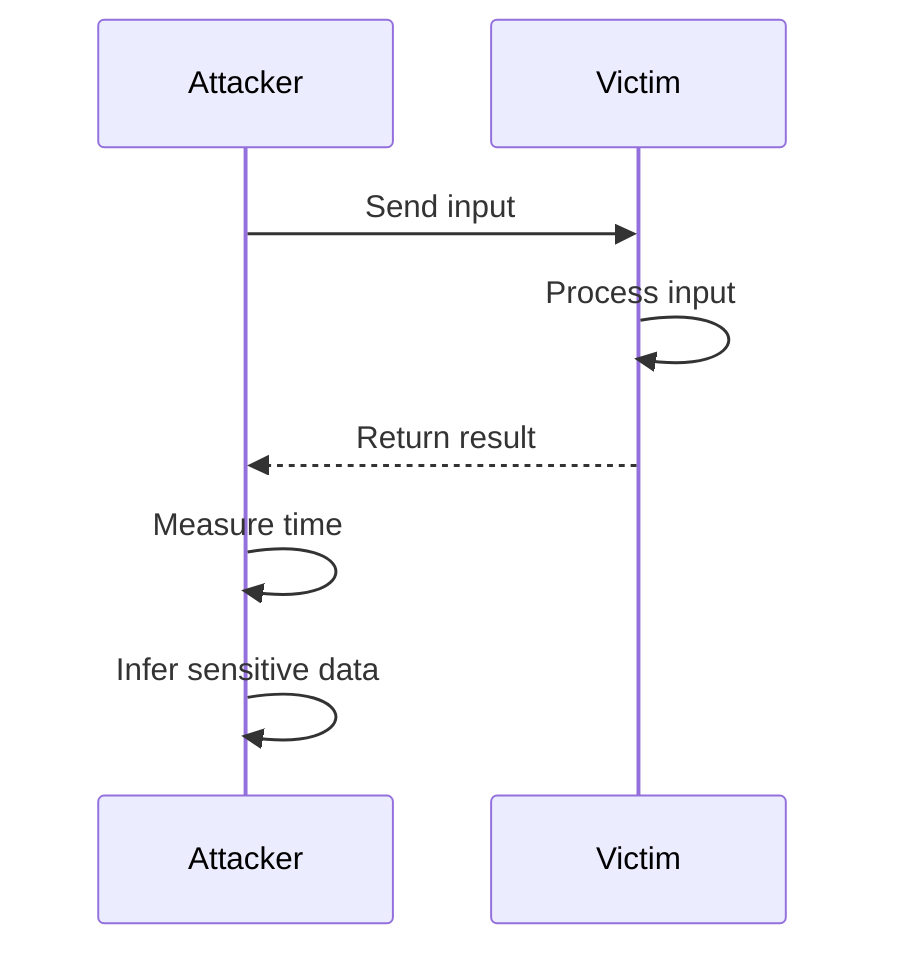

## 15.11 Side-Channel Attacks and Mitigation

In the realm of cybersecurity, side-channel attacks represent a sophisticated class of exploits that target the implementation of a system rather than its theoretical design. As C++ developers and architects, understanding these attacks and implementing effective mitigation strategies is crucial for building secure applications. This section delves into the nature of side-channel attacks, particularly focusing on timing and cache attacks, and provides guidance on writing secure C++ code to minimize these risks.

### Understanding Side-Channel Attacks

Side-channel attacks exploit indirect information leakage from a system, such as timing information, power consumption, electromagnetic leaks, or even sound. Unlike traditional attacks that target the software's logic, side-channel attacks leverage the physical characteristics of the system to extract sensitive information.

#### Types of Side-Channel Attacks

1. **Timing Attacks**: These attacks exploit the time variations in the execution of cryptographic algorithms. For instance, if an operation takes longer to execute based on the input data, an attacker can infer the input by measuring the time taken.

2. **Cache Attacks**: These attacks exploit the behavior of the CPU cache. Since accessing data from the cache is faster than accessing it from main memory, attackers can infer sensitive information based on cache hits and misses.

3. **Power Analysis Attacks**: By measuring the power consumption of a device, attackers can deduce the operations being performed and potentially extract cryptographic keys.

4. **Electromagnetic Attacks**: These involve capturing electromagnetic emissions from a device to infer data being processed.

5. **Acoustic Cryptanalysis**: This involves analyzing the sound produced by a device to extract sensitive information.

### Timing Attacks

Timing attacks are one of the most common forms of side-channel attacks. They exploit the time variations in the execution of operations to infer sensitive information. For example, if a cryptographic operation takes longer to execute for certain inputs, an attacker can measure the execution time and deduce the input.

#### Example of a Timing Attack

Consider a simple password comparison function:

```cpp
bool isPasswordCorrect(const std::string& inputPassword, const std::string& actualPassword) {
    if (inputPassword.length() != actualPassword.length()) {
        return false;
    }
    for (size_t i = 0; i < inputPassword.length(); ++i) {
        if (inputPassword[i] != actualPassword[i]) {
            return false;
        }
    }
    return true;
}
```

In this example, the function returns as soon as a mismatch is found. An attacker can measure the time taken by the function to return and deduce how many characters of the input password match the actual password.

#### Mitigating Timing Attacks

To mitigate timing attacks, ensure that operations take a constant amount of time regardless of the input. Here's a revised version of the password comparison function:

```cpp
bool isPasswordCorrect(const std::string& inputPassword, const std::string& actualPassword) {
    if (inputPassword.length() != actualPassword.length()) {
        return false;
    }
    bool result = true;
    for (size_t i = 0; i < inputPassword.length(); ++i) {
        result &= (inputPassword[i] == actualPassword[i]);
    }
    return result;
}
```

In this version, the function iterates through all characters regardless of mismatches, ensuring constant execution time.

### Cache Attacks

Cache attacks exploit the behavior of the CPU cache to infer sensitive information. These attacks are particularly effective in multi-tenant environments, such as cloud computing, where an attacker can share the same physical hardware as the victim.

#### Example of a Cache Attack

Consider a cryptographic operation that accesses a lookup table based on secret data. An attacker can infer the secret data by observing which parts of the table are cached.

#### Mitigating Cache Attacks

To mitigate cache attacks, avoid data-dependent memory access patterns. Use techniques such as:

- **Data Obfuscation**: Randomize memory access patterns to prevent attackers from deducing sensitive information.
- **Cache Flushing**: Explicitly flush the cache before and after sensitive operations to prevent attackers from observing cache behavior.
- **Constant-Time Algorithms**: Design algorithms that access memory in a predictable pattern, regardless of the input data.

### Writing Secure C++ Code

To protect against side-channel attacks, follow these best practices when writing C++ code:

1. **Use Constant-Time Operations**: Ensure that operations take a constant amount of time, regardless of the input data.

2. **Avoid Data-Dependent Memory Access**: Design algorithms that do not vary memory access patterns based on input data.

3. **Leverage Compiler and Hardware Features**: Use compiler options and hardware features that provide protection against side-channel attacks.

4. **Regularly Audit Code**: Conduct regular security audits to identify and address potential vulnerabilities.

5. **Use Secure Libraries**: Leverage well-tested cryptographic libraries that are designed to resist side-channel attacks.

### Visualizing Side-Channel Attacks

Below is a diagram illustrating the flow of a timing attack:



**Figure 1: Timing Attack Sequence**

### Try It Yourself

To better understand side-channel attacks, try modifying the password comparison function to introduce a timing vulnerability and then apply the mitigation techniques discussed. Experiment with different inputs and measure the execution time to observe the impact of timing attacks.

### References and Further Reading

- [OWASP Timing Attack](https://owasp.org/www-community/attacks/Timing_Attack)
- [Cache Attacks and Countermeasures](https://www.cs.tau.ac.il/~tromer/papers/cache.pdf)
- [Intel's Guide to Mitigating Side-Channel Attacks](https://software.intel.com/content/www/us/en/develop/articles/software-security-guidance/side-channel-attack-mitigation.html)

### Knowledge Check

1. What is a side-channel attack?
2. How can timing attacks be mitigated in C++?
3. What are cache attacks, and how can they be prevented?
4. Why is constant-time execution important in cryptographic operations?
5. How can data-dependent memory access patterns lead to vulnerabilities?

### Embrace the Journey

Remember, mastering side-channel attack mitigation is a continuous journey. As you progress, you'll develop more secure and robust applications. Keep experimenting, stay curious, and enjoy the journey!

## Quiz Time!



### What is a side-channel attack?

- [x] An attack that exploits indirect information leakage from a system.
- [ ] An attack that targets the software's logic directly.
- [ ] An attack that uses brute force to guess passwords.
- [ ] An attack that involves phishing.

> **Explanation:** Side-channel attacks exploit indirect information leakage from a system, such as timing information or power consumption, rather than targeting the software's logic directly.

### How can timing attacks be mitigated in C++?

- [x] By ensuring operations take a constant amount of time regardless of input.
- [ ] By using data-dependent memory access patterns.
- [ ] By increasing the complexity of algorithms.
- [ ] By using more secure passwords.

> **Explanation:** Timing attacks can be mitigated by ensuring that operations take a constant amount of time, regardless of the input, to prevent attackers from inferring sensitive information.

### What are cache attacks?

- [x] Attacks that exploit the behavior of the CPU cache to infer sensitive information.
- [ ] Attacks that involve stealing data from the hard drive.
- [ ] Attacks that use social engineering to gain access.
- [ ] Attacks that involve denial of service.

> **Explanation:** Cache attacks exploit the behavior of the CPU cache to infer sensitive information based on cache hits and misses.

### Why is constant-time execution important in cryptographic operations?

- [x] To prevent attackers from inferring sensitive information based on execution time.
- [ ] To make algorithms faster.
- [ ] To reduce memory usage.
- [ ] To simplify code.

> **Explanation:** Constant-time execution is important in cryptographic operations to prevent attackers from inferring sensitive information based on variations in execution time.

### How can data-dependent memory access patterns lead to vulnerabilities?

- [x] They can allow attackers to infer sensitive information based on memory access patterns.
- [ ] They make code run faster.
- [ ] They simplify algorithm design.
- [ ] They reduce power consumption.

> **Explanation:** Data-dependent memory access patterns can lead to vulnerabilities by allowing attackers to infer sensitive information based on which parts of memory are accessed.

### What is a common mitigation strategy for cache attacks?

- [x] Avoiding data-dependent memory access patterns.
- [ ] Increasing the size of the cache.
- [ ] Using more complex algorithms.
- [ ] Encrypting all data in memory.

> **Explanation:** A common mitigation strategy for cache attacks is to avoid data-dependent memory access patterns, which can prevent attackers from inferring sensitive information.

### How can side-channel attacks be detected?

- [x] By conducting regular security audits and monitoring system behavior.
- [ ] By using stronger passwords.
- [ ] By disabling network access.
- [ ] By encrypting all data.

> **Explanation:** Side-channel attacks can be detected by conducting regular security audits and monitoring system behavior for unusual patterns that may indicate an attack.

### What role do secure libraries play in mitigating side-channel attacks?

- [x] They provide well-tested cryptographic functions designed to resist side-channel attacks.
- [ ] They increase the complexity of code.
- [ ] They reduce the need for security audits.
- [ ] They simplify algorithm design.

> **Explanation:** Secure libraries provide well-tested cryptographic functions that are designed to resist side-channel attacks, reducing the risk of vulnerabilities.

### What is the impact of side-channel attacks on multi-tenant environments?

- [x] They can allow attackers to infer sensitive information from other tenants on the same hardware.
- [ ] They reduce the performance of applications.
- [ ] They simplify resource allocation.
- [ ] They increase the cost of cloud services.

> **Explanation:** In multi-tenant environments, side-channel attacks can allow attackers to infer sensitive information from other tenants sharing the same physical hardware.

### True or False: Side-channel attacks target the theoretical design of a system.

- [ ] True
- [x] False

> **Explanation:** False. Side-channel attacks do not target the theoretical design of a system; they exploit indirect information leakage from the system's physical implementation.


