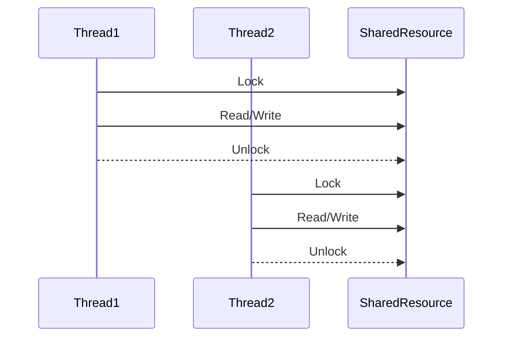

## 15.12 Security in Concurrency

Concurrency in C++ offers the potential for significant performance improvements by allowing multiple operations to be executed simultaneously. However, with this power comes the responsibility of ensuring that concurrent operations do not lead to security vulnerabilities such as race conditions and data corruption. In this section, we will delve into the intricacies of securing concurrent C++ applications, focusing on thread safety and best practices for writing security-critical code.

### Understanding Concurrency in C++

Concurrency refers to the execution of multiple sequences of operations simultaneously. In C++, concurrency is primarily achieved through multithreading, where multiple threads run in parallel, sharing the same resources. This can lead to complex interactions between threads, necessitating careful management to avoid security issues.

#### Key Concepts in Concurrency

1. **Threads**: The smallest unit of processing that can be scheduled by an operating system. In C++, threads can be created using the `std::thread` class.

2. **Synchronization**: Mechanisms to control the access of multiple threads to shared resources. Common synchronization primitives include mutexes, locks, and condition variables.

3. **Race Conditions**: Occur when the outcome of a program depends on the sequence or timing of uncontrollable events, such as thread execution order.

4. **Data Corruption**: Happens when concurrent threads modify shared data simultaneously without proper synchronization, leading to inconsistent or incorrect data.

### The Importance of Thread Safety

Thread safety ensures that shared data is accessed and modified correctly when multiple threads are involved. In security-critical applications, failing to ensure thread safety can lead to vulnerabilities that attackers might exploit. For instance, race conditions can be used to bypass security checks or access sensitive data.

#### Common Thread Safety Issues

- **Race Conditions**: As mentioned, these occur when multiple threads access shared data simultaneously, leading to unpredictable results.

- **Deadlocks**: Situations where two or more threads are blocked forever, each waiting for the other to release a resource.

- **Livelocks**: Similar to deadlocks, but the threads keep changing their state in response to each other without making any progress.

- **Starvation**: When a thread is perpetually denied access to resources it needs to proceed.

### Best Practices for Secure Concurrency

To ensure security in concurrent C++ applications, developers should adhere to best practices that mitigate the risks of race conditions, data corruption, and other concurrency-related issues.

#### 1. Use Synchronization Primitives

Synchronization primitives like mutexes and locks are essential for controlling access to shared resources. They ensure that only one thread can access a resource at a time, preventing race conditions.

```cpp
#include <iostream>
#include <thread>
#include <mutex>

std::mutex mtx;
int shared_data = 0;

void increment() {
    std::lock_guard<std::mutex> lock(mtx); // Automatically locks and unlocks the mutex
    ++shared_data;
}

int main() {
    std::thread t1(increment);
    std::thread t2(increment);

    t1.join();
    t2.join();

    std::cout << "Shared data: " << shared_data << std::endl;
    return 0;
}
```

**Explanation**: In this example, `std::lock_guard` is used to ensure that the `increment` function locks the mutex before accessing `shared_data`. This prevents race conditions by ensuring that only one thread can modify `shared_data` at a time.

#### 2. Avoid Deadlocks

Deadlocks can be avoided by ensuring that all threads acquire locks in a consistent order. Additionally, using `std::lock` to acquire multiple locks simultaneously can help prevent deadlocks.

```cpp
#include <iostream>
#include <thread>
#include <mutex>

std::mutex mtx1, mtx2;

void task1() {
    std::lock(mtx1, mtx2); // Locks both mutexes without deadlock risk
    std::lock_guard<std::mutex> lock1(mtx1, std::adopt_lock);
    std::lock_guard<std::mutex> lock2(mtx2, std::adopt_lock);
    // Critical section
}

void task2() {
    std::lock(mtx1, mtx2);
    std::lock_guard<std::mutex> lock1(mtx1, std::adopt_lock);
    std::lock_guard<std::mutex> lock2(mtx2, std::adopt_lock);
    // Critical section
}

int main() {
    std::thread t1(task1);
    std::thread t2(task2);

    t1.join();
    t2.join();

    return 0;
}
```

**Explanation**: The `std::lock` function locks both `mtx1` and `mtx2` simultaneously, preventing deadlocks by ensuring that both locks are acquired in a consistent order.

#### 3. Minimize Shared State

Reducing the amount of shared state between threads can significantly decrease the risk of race conditions and data corruption. Design your application to minimize shared data, and use thread-local storage when possible.

#### 4. Use Atomic Operations

Atomic operations provide a way to perform read-modify-write operations on shared data without the need for explicit locks. The `std::atomic` library in C++ provides atomic operations for built-in types.

```cpp
#include <iostream>
#include <thread>
#include <atomic>

std::atomic<int> atomic_data(0);

void increment() {
    atomic_data.fetch_add(1, std::memory_order_relaxed);
}

int main() {
    std::thread t1(increment);
    std::thread t2(increment);

    t1.join();
    t2.join();

    std::cout << "Atomic data: " << atomic_data.load() << std::endl;
    return 0;
}
```

**Explanation**: The `std::atomic` type ensures that the `fetch_add` operation is performed atomically, preventing race conditions without the need for explicit locks.

#### 5. Implement Thread-Safe Singleton

Singletons are often used in applications to ensure a class has only one instance. However, implementing a thread-safe singleton requires careful consideration to avoid race conditions.

```cpp
#include <iostream>
#include <mutex>

class Singleton {
public:
    static Singleton& getInstance() {
        std::call_once(initFlag, []() { instance.reset(new Singleton); });
        return *instance;
    }

private:
    Singleton() = default;
    ~Singleton() = default;
    Singleton(const Singleton&) = delete;
    Singleton& operator=(const Singleton&) = delete;

    static std::unique_ptr<Singleton> instance;
    static std::once_flag initFlag;
};

std::unique_ptr<Singleton> Singleton::instance;
std::once_flag Singleton::initFlag;

int main() {
    Singleton& singleton = Singleton::getInstance();
    return 0;
}
```

**Explanation**: The `std::call_once` function ensures that the singleton instance is initialized only once, even in a multithreaded environment.

### Security Considerations in Concurrency

When dealing with concurrency, it's essential to consider the security implications of your design and implementation. Here are some key considerations:

#### 1. Validate Inputs

Always validate inputs to ensure they meet expected criteria. This prevents malicious data from causing unexpected behavior in concurrent operations.

#### 2. Secure Resource Access

Ensure that access to shared resources is controlled and monitored. Use access control mechanisms to restrict which threads can access sensitive data.

#### 3. Monitor for Anomalies

Implement logging and monitoring to detect unusual patterns of access or modification to shared data. This can help identify potential security breaches or vulnerabilities.

#### 4. Use Secure Libraries

Leverage secure libraries and frameworks that provide built-in concurrency support. These libraries are often designed with security in mind and can help mitigate common concurrency issues.

### Visualizing Concurrency and Security

To better understand the flow of concurrent operations and the potential for race conditions, let's visualize a typical scenario using a Mermaid.js sequence diagram.



**Diagram Explanation**: This sequence diagram illustrates two threads accessing a shared resource. Each thread locks the resource before accessing it and unlocks it afterward, ensuring that only one thread can access the resource at a time.

### Try It Yourself

To deepen your understanding of concurrency and security, try modifying the code examples provided:

1. **Experiment with Different Synchronization Primitives**: Replace `std::mutex` with `std::shared_mutex` or `std::recursive_mutex` and observe the behavior.

2. **Implement a Thread Pool**: Create a thread pool that manages a fixed number of threads and executes tasks concurrently.

3. **Simulate a Race Condition**: Remove the synchronization in the `increment` function and observe the effects of a race condition.

### Knowledge Check

Before we conclude, let's reinforce what we've learned with a few questions:

- What is a race condition, and how can it affect the security of a concurrent application?
- How can deadlocks be avoided in a multithreaded environment?
- Why is it important to minimize shared state in concurrent applications?

### Conclusion

Ensuring security in concurrency is a critical aspect of developing robust C++ applications. By understanding the principles of thread safety and applying best practices, developers can mitigate the risks associated with race conditions and data corruption. Remember, this is just the beginning. As you progress, you'll build more complex and secure concurrent applications. Keep experimenting, stay curious, and enjoy the journey!

## Quiz Time!



### What is a race condition?

- [x] A situation where the outcome depends on the sequence or timing of uncontrollable events.
- [ ] A condition where a program runs slower than expected.
- [ ] A scenario where two threads never execute.
- [ ] A method to improve program performance.

> **Explanation:** A race condition occurs when the outcome of a program depends on the sequence or timing of uncontrollable events, such as thread execution order.

### How can deadlocks be avoided?

- [x] By acquiring locks in a consistent order.
- [x] By using `std::lock` to acquire multiple locks simultaneously.
- [ ] By avoiding the use of any locks.
- [ ] By using more threads.

> **Explanation:** Deadlocks can be avoided by acquiring locks in a consistent order and using `std::lock` to acquire multiple locks simultaneously.

### What is the purpose of `std::atomic`?

- [x] To perform atomic operations on shared data.
- [ ] To create threads.
- [ ] To lock resources.
- [ ] To manage memory.

> **Explanation:** `std::atomic` is used to perform atomic operations on shared data, preventing race conditions without explicit locks.

### What is a deadlock?

- [x] A situation where two or more threads are blocked forever, each waiting for the other to release a resource.
- [ ] A condition where a program runs faster than expected.
- [ ] A scenario where threads execute in parallel.
- [ ] A method to improve program security.

> **Explanation:** A deadlock occurs when two or more threads are blocked forever, each waiting for the other to release a resource.

### Why is it important to minimize shared state?

- [x] To decrease the risk of race conditions.
- [x] To reduce data corruption.
- [ ] To increase program complexity.
- [ ] To improve code readability.

> **Explanation:** Minimizing shared state decreases the risk of race conditions and data corruption by reducing the amount of data that multiple threads access simultaneously.

### What is `std::call_once` used for?

- [x] To ensure a function is called only once, even in a multithreaded environment.
- [ ] To create a new thread.
- [ ] To lock a resource.
- [ ] To manage memory.

> **Explanation:** `std::call_once` ensures that a function is called only once, even in a multithreaded environment, making it useful for thread-safe initialization.

### What is a livelock?

- [x] A situation where threads keep changing their state in response to each other without making progress.
- [ ] A condition where threads execute in parallel.
- [ ] A method to improve program performance.
- [ ] A scenario where a program runs slower than expected.

> **Explanation:** A livelock occurs when threads keep changing their state in response to each other without making progress, similar to a deadlock but with activity.

### What is the role of `std::lock_guard`?

- [x] To automatically lock and unlock a mutex.
- [ ] To create a new thread.
- [ ] To perform atomic operations.
- [ ] To manage memory.

> **Explanation:** `std::lock_guard` automatically locks a mutex when it is created and unlocks it when it goes out of scope, ensuring safe access to shared resources.

### Why is input validation important in concurrent applications?

- [x] To prevent malicious data from causing unexpected behavior.
- [ ] To improve program performance.
- [ ] To create more threads.
- [ ] To manage memory.

> **Explanation:** Input validation is crucial in concurrent applications to prevent malicious data from causing unexpected behavior or security vulnerabilities.

### True or False: Atomic operations require explicit locks.

- [ ] True
- [x] False

> **Explanation:** False. Atomic operations do not require explicit locks because they are designed to be performed atomically, preventing race conditions without locks.




