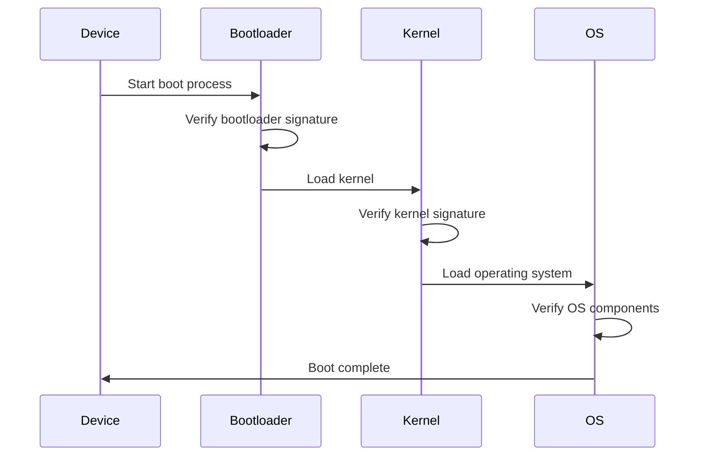
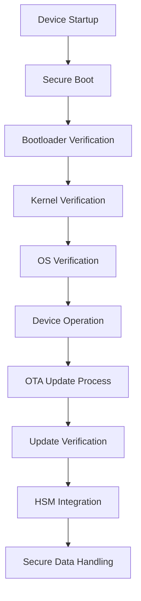

## 15.13 Security for Embedded and IoT Devices

In the rapidly evolving landscape of embedded systems and the Internet of Things (IoT), security has become a paramount concern. These devices, often deployed in critical applications, are susceptible to a myriad of threats. As expert software engineers and architects, it is crucial to understand the unique security challenges these devices face and how to mitigate them effectively. This section delves into the constraints and challenges of securing embedded and IoT devices, with a focus on over-the-air (OTA) updates, secure boot processes, and the use of hardware security modules (HSMs).

### Understanding the Constraints and Challenges

Embedded and IoT devices operate under a set of constraints that make security implementation particularly challenging. These constraints include limited processing power, restricted memory, and energy efficiency requirements. Additionally, the diverse and often remote deployment environments of these devices further complicate security measures.

#### Limited Resources

Embedded devices are typically designed to perform specific tasks with minimal resources. This means they often lack the computational power and memory to implement complex security algorithms. As a result, security solutions must be lightweight and efficient.

#### Diverse Deployment Environments

IoT devices are deployed in a wide range of environments, from industrial settings to consumer homes. Each environment presents unique security challenges, such as physical tampering or network-based attacks. Security solutions must be adaptable to these varied contexts.

#### Long Lifecycles

Embedded devices often have long operational lifecycles, sometimes spanning decades. This longevity requires security solutions that can be updated and maintained over time to address emerging threats.

#### Connectivity and Network Exposure

The very nature of IoT devices, which are often connected to the internet, exposes them to a wide range of network-based attacks. Ensuring secure communication channels and protecting data integrity and confidentiality is critical.

### Over-the-Air Updates

Over-the-air (OTA) updates are a crucial mechanism for maintaining the security and functionality of IoT devices. They allow for the remote deployment of firmware updates, security patches, and new features. However, implementing OTA updates securely is a complex task that requires careful consideration.

#### Secure Update Process

To ensure the security of OTA updates, it is essential to implement a robust update process. This includes verifying the authenticity and integrity of update packages before installation. Digital signatures and cryptographic hashes are commonly used to achieve this.

```cpp
#include <iostream>
#include <string>
#include <openssl/sha.h>
#include <openssl/pem.h>
#include <openssl/rsa.h>

// Function to verify the digital signature of the update package
bool verifySignature(const std::string& data, const std::string& signature, RSA* publicKey) {
    unsigned char hash[SHA256_DIGEST_LENGTH];
    SHA256(reinterpret_cast<const unsigned char*>(data.c_str()), data.size(), hash);

    int result = RSA_verify(NID_sha256, hash, SHA256_DIGEST_LENGTH,
                            reinterpret_cast<const unsigned char*>(signature.c_str()),
                            signature.size(), publicKey);

    return result == 1;
}

int main() {
    // Example data and signature to verify
    std::string data = "Firmware update data";
    std::string signature = "Digital signature of the update";

    // Load the public key (example, replace with actual key loading)
    FILE* pubKeyFile = fopen("public_key.pem", "r");
    RSA* publicKey = PEM_read_RSA_PUBKEY(pubKeyFile, nullptr, nullptr, nullptr);
    fclose(pubKeyFile);

    if (verifySignature(data, signature, publicKey)) {
        std::cout << "Update verified successfully." << std::endl;
    } else {
        std::cout << "Update verification failed." << std::endl;
    }

    RSA_free(publicKey);
    return 0;
}
```

In this example, we use OpenSSL to verify the digital signature of an update package. The `verifySignature` function checks the integrity and authenticity of the update data using a public key.

#### Rollback Protection

To prevent attackers from exploiting vulnerabilities in older firmware versions, it is important to implement rollback protection. This ensures that devices cannot be downgraded to insecure versions of the firmware.

#### Secure Communication Channels

OTA updates should be delivered over secure communication channels, such as TLS, to protect against man-in-the-middle attacks. This ensures that update packages cannot be intercepted or altered during transmission.

### Secure Boot

Secure boot is a security mechanism that ensures a device boots using only trusted software. It prevents unauthorized or malicious software from being loaded during the boot process, thereby protecting the device from a range of attacks.

#### Boot Process Overview

The secure boot process involves several stages, each of which must be verified before proceeding to the next. This typically includes verifying the bootloader, the operating system kernel, and any critical system components.



This sequence diagram illustrates the secure boot process, highlighting the verification steps at each stage.

#### Implementing Secure Boot in C++

Implementing secure boot in C++ involves creating a chain of trust, where each component verifies the integrity of the next. This can be achieved using cryptographic signatures and hardware-based security features.

```cpp
#include <iostream>
#include <string>
#include <openssl/sha.h>
#include <openssl/pem.h>
#include <openssl/rsa.h>

// Function to verify the bootloader signature
bool verifyBootloader(const std::string& bootloaderData, RSA* publicKey) {
    unsigned char hash[SHA256_DIGEST_LENGTH];
    SHA256(reinterpret_cast<const unsigned char*>(bootloaderData.c_str()), bootloaderData.size(), hash);

    // Simulated signature verification (replace with actual signature)
    std::string signature = "Bootloader signature";

    int result = RSA_verify(NID_sha256, hash, SHA256_DIGEST_LENGTH,
                            reinterpret_cast<const unsigned char*>(signature.c_str()),
                            signature.size(), publicKey);

    return result == 1;
}

int main() {
    // Example bootloader data
    std::string bootloaderData = "Bootloader binary data";

    // Load the public key (example, replace with actual key loading)
    FILE* pubKeyFile = fopen("bootloader_pub_key.pem", "r");
    RSA* publicKey = PEM_read_RSA_PUBKEY(pubKeyFile, nullptr, nullptr, nullptr);
    fclose(pubKeyFile);

    if (verifyBootloader(bootloaderData, publicKey)) {
        std::cout << "Bootloader verified successfully." << std::endl;
    } else {
        std::cout << "Bootloader verification failed." << std::endl;
    }

    RSA_free(publicKey);
    return 0;
}
```

This code snippet demonstrates how to verify the bootloader signature using OpenSSL. The `verifyBootloader` function checks the integrity of the bootloader data before proceeding with the boot process.

### Hardware Security Modules (HSMs)

Hardware Security Modules (HSMs) are dedicated hardware devices designed to protect cryptographic keys and perform cryptographic operations securely. They play a crucial role in securing embedded and IoT devices by providing a tamper-resistant environment for key management and cryptographic processing.

#### Key Management

HSMs provide secure storage and management of cryptographic keys, ensuring that keys are never exposed in plaintext outside the secure environment. This is critical for protecting sensitive data and maintaining the integrity of cryptographic operations.

#### Cryptographic Operations

HSMs can perform a wide range of cryptographic operations, including encryption, decryption, digital signing, and key generation. Offloading these operations to an HSM can enhance security and improve performance by freeing up device resources.

#### Integration with Embedded Systems

Integrating HSMs with embedded systems requires careful consideration of the device's architecture and communication interfaces. HSMs can be connected via various interfaces, such as SPI, I2C, or USB, depending on the device's capabilities and requirements.

```cpp
#include <iostream>
#include <string>
#include <hsm_library.h> // Hypothetical HSM library

// Function to perform encryption using HSM
std::string encryptDataWithHSM(const std::string& data, HSM* hsm) {
    // Perform encryption using HSM
    std::string encryptedData = hsm->encrypt(data);
    return encryptedData;
}

int main() {
    // Example data to encrypt
    std::string data = "Sensitive data";

    // Initialize HSM (example, replace with actual initialization)
    HSM* hsm = initializeHSM();

    // Encrypt data using HSM
    std::string encryptedData = encryptDataWithHSM(data, hsm);

    std::cout << "Encrypted data: " << encryptedData << std::endl;

    // Clean up HSM resources
    cleanupHSM(hsm);

    return 0;
}
```

This example illustrates how to use a hypothetical HSM library to encrypt data. The `encryptDataWithHSM` function performs encryption using the HSM, ensuring that sensitive data is protected.

### Try It Yourself

To deepen your understanding of these concepts, try modifying the code examples provided. For instance, you can:

- Experiment with different cryptographic algorithms and key sizes in the OTA update and secure boot examples.
- Implement additional security checks, such as certificate validation, in the OTA update process.
- Explore integrating a real HSM library into the encryption example and test its performance.

### Visualizing Security Architecture

To better understand the security architecture of embedded and IoT devices, consider the following diagram, which illustrates the integration of OTA updates, secure boot, and HSMs.



This diagram provides a high-level overview of the security processes involved in booting and operating an embedded or IoT device, highlighting the role of secure boot, OTA updates, and HSMs.

### References and Further Reading

- [OpenSSL Documentation](https://www.openssl.org/docs/)
- [NIST Guidelines for IoT Security](https://csrc.nist.gov/publications/detail/sp/800-183/final)
- [Trusted Computing Group's Secure Boot Guidelines](https://trustedcomputinggroup.org/)

### Knowledge Check

To reinforce your understanding of the material, consider the following questions:

- What are the key constraints and challenges in securing embedded and IoT devices?
- How do OTA updates enhance the security of IoT devices, and what are the key considerations for their implementation?
- What is the role of secure boot in protecting embedded devices, and how is it typically implemented?
- How do HSMs contribute to the security of embedded systems, and what are their primary functions?

### Embrace the Journey

Remember, securing embedded and IoT devices is an ongoing process that requires vigilance and adaptability. Stay informed about emerging threats and best practices, and continue to refine your security strategies. As you progress, you'll build more resilient and secure systems that can withstand the challenges of the ever-evolving digital landscape. Keep experimenting, stay curious, and enjoy the journey!

## Quiz Time!



### What is a primary constraint in securing embedded devices?

- [x] Limited processing power
- [ ] Unlimited network bandwidth
- [ ] Infinite memory resources
- [ ] High energy consumption

> **Explanation:** Embedded devices often have limited processing power, which restricts the complexity of security algorithms that can be implemented.

### What is the purpose of over-the-air (OTA) updates in IoT devices?

- [x] To remotely deploy firmware updates and security patches
- [ ] To increase device power consumption
- [ ] To disable device security features
- [ ] To reduce device connectivity

> **Explanation:** OTA updates allow for the remote deployment of firmware updates and security patches, enhancing the security and functionality of IoT devices.

### How does secure boot protect embedded devices?

- [x] By ensuring only trusted software is loaded during the boot process
- [ ] By increasing the device's processing speed
- [ ] By disabling network connectivity
- [ ] By reducing memory usage

> **Explanation:** Secure boot ensures that only trusted software is loaded during the boot process, protecting the device from unauthorized or malicious software.

### What is a key function of Hardware Security Modules (HSMs)?

- [x] Secure storage and management of cryptographic keys
- [ ] Increasing device power consumption
- [ ] Disabling network connectivity
- [ ] Reducing device memory usage

> **Explanation:** HSMs provide secure storage and management of cryptographic keys, ensuring that keys are never exposed in plaintext outside the secure environment.

### Which interface is commonly used to connect HSMs to embedded systems?

- [x] SPI
- [ ] HDMI
- [ ] VGA
- [ ] DVI

> **Explanation:** HSMs can be connected to embedded systems via various interfaces, such as SPI, depending on the device's capabilities and requirements.

### What is rollback protection in the context of OTA updates?

- [x] Preventing devices from being downgraded to insecure firmware versions
- [ ] Increasing device processing speed
- [ ] Disabling device security features
- [ ] Reducing device memory usage

> **Explanation:** Rollback protection prevents devices from being downgraded to insecure firmware versions, ensuring that attackers cannot exploit vulnerabilities in older firmware.

### What is the role of cryptographic signatures in secure boot?

- [x] Verifying the integrity of software components during the boot process
- [ ] Increasing device power consumption
- [ ] Disabling network connectivity
- [ ] Reducing device memory usage

> **Explanation:** Cryptographic signatures are used in secure boot to verify the integrity of software components during the boot process, ensuring that only trusted software is loaded.

### Why is it important to deliver OTA updates over secure communication channels?

- [x] To protect against man-in-the-middle attacks
- [ ] To increase device power consumption
- [ ] To disable device security features
- [ ] To reduce device connectivity

> **Explanation:** Delivering OTA updates over secure communication channels, such as TLS, protects against man-in-the-middle attacks, ensuring that update packages cannot be intercepted or altered during transmission.

### What is a challenge of integrating HSMs with embedded systems?

- [x] Ensuring compatibility with the device's architecture and communication interfaces
- [ ] Increasing device power consumption
- [ ] Disabling network connectivity
- [ ] Reducing device memory usage

> **Explanation:** Integrating HSMs with embedded systems requires careful consideration of the device's architecture and communication interfaces to ensure compatibility and effective security.

### True or False: Embedded devices often have long operational lifecycles, requiring security solutions that can be updated over time.

- [x] True
- [ ] False

> **Explanation:** Embedded devices often have long operational lifecycles, sometimes spanning decades, which requires security solutions that can be updated and maintained over time to address emerging threats.


