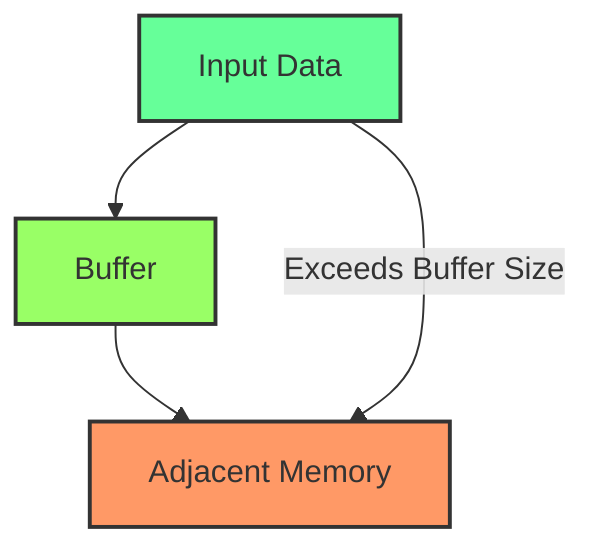
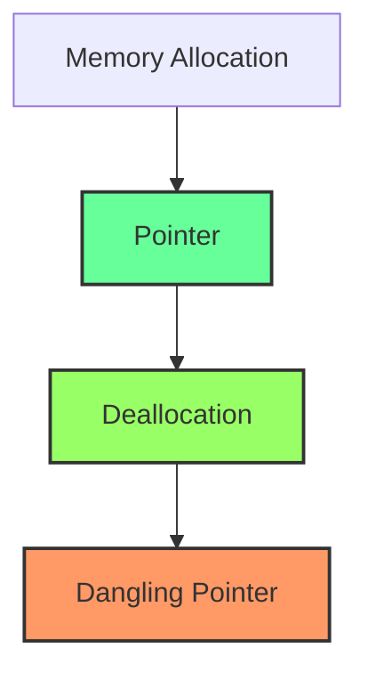

## 15.2 Managing Memory Safely

Memory management is a critical aspect of C++ programming, especially when it comes to ensuring the safety and security of applications. In this section, we will delve into the intricacies of managing memory safely in C++, focusing on preventing buffer overflows and avoiding dangling pointers. These issues are not only common pitfalls but also significant security vulnerabilities that can lead to severe consequences if not addressed properly.

### Understanding Buffer Overflows

Buffer overflows occur when data exceeds the allocated space in memory, overwriting adjacent memory locations. This can lead to unpredictable behavior, crashes, or even security breaches. Understanding how buffer overflows happen is the first step toward preventing them.

#### How Buffer Overflows Occur

Buffer overflows typically occur due to improper handling of memory allocation and data input. Consider the following example:

```cpp
#include <iostream>
#include <cstring>

void unsafeFunction(const char* input) {
    char buffer[10];
    strcpy(buffer, input); // Unsafe: No bounds checking
    std::cout << "Buffer content: " << buffer << std::endl;
}

int main() {
    const char* longString = "This is a very long string that exceeds buffer size";
    unsafeFunction(longString);
    return 0;
}
```

In this example, the `strcpy` function copies a string into a buffer without checking if the buffer is large enough to hold the string. If the input exceeds the buffer size, it overwrites adjacent memory, leading to undefined behavior.

#### Preventing Buffer Overflows

To prevent buffer overflows, it's essential to use safe functions and practices:

1. **Use Safe Functions**: Prefer functions that perform bounds checking, such as `strncpy` or `snprintf`, over their unsafe counterparts.

2. **Manual Bounds Checking**: Always check the size of the input data against the buffer size before copying.

3. **Use Standard Library Containers**: Utilize `std::string` and other standard containers that manage memory automatically and provide bounds checking.

4. **Static Analysis Tools**: Employ tools that can detect potential buffer overflows during development.

Here is a safer version of the previous example using `strncpy`:

```cpp
#include <iostream>
#include <cstring>

void safeFunction(const char* input) {
    char buffer[10];
    strncpy(buffer, input, sizeof(buffer) - 1);
    buffer[sizeof(buffer) - 1] = '\0'; // Ensure null-termination
    std::cout << "Buffer content: " << buffer << std::endl;
}

int main() {
    const char* longString = "This is a very long string that exceeds buffer size";
    safeFunction(longString);
    return 0;
}
```

### Avoiding Dangling Pointers

Dangling pointers occur when an object is deleted or deallocated, but a pointer still references the memory location. Accessing a dangling pointer can lead to undefined behavior, crashes, or data corruption.

#### How Dangling Pointers Occur

Dangling pointers typically arise from:

1. **Deallocating Memory**: When memory is deallocated using `delete` or `free`, but pointers to that memory still exist.

2. **Returning Pointers to Local Variables**: Returning a pointer to a local variable from a function results in a dangling pointer once the function exits.

3. **Scope Exiting**: When a pointer points to an object that goes out of scope.

Consider the following example:

```cpp
#include <iostream>

int* createDanglingPointer() {
    int localVariable = 42;
    return &localVariable; // Unsafe: Returning address of local variable
}

int main() {
    int* ptr = createDanglingPointer();
    std::cout << *ptr << std::endl; // Undefined behavior
    return 0;
}
```

#### Preventing Dangling Pointers

To avoid dangling pointers, follow these best practices:

1. **Set Pointers to `nullptr`**: After deallocating memory, set pointers to `nullptr` to avoid accidental access.

2. **Use Smart Pointers**: Utilize `std::unique_ptr` and `std::shared_ptr` to manage object lifetimes automatically.

3. **Avoid Returning Pointers to Local Variables**: Return objects by value or use dynamic memory allocation if necessary.

4. **Scope Management**: Be mindful of object lifetimes and pointer scopes.

Here is an example using smart pointers to manage memory safely:

```cpp
#include <iostream>
#include <memory>

void safePointerUsage() {
    std::unique_ptr<int> ptr = std::make_unique<int>(42);
    std::cout << *ptr << std::endl; // Safe: Managed by unique_ptr
}

int main() {
    safePointerUsage();
    return 0;
}
```

### Visualizing Memory Management

To further understand how buffer overflows and dangling pointers affect memory, let's visualize these concepts using Mermaid.js diagrams.

#### Buffer Overflow Visualization



*Caption: Buffer overflow occurs when input data exceeds the allocated buffer size, overwriting adjacent memory.*

#### Dangling Pointer Visualization



*Caption: Dangling pointers occur when memory is deallocated, but pointers still reference the old memory location.*

### Safe Memory Management Practices

In addition to preventing buffer overflows and avoiding dangling pointers, there are general practices that contribute to safe memory management in C++:

1. **RAII (Resource Acquisition Is Initialization)**: Use RAII to manage resources, ensuring that they are acquired and released in a controlled manner.

2. **Smart Pointers**: Use smart pointers to automate memory management and avoid manual memory handling errors.

3. **Avoid Manual Memory Management**: Prefer standard library containers and algorithms that handle memory automatically.

4. **Regular Code Reviews**: Conduct code reviews to catch potential memory management issues early.

5. **Testing and Debugging Tools**: Use tools like Valgrind and AddressSanitizer to detect memory leaks and other issues.

### Try It Yourself

To reinforce your understanding, try modifying the code examples provided. Experiment with different buffer sizes and input data to see how buffer overflows can occur. Use smart pointers in various scenarios to manage memory safely.

### Knowledge Check

- What is a buffer overflow, and how can it be prevented?
- How do dangling pointers occur, and what practices can help avoid them?
- Why is RAII important in C++ memory management?

### Conclusion

Managing memory safely in C++ is crucial for building robust and secure applications. By understanding and preventing buffer overflows and dangling pointers, you can significantly enhance the reliability and security of your software. Remember, this is just the beginning. As you progress, you'll build more complex and secure applications. Keep experimenting, stay curious, and enjoy the journey!

## Quiz Time!



### What is a buffer overflow?

- [x] When data exceeds the allocated buffer size and overwrites adjacent memory.
- [ ] When a buffer is allocated but not used.
- [ ] When a buffer is used without initialization.
- [ ] When a buffer is deallocated before use.

> **Explanation:** A buffer overflow occurs when data exceeds the allocated buffer size, leading to overwriting of adjacent memory.

### How can buffer overflows be prevented?

- [x] Use functions that perform bounds checking.
- [x] Utilize standard library containers like `std::string`.
- [ ] Always use `strcpy` for string copying.
- [ ] Ignore input size when copying data.

> **Explanation:** Buffer overflows can be prevented by using safe functions that perform bounds checking and leveraging standard library containers that manage memory automatically.

### What is a dangling pointer?

- [x] A pointer that references memory that has been deallocated.
- [ ] A pointer that is never initialized.
- [ ] A pointer that points to a constant value.
- [ ] A pointer that is used in a loop.

> **Explanation:** A dangling pointer occurs when a pointer references memory that has already been deallocated, leading to undefined behavior.

### How can dangling pointers be avoided?

- [x] Set pointers to `nullptr` after deallocation.
- [x] Use smart pointers like `std::unique_ptr`.
- [ ] Always return pointers to local variables.
- [ ] Ignore pointer scope and lifetime.

> **Explanation:** Dangling pointers can be avoided by setting pointers to `nullptr` after deallocation and using smart pointers to manage object lifetimes automatically.

### What is RAII in C++?

- [x] Resource Acquisition Is Initialization, a pattern for managing resources.
- [ ] A method for optimizing memory allocation.
- [ ] A technique for debugging memory leaks.
- [ ] A strategy for improving code readability.

> **Explanation:** RAII (Resource Acquisition Is Initialization) is a pattern in C++ for managing resources, ensuring they are acquired and released in a controlled manner.

### Why should smart pointers be used in C++?

- [x] To automate memory management and avoid manual errors.
- [ ] To increase the complexity of code.
- [ ] To replace all standard library containers.
- [ ] To eliminate the need for code reviews.

> **Explanation:** Smart pointers should be used in C++ to automate memory management, reducing the risk of manual errors and improving code safety.

### What is the role of static analysis tools in memory management?

- [x] Detect potential buffer overflows and other issues during development.
- [ ] Automatically fix all memory management issues.
- [ ] Replace the need for testing and debugging.
- [ ] Increase code complexity.

> **Explanation:** Static analysis tools help detect potential buffer overflows and other memory management issues during development, aiding in building safer applications.

### How does `std::unique_ptr` help in managing memory safely?

- [x] It ensures exclusive ownership of a resource, automatically deallocating it when no longer needed.
- [ ] It allows multiple pointers to manage the same resource.
- [ ] It requires manual deallocation of resources.
- [ ] It is only used for debugging purposes.

> **Explanation:** `std::unique_ptr` ensures exclusive ownership of a resource, automatically deallocating it when no longer needed, thus preventing memory leaks.

### What happens if you return a pointer to a local variable from a function?

- [x] It results in a dangling pointer once the function exits.
- [ ] It creates a safe reference to the variable.
- [ ] It optimizes memory usage.
- [ ] It increases the function's performance.

> **Explanation:** Returning a pointer to a local variable from a function results in a dangling pointer once the function exits, as the local variable's memory is deallocated.

### True or False: Using `strncpy` guarantees prevention of buffer overflows.

- [ ] True
- [x] False

> **Explanation:** While `strncpy` helps prevent buffer overflows by allowing bounds checking, it does not guarantee prevention on its own. Proper usage, including ensuring null-termination, is necessary.


