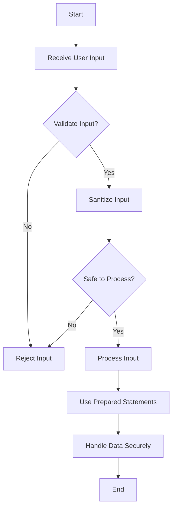

## 15.3 Preventing Injection Attacks

In the realm of software security, injection attacks are among the most prevalent and damaging threats. These attacks exploit vulnerabilities in applications by injecting malicious code into input fields, which is then executed by the system. As expert software engineers and architects, it is crucial to understand how to prevent these attacks, especially when developing applications in C++. This section will guide you through the principles of input validation, data sanitization, and secure data handling to mitigate the risk of injection attacks.

### Understanding Injection Attacks

Injection attacks occur when untrusted data is sent to an interpreter as part of a command or query. The attacker's hostile data can trick the interpreter into executing unintended commands or accessing unauthorized data. Common types of injection attacks include:

- **SQL Injection**: Involves inserting or "injecting" SQL queries via input data from the client to the application.
- **Command Injection**: Occurs when an attacker is able to execute arbitrary commands on the host operating system via a vulnerable application.
- **Code Injection**: Involves injecting code that is then executed by the application.
- **Cross-Site Scripting (XSS)**: Involves injecting malicious scripts into content from otherwise trusted websites.

### The Importance of Input Validation

Input validation is the first line of defense against injection attacks. It involves verifying that the input data is both syntactically and semantically correct. Here are some key principles:

1. **Whitelist Validation**: Define what is allowed and reject everything else. This is more secure than blacklisting, which involves defining what is not allowed.
2. **Data Type Checks**: Ensure that the input data matches the expected data type.
3. **Range Checks**: Verify that numeric inputs fall within a specified range.
4. **Length Checks**: Ensure that the input data does not exceed expected lengths.
5. **Pattern Matching**: Use regular expressions to match input data against expected patterns.

### Implementing Input Validation in C++

Let's explore how to implement input validation in C++ with practical examples.

```cpp
#include <iostream>
#include <regex>
#include <string>

// Function to validate email using regex
bool validateEmail(const std::string& email) {
    const std::regex pattern(R"((\w+)(\.{1}\w+)*@(\w+)(\.\w{2,3})+)");
    return std::regex_match(email, pattern);
}

// Function to validate age
bool validateAge(int age) {
    return age >= 0 && age <= 120;
}

int main() {
    std::string email;
    int age;

    std::cout << "Enter your email: ";
    std::cin >> email;
    if (!validateEmail(email)) {
        std::cerr << "Invalid email format!" << std::endl;
        return 1;
    }

    std::cout << "Enter your age: ";
    std::cin >> age;
    if (!validateAge(age)) {
        std::cerr << "Invalid age!" << std::endl;
        return 1;
    }

    std::cout << "Validation successful!" << std::endl;
    return 0;
}
```

### Data Sanitization

Data sanitization involves cleaning input data to ensure it is safe to process. This process is crucial when dealing with data that will be executed or stored. Here are some strategies:

- **Escape Special Characters**: Convert special characters to their escaped equivalents to prevent them from being interpreted as code.
- **Remove Potentially Dangerous Characters**: Strip out characters that could be used in an attack, such as semicolons or quotes.
- **Normalize Input**: Convert input data to a standard format to prevent attacks that rely on variations in input encoding.

### Implementing Data Sanitization in C++

Below is an example demonstrating how to sanitize input data in C++.

```cpp
#include <iostream>
#include <string>

// Function to sanitize input by escaping special characters
std::string sanitizeInput(const std::string& input) {
    std::string sanitized;
    for (char ch : input) {
        switch (ch) {
            case '<': sanitized.append("&lt;"); break;
            case '>': sanitized.append("&gt;"); break;
            case '&': sanitized.append("&amp;"); break;
            case '"': sanitized.append("&quot;"); break;
            case '\'': sanitized.append("&apos;"); break;
            default: sanitized.push_back(ch); break;
        }
    }
    return sanitized;
}

int main() {
    std::string userInput;
    std::cout << "Enter some text: ";
    std::getline(std::cin, userInput);

    std::string safeInput = sanitizeInput(userInput);
    std::cout << "Sanitized input: " << safeInput << std::endl;

    return 0;
}
```

### Secure Data Handling

Secure data handling involves managing data in a way that minimizes the risk of unauthorized access or modification. Here are some best practices:

- **Use Prepared Statements**: When interacting with databases, use prepared statements to separate SQL code from data, preventing SQL injection attacks.
- **Limit Data Exposure**: Only expose data that is necessary for the operation. Use the principle of least privilege.
- **Encrypt Sensitive Data**: Use encryption to protect sensitive data both in transit and at rest.

### Implementing Secure Data Handling in C++

Let's see how to use prepared statements to prevent SQL injection in a C++ application.

```cpp
#include <iostream>
#include <mysql/mysql.h>

// Function to connect to the database and execute a query safely
void executeQuery(const std::string& userInput) {
    MYSQL *conn;
    MYSQL_STMT *stmt;
    MYSQL_BIND bind[1];

    conn = mysql_init(NULL);
    if (conn == NULL) {
        std::cerr << "mysql_init() failed\n";
        return;
    }

    if (mysql_real_connect(conn, "localhost", "user", "password", "database", 0, NULL, 0) == NULL) {
        std::cerr << "mysql_real_connect() failed\n";
        mysql_close(conn);
        return;
    }

    stmt = mysql_stmt_init(conn);
    if (!stmt) {
        std::cerr << "mysql_stmt_init() failed\n";
        mysql_close(conn);
        return;
    }

    const char *query = "SELECT * FROM users WHERE username = ?";
    if (mysql_stmt_prepare(stmt, query, strlen(query))) {
        std::cerr << "mysql_stmt_prepare() failed\n";
        mysql_stmt_close(stmt);
        mysql_close(conn);
        return;
    }

    memset(bind, 0, sizeof(bind));
    bind[0].buffer_type = MYSQL_TYPE_STRING;
    bind[0].buffer = (char *)userInput.c_str();
    bind[0].buffer_length = userInput.length();

    if (mysql_stmt_bind_param(stmt, bind)) {
        std::cerr << "mysql_stmt_bind_param() failed\n";
        mysql_stmt_close(stmt);
        mysql_close(conn);
        return;
    }

    if (mysql_stmt_execute(stmt)) {
        std::cerr << "mysql_stmt_execute() failed\n";
    } else {
        std::cout << "Query executed successfully\n";
    }

    mysql_stmt_close(stmt);
    mysql_close(conn);
}

int main() {
    std::string username;
    std::cout << "Enter username: ";
    std::cin >> username;

    executeQuery(username);

    return 0;
}
```

### Visualizing the Process of Preventing Injection Attacks

To better understand the flow of preventing injection attacks, let's visualize the process using a flowchart.



**Figure 1**: Flowchart illustrating the process of preventing injection attacks through input validation, sanitization, and secure data handling.

### Try It Yourself

To reinforce your understanding, try modifying the code examples above. Here are some suggestions:

- **Extend the Email Validation**: Modify the `validateEmail` function to include more complex email patterns, such as those with subdomains.
- **Enhance the Sanitization Function**: Add more special characters to the `sanitizeInput` function and test it with various inputs.
- **Implement Additional Security Measures**: In the SQL example, try adding encryption for sensitive data before storing it in the database.

### Knowledge Check

To ensure you've grasped the key concepts, consider the following questions:

- What are the differences between input validation and data sanitization?
- Why is it important to use prepared statements in database interactions?
- How can you ensure that your input validation is comprehensive and robust?

### Conclusion

Preventing injection attacks is a critical aspect of developing secure applications. By validating and sanitizing inputs, handling data securely, and following best practices, you can significantly reduce the risk of these attacks. Remember, security is an ongoing process that requires vigilance and continuous improvement.

### Further Reading

For more information on preventing injection attacks and secure coding practices, consider exploring the following resources:

- [OWASP Top Ten](https://owasp.org/www-project-top-ten/)
- [C++ Secure Coding Guidelines](https://isocpp.github.io/CppCoreGuidelines/CppCoreGuidelines)
- [SQL Injection Prevention Cheat Sheet](https://cheatsheetseries.owasp.org/cheatsheets/SQL_Injection_Prevention_Cheat_Sheet.html)

## Quiz Time!



### What is the primary goal of input validation?

- [x] To ensure that input data is both syntactically and semantically correct
- [ ] To convert input data into a standard format
- [ ] To encrypt sensitive data
- [ ] To execute commands securely

> **Explanation:** Input validation ensures that data is correct and expected before processing.

### Which of the following is a common type of injection attack?

- [x] SQL Injection
- [ ] Buffer Overflow
- [ ] Man-in-the-Middle
- [ ] Phishing

> **Explanation:** SQL Injection is a common type of injection attack that exploits vulnerabilities in applications.

### What is the benefit of using prepared statements?

- [x] They separate SQL code from data, preventing SQL injection attacks
- [ ] They make queries run faster
- [ ] They allow for dynamic query generation
- [ ] They automatically sanitize input data

> **Explanation:** Prepared statements help prevent SQL injection by separating code from data.

### What is the purpose of data sanitization?

- [x] To clean input data to ensure it is safe to process
- [ ] To validate input data against expected patterns
- [ ] To encrypt data before storage
- [ ] To convert data into a standard format

> **Explanation:** Data sanitization involves cleaning input data to prevent it from being interpreted as code.

### Which of the following is a strategy for secure data handling?

- [x] Use prepared statements
- [ ] Use global variables
- [ ] Disable encryption
- [ ] Allow all user inputs

> **Explanation:** Using prepared statements is a strategy for secure data handling to prevent SQL injection.

### What is the principle of least privilege?

- [x] Only expose data that is necessary for the operation
- [ ] Allow all users to access all data
- [ ] Encrypt all data by default
- [ ] Use the same credentials for all users

> **Explanation:** The principle of least privilege involves limiting data exposure to only what is necessary.

### How can you prevent command injection attacks?

- [x] Validate and sanitize all input data
- [ ] Use global variables for input storage
- [ ] Disable input validation
- [ ] Allow unrestricted command execution

> **Explanation:** Validating and sanitizing input data helps prevent command injection attacks.

### What is the role of encryption in secure data handling?

- [x] To protect sensitive data both in transit and at rest
- [ ] To validate input data
- [ ] To execute commands securely
- [ ] To convert data into a standard format

> **Explanation:** Encryption protects sensitive data from unauthorized access.

### Why is it important to escape special characters in input data?

- [x] To prevent them from being interpreted as code
- [ ] To make input data more readable
- [ ] To increase input data length
- [ ] To convert input data into a standard format

> **Explanation:** Escaping special characters prevents them from being executed as code.

### True or False: Input validation alone is sufficient to prevent all injection attacks.

- [ ] True
- [x] False

> **Explanation:** While input validation is crucial, it must be combined with other strategies like data sanitization and secure data handling to effectively prevent injection attacks.


