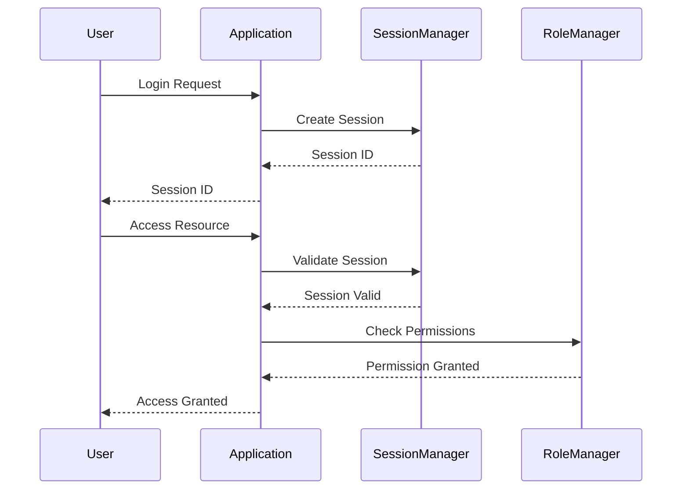

## 15.4 Access Control and Authentication

In the realm of software security, **Access Control and Authentication** are fundamental components that ensure only authorized users can access specific resources and perform actions within a system. This section delves into the implementation of these concepts in C++, focusing on role-based access, secure session management, and the encryption of sensitive data. By mastering these techniques, you can build robust and secure C++ applications that protect user data and maintain system integrity.

### Understanding Access Control

**Access Control** is the process of granting or denying specific requests to obtain and use information and related information processing services. It is a critical component of any security architecture and is typically implemented using various models, such as Discretionary Access Control (DAC), Mandatory Access Control (MAC), and Role-Based Access Control (RBAC).

#### Role-Based Access Control (RBAC)

**Role-Based Access Control (RBAC)** is a widely used access control model that assigns permissions to users based on their roles within an organization. This model simplifies management by associating permissions with roles rather than individual users.

**Key Concepts of RBAC:**

- **Roles**: A role represents a set of permissions. Users are assigned roles based on their responsibilities.
- **Permissions**: Permissions define the allowed actions on resources.
- **Users**: Individuals who interact with the system and are assigned roles.
- **Sessions**: A session represents a user's active role(s) during a login period.

**Benefits of RBAC:**

- **Scalability**: Easily manage permissions for large numbers of users by assigning roles.
- **Security**: Reduce the risk of unauthorized access by clearly defining roles and permissions.
- **Flexibility**: Adapt to organizational changes by modifying roles and permissions.

#### Implementing RBAC in C++

To implement RBAC in C++, we can create classes to represent users, roles, and permissions. Let's explore a basic implementation:

```cpp
#include <iostream>
#include <string>
#include <unordered_map>
#include <unordered_set>
#include <vector>

// Role class representing a set of permissions
class Role {
public:
    Role(const std::string& name) : name(name) {}

    void addPermission(const std::string& permission) {
        permissions.insert(permission);
    }

    bool hasPermission(const std::string& permission) const {
        return permissions.find(permission) != permissions.end();
    }

    const std::string& getName() const {
        return name;
    }

private:
    std::string name;
    std::unordered_set<std::string> permissions;
};

// User class representing a user with assigned roles
class User {
public:
    User(const std::string& username) : username(username) {}

    void assignRole(const Role& role) {
        roles.push_back(role);
    }

    bool hasPermission(const std::string& permission) const {
        for (const auto& role : roles) {
            if (role.hasPermission(permission)) {
                return true;
            }
        }
        return false;
    }

    const std::string& getUsername() const {
        return username;
    }

private:
    std::string username;
    std::vector<Role> roles;
};

// Example usage
int main() {
    Role adminRole("Admin");
    adminRole.addPermission("read");
    adminRole.addPermission("write");
    adminRole.addPermission("delete");

    Role userRole("User");
    userRole.addPermission("read");

    User alice("Alice");
    alice.assignRole(adminRole);

    User bob("Bob");
    bob.assignRole(userRole);

    std::cout << "Alice has read permission: " << alice.hasPermission("read") << std::endl;
    std::cout << "Bob has delete permission: " << bob.hasPermission("delete") << std::endl;

    return 0;
}
```

**Explanation:**

- **Role Class**: Represents a role with a set of permissions.
- **User Class**: Represents a user with assigned roles. It checks permissions by iterating through the user's roles.
- **Main Function**: Demonstrates creating roles, assigning them to users, and checking permissions.

### Secure Session Management

**Session Management** is crucial for maintaining a user's state and identity across multiple requests. It involves creating, maintaining, and terminating user sessions securely.

#### Key Concepts of Session Management

- **Session ID**: A unique identifier for each session, often stored in cookies.
- **Session Timeout**: The duration after which a session expires due to inactivity.
- **Session Storage**: Mechanism to store session data, such as in-memory or database storage.

#### Implementing Secure Session Management in C++

To implement secure session management, we need to generate unique session IDs, store session data securely, and handle session expiration. Here's a basic implementation:

```cpp
#include <iostream>
#include <unordered_map>
#include <string>
#include <ctime>
#include <cstdlib>

// Session class representing a user session
class Session {
public:
    Session(const std::string& userId) : userId(userId), lastAccessTime(std::time(nullptr)) {
        sessionId = generateSessionId();
    }

    const std::string& getSessionId() const {
        return sessionId;
    }

    const std::string& getUserId() const {
        return userId;
    }

    void updateLastAccessTime() {
        lastAccessTime = std::time(nullptr);
    }

    bool isExpired(int timeout) const {
        return std::difftime(std::time(nullptr), lastAccessTime) > timeout;
    }

private:
    std::string sessionId;
    std::string userId;
    std::time_t lastAccessTime;

    std::string generateSessionId() {
        const char charset[] = "0123456789ABCDEFGHIJKLMNOPQRSTUVWXYZabcdefghijklmnopqrstuvwxyz";
        const size_t length = 16;
        std::string sessionId;
        for (size_t i = 0; i < length; ++i) {
            sessionId += charset[rand() % (sizeof(charset) - 1)];
        }
        return sessionId;
    }
};

// SessionManager class to manage user sessions
class SessionManager {
public:
    void createSession(const std::string& userId) {
        Session session(userId);
        sessions[session.getSessionId()] = session;
    }

    bool validateSession(const std::string& sessionId, int timeout) {
        auto it = sessions.find(sessionId);
        if (it != sessions.end() && !it->second.isExpired(timeout)) {
            it->second.updateLastAccessTime();
            return true;
        }
        return false;
    }

    void removeSession(const std::string& sessionId) {
        sessions.erase(sessionId);
    }

private:
    std::unordered_map<std::string, Session> sessions;
};

// Example usage
int main() {
    srand(static_cast<unsigned int>(std::time(nullptr)));

    SessionManager sessionManager;
    sessionManager.createSession("Alice");

    std::string sessionId = "some-session-id"; // Replace with actual session ID
    int timeout = 300; // 5 minutes

    if (sessionManager.validateSession(sessionId, timeout)) {
        std::cout << "Session is valid." << std::endl;
    } else {
        std::cout << "Session is invalid or expired." << std::endl;
    }

    return 0;
}
```

**Explanation:**

- **Session Class**: Represents a user session with a unique session ID and last access time.
- **SessionManager Class**: Manages sessions by creating, validating, and removing them.
- **Main Function**: Demonstrates creating a session and validating it.

### Encrypting Sensitive Data

**Data Encryption** is essential for protecting sensitive information from unauthorized access. It involves converting plaintext data into ciphertext using encryption algorithms.

#### Key Concepts of Data Encryption

- **Symmetric Encryption**: Uses the same key for encryption and decryption (e.g., AES).
- **Asymmetric Encryption**: Uses a pair of keys (public and private) for encryption and decryption (e.g., RSA).
- **Hashing**: Converts data into a fixed-size hash value, often used for password storage.

#### Implementing Data Encryption in C++

To encrypt data in C++, we can use libraries such as OpenSSL or Crypto++. Here's an example using OpenSSL for symmetric encryption:

```cpp
#include <iostream>
#include <openssl/evp.h>
#include <openssl/rand.h>
#include <cstring>

// Encrypts plaintext using AES-256-CBC
bool encrypt(const unsigned char* plaintext, int plaintext_len, const unsigned char* key,
             const unsigned char* iv, unsigned char* ciphertext) {
    EVP_CIPHER_CTX* ctx = EVP_CIPHER_CTX_new();
    if (!ctx) return false;

    int len;
    int ciphertext_len;

    if (1 != EVP_EncryptInit_ex(ctx, EVP_aes_256_cbc(), nullptr, key, iv)) return false;
    if (1 != EVP_EncryptUpdate(ctx, ciphertext, &len, plaintext, plaintext_len)) return false;
    ciphertext_len = len;
    if (1 != EVP_EncryptFinal_ex(ctx, ciphertext + len, &len)) return false;
    ciphertext_len += len;

    EVP_CIPHER_CTX_free(ctx);
    return ciphertext_len;
}

// Decrypts ciphertext using AES-256-CBC
bool decrypt(const unsigned char* ciphertext, int ciphertext_len, const unsigned char* key,
             const unsigned char* iv, unsigned char* plaintext) {
    EVP_CIPHER_CTX* ctx = EVP_CIPHER_CTX_new();
    if (!ctx) return false;

    int len;
    int plaintext_len;

    if (1 != EVP_DecryptInit_ex(ctx, EVP_aes_256_cbc(), nullptr, key, iv)) return false;
    if (1 != EVP_DecryptUpdate(ctx, plaintext, &len, ciphertext, ciphertext_len)) return false;
    plaintext_len = len;
    if (1 != EVP_DecryptFinal_ex(ctx, plaintext + len, &len)) return false;
    plaintext_len += len;

    EVP_CIPHER_CTX_free(ctx);
    return plaintext_len;
}

// Example usage
int main() {
    unsigned char key[32];
    unsigned char iv[16];

    if (!RAND_bytes(key, sizeof(key)) || !RAND_bytes(iv, sizeof(iv))) {
        std::cerr << "Error generating key/iv." << std::endl;
        return 1;
    }

    const char* plaintext = "Hello, World!";
    unsigned char ciphertext[128];
    unsigned char decryptedtext[128];

    int ciphertext_len = encrypt(reinterpret_cast<const unsigned char*>(plaintext), strlen(plaintext), key, iv, ciphertext);
    if (ciphertext_len == 0) {
        std::cerr << "Encryption failed." << std::endl;
        return 1;
    }

    int decryptedtext_len = decrypt(ciphertext, ciphertext_len, key, iv, decryptedtext);
    if (decryptedtext_len == 0) {
        std::cerr << "Decryption failed." << std::endl;
        return 1;
    }

    decryptedtext[decryptedtext_len] = '\0';
    std::cout << "Decrypted text: " << decryptedtext << std::endl;

    return 0;
}
```

**Explanation:**

- **Encrypt Function**: Encrypts plaintext using AES-256-CBC.
- **Decrypt Function**: Decrypts ciphertext back to plaintext.
- **Main Function**: Demonstrates encrypting and decrypting a message.

### Visualizing Access Control and Authentication

To better understand the flow of access control and authentication, let's visualize the process using a sequence diagram.



**Diagram Explanation:**

- **Login Request**: The user requests to log in, and the application creates a session.
- **Access Resource**: The user requests access to a resource, and the application validates the session and checks permissions.

### Best Practices for Access Control and Authentication

Implementing access control and authentication effectively requires adhering to best practices:

1. **Use Strong Password Policies**: Enforce complex passwords and regular password changes.
2. **Implement Multi-Factor Authentication (MFA)**: Add an extra layer of security by requiring additional verification.
3. **Secure Session Management**: Use secure cookies, set appropriate session timeouts, and regenerate session IDs after login.
4. **Encrypt Sensitive Data**: Use strong encryption algorithms and keep encryption keys secure.
5. **Regularly Update and Patch Systems**: Keep software up to date to protect against vulnerabilities.
6. **Log and Monitor Access**: Maintain logs of access attempts and monitor for suspicious activity.

### Try It Yourself

To deepen your understanding, try modifying the code examples:

- **Add New Roles and Permissions**: Extend the RBAC implementation by adding new roles and permissions.
- **Implement Session Expiration**: Modify the session management code to handle session expiration and removal.
- **Experiment with Encryption**: Change the encryption algorithm or key size in the OpenSSL example.

### Knowledge Check

Before moving on, let's reinforce what we've learned:

- **What is the primary purpose of RBAC?**
- **How does session management contribute to security?**
- **What are the differences between symmetric and asymmetric encryption?**

### Embrace the Journey

Remember, mastering access control and authentication in C++ is a journey. As you progress, you'll build more secure and reliable applications. Keep experimenting, stay curious, and enjoy the journey!

## Quiz Time!



### What is the primary benefit of Role-Based Access Control (RBAC)?

- [x] Simplifies permission management by associating permissions with roles
- [ ] Provides a single point of failure for access control
- [ ] Eliminates the need for user authentication
- [ ] Requires less memory than other access control models

> **Explanation:** RBAC simplifies permission management by associating permissions with roles, making it easier to manage large numbers of users.

### What is a session ID used for in session management?

- [x] To uniquely identify a user's session
- [ ] To encrypt user data
- [ ] To store user passwords
- [ ] To determine user roles

> **Explanation:** A session ID uniquely identifies a user's session, allowing the system to maintain state across multiple requests.

### Which encryption method uses a pair of keys for encryption and decryption?

- [x] Asymmetric Encryption
- [ ] Symmetric Encryption
- [ ] Hashing
- [ ] Role-Based Encryption

> **Explanation:** Asymmetric encryption uses a pair of keys (public and private) for encryption and decryption.

### What is the purpose of session timeout?

- [x] To expire a session after a period of inactivity
- [ ] To increase session security by frequently changing session IDs
- [ ] To encrypt session data
- [ ] To store user roles

> **Explanation:** Session timeout expires a session after a period of inactivity to enhance security.

### Which library is commonly used for encryption in C++?

- [x] OpenSSL
- [ ] Boost
- [ ] Qt
- [ ] STL

> **Explanation:** OpenSSL is a widely used library for encryption in C++.

### What is the role of the `SessionManager` class in the provided code example?

- [x] To manage user sessions by creating, validating, and removing them
- [ ] To encrypt user data
- [ ] To store user passwords
- [ ] To determine user roles

> **Explanation:** The `SessionManager` class manages user sessions by creating, validating, and removing them.

### What is the primary purpose of encrypting sensitive data?

- [x] To protect data from unauthorized access
- [ ] To reduce data size
- [ ] To increase data processing speed
- [ ] To store data in a database

> **Explanation:** Encrypting sensitive data protects it from unauthorized access.

### What is a key advantage of using RBAC?

- [x] It reduces the risk of unauthorized access by clearly defining roles and permissions
- [ ] It eliminates the need for encryption
- [ ] It requires less memory than other access control models
- [ ] It provides a single point of failure for access control

> **Explanation:** RBAC reduces the risk of unauthorized access by clearly defining roles and permissions.

### What is the difference between symmetric and asymmetric encryption?

- [x] Symmetric uses one key for both encryption and decryption, while asymmetric uses a pair of keys
- [ ] Symmetric is faster than asymmetric
- [ ] Asymmetric uses one key for both encryption and decryption, while symmetric uses a pair of keys
- [ ] Asymmetric is faster than symmetric

> **Explanation:** Symmetric encryption uses one key for both encryption and decryption, while asymmetric encryption uses a pair of keys.

### True or False: Session management is not necessary for secure applications.

- [ ] True
- [x] False

> **Explanation:** False. Session management is crucial for maintaining a user's state and identity across multiple requests, contributing to application security.


