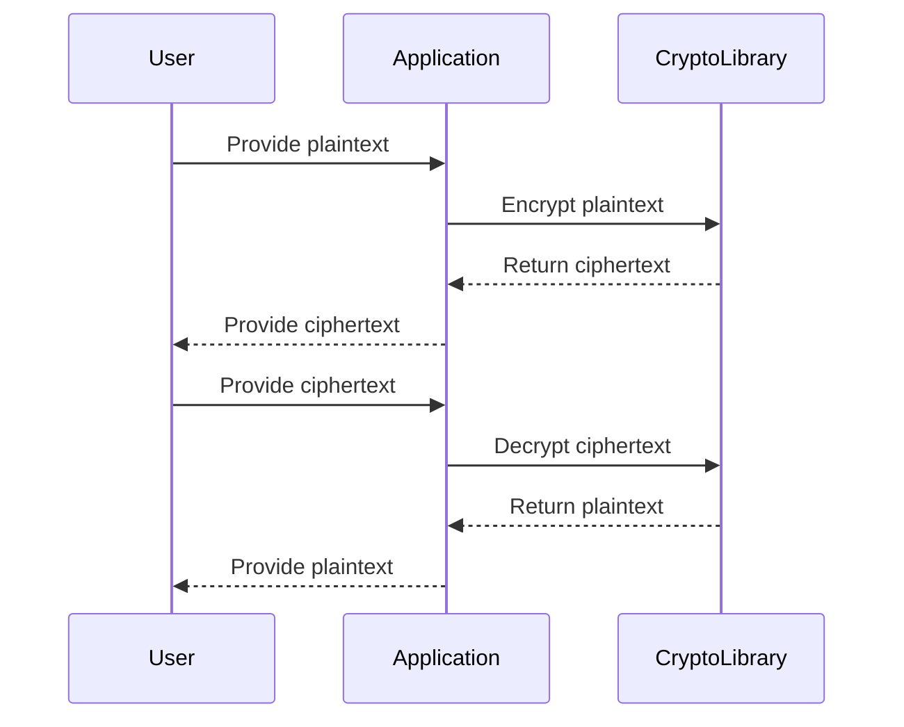

## 15.5 Encryption and Cryptography

In the realm of software development, security is paramount. As expert software engineers and architects, understanding and implementing encryption and cryptography in C++ is crucial for building secure applications. This section delves into the fundamental concepts of cryptography, explores the use of popular cryptographic libraries like OpenSSL and libsodium, and highlights best practices for encryption and key management.

### Introduction to Cryptography

Cryptography is the science of securing information by transforming it into an unreadable format, only to be reverted to its original form by those possessing the correct decryption key. It plays a vital role in ensuring confidentiality, integrity, and authenticity of data.

#### Key Concepts in Cryptography

- **Encryption**: The process of converting plaintext into ciphertext using an algorithm and a key.
- **Decryption**: The reverse process of encryption, converting ciphertext back to plaintext.
- **Symmetric Encryption**: Uses the same key for both encryption and decryption.
- **Asymmetric Encryption**: Uses a pair of keys, a public key for encryption and a private key for decryption.
- **Hashing**: Converts data into a fixed-size string of characters, which is typically a digest that is unique to the original data.
- **Digital Signatures**: Provides a way to verify the authenticity and integrity of a message or document.

### Cryptographic Libraries in C++

C++ offers several libraries for implementing cryptographic functions. Two of the most widely used libraries are OpenSSL and libsodium.

#### OpenSSL

OpenSSL is a robust, full-featured open-source toolkit implementing the Secure Sockets Layer (SSL) and Transport Layer Security (TLS) protocols, as well as a general-purpose cryptography library.

##### Installing OpenSSL

To use OpenSSL in your C++ projects, you need to install it first. On most Linux distributions, you can install it using the package manager:

```bash
sudo apt-get install libssl-dev
```

For Windows, you can download precompiled binaries from the OpenSSL website.

##### Basic Encryption with OpenSSL

Here's a simple example of encrypting and decrypting data using OpenSSL's AES (Advanced Encryption Standard) in C++:

```cpp
#include <openssl/conf.h>
#include <openssl/evp.h>
#include <openssl/err.h>
#include <string.h>
#include <iostream>

void handleErrors(void) {
    ERR_print_errors_fp(stderr);
    abort();
}

int encrypt(unsigned char *plaintext, int plaintext_len, unsigned char *key,
            unsigned char *iv, unsigned char *ciphertext) {
    EVP_CIPHER_CTX *ctx;

    int len;
    int ciphertext_len;

    if(!(ctx = EVP_CIPHER_CTX_new())) handleErrors();

    if(1 != EVP_EncryptInit_ex(ctx, EVP_aes_256_cbc(), NULL, key, iv))
        handleErrors();

    if(1 != EVP_EncryptUpdate(ctx, ciphertext, &len, plaintext, plaintext_len))
        handleErrors();
    ciphertext_len = len;

    if(1 != EVP_EncryptFinal_ex(ctx, ciphertext + len, &len)) handleErrors();
    ciphertext_len += len;

    EVP_CIPHER_CTX_free(ctx);

    return ciphertext_len;
}

int main() {
    unsigned char *key = (unsigned char *)"01234567890123456789012345678901"; // A 256 bit key
    unsigned char *iv = (unsigned char *)"0123456789012345"; // A 128 bit IV

    unsigned char *plaintext = (unsigned char *)"The quick brown fox jumps over the lazy dog";
    unsigned char ciphertext[128];

    int ciphertext_len = encrypt(plaintext, strlen((char *)plaintext), key, iv, ciphertext);

    std::cout << "Ciphertext is:" << std::endl;
    for(int i = 0; i < ciphertext_len; i++)
        std::cout << std::hex << (int)ciphertext[i];
    std::cout << std::endl;

    return 0;
}
```

**Explanation**: This code demonstrates how to encrypt a plaintext message using AES-256-CBC. It initializes the encryption operation, processes the plaintext, and finalizes the encryption. The encrypted data is stored in `ciphertext`.

#### Libsodium

Libsodium is a modern, easy-to-use software library for encryption, decryption, signatures, password hashing, and more. It is a portable, cross-compilable, installable, and packageable fork of NaCl, the Networking and Cryptography library.

##### Installing Libsodium

To install libsodium, you can use the package manager on Linux:

```bash
sudo apt-get install libsodium-dev
```

For Windows, you can download the binaries from the libsodium website.

##### Basic Encryption with Libsodium

Here's an example of encrypting and decrypting data using libsodium's secret-key encryption:

```cpp
#include <sodium.h>
#include <iostream>

int main() {
    if (sodium_init() < 0) {
        std::cerr << "Libsodium initialization failed" << std::endl;
        return 1;
    }

    unsigned char key[crypto_secretbox_KEYBYTES];
    unsigned char nonce[crypto_secretbox_NONCEBYTES];
    unsigned char message[] = "The quick brown fox jumps over the lazy dog";
    unsigned char ciphertext[crypto_secretbox_MACBYTES + sizeof(message)];
    unsigned char decrypted[sizeof(message)];

    randombytes_buf(key, sizeof key);
    randombytes_buf(nonce, sizeof nonce);

    crypto_secretbox_easy(ciphertext, message, sizeof message, nonce, key);

    if (crypto_secretbox_open_easy(decrypted, ciphertext, sizeof ciphertext, nonce, key) != 0) {
        std::cerr << "Decryption failed" << std::endl;
        return 1;
    }

    std::cout << "Decrypted message: " << decrypted << std::endl;

    return 0;
}
```

**Explanation**: This code uses libsodium to encrypt and decrypt a message. It generates a random key and nonce, encrypts the message, and then decrypts it back to its original form.

### Best Practices for Encryption

Implementing encryption correctly is crucial for maintaining the security of your applications. Here are some best practices to follow:

1. **Use Strong Algorithms**: Always use well-established cryptographic algorithms like AES, RSA, and SHA-256. Avoid using outdated or weak algorithms.

2. **Keep Keys Secure**: Encryption is only as strong as the secrecy of the keys. Use secure key management practices to protect your keys.

3. **Use Proper Initialization Vectors (IVs)**: For algorithms that require an IV, ensure that it is unique and unpredictable for each encryption operation.

4. **Avoid Hardcoding Keys**: Never hardcode encryption keys in your source code. Use secure storage solutions like hardware security modules (HSMs) or secure key vaults.

5. **Regularly Update Libraries**: Keep your cryptographic libraries up to date to protect against known vulnerabilities.

6. **Implement Error Handling**: Always check for errors during encryption and decryption processes to ensure data integrity.

### Key Management

Key management is a critical aspect of cryptography. It involves the generation, distribution, storage, and destruction of cryptographic keys.

#### Key Generation

- **Randomness**: Use a secure random number generator to create keys. Both OpenSSL and libsodium provide functions for generating cryptographically secure random numbers.
- **Key Length**: Choose an appropriate key length based on the algorithm and security requirements. For example, AES-256 requires a 256-bit key.

#### Key Storage

- **Secure Storage**: Store keys in a secure location, such as a hardware security module (HSM) or a secure key vault.
- **Access Control**: Restrict access to keys to only those who need it. Implement strict access controls and auditing.

#### Key Distribution

- **Secure Channels**: Use secure channels like TLS to distribute keys.
- **Key Exchange Protocols**: Implement key exchange protocols like Diffie-Hellman to securely exchange keys over an insecure channel.

#### Key Rotation and Destruction

- **Key Rotation**: Regularly rotate keys to minimize the impact of a compromised key.
- **Key Destruction**: Securely delete keys when they are no longer needed to prevent unauthorized access.

### Visualizing Cryptographic Processes

To better understand the flow of cryptographic operations, let's visualize the encryption and decryption process using a sequence diagram.



**Description**: This diagram illustrates the interaction between a user, an application, and a cryptographic library during the encryption and decryption process. The user provides plaintext to the application, which then uses the cryptographic library to encrypt it into ciphertext. The reverse process occurs during decryption.

### Try It Yourself

Experimenting with cryptographic code is an excellent way to deepen your understanding. Try modifying the examples provided:

- Change the encryption algorithm from AES-256-CBC to another supported by OpenSSL, such as AES-128-CBC.
- Implement a simple key rotation mechanism by generating a new key and re-encrypting data.
- Use libsodium's public-key encryption functions to encrypt and decrypt messages.

### Knowledge Check

Let's reinforce what we've learned with a few questions:

1. What is the difference between symmetric and asymmetric encryption?
2. Why is key management crucial in cryptography?
3. How can you ensure the security of encryption keys?
4. What are some best practices for using cryptographic libraries?

### Embrace the Journey

Remember, mastering encryption and cryptography is an ongoing journey. As you continue to explore and implement these concepts, you'll build more secure and robust applications. Stay curious, keep experimenting, and enjoy the process!

## Quiz Time!



### What is the primary purpose of encryption?

- [x] To convert plaintext into ciphertext
- [ ] To hash data
- [ ] To generate random numbers
- [ ] To compress data

> **Explanation:** Encryption is used to convert plaintext into ciphertext, making it unreadable to unauthorized users.

### Which C++ library is known for implementing the Secure Sockets Layer (SSL) and Transport Layer Security (TLS) protocols?

- [x] OpenSSL
- [ ] libsodium
- [ ] Boost
- [ ] Qt

> **Explanation:** OpenSSL is a widely-used library that implements SSL and TLS protocols.

### What is a key advantage of using libsodium for cryptographic operations?

- [x] It is easy to use and provides modern cryptographic primitives
- [ ] It is only available on Linux
- [ ] It does not support symmetric encryption
- [ ] It is a proprietary library

> **Explanation:** Libsodium is designed to be easy to use and provides a range of modern cryptographic primitives.

### What is a critical aspect of key management?

- [x] Secure storage and access control
- [ ] Hardcoding keys in source code
- [ ] Using short keys for efficiency
- [ ] Ignoring key rotation

> **Explanation:** Key management involves securely storing keys and controlling access to them.

### Which of the following is a best practice for encryption?

- [x] Using strong, well-established algorithms
- [ ] Hardcoding keys in the application
- [ ] Using the same key for all operations
- [ ] Ignoring error handling

> **Explanation:** It is essential to use strong, well-established algorithms for secure encryption.

### What is the role of an Initialization Vector (IV) in encryption?

- [x] To ensure uniqueness and unpredictability for each encryption operation
- [ ] To serve as the encryption key
- [ ] To compress data before encryption
- [ ] To hash the plaintext

> **Explanation:** An IV ensures that the same plaintext encrypts to different ciphertexts each time, providing uniqueness.

### What is the purpose of a digital signature?

- [x] To verify the authenticity and integrity of a message
- [ ] To encrypt data
- [ ] To generate random numbers
- [ ] To compress data

> **Explanation:** Digital signatures are used to verify the authenticity and integrity of a message or document.

### How can you securely distribute cryptographic keys?

- [x] Using secure channels like TLS
- [ ] Sending them via email
- [ ] Hardcoding them in the application
- [ ] Using short keys for efficiency

> **Explanation:** Secure channels like TLS are used to distribute cryptographic keys securely.

### What is the recommended way to generate cryptographic keys?

- [x] Using a secure random number generator
- [ ] Hardcoding them in the application
- [ ] Using a fixed value for simplicity
- [ ] Copying them from another application

> **Explanation:** Cryptographic keys should be generated using a secure random number generator to ensure their unpredictability.

### True or False: It is safe to hardcode encryption keys in your source code.

- [ ] True
- [x] False

> **Explanation:** Hardcoding encryption keys in source code is unsafe as it exposes them to potential attackers.


