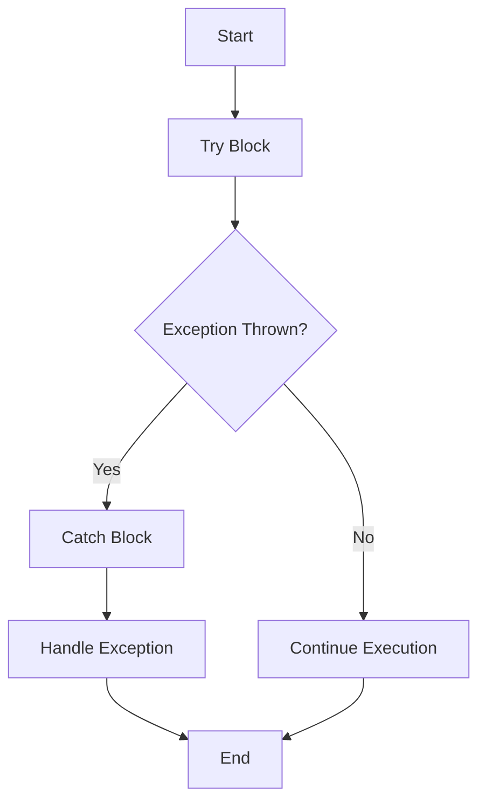

## 15.6 Exception Safety

Exception safety is a crucial aspect of C++ programming that ensures your code behaves predictably and securely in the presence of exceptions. In this section, we will explore the principles of exception safety, how to handle exceptions securely, avoid information leaks, and use try-catch blocks effectively. By mastering these techniques, you will be able to write robust and secure C++ applications.

### Introduction to Exception Safety

Exception safety refers to the guarantees provided by a piece of code when exceptions occur. It is essential for writing reliable software, as it ensures that resources are properly managed and that the program remains in a valid state even when unexpected events occur.

#### Levels of Exception Safety

There are three primary levels of exception safety guarantees:

1. **Basic Guarantee**: Ensures that if an exception is thrown, the program remains in a valid state, and no resources are leaked. However, the state of the program may be altered.

2. **Strong Guarantee**: Ensures that if an exception is thrown, the program state is unchanged. This is often achieved through techniques like copy-and-swap idiom.

3. **No-Throw Guarantee**: Ensures that a function will not throw exceptions. This is typically used for destructors and other critical operations.

### Handling Exceptions Securely

Handling exceptions securely involves writing code that not only manages resources correctly but also prevents information leaks and maintains the integrity of the program.

#### Avoiding Information Leaks

Information leaks can occur when sensitive data is exposed through exception messages or when exceptions cause the program to leave data in an inconsistent state. To avoid information leaks:

- **Sanitize Exception Messages**: Ensure that exception messages do not contain sensitive information. Use generic messages and log detailed information securely.

- **Maintain Consistency**: Ensure that data structures remain consistent even when exceptions occur. This may involve using transactions or rollback mechanisms.

- **Secure Resource Management**: Use RAII (Resource Acquisition Is Initialization) to manage resources such as memory, file handles, and network connections. This ensures that resources are released properly even when exceptions occur.

#### Correct Use of Try-Catch Blocks

Try-catch blocks are used to handle exceptions and ensure that the program can recover from errors. Here are some best practices for using try-catch blocks:

- **Catch Specific Exceptions**: Catch specific exceptions rather than using a generic catch-all block. This allows you to handle different types of errors appropriately.

- **Minimize Scope**: Keep the scope of try-catch blocks as small as possible to limit the impact of exceptions and make the code easier to understand.

- **Avoid Catching All Exceptions**: Avoid using catch-all blocks (`catch(...)`) unless absolutely necessary. They can hide programming errors and make debugging difficult.

- **Re-throw Exceptions**: If you cannot handle an exception, consider re-throwing it to allow higher-level code to handle it.

### Code Examples

Let's explore some code examples to illustrate these concepts.

#### Basic Exception Handling

```cpp
#include <iostream>
#include <stdexcept>

void processFile(const std::string& filename) {
    try {
        // Open the file
        std::ifstream file(filename);
        if (!file.is_open()) {
            throw std::runtime_error("Failed to open file");
        }

        // Process the file
        // ...

        // Close the file automatically when going out of scope
    } catch (const std::runtime_error& e) {
        std::cerr << "Error: " << e.what() << std::endl;
    }
}

int main() {
    processFile("example.txt");
    return 0;
}
```

In this example, we use a try-catch block to handle exceptions when opening a file. The `std::runtime_error` exception is caught, and an error message is printed.

#### RAII for Resource Management

```cpp
#include <iostream>
#include <memory>

class Resource {
public:
    Resource() { std::cout << "Resource acquired\n"; }
    ~Resource() { std::cout << "Resource released\n"; }
};

void useResource() {
    std::unique_ptr<Resource> res(new Resource());
    // Use the resource
    // ...
    // Resource is automatically released when going out of scope
}

int main() {
    try {
        useResource();
    } catch (const std::exception& e) {
        std::cerr << "Exception caught: " << e.what() << std::endl;
    }
    return 0;
}
```

In this example, we use a `std::unique_ptr` to manage a `Resource` object. The resource is automatically released when the `std::unique_ptr` goes out of scope, ensuring that no resource leaks occur even if an exception is thrown.

### Visualizing Exception Safety

To better understand the flow of exception handling, let's visualize the process using a flowchart.



**Figure 1**: Exception Handling Flowchart. This diagram illustrates the flow of control when an exception is thrown and caught.

### Best Practices for Exception Safety

Here are some best practices to ensure exception safety in your C++ code:

- **Use RAII**: Always use RAII to manage resources. This ensures that resources are automatically released when they go out of scope.

- **Prefer Stack Allocation**: Allocate objects on the stack whenever possible. Stack-allocated objects are automatically destroyed when they go out of scope, reducing the risk of resource leaks.

- **Write Exception-Safe Code**: Ensure that your code provides at least the basic exception safety guarantee. This means that resources are not leaked, and the program remains in a valid state.

- **Avoid Throwing Exceptions in Destructors**: Destructors should never throw exceptions. If an exception is thrown during stack unwinding, it can lead to program termination.

- **Use `noexcept`**: Use the `noexcept` specifier for functions that are not expected to throw exceptions. This can improve performance and provide stronger exception safety guarantees.

### Try It Yourself

Experiment with the code examples provided in this section. Try modifying the code to throw different types of exceptions and observe how the program behaves. Consider adding additional try-catch blocks to handle specific exceptions and see how it affects the program's flow.

### Knowledge Check

Let's test your understanding of exception safety with a few questions:

1. What is the primary purpose of exception safety in C++?
2. Describe the three levels of exception safety guarantees.
3. Why is it important to avoid information leaks when handling exceptions?
4. What is RAII, and how does it help with exception safety?
5. Why should destructors not throw exceptions?

### Conclusion

Exception safety is a critical aspect of writing robust and secure C++ applications. By understanding the principles of exception safety and following best practices, you can ensure that your code behaves predictably and securely in the presence of exceptions. Remember, this is just the beginning. As you progress, you'll build more complex and interactive applications. Keep experimenting, stay curious, and enjoy the journey!

## Quiz Time!



### What is the primary purpose of exception safety in C++?

- [x] To ensure that resources are properly managed and the program remains in a valid state when exceptions occur.
- [ ] To improve the performance of the program.
- [ ] To make the code easier to read.
- [ ] To ensure that exceptions are never thrown.

> **Explanation:** Exception safety ensures that resources are managed correctly and the program remains in a valid state even when exceptions occur.

### Which of the following is NOT a level of exception safety guarantee?

- [ ] Basic Guarantee
- [ ] Strong Guarantee
- [x] Weak Guarantee
- [ ] No-Throw Guarantee

> **Explanation:** The three levels of exception safety guarantees are Basic, Strong, and No-Throw. There is no "Weak Guarantee."

### Why is it important to avoid information leaks when handling exceptions?

- [x] To prevent sensitive data from being exposed.
- [ ] To improve the performance of the program.
- [ ] To make the code easier to read.
- [ ] To ensure that exceptions are never thrown.

> **Explanation:** Avoiding information leaks is important to prevent sensitive data from being exposed through exception messages or inconsistent states.

### What is RAII, and how does it help with exception safety?

- [x] RAII is a programming idiom that ensures resources are released when they go out of scope, helping to prevent resource leaks.
- [ ] RAII is a design pattern that improves code readability.
- [ ] RAII is a tool for debugging exceptions.
- [ ] RAII is a method for optimizing performance.

> **Explanation:** RAII (Resource Acquisition Is Initialization) is a programming idiom that ensures resources are automatically released when they go out of scope, preventing leaks.

### Why should destructors not throw exceptions?

- [x] Because throwing exceptions in destructors can lead to program termination during stack unwinding.
- [ ] Because destructors are not allowed to contain any code.
- [ ] Because exceptions in destructors improve performance.
- [ ] Because destructors are only called when the program exits.

> **Explanation:** Throwing exceptions in destructors can lead to program termination if another exception is already being handled during stack unwinding.

### What is the purpose of the `noexcept` specifier in C++?

- [x] To indicate that a function is not expected to throw exceptions.
- [ ] To improve the readability of the code.
- [ ] To ensure that exceptions are always caught.
- [ ] To prevent the use of try-catch blocks.

> **Explanation:** The `noexcept` specifier is used to indicate that a function is not expected to throw exceptions, which can improve performance and provide stronger exception safety guarantees.

### How can you ensure that resources are properly managed when exceptions occur?

- [x] By using RAII and smart pointers.
- [ ] By writing more try-catch blocks.
- [ ] By avoiding the use of exceptions altogether.
- [ ] By using global variables.

> **Explanation:** Using RAII and smart pointers ensures that resources are automatically released when they go out of scope, even if exceptions occur.

### What is the benefit of catching specific exceptions rather than using a catch-all block?

- [x] It allows you to handle different types of errors appropriately.
- [ ] It improves the performance of the program.
- [ ] It makes the code easier to read.
- [ ] It ensures that exceptions are never thrown.

> **Explanation:** Catching specific exceptions allows you to handle different types of errors appropriately, rather than using a generic catch-all block.

### What is the basic exception safety guarantee?

- [x] It ensures that if an exception is thrown, the program remains in a valid state, and no resources are leaked.
- [ ] It ensures that exceptions are never thrown.
- [ ] It ensures that the program state is unchanged.
- [ ] It ensures that the program terminates immediately.

> **Explanation:** The basic exception safety guarantee ensures that if an exception is thrown, the program remains in a valid state, and no resources are leaked.

### True or False: Destructors should always throw exceptions to indicate errors.

- [ ] True
- [x] False

> **Explanation:** Destructors should never throw exceptions because doing so can lead to program termination during stack unwinding.


