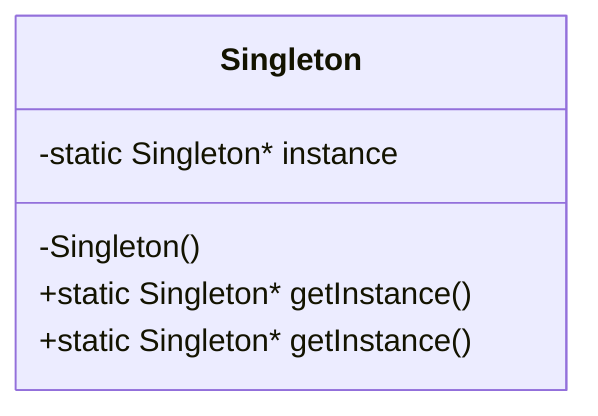
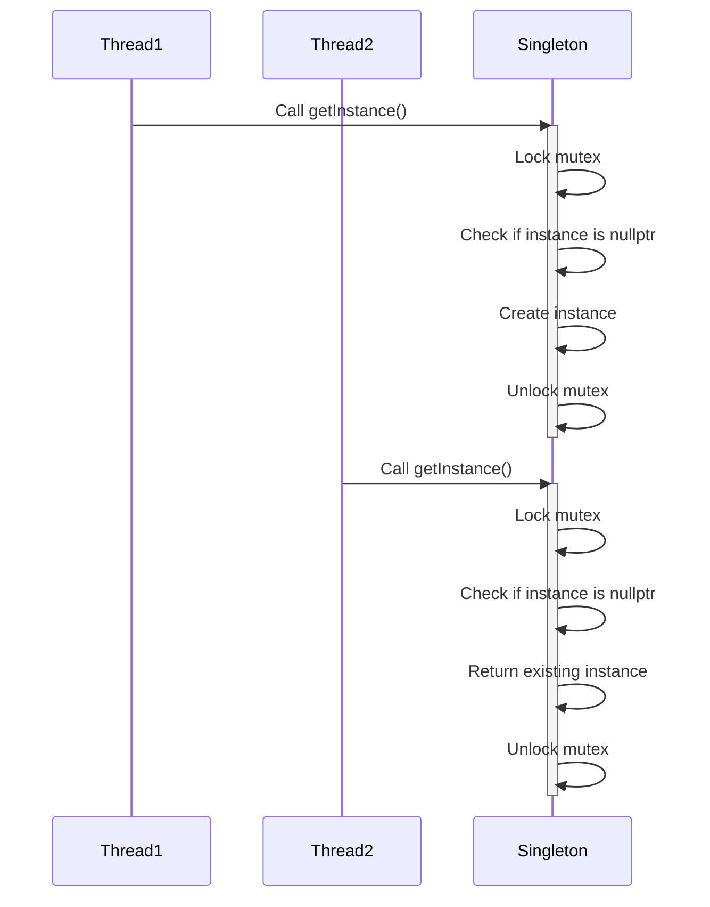

## 15.7 Secure Singleton Implementation

The Singleton pattern is a well-known design pattern in software engineering, particularly useful when you need to ensure that a class has only one instance and provide a global point of access to it. However, in modern C++ applications, implementing a Singleton pattern securely and efficiently requires careful consideration of thread safety, unauthorized access prevention, and secure initialization. In this section, we will delve into these aspects, providing you with a comprehensive understanding of how to implement a secure Singleton in C++.

### Design Pattern Name

**Singleton Pattern**

### Category

**Creational Pattern**

### Intent

The intent of the Singleton pattern is to ensure that a class has only one instance and to provide a global point of access to that instance. This is particularly useful in scenarios where a single object is needed to coordinate actions across the system, such as a configuration manager or a logging service.

### Diagrams

To better understand the Singleton pattern, let's visualize its structure using a class diagram.



**Diagram Description:** This class diagram illustrates the basic structure of a Singleton pattern. The `Singleton` class contains a private static pointer `instance` to hold the single instance of the class. The constructor is private to prevent direct instantiation, and the `getInstance()` method provides access to the instance.

### Key Participants

1. **Singleton Class**: The class that is designed to have only one instance.
2. **Instance**: The single instance of the Singleton class.
3. **Client**: Any class or function that accesses the Singleton instance.

### Applicability

Use the Singleton pattern when:
- There must be exactly one instance of a class, and it must be accessible to clients from a well-known access point.
- The sole instance should be extensible by subclassing, and clients should be able to use an extended instance without modifying their code.

### Sample Code Snippet

Let's start with a basic implementation of a Singleton pattern in C++:

```cpp
#include <iostream>
#include <mutex>

class Singleton {
private:
    static Singleton* instance;
    static std::mutex mutex;

    // Private constructor to prevent instantiation
    Singleton() {}

public:
    // Delete copy constructor and assignment operator
    Singleton(const Singleton&) = delete;
    Singleton& operator=(const Singleton&) = delete;

    // Static method to provide access to the instance
    static Singleton* getInstance() {
        std::lock_guard<std::mutex> lock(mutex);
        if (instance == nullptr) {
            instance = new Singleton();
        }
        return instance;
    }
};

// Initialize static members
Singleton* Singleton::instance = nullptr;
std::mutex Singleton::mutex;

int main() {
    Singleton* singleton = Singleton::getInstance();
    std::cout << "Singleton instance address: " << singleton << std::endl;
    return 0;
}
```

**Code Explanation:**
- **Private Constructor**: Prevents the direct creation of the Singleton object.
- **Static Instance**: Holds the single instance of the Singleton class.
- **Mutex**: Ensures thread safety when accessing the instance.
- **Deleted Copy Constructor and Assignment Operator**: Prevents copying or assigning the Singleton instance.

### Design Considerations

#### Ensuring Thread Safety

In a multithreaded environment, it's crucial to ensure that the Singleton instance is created only once. The use of a mutex in the `getInstance()` method ensures that only one thread can access the critical section at a time, preventing race conditions.

#### Preventing Unauthorized Access

By making the constructor private and deleting the copy constructor and assignment operator, we prevent unauthorized creation or duplication of the Singleton instance.

#### Secure Initialization

Secure initialization involves ensuring that the Singleton instance is fully constructed before any thread can access it. This can be achieved using a combination of mutex locks and careful design to avoid exposing the instance until it is ready.

### Differences and Similarities

The Singleton pattern is often confused with the Factory pattern. While both involve object creation, the Singleton pattern ensures a single instance, whereas the Factory pattern is concerned with creating multiple instances of objects.

### Advanced Secure Singleton Implementation

Let's explore a more advanced implementation of the Singleton pattern that leverages C++11 features for improved security and efficiency.

```cpp
#include <iostream>
#include <memory>

class SecureSingleton {
private:
    static std::unique_ptr<SecureSingleton> instance;
    static std::once_flag initFlag;

    SecureSingleton() {
        // Secure initialization logic
        std::cout << "SecureSingleton initialized." << std::endl;
    }

public:
    SecureSingleton(const SecureSingleton&) = delete;
    SecureSingleton& operator=(const SecureSingleton&) = delete;

    static SecureSingleton* getInstance() {
        std::call_once(initFlag, []() {
            instance.reset(new SecureSingleton());
        });
        return instance.get();
    }
};

// Initialize static members
std::unique_ptr<SecureSingleton> SecureSingleton::instance;
std::once_flag SecureSingleton::initFlag;

int main() {
    SecureSingleton* singleton = SecureSingleton::getInstance();
    std::cout << "SecureSingleton instance address: " << singleton << std::endl;
    return 0;
}
```

**Code Explanation:**
- **`std::unique_ptr`**: Manages the Singleton instance with automatic memory management.
- **`std::once_flag` and `std::call_once`**: Ensures that the initialization logic is executed only once, even in a multithreaded environment.

### Try It Yourself

Experiment with the code examples provided. Try modifying the Singleton class to include additional functionality or change the initialization logic. Observe how the use of `std::unique_ptr` and `std::call_once` simplifies memory management and ensures thread safety.

### Visualizing Thread Safety in Singleton

Let's visualize the thread safety mechanism using a sequence diagram.



**Diagram Description:** This sequence diagram illustrates how two threads interact with the Singleton class. Thread1 locks the mutex, checks if the instance is `nullptr`, creates the instance, and then unlocks the mutex. Thread2, upon calling `getInstance()`, locks the mutex, finds that the instance is already created, and returns it.

### References and Links

- [C++ Reference: std::unique_ptr](https://en.cppreference.com/w/cpp/memory/unique_ptr)
- [C++ Reference: std::call_once](https://en.cppreference.com/w/cpp/thread/call_once)
- [Design Patterns: Elements of Reusable Object-Oriented Software](https://en.wikipedia.org/wiki/Design_Patterns)

### Knowledge Check

- What is the primary purpose of the Singleton pattern?
- How does `std::call_once` contribute to thread safety in Singleton implementation?
- Why is it important to delete the copy constructor and assignment operator in a Singleton class?

### Embrace the Journey

Remember, mastering design patterns like Singleton is just the beginning. As you progress, you'll encounter more complex patterns and scenarios. Keep experimenting, stay curious, and enjoy the journey!

### Quiz Time!



### What is the primary purpose of the Singleton pattern?

- [x] To ensure that a class has only one instance and provide a global point of access to it.
- [ ] To create multiple instances of a class.
- [ ] To encapsulate object creation logic.
- [ ] To provide a unified interface to a set of interfaces.

> **Explanation:** The Singleton pattern ensures that a class has only one instance and provides a global point of access to it.

### Which C++ feature is used to ensure that a function is executed only once in a multithreaded environment?

- [ ] std::mutex
- [x] std::call_once
- [ ] std::lock_guard
- [ ] std::thread

> **Explanation:** `std::call_once` is used to ensure that a function is executed only once, even in a multithreaded environment.

### Why is it important to delete the copy constructor and assignment operator in a Singleton class?

- [x] To prevent copying or assigning the Singleton instance.
- [ ] To allow multiple instances of the Singleton.
- [ ] To enable thread safety.
- [ ] To improve performance.

> **Explanation:** Deleting the copy constructor and assignment operator prevents copying or assigning the Singleton instance, ensuring only one instance exists.

### What is the role of `std::unique_ptr` in the advanced Singleton implementation?

- [x] To manage the Singleton instance with automatic memory management.
- [ ] To ensure thread safety.
- [ ] To lock the instance during initialization.
- [ ] To provide a global point of access.

> **Explanation:** `std::unique_ptr` manages the Singleton instance with automatic memory management, ensuring proper resource cleanup.

### How does `std::mutex` contribute to thread safety in Singleton implementation?

- [x] By ensuring that only one thread can access the critical section at a time.
- [ ] By creating multiple instances of the Singleton.
- [ ] By deleting the copy constructor.
- [ ] By providing a global point of access.

> **Explanation:** `std::mutex` ensures that only one thread can access the critical section at a time, preventing race conditions.

### What is the benefit of using `std::once_flag` in Singleton implementation?

- [x] To ensure that initialization logic is executed only once.
- [ ] To allow multiple initializations.
- [ ] To improve performance.
- [ ] To provide a global point of access.

> **Explanation:** `std::once_flag` ensures that initialization logic is executed only once, even in a multithreaded environment.

### In the context of Singleton, what does "secure initialization" mean?

- [x] Ensuring the Singleton instance is fully constructed before any thread can access it.
- [ ] Allowing unauthorized access to the instance.
- [ ] Creating multiple instances.
- [ ] Deleting the copy constructor.

> **Explanation:** Secure initialization means ensuring the Singleton instance is fully constructed before any thread can access it.

### Which of the following is NOT a characteristic of a secure Singleton implementation?

- [ ] Thread safety
- [ ] Secure initialization
- [x] Multiple instances
- [ ] Preventing unauthorized access

> **Explanation:** A secure Singleton implementation should have thread safety, secure initialization, and prevent unauthorized access, but not allow multiple instances.

### What is the purpose of the `getInstance()` method in a Singleton class?

- [x] To provide access to the Singleton instance.
- [ ] To create multiple instances.
- [ ] To lock the instance.
- [ ] To delete the copy constructor.

> **Explanation:** The `getInstance()` method provides access to the Singleton instance, ensuring only one instance exists.

### True or False: The Singleton pattern is a structural design pattern.

- [ ] True
- [x] False

> **Explanation:** The Singleton pattern is a creational design pattern, not a structural one.


