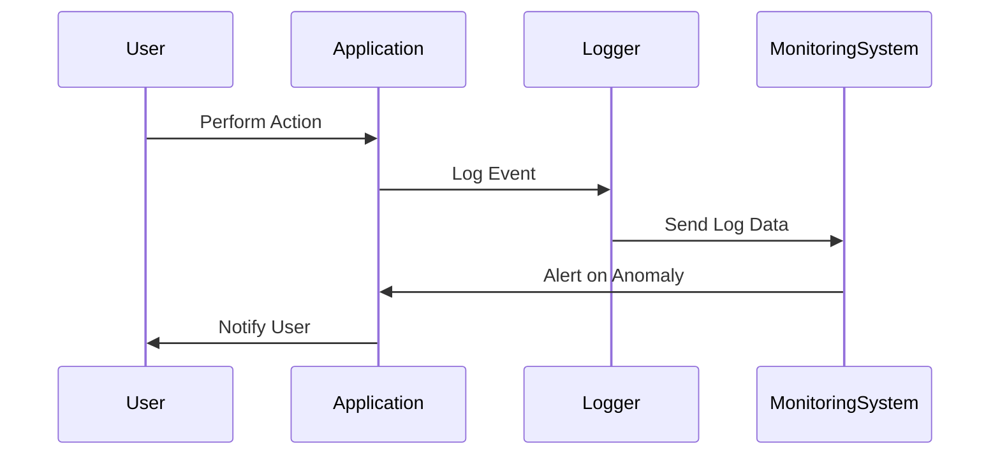

## 15.8 Audit Logging and Monitoring

In today's digital landscape, the importance of security cannot be overstated. As software engineers and architects, we must ensure that our applications are not only functional but also secure. One of the key components of a robust security strategy is audit logging and monitoring. This section will delve into the intricacies of audit logging and monitoring in C++ applications, providing you with the knowledge and tools to implement effective logging mechanisms.

### Introduction to Audit Logging and Monitoring

Audit logging and monitoring are critical components of a security framework. They involve the systematic recording and analysis of events within a software system to detect and respond to security incidents. By maintaining detailed logs, developers can trace the sequence of actions leading to an event, identify potential security breaches, and ensure compliance with regulatory requirements.

#### Key Concepts

- **Audit Logging**: The process of recording events and changes in a system. These logs provide a historical record of system activities and are essential for forensic analysis.
- **Monitoring**: The continuous observation of system activities to detect and respond to security events in real-time.
- **Log Integrity**: Ensuring that logs are accurate and have not been tampered with. This is crucial for maintaining trust in the logged data.

### Why Audit Logging and Monitoring Matter

Audit logging and monitoring serve several purposes:

1. **Security**: Detect unauthorized access and potential security breaches.
2. **Compliance**: Meet regulatory requirements such as GDPR, HIPAA, and PCI-DSS.
3. **Forensics**: Provide a trail of evidence for investigating security incidents.
4. **Performance Monitoring**: Identify performance bottlenecks and optimize system operations.

### Implementing Audit Logging in C++

Let's explore how to implement audit logging in C++ applications. We'll cover the basics of logging, explore different logging frameworks, and discuss best practices for maintaining log integrity.

#### Choosing a Logging Framework

C++ offers several logging frameworks, each with its own set of features. Some popular options include:

- **Boost.Log**: A flexible and powerful logging library that supports various logging backends and filters.
- **spdlog**: A fast, header-only logging library that is easy to integrate and use.
- **log4cpp**: A port of the popular log4j library for C++.

When choosing a logging framework, consider factors such as performance, ease of integration, and support for log rotation and filtering.

#### Basic Logging Example

Here's a simple example using the spdlog library:

```cpp
#include <spdlog/spdlog.h>
#include <spdlog/sinks/basic_file_sink.h>

int main() {
    // Create a basic file logger
    auto logger = spdlog::basic_logger_mt("basic_logger", "logs/audit.log");

    // Log messages with different severity levels
    logger->info("Application started");
    logger->warn("Low disk space");
    logger->error("Failed to open file");

    return 0;
}
```

In this example, we create a basic file logger that writes log messages to `logs/audit.log`. We log messages with different severity levels, such as `info`, `warn`, and `error`.

#### Ensuring Log Integrity

Log integrity is crucial for ensuring that logs can be trusted. Here are some strategies to maintain log integrity:

- **Digital Signatures**: Use cryptographic signatures to verify the authenticity of log entries.
- **Hashing**: Generate hashes for log files and store them securely to detect tampering.
- **Access Controls**: Restrict access to log files to prevent unauthorized modifications.

### Monitoring C++ Applications

Monitoring involves the real-time observation of system activities to detect anomalies and respond to incidents. Effective monitoring requires a combination of tools and techniques to ensure comprehensive coverage.

#### Setting Up Monitoring Tools

Several tools can be used to monitor C++ applications:

- **Prometheus**: A powerful monitoring and alerting toolkit that can be integrated with C++ applications using client libraries.
- **Grafana**: A visualization tool that can be used in conjunction with Prometheus to create dashboards and alerts.
- **Nagios**: A widely-used monitoring system that provides alerts and reports on system performance.

#### Real-Time Monitoring Example

Here's an example of setting up a basic monitoring system using Prometheus and Grafana:

1. **Install Prometheus**: Follow the [Prometheus installation guide](https://prometheus.io/docs/prometheus/latest/installation/) to set up Prometheus on your system.

2. **Install Grafana**: Follow the [Grafana installation guide](https://grafana.com/docs/grafana/latest/installation/) to set up Grafana.

3. **Configure Prometheus**: Add your C++ application as a target in the Prometheus configuration file.

4. **Create Grafana Dashboards**: Use Grafana to create dashboards that visualize the metrics collected by Prometheus.

#### Monitoring Code Example

To integrate Prometheus with a C++ application, you can use the `prometheus-cpp` library:

```cpp
#include <prometheus/exposer.h>
#include <prometheus/registry.h>
#include <prometheus/counter.h>

int main() {
    // Create an exposer to expose metrics
    prometheus::Exposer exposer{"127.0.0.1:8080"};

    // Create a registry to hold metrics
    auto registry = std::make_shared<prometheus::Registry>();

    // Create a counter metric
    auto& counter_family = prometheus::BuildCounter()
                               .Name("requests_total")
                               .Help("Total number of requests")
                               .Register(*registry);

    auto& counter = counter_family.Add({{"method", "GET"}});

    // Increment the counter
    counter.Increment();

    // Expose the metrics
    exposer.RegisterCollectable(registry);

    // Run the application
    while (true) {
        // Simulate application logic
    }

    return 0;
}
```

In this example, we create a simple Prometheus exposer that exposes a counter metric. The counter tracks the total number of requests processed by the application.

### Best Practices for Audit Logging and Monitoring

To ensure effective audit logging and monitoring, follow these best practices:

1. **Define Clear Objectives**: Determine what you want to achieve with logging and monitoring. This could include detecting security breaches, ensuring compliance, or optimizing performance.

2. **Log Strategically**: Avoid logging sensitive information such as passwords or personal data. Focus on logging events that are relevant to your objectives.

3. **Implement Log Rotation**: Use log rotation to manage log file sizes and prevent disk space issues. Most logging frameworks support log rotation out of the box.

4. **Use Structured Logging**: Structured logs are easier to parse and analyze. Consider using JSON or XML formats for your logs.

5. **Set Up Alerts**: Configure alerts to notify you of critical events or anomalies. This can help you respond to incidents in a timely manner.

6. **Regularly Review Logs**: Periodically review logs to identify patterns or trends that may indicate security issues.

### Visualizing Audit Logging and Monitoring

To better understand the flow of audit logging and monitoring, let's visualize the process using a sequence diagram.



In this diagram, we see the interaction between the user, application, logger, and monitoring system. The user performs an action, which is logged by the application. The logger sends the log data to the monitoring system, which analyzes it for anomalies. If an anomaly is detected, the monitoring system alerts the application, which notifies the user.

### Try It Yourself

To deepen your understanding of audit logging and monitoring, try modifying the code examples provided:

1. **Enhance the Logging Example**: Add additional log levels (e.g., `debug`, `trace`) and experiment with different log formats.

2. **Extend the Monitoring Example**: Add more metrics to the Prometheus example, such as response times or error rates.

3. **Implement Log Integrity Checks**: Use digital signatures or hashing to verify the integrity of your logs.

### References and Further Reading

- [Prometheus Documentation](https://prometheus.io/docs/introduction/overview/)
- [Grafana Documentation](https://grafana.com/docs/grafana/latest/)
- [spdlog GitHub Repository](https://github.com/gabime/spdlog)
- [Boost.Log Documentation](https://www.boost.org/doc/libs/release/libs/log/doc/html/index.html)

### Knowledge Check

Before we conclude, let's reinforce what we've learned with a few questions:

- What are the key components of an audit logging system?
- How can you ensure the integrity of your logs?
- What tools can be used to monitor C++ applications?

### Conclusion

Audit logging and monitoring are essential practices for maintaining the security and integrity of C++ applications. By implementing effective logging mechanisms and monitoring tools, you can detect and respond to security incidents, ensure compliance, and optimize system performance. Remember, this is just the beginning. As you progress, continue to refine your logging and monitoring strategies to stay ahead of emerging threats.

## Quiz Time!



### What is the primary purpose of audit logging?

- [x] To record events and changes in a system
- [ ] To execute system commands
- [ ] To compile code
- [ ] To encrypt data

> **Explanation:** Audit logging is primarily used to record events and changes in a system for security and forensic analysis.

### Which of the following is a popular C++ logging framework?

- [x] spdlog
- [ ] React
- [ ] Django
- [ ] Flask

> **Explanation:** spdlog is a popular C++ logging framework known for its speed and ease of use.

### How can log integrity be ensured?

- [x] Using digital signatures
- [ ] Deleting old logs
- [ ] Compressing log files
- [ ] Disabling logging

> **Explanation:** Digital signatures can be used to verify the authenticity of log entries and ensure log integrity.

### What is the role of monitoring in a software system?

- [x] To detect and respond to security events in real-time
- [ ] To compile code
- [ ] To store data
- [ ] To encrypt files

> **Explanation:** Monitoring involves the real-time observation of system activities to detect and respond to security events.

### Which tool is used for visualizing metrics collected by Prometheus?

- [x] Grafana
- [ ] Visual Studio
- [ ] Eclipse
- [ ] IntelliJ

> **Explanation:** Grafana is a visualization tool used to create dashboards and alerts for metrics collected by Prometheus.

### What is the benefit of structured logging?

- [x] Easier to parse and analyze
- [ ] Increases log file size
- [ ] Requires more memory
- [ ] Slows down the system

> **Explanation:** Structured logging formats like JSON or XML make logs easier to parse and analyze.

### What should be avoided when logging?

- [x] Logging sensitive information
- [ ] Logging error messages
- [ ] Logging warnings
- [ ] Logging informational messages

> **Explanation:** Sensitive information such as passwords or personal data should not be logged to protect user privacy.

### What is a common feature of logging frameworks?

- [x] Log rotation
- [ ] Code compilation
- [ ] Data encryption
- [ ] File compression

> **Explanation:** Log rotation is a common feature in logging frameworks to manage log file sizes and prevent disk space issues.

### True or False: Monitoring can help identify performance bottlenecks.

- [x] True
- [ ] False

> **Explanation:** Monitoring can help identify performance bottlenecks by observing system activities and metrics.

### Which of the following is a best practice for audit logging and monitoring?

- [x] Regularly review logs
- [ ] Disable logging
- [ ] Ignore alerts
- [ ] Log all user passwords

> **Explanation:** Regularly reviewing logs helps identify patterns or trends that may indicate security issues.


