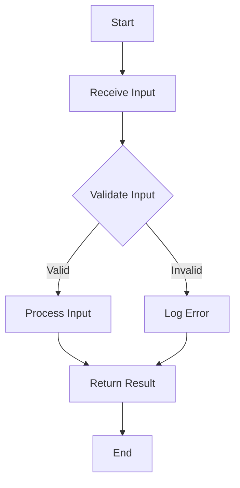

## 15.9 Defensive Programming Techniques

In the realm of software development, defensive programming is a critical practice that aims to improve the robustness and reliability of code. By anticipating potential errors and implementing strategies to prevent them, developers can create software that is more resilient to unexpected inputs and conditions. In this section, we will delve into the key aspects of defensive programming in C++, focusing on input validation, error handling, and fuzz testing for security vulnerabilities.

### Introduction to Defensive Programming

Defensive programming is a proactive approach to software development that involves writing code in a way that anticipates potential errors and mitigates their impact. The primary goal is to ensure that software behaves predictably and safely, even in the face of unexpected or erroneous inputs. This approach is particularly important in C++ due to its complexity and the potential for subtle bugs that can lead to security vulnerabilities or system crashes.

#### Key Principles of Defensive Programming

1. **Anticipate Errors**: Assume that errors will occur and design your code to handle them gracefully.
2. **Validate Inputs**: Always check the validity of inputs before processing them.
3. **Fail Safely**: Ensure that your program fails in a controlled manner, minimizing the impact on users and systems.
4. **Use Assertions**: Employ assertions to catch programming errors during development.
5. **Document Assumptions**: Clearly document any assumptions made in your code to aid future maintenance and debugging.

### Input Validation

Input validation is a fundamental aspect of defensive programming. It involves checking that inputs to a program are within expected bounds and formats before they are processed. This step is crucial for preventing a wide range of errors and security vulnerabilities, such as buffer overflows and injection attacks.

#### Techniques for Input Validation

1. **Range Checking**: Ensure that numerical inputs fall within acceptable ranges. For example, if a function expects a percentage value, verify that the input is between 0 and 100.

   ```cpp
   void setPercentage(int value) {
       if (value < 0 || value > 100) {
           throw std::out_of_range("Percentage must be between 0 and 100.");
       }
       // Proceed with setting the percentage
   }
   ```

2. **Type Checking**: Verify that inputs are of the expected type. This is particularly important when dealing with user inputs or data from external sources.

3. **Format Validation**: Check that inputs conform to expected formats, such as email addresses or phone numbers. Regular expressions can be useful for this purpose.

   ```cpp
   #include <regex>
   #include <string>

   bool isValidEmail(const std::string& email) {
       const std::regex pattern(R"((\w+)(\.{0,1})(\w*)@(\w+)\.(\w+))");
       return std::regex_match(email, pattern);
   }
   ```

4. **Boundary Conditions**: Test inputs at the boundaries of acceptable ranges to ensure that edge cases are handled correctly.

5. **Sanitization**: Cleanse inputs to remove or escape potentially harmful characters, especially when dealing with file paths or SQL queries.

#### Common Pitfalls in Input Validation

- **Over-reliance on Client-side Validation**: Always perform validation on the server side, as client-side validation can be bypassed.
- **Assuming Validity**: Never assume that inputs are valid. Always validate, even if the source is trusted.
- **Inadequate Error Messages**: Provide clear and informative error messages to guide users in correcting their inputs.

### Error Handling

Effective error handling is a cornerstone of defensive programming. It involves detecting, reporting, and recovering from errors in a way that maintains the stability and usability of the software.

#### Strategies for Error Handling

1. **Use Exceptions**: C++ provides a robust exception handling mechanism that allows you to separate error handling code from regular code flow. Use exceptions to handle errors that cannot be resolved locally.

   ```cpp
   try {
       // Code that might throw an exception
   } catch (const std::exception& e) {
       std::cerr << "Error: " << e.what() << std::endl;
       // Handle error
   }
   ```

2. **Return Error Codes**: For functions that are frequently called or where exceptions might be too costly, consider returning error codes.

   ```cpp
   enum class ErrorCode {
       SUCCESS,
       INVALID_INPUT,
       OUT_OF_MEMORY,
       // Other error codes
   };

   ErrorCode performOperation() {
       // Perform operation
       if (/* error condition */) {
           return ErrorCode::INVALID_INPUT;
       }
       return ErrorCode::SUCCESS;
   }
   ```

3. **Resource Management**: Use RAII (Resource Acquisition Is Initialization) to manage resources and ensure that they are properly released in the event of an error.

   ```cpp
   class Resource {
   public:
       Resource() { /* Acquire resource */ }
       ~Resource() { /* Release resource */ }
   };
   ```

4. **Logging**: Implement logging to record errors and their context. This can be invaluable for debugging and monitoring.

5. **Graceful Degradation**: Design your software to degrade gracefully in the event of an error, providing limited functionality rather than complete failure.

#### Best Practices for Error Handling

- **Catch Specific Exceptions**: Avoid catching generic exceptions unless absolutely necessary. Catch specific exceptions to handle different error types appropriately.
- **Avoid Silent Failures**: Ensure that errors are reported and logged, even if they are not immediately visible to the user.
- **Test Error Handling Code**: Regularly test your error handling code to ensure that it behaves as expected.

### Fuzz Testing for Security Vulnerabilities

Fuzz testing, or fuzzing, is a technique used to discover security vulnerabilities and bugs by providing random or unexpected inputs to a program. This approach can reveal edge cases and vulnerabilities that might not be apparent through regular testing.

#### Implementing Fuzz Testing

1. **Identify Target Functions**: Focus on functions that handle external inputs, such as file parsers or network protocols.

2. **Generate Random Inputs**: Use tools or write scripts to generate random inputs that cover a wide range of scenarios.

3. **Monitor for Crashes**: Run the program with the generated inputs and monitor for crashes, memory leaks, or unexpected behavior.

4. **Analyze Results**: Investigate any anomalies to identify potential vulnerabilities or bugs.

#### Tools for Fuzz Testing

- **AFL (American Fuzzy Lop)**: A popular open-source fuzzer that uses genetic algorithms to generate inputs.
- **libFuzzer**: A library for in-process, coverage-guided fuzzing.
- **OSS-Fuzz**: A service by Google that provides continuous fuzzing for open-source projects.

#### Benefits of Fuzz Testing

- **Uncover Hidden Bugs**: Fuzz testing can reveal bugs that are difficult to detect through traditional testing methods.
- **Improve Security**: By identifying vulnerabilities, fuzz testing helps improve the security and robustness of software.
- **Automated Testing**: Fuzz testing can be automated, allowing for continuous testing and integration into CI/CD pipelines.

### Defensive Programming in Practice

To illustrate the application of defensive programming techniques, let's consider a practical example: a simple file parser that reads and processes data from a file.

#### Example: Defensive File Parser

```cpp
#include <iostream>
#include <fstream>
#include <string>
#include <stdexcept>

class FileParser {
public:
    explicit FileParser(const std::string& filePath) {
        file.open(filePath);
        if (!file.is_open()) {
            throw std::runtime_error("Failed to open file: " + filePath);
        }
    }

    ~FileParser() {
        if (file.is_open()) {
            file.close();
        }
    }

    void parse() {
        std::string line;
        while (std::getline(file, line)) {
            if (!isValidLine(line)) {
                std::cerr << "Invalid line format: " << line << std::endl;
                continue;
            }
            processLine(line);
        }
    }

private:
    std::ifstream file;

    bool isValidLine(const std::string& line) {
        // Validate line format (e.g., check for specific structure)
        return !line.empty(); // Simple check for demonstration
    }

    void processLine(const std::string& line) {
        // Process the line (e.g., parse data)
        std::cout << "Processing line: " << line << std::endl;
    }
};

int main() {
    try {
        FileParser parser("data.txt");
        parser.parse();
    } catch (const std::exception& e) {
        std::cerr << "Error: " << e.what() << std::endl;
    }
    return 0;
}
```

#### Key Points in the Example

- **Input Validation**: The `isValidLine` function checks the format of each line before processing it.
- **Error Handling**: The constructor throws an exception if the file cannot be opened, and the main function catches and reports this error.
- **Resource Management**: The file is automatically closed when the `FileParser` object is destroyed, thanks to RAII.

### Try It Yourself

To gain hands-on experience with defensive programming, try modifying the file parser example:

1. **Enhance Input Validation**: Implement more complex validation logic in the `isValidLine` function.
2. **Add Logging**: Integrate a logging mechanism to record errors and processing steps.
3. **Implement Fuzz Testing**: Write a script to generate random input files and test the parser's robustness.

### Visualizing Defensive Programming

To better understand the flow of defensive programming techniques, let's visualize the process using a flowchart.



**Figure 1: Flowchart of Defensive Programming Process**

### References and Further Reading

- [C++ Core Guidelines](https://isocpp.github.io/CppCoreGuidelines/CppCoreGuidelines) - A set of guidelines for writing modern C++ code.
- [OWASP Secure Coding Practices](https://owasp.org/www-project-secure-coding-practices-quick-reference-guide/) - A quick reference guide for secure coding practices.
- [American Fuzzy Lop (AFL)](http://lcamtuf.coredump.cx/afl/) - A powerful fuzzer for discovering bugs and vulnerabilities.

### Knowledge Check

Before we conclude, let's reinforce your understanding of defensive programming techniques with a few questions:

1. What is the primary goal of defensive programming?
2. Why is input validation important in C++?
3. How can exceptions be used effectively for error handling?
4. What are the benefits of fuzz testing?
5. How does RAII contribute to resource management?

### Embrace the Journey

Remember, mastering defensive programming is a journey. As you continue to develop your skills, you'll build more robust and secure applications. Keep experimenting, stay curious, and enjoy the process of learning and improving your craft.

## Quiz Time!



### What is the primary goal of defensive programming?

- [x] To improve the robustness and reliability of code
- [ ] To make code run faster
- [ ] To reduce the size of the codebase
- [ ] To eliminate all bugs

> **Explanation:** The primary goal of defensive programming is to improve the robustness and reliability of code by anticipating potential errors and implementing strategies to prevent them.

### Why is input validation important in C++?

- [x] To prevent errors and security vulnerabilities
- [ ] To make the code more readable
- [ ] To reduce memory usage
- [ ] To improve execution speed

> **Explanation:** Input validation is important in C++ to prevent errors and security vulnerabilities by ensuring that inputs are within expected bounds and formats before processing.

### How can exceptions be used effectively for error handling?

- [x] By separating error handling code from regular code flow
- [ ] By ignoring errors
- [ ] By logging errors only
- [ ] By using them in place of all conditional statements

> **Explanation:** Exceptions can be used effectively for error handling by separating error handling code from regular code flow, allowing for more organized and maintainable code.

### What are the benefits of fuzz testing?

- [x] Uncover hidden bugs and improve security
- [ ] Reduce code complexity
- [ ] Increase code readability
- [ ] Decrease execution time

> **Explanation:** Fuzz testing helps uncover hidden bugs and improve security by providing random or unexpected inputs to a program, revealing edge cases and vulnerabilities.

### How does RAII contribute to resource management?

- [x] By ensuring resources are properly released in the event of an error
- [ ] By increasing memory usage
- [ ] By making code run faster
- [ ] By reducing code readability

> **Explanation:** RAII (Resource Acquisition Is Initialization) contributes to resource management by ensuring that resources are properly released in the event of an error, preventing resource leaks.

### What is a common pitfall in input validation?

- [x] Over-reliance on client-side validation
- [ ] Using regular expressions
- [ ] Checking for null values
- [ ] Logging errors

> **Explanation:** A common pitfall in input validation is over-reliance on client-side validation, as it can be bypassed. Server-side validation is essential.

### What is the role of assertions in defensive programming?

- [x] To catch programming errors during development
- [ ] To improve code performance
- [ ] To reduce code size
- [ ] To handle runtime errors

> **Explanation:** Assertions are used in defensive programming to catch programming errors during development, helping to identify and fix issues early.

### What is the purpose of logging in error handling?

- [x] To record errors and their context for debugging and monitoring
- [ ] To increase code execution speed
- [ ] To reduce memory usage
- [ ] To eliminate all errors

> **Explanation:** Logging in error handling is used to record errors and their context, which is invaluable for debugging and monitoring.

### How can fuzz testing be automated?

- [x] By integrating it into CI/CD pipelines
- [ ] By manually generating inputs
- [ ] By writing more complex code
- [ ] By reducing code size

> **Explanation:** Fuzz testing can be automated by integrating it into CI/CD pipelines, allowing for continuous testing and early detection of vulnerabilities.

### True or False: Defensive programming eliminates all bugs.

- [ ] True
- [x] False

> **Explanation:** Defensive programming does not eliminate all bugs but aims to improve the robustness and reliability of code by anticipating and mitigating potential errors.


