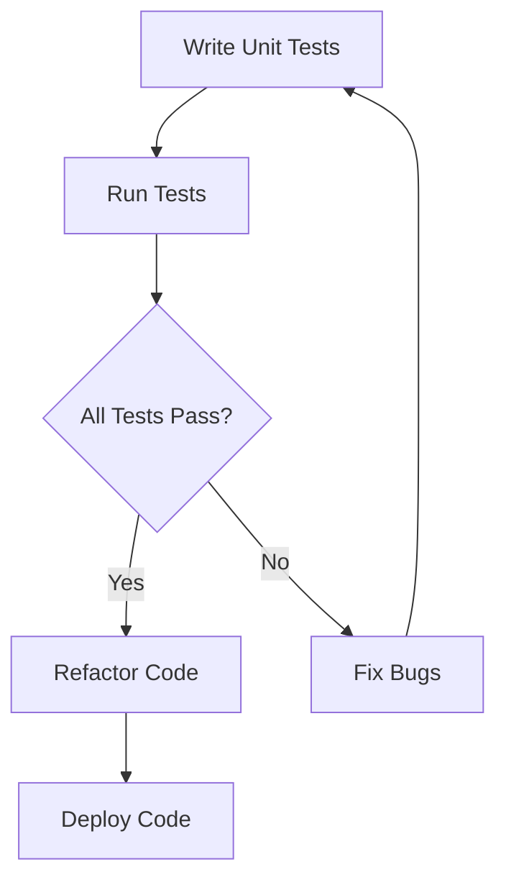

## 16.1 Unit Testing in C++

Unit testing is a critical component of software development that ensures individual parts of a program work as expected. In C++, unit testing helps maintain code quality, facilitates refactoring, and provides a safety net for developers. This section delves into the nuances of unit testing in C++, focusing on popular frameworks such as Google Test, Catch2, and Boost.Test. We will explore how to write effective unit tests, best practices, and the benefits of incorporating unit testing into your development workflow.

### Introduction to Unit Testing

Unit testing involves testing the smallest parts of an application, known as units, in isolation. These units are typically functions or methods. The goal is to validate that each unit performs as intended. Unit tests are automated and run frequently to catch errors early in the development cycle.

#### Benefits of Unit Testing

- **Early Bug Detection**: Catching bugs early reduces the cost and effort required to fix them.
- **Code Refactoring**: Unit tests provide a safety net, allowing developers to refactor code with confidence.
- **Documentation**: Tests serve as a form of documentation, illustrating how the code is supposed to work.
- **Improved Design**: Writing tests encourages better design practices, such as modularity and separation of concerns.

### Key Concepts in Unit Testing

Before diving into specific frameworks, let's cover some fundamental concepts in unit testing.

#### Test Cases and Test Suites

- **Test Case**: A single unit of testing that checks a specific behavior or functionality.
- **Test Suite**: A collection of test cases that are executed together.

#### Assertions

Assertions are used to verify that a condition holds true. If an assertion fails, the test case fails. Common assertions include:

- **Equality**: `ASSERT_EQ(expected, actual)`
- **Truth**: `ASSERT_TRUE(condition)`
- **Falsehood**: `ASSERT_FALSE(condition)`

#### Test Fixtures

Test fixtures provide a baseline environment for tests, allowing for setup and teardown operations. They ensure that each test runs in a consistent state.

### Popular C++ Unit Testing Frameworks

Several frameworks are available for unit testing in C++. We will focus on three widely used ones: Google Test, Catch2, and Boost.Test.

#### Google Test

Google Test, also known as GTest, is a robust framework developed by Google. It offers a rich set of features, including parameterized tests, death tests, and more.

##### Getting Started with Google Test

To use Google Test, you need to install it and link it to your project. Here's a simple example to illustrate its usage:

```cpp
#include <gtest/gtest.h>

// Function to be tested
int add(int a, int b) {
    return a + b;
}

// Test case
TEST(AdditionTest, PositiveNumbers) {
    ASSERT_EQ(add(1, 2), 3);
}

int main(int argc, char **argv) {
    ::testing::InitGoogleTest(&argc, argv);
    return RUN_ALL_TESTS();
}
```

In this example, we define a test case `AdditionTest` that checks if the `add` function returns the correct sum for positive numbers.

##### Key Features of Google Test

- **Parameterized Tests**: Run the same test logic with different inputs.
- **Death Tests**: Verify that code terminates as expected.
- **Mocking Support**: Use Google Mock to create mock objects.

#### Catch2

Catch2 is a modern, header-only testing framework that emphasizes simplicity and ease of use. It is known for its expressive syntax and minimal boilerplate.

##### Getting Started with Catch2

Catch2 is easy to integrate into your project. Here's an example:

```cpp
#define CATCH_CONFIG_MAIN
#include <catch2/catch.hpp>

// Function to be tested
int multiply(int a, int b) {
    return a * b;
}

// Test case
TEST_CASE("Multiplication of two numbers", "[multiply]") {
    REQUIRE(multiply(2, 3) == 6);
    REQUIRE(multiply(-1, 5) == -5);
}
```

In this example, we define a test case using `TEST_CASE` and use `REQUIRE` to assert conditions.

##### Key Features of Catch2

- **BDD Style**: Supports Behavior-Driven Development style tests.
- **Sectioning**: Divide tests into sections for better organization.
- **Minimal Configuration**: No need for a separate main function.

#### Boost.Test

Boost.Test is part of the Boost C++ Libraries and provides a comprehensive set of tools for unit testing.

##### Getting Started with Boost.Test

Boost.Test requires linking with the Boost libraries. Here's a basic example:

```cpp
#define BOOST_TEST_MODULE MyTest
#include <boost/test/included/unit_test.hpp>

// Function to be tested
int subtract(int a, int b) {
    return a - b;
}

// Test case
BOOST_AUTO_TEST_CASE(SubtractionTest) {
    BOOST_CHECK(subtract(5, 3) == 2);
    BOOST_CHECK(subtract(0, 0) == 0);
}
```

In this example, we use `BOOST_CHECK` to perform assertions within a test case.

##### Key Features of Boost.Test

- **Rich Assertions**: A wide variety of assertion macros.
- **Test Suites**: Organize tests into suites for better management.
- **Fixtures and Global Setup**: Support for test fixtures and global setup/teardown.

### Writing Effective Unit Tests

Writing effective unit tests is crucial for maximizing their benefits. Here are some best practices:

#### Keep Tests Independent

Each test should be independent of others. Avoid sharing state between tests to prevent side effects.

#### Test One Thing at a Time

Focus on testing a single behavior or functionality per test case. This makes tests easier to understand and maintain.

#### Use Descriptive Names

Name your test cases and test suites descriptively to convey their purpose. This aids in understanding and debugging.

#### Mock External Dependencies

Use mocking frameworks to simulate external dependencies, such as databases or network services. This isolates the unit under test and speeds up execution.

### Advanced Testing Techniques

As you become more comfortable with unit testing, consider exploring advanced techniques to enhance your testing strategy.

#### Parameterized Tests

Parameterized tests allow you to run the same test logic with different inputs. This is useful for testing functions with multiple scenarios.

##### Example with Google Test

```cpp
class AdditionTest : public ::testing::TestWithParam<std::tuple<int, int, int>> {};

TEST_P(AdditionTest, HandlesMultipleInputs) {
    int a, b, expected;
    std::tie(a, b, expected) = GetParam();
    ASSERT_EQ(add(a, b), expected);
}

INSTANTIATE_TEST_SUITE_P(Default, AdditionTest, ::testing::Values(
    std::make_tuple(1, 2, 3),
    std::make_tuple(-1, -1, -2),
    std::make_tuple(0, 0, 0)
));
```

In this example, `INSTANTIATE_TEST_SUITE_P` is used to provide different input values for the test.

#### Mocking with Google Mock

Google Mock is a powerful library for creating mock objects. It integrates seamlessly with Google Test.

##### Example of Mocking

```cpp
#include <gmock/gmock.h>

class Database {
public:
    virtual bool connect() = 0;
    virtual ~Database() = default;
};

class MockDatabase : public Database {
public:
    MOCK_METHOD(bool, connect, (), (override));
};

TEST(DatabaseTest, ConnectsSuccessfully) {
    MockDatabase mockDb;
    EXPECT_CALL(mockDb, connect()).WillOnce(::testing::Return(true));

    ASSERT_TRUE(mockDb.connect());
}
```

In this example, we create a mock class `MockDatabase` and define expectations using `EXPECT_CALL`.

### Visualizing Unit Testing Workflow

To better understand the workflow of unit testing, let's visualize the process:



**Figure 1**: Unit testing workflow. Write tests, run them, fix any bugs, refactor code, and deploy.

### Try It Yourself

Experiment with the code examples provided. Try modifying the test cases to cover additional scenarios or edge cases. For instance, in the `AdditionTest`, add more tuples with different numbers to test the `add` function further.

### References and Further Reading

- [Google Test Documentation](https://github.com/google/googletest)
- [Catch2 Documentation](https://github.com/catchorg/Catch2)
- [Boost.Test Documentation](https://www.boost.org/doc/libs/release/libs/test/)

### Knowledge Check

- What are the benefits of unit testing?
- How do assertions work in unit tests?
- What is the purpose of test fixtures?

### Embrace the Journey

Remember, mastering unit testing is a journey. As you progress, you'll build more robust and reliable C++ applications. Keep experimenting, stay curious, and enjoy the process!

## Quiz Time!



### What is the primary goal of unit testing?

- [x] To validate that each unit of the program performs as intended
- [ ] To test the entire application as a whole
- [ ] To replace integration testing
- [ ] To eliminate the need for manual testing

> **Explanation:** Unit testing focuses on verifying the functionality of individual units of code.

### Which C++ unit testing framework is known for its expressive syntax and minimal boilerplate?

- [ ] Google Test
- [x] Catch2
- [ ] Boost.Test
- [ ] CppUnit

> **Explanation:** Catch2 is known for its expressive syntax and minimal configuration requirements.

### What is a test fixture?

- [x] A baseline environment for tests, allowing for setup and teardown operations
- [ ] A collection of test cases
- [ ] A tool for mocking external dependencies
- [ ] A type of assertion

> **Explanation:** Test fixtures provide a consistent environment for tests to run.

### Which assertion would you use to check if two values are equal in Google Test?

- [ ] ASSERT_TRUE
- [x] ASSERT_EQ
- [ ] ASSERT_FALSE
- [ ] ASSERT_NE

> **Explanation:** ASSERT_EQ checks if two values are equal in Google Test.

### What is the purpose of mocking in unit tests?

- [x] To simulate external dependencies
- [ ] To increase test execution time
- [ ] To replace assertions
- [ ] To create test fixtures

> **Explanation:** Mocking is used to simulate external dependencies and isolate the unit under test.

### Which framework provides support for parameterized tests?

- [x] Google Test
- [ ] Catch2
- [ ] Boost.Test
- [ ] All of the above

> **Explanation:** Google Test provides support for parameterized tests.

### What is the advantage of using descriptive names for test cases?

- [x] It aids in understanding and debugging
- [ ] It increases test execution speed
- [ ] It reduces the number of tests needed
- [ ] It eliminates the need for comments

> **Explanation:** Descriptive names make it easier to understand the purpose of tests and debug issues.

### In Google Test, what does the `EXPECT_CALL` macro do?

- [x] Sets expectations for mock object behavior
- [ ] Runs a test case
- [ ] Asserts that a condition is true
- [ ] Initializes the test environment

> **Explanation:** EXPECT_CALL is used to set expectations for mock object behavior in Google Test.

### True or False: Unit tests should be dependent on each other.

- [ ] True
- [x] False

> **Explanation:** Unit tests should be independent to avoid side effects and ensure reliability.

### Which of the following is NOT a benefit of unit testing?

- [ ] Early bug detection
- [ ] Improved code design
- [x] Increased code complexity
- [ ] Documentation of code behavior

> **Explanation:** Unit testing aims to reduce complexity by ensuring code correctness and maintainability.


