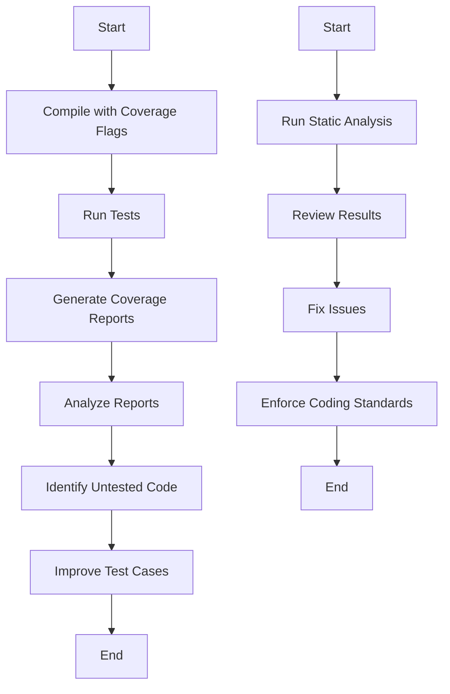

## 16.10 Code Coverage and Static Analysis

In the realm of software development, ensuring the quality and reliability of your code is paramount. This section delves into the essential practices of code coverage and static analysis in C++. These techniques are crucial for identifying potential issues, enforcing coding standards, and ensuring that your codebase is both robust and maintainable. Let's explore these concepts in detail, providing you with the tools and knowledge to master them.

### Understanding Code Coverage

Code coverage is a metric used to determine how much of your code is executed during testing. It provides insights into the effectiveness of your test suite and helps identify untested parts of your codebase. There are several types of code coverage, including:

- **Line Coverage**: Measures the percentage of executed lines of code.
- **Branch Coverage**: Evaluates whether each branch (e.g., if-else statements) has been executed.
- **Function Coverage**: Checks if each function has been called.
- **Path Coverage**: Ensures all possible paths through the code are tested.

#### Importance of Code Coverage

- **Identifying Gaps**: Code coverage highlights areas of the code that lack testing, allowing you to focus on improving test cases.
- **Improving Code Quality**: By ensuring that more of your code is tested, you can catch bugs and errors early in the development process.
- **Facilitating Refactoring**: High coverage provides confidence when refactoring, as it ensures that changes do not introduce new bugs.

#### Tools for Code Coverage in C++

Several tools can help measure code coverage in C++ projects:

- **gcov**: A tool that works with GCC to produce coverage reports.
- **LCOV**: A graphical front-end for gcov, providing HTML reports.
- **BullseyeCoverage**: A commercial tool offering detailed coverage analysis.
- **Coverage.py**: Although primarily for Python, it can be adapted for C++ with some effort.

#### Implementing Code Coverage

To implement code coverage in your C++ project, follow these steps:

1. **Compile with Coverage Flags**: Use the `-fprofile-arcs` and `-ftest-coverage` flags with GCC to enable coverage data collection.
   
   ```bash
   g++ -fprofile-arcs -ftest-coverage -o my_program my_program.cpp
   ```

2. **Run Your Tests**: Execute your test suite to generate coverage data.

3. **Generate Coverage Reports**: Use `gcov` or `LCOV` to process the coverage data and generate reports.

   ```bash
   gcov my_program.cpp
   lcov --capture --directory . --output-file coverage.info
   genhtml coverage.info --output-directory out
   ```

4. **Analyze the Reports**: Review the reports to identify untested code and improve your test cases accordingly.

### Static Analysis in C++

Static analysis involves examining your code for potential errors, code smells, and adherence to coding standards without executing it. This process helps catch issues early in the development cycle, reducing the cost and effort of fixing them later.

#### Benefits of Static Analysis

- **Early Detection**: Identify bugs and vulnerabilities before they manifest in runtime errors.
- **Code Quality**: Enforce coding standards and best practices, leading to more maintainable code.
- **Security**: Detect security vulnerabilities, such as buffer overflows and injection flaws.

#### Popular Static Analysis Tools for C++

- **Clang-Tidy**: A versatile tool that provides linting and static analysis for C++ code. It integrates well with Clang and offers a wide range of checks.
- **SonarQube**: A comprehensive platform for continuous inspection of code quality, supporting multiple languages, including C++.
- **Cppcheck**: A static analysis tool specifically designed for C++ that focuses on detecting bugs and undefined behavior.
- **PVS-Studio**: A commercial tool that provides deep analysis and integrates with various IDEs.

#### Using Clang-Tidy

Clang-Tidy is a powerful tool for static analysis and linting in C++. It is part of the LLVM project and provides a wide range of checks to enforce coding standards and detect potential issues.

##### Setting Up Clang-Tidy

1. **Install Clang-Tidy**: Ensure you have Clang installed on your system. Clang-Tidy is typically included with the Clang package.

2. **Configure Checks**: Create a `.clang-tidy` configuration file in your project root to specify the checks you want to enable.

   ```yaml
   Checks: '-*,clang-analyzer-*'
   WarningsAsErrors: ''
   ```

3. **Run Clang-Tidy**: Execute Clang-Tidy on your source files to perform static analysis.

   ```bash
   clang-tidy my_program.cpp -- -I/path/to/include
   ```

4. **Review Results**: Analyze the output to identify and fix issues in your code.

##### Clang-Tidy Example

Let's consider a simple C++ program and see how Clang-Tidy can help improve it:

```cpp
#include <iostream>

void printMessage(const char* message) {
    if (message != nullptr) {
        std::cout << message << std::endl;
    }
}

int main() {
    printMessage("Hello, World!");
    return 0;
}
```

Running Clang-Tidy with the `clang-analyzer-core` checks might suggest improvements, such as using `std::string` instead of `const char*` for safer string handling.

#### Using SonarQube for C++

SonarQube is a platform for continuous inspection of code quality. It supports C++ through plugins and provides a comprehensive dashboard for monitoring code quality metrics.

##### Setting Up SonarQube

1. **Install SonarQube**: Download and install SonarQube on your server. Ensure you have Java installed, as SonarQube requires it.

2. **Configure SonarQube**: Set up a `sonar-project.properties` file in your project directory to specify project details and analysis parameters.

   ```properties
   sonar.projectKey=my_project
   sonar.sources=src
   sonar.cxx.includeDirectories=include
   ```

3. **Run Analysis**: Use the SonarQube Scanner to analyze your project and upload results to the SonarQube server.

   ```bash
   sonar-scanner
   ```

4. **Review Dashboard**: Access the SonarQube dashboard to review code quality metrics, including issues, duplications, and coverage.

##### SonarQube Example

Consider a C++ project with several source files. SonarQube can provide insights into code complexity, potential bugs, and adherence to coding standards, helping you maintain a high-quality codebase.

### Linting and Style Enforcement

Linting is the process of analyzing code to flag programming errors, bugs, stylistic errors, and suspicious constructs. It helps enforce a consistent coding style across your codebase.

#### Popular Linting Tools for C++

- **Clang-Tidy**: In addition to static analysis, Clang-Tidy provides linting capabilities to enforce coding standards.
- **Cpplint**: A simple linting tool for C++ that checks for Google C++ Style Guide compliance.
- **AStyle**: A tool for formatting C++ code according to specified style guidelines.

#### Enforcing Coding Standards

To enforce coding standards in your C++ project, follow these steps:

1. **Choose a Style Guide**: Select a style guide that suits your project needs, such as the Google C++ Style Guide or the C++ Core Guidelines.

2. **Configure Linting Tools**: Set up linting tools like Clang-Tidy or Cpplint to check your code against the chosen style guide.

3. **Integrate with CI/CD**: Incorporate linting checks into your continuous integration and continuous deployment (CI/CD) pipeline to ensure code quality is maintained.

4. **Review and Refactor**: Regularly review linting reports and refactor code to adhere to the established standards.

### Try It Yourself

To solidify your understanding of code coverage and static analysis, try the following exercises:

1. **Set Up Code Coverage**: Implement code coverage in a small C++ project using `gcov` and `LCOV`. Analyze the coverage reports and identify untested code.

2. **Use Clang-Tidy**: Run Clang-Tidy on a C++ project and fix any issues it identifies. Experiment with different checks and configurations.

3. **Explore SonarQube**: Set up a SonarQube server locally and analyze a C++ project. Explore the dashboard and review the insights provided.

### Visualizing Code Coverage and Static Analysis

Let's visualize the workflow of code coverage and static analysis in a C++ project using a flowchart:



### References and Further Reading

- [GCC gcov Documentation](https://gcc.gnu.org/onlinedocs/gcc/Gcov.html)
- [Clang-Tidy Documentation](https://clang.llvm.org/extra/clang-tidy/)
- [SonarQube Documentation](https://docs.sonarqube.org/latest/)
- [C++ Core Guidelines](https://isocpp.github.io/CppCoreGuidelines/CppCoreGuidelines)

### Knowledge Check

- What are the different types of code coverage, and why are they important?
- How does static analysis help improve code quality and security?
- What are some popular tools for code coverage and static analysis in C++?
- How can you integrate linting and style enforcement into your CI/CD pipeline?

### Embrace the Journey

Remember, mastering code coverage and static analysis is a continuous journey. As you progress, you'll gain deeper insights into your codebase and develop more robust and maintainable software. Keep experimenting, stay curious, and enjoy the journey!

## Quiz Time!



### What is the primary purpose of code coverage?

- [x] To measure how much of the code is executed during testing
- [ ] To enforce coding standards
- [ ] To detect runtime errors
- [ ] To optimize code performance

> **Explanation:** Code coverage measures how much of the code is executed during testing, helping identify untested parts of the codebase.

### Which tool is used for static analysis in C++?

- [x] Clang-Tidy
- [ ] Gcov
- [ ] LCOV
- [ ] BullseyeCoverage

> **Explanation:** Clang-Tidy is a tool used for static analysis and linting in C++.

### What is the role of SonarQube in code quality?

- [x] Continuous inspection of code quality
- [ ] Compiling C++ code
- [ ] Generating code coverage reports
- [ ] Formatting code

> **Explanation:** SonarQube is a platform for continuous inspection of code quality, providing insights into code complexity, potential bugs, and adherence to coding standards.

### What does branch coverage measure?

- [x] Whether each branch of the code has been executed
- [ ] The percentage of executed lines of code
- [ ] The number of functions called
- [ ] The total number of tests run

> **Explanation:** Branch coverage measures whether each branch (e.g., if-else statements) has been executed during testing.

### Which tool provides a graphical front-end for gcov?

- [x] LCOV
- [ ] Clang-Tidy
- [ ] SonarQube
- [ ] Cpplint

> **Explanation:** LCOV is a graphical front-end for gcov, providing HTML reports for code coverage analysis.

### What is the benefit of using static analysis?

- [x] Early detection of bugs and vulnerabilities
- [ ] Faster code execution
- [ ] Reduced code size
- [ ] Improved runtime performance

> **Explanation:** Static analysis helps in the early detection of bugs and vulnerabilities, improving code quality and security.

### How can you enforce coding standards in a C++ project?

- [x] By using linting tools like Clang-Tidy
- [ ] By increasing code coverage
- [ ] By running more tests
- [ ] By reducing code complexity

> **Explanation:** Linting tools like Clang-Tidy can be used to enforce coding standards and ensure consistent code style.

### What is the purpose of a `.clang-tidy` configuration file?

- [x] To specify the checks to be enabled for Clang-Tidy
- [ ] To configure code coverage tools
- [ ] To set up SonarQube analysis parameters
- [ ] To format C++ code

> **Explanation:** A `.clang-tidy` configuration file specifies the checks to be enabled for Clang-Tidy during static analysis.

### Which of the following is NOT a type of code coverage?

- [ ] Line Coverage
- [ ] Branch Coverage
- [ ] Function Coverage
- [x] Style Coverage

> **Explanation:** Style coverage is not a type of code coverage. The types include line, branch, function, and path coverage.

### True or False: Static analysis requires executing the code to find potential issues.

- [ ] True
- [x] False

> **Explanation:** Static analysis examines the code without executing it, identifying potential issues and enforcing coding standards.


