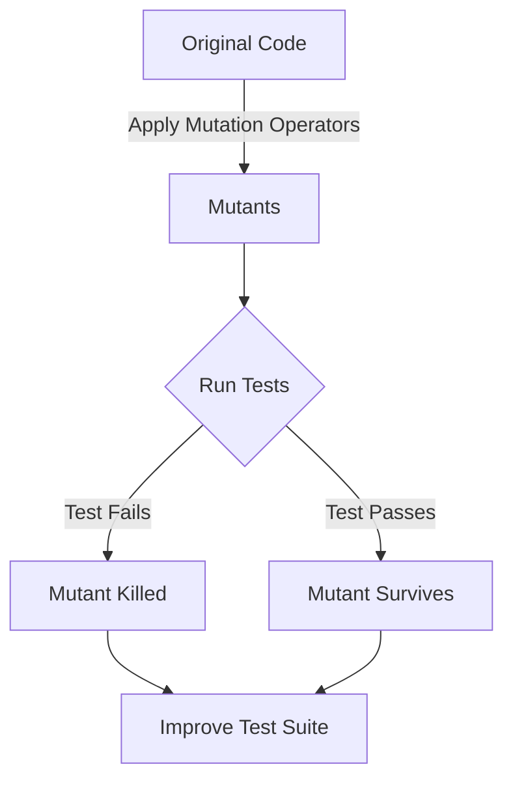

## 16.11 Mutation Testing

Mutation testing is a powerful technique used to evaluate the effectiveness of a test suite by introducing small changes, or "mutations," to the code and observing if the existing tests can detect these changes. This process helps identify weaknesses in the test suite and ensures that it can catch potential bugs in the codebase. In this section, we will delve into the concepts, tools, and techniques of mutation testing in C++, providing a comprehensive guide for expert software engineers and architects.

### Understanding Mutation Testing

#### What is Mutation Testing?

Mutation testing involves creating multiple versions of the original program, known as mutants, by making small syntactic changes to the code. These changes simulate common programming errors. The goal is to determine if the test suite can detect these mutants, thereby assessing its robustness and comprehensiveness.

#### Why Use Mutation Testing?

- **Assess Test Suite Quality**: Mutation testing provides a quantitative measure of the test suite's ability to detect faults.
- **Identify Weak Tests**: It helps identify tests that do not effectively validate the code's behavior.
- **Improve Code Quality**: By ensuring that the test suite is robust, mutation testing indirectly contributes to higher code quality.

### Key Concepts in Mutation Testing

#### Mutants

Mutants are variations of the original program created by applying mutation operators. Each mutant represents a potential fault in the code.

#### Mutation Operators

Mutation operators are rules that define how to alter the code to create mutants. Common mutation operators include:

- **Arithmetic Operator Replacement**: Replacing arithmetic operators (e.g., `+` with `-`).
- **Logical Operator Replacement**: Changing logical operators (e.g., `&&` with `||`).
- **Conditional Boundary Changes**: Modifying conditional boundaries (e.g., changing `>` to `>=`).
- **Statement Deletion**: Removing a line of code to see if the test suite detects the change.

#### Killing Mutants

A mutant is considered "killed" if a test case fails when executed against it. If a mutant survives, it indicates that the test suite is not sensitive to that particular change.

### Implementing Mutation Testing in C++

#### Tools for Mutation Testing in C++

Several tools can facilitate mutation testing in C++. Some popular ones include:

- **Mull**: A mutation testing tool specifically designed for C and C++.
- **Mutant**: A generic mutation testing framework that can be adapted for C++.
- **Google Test**: While not a mutation testing tool per se, it can be used in conjunction with mutation testing frameworks to run tests.

#### Setting Up a Mutation Testing Environment

To set up a mutation testing environment in C++, follow these steps:

1. **Select a Mutation Testing Tool**: Choose a tool that fits your project's needs.
2. **Integrate with Build System**: Ensure the tool is integrated with your build system (e.g., CMake).
3. **Configure Mutation Operators**: Define which mutation operators to apply based on your codebase.
4. **Run Mutation Tests**: Execute the mutation tests and analyze the results.

#### Sample Code Snippet

Below is a simple example demonstrating mutation testing in C++ using a hypothetical mutation testing framework:

```cpp
#include <iostream>
#include <cassert>

// Original function
int add(int a, int b) {
    return a + b;
}

// Test case
void testAdd() {
    assert(add(2, 3) == 5);
    assert(add(-1, 1) == 0);
    assert(add(0, 0) == 0);
}

int main() {
    testAdd();
    std::cout << "All tests passed!" << std::endl;
    return 0;
}
```

**Mutation Example**: Suppose a mutation operator changes the `+` operator to `-` in the `add` function. The test suite should detect this change and fail.

### Visualizing Mutation Testing

To better understand the process of mutation testing, let's visualize it using a flowchart:



**Figure 1**: The flowchart illustrates the mutation testing process, where mutants are created, tested, and either killed or survive, prompting improvements to the test suite.

### Best Practices for Mutation Testing

#### Start Small

Begin with a small subset of your codebase to understand the impact of mutation testing and gradually expand to larger sections.

#### Focus on Critical Code

Apply mutation testing to critical parts of your application where failures would have significant consequences.

#### Automate the Process

Integrate mutation testing into your continuous integration pipeline to ensure regular assessment of your test suite's effectiveness.

#### Analyze Surviving Mutants

Investigate why certain mutants survive to identify gaps in your test suite and improve test coverage.

### Challenges and Considerations

#### Performance Overhead

Mutation testing can be resource-intensive due to the large number of mutants generated. Optimize by selecting relevant mutation operators and focusing on critical code sections.

#### False Positives

Ensure that the test suite is correctly identifying genuine issues and not flagging false positives due to environmental factors or test flakiness.

#### Tool Limitations

Be aware of the limitations of your chosen mutation testing tool, such as support for specific C++ features or integration with your build system.

### Knowledge Check

To reinforce your understanding of mutation testing, consider the following questions:

- What are the benefits of mutation testing compared to traditional code coverage metrics?
- How do mutation operators simulate common programming errors?
- Why is it important to analyze surviving mutants?

### Conclusion

Mutation testing is a valuable technique for assessing and improving the effectiveness of your test suite in C++. By systematically introducing changes to the code and evaluating the test suite's ability to detect these changes, you can ensure that your tests are robust and comprehensive. As you integrate mutation testing into your development process, remember to start small, focus on critical code, and automate the process for continuous improvement.

## Quiz Time!



### What is the primary goal of mutation testing?

- [x] To assess the effectiveness of a test suite
- [ ] To improve code readability
- [ ] To refactor code for performance
- [ ] To automate deployment processes

> **Explanation:** Mutation testing is primarily used to evaluate how well a test suite can detect faults by introducing small changes to the code.

### Which of the following is a common mutation operator?

- [x] Arithmetic Operator Replacement
- [ ] Variable Renaming
- [ ] Function Inlining
- [ ] Code Obfuscation

> **Explanation:** Arithmetic Operator Replacement is a common mutation operator that involves changing arithmetic operators to simulate potential errors.

### What does it mean when a mutant is "killed"?

- [x] A test case fails when executed against the mutant
- [ ] The mutant is removed from the codebase
- [ ] The mutant is refactored for performance
- [ ] The mutant is integrated into the main branch

> **Explanation:** A mutant is considered "killed" when a test case fails, indicating that the test suite successfully detected the introduced change.

### Why is it important to analyze surviving mutants?

- [x] To identify gaps in the test suite
- [ ] To improve code readability
- [ ] To refactor code for performance
- [ ] To automate deployment processes

> **Explanation:** Analyzing surviving mutants helps identify weaknesses in the test suite, allowing developers to improve test coverage and effectiveness.

### What is a potential challenge of mutation testing?

- [x] Performance overhead
- [ ] Improved code readability
- [ ] Automated deployment
- [ ] Code obfuscation

> **Explanation:** Mutation testing can be resource-intensive due to the large number of mutants generated, leading to performance overhead.

### Which tool is specifically designed for mutation testing in C++?

- [x] Mull
- [ ] Google Test
- [ ] Jenkins
- [ ] Docker

> **Explanation:** Mull is a mutation testing tool specifically designed for C and C++.

### How can mutation testing be integrated into the development process?

- [x] By automating it within the continuous integration pipeline
- [ ] By manually running tests after each code change
- [ ] By refactoring code for performance
- [ ] By obfuscating code for security

> **Explanation:** Automating mutation testing within the CI pipeline ensures regular assessment of the test suite's effectiveness.

### What is the purpose of mutation operators?

- [x] To create mutants by altering the code
- [ ] To refactor code for performance
- [ ] To improve code readability
- [ ] To automate deployment processes

> **Explanation:** Mutation operators define how to alter the code to create mutants, simulating potential faults.

### What is a false positive in the context of mutation testing?

- [x] When a test suite incorrectly identifies an issue
- [ ] When a mutant is successfully killed
- [ ] When a mutant survives
- [ ] When a test case passes successfully

> **Explanation:** A false positive occurs when the test suite incorrectly flags an issue that is not genuinely present.

### True or False: Mutation testing can help improve code quality indirectly.

- [x] True
- [ ] False

> **Explanation:** By ensuring that the test suite is robust and comprehensive, mutation testing indirectly contributes to higher code quality.


