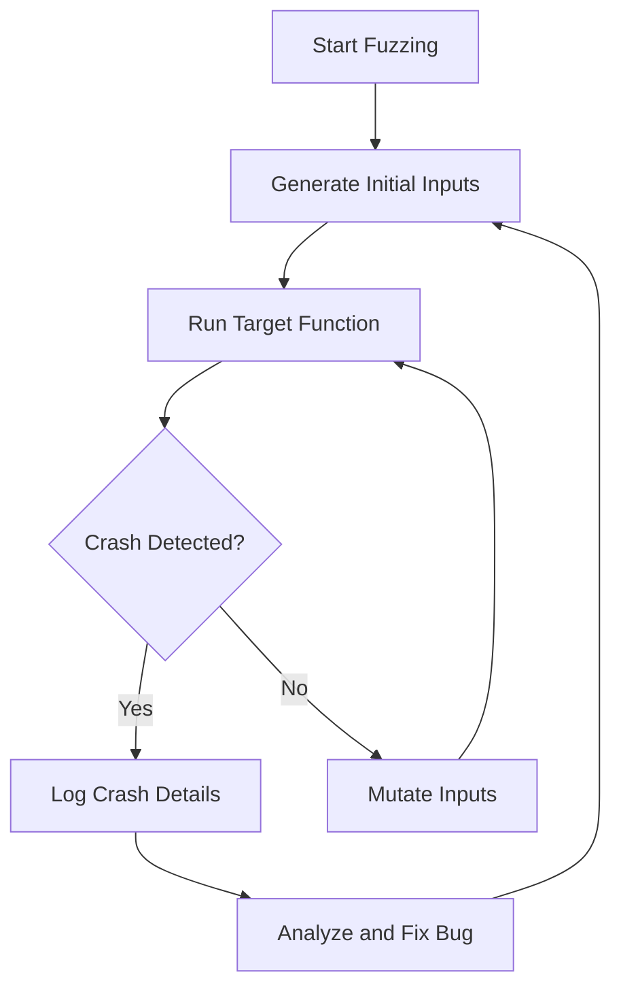

## 16.12 Fuzz Testing

As software engineers and architects, ensuring the robustness and reliability of our applications is paramount. One powerful technique to achieve this is **fuzz testing**. Fuzz testing, or fuzzing, is an automated software testing technique that involves providing invalid, unexpected, or random data as input to a computer program. The primary goal is to find security vulnerabilities and bugs that could lead to crashes, memory leaks, or unexpected behavior.

### Introduction to Fuzz Testing

Fuzz testing is a dynamic testing technique that helps identify vulnerabilities by bombarding an application with random inputs. Unlike traditional testing methods that rely on predefined test cases, fuzz testing explores the input space more extensively, often uncovering edge cases that human testers might overlook.

#### Key Concepts in Fuzz Testing

- **Random Input Generation**: Fuzz testing involves generating random inputs to test how the application handles unexpected data. This can include malformed data, boundary values, or even completely random bytes.
- **Automated Testing**: Fuzz testing is automated, meaning it can run continuously without human intervention, making it ideal for long-term testing scenarios.
- **Crash Detection**: The primary focus of fuzz testing is to detect crashes or unexpected behavior, which can indicate potential vulnerabilities or bugs.
- **Coverage-Guided Fuzzing**: Modern fuzz testing tools often use coverage-guided techniques to maximize the exploration of the codebase, ensuring that as many paths as possible are tested.

### Tools for Fuzz Testing

Several tools are available to facilitate fuzz testing in C++, each with its unique features and capabilities. Two of the most popular tools are **American Fuzzy Lop (AFL)** and **libFuzzer**.

#### American Fuzzy Lop (AFL)

AFL is a widely used fuzz testing tool known for its effectiveness and ease of use. It employs a novel genetic algorithm to automatically discover interesting test cases that trigger new internal states in the targeted binary.

- **Instrumentation**: AFL uses compile-time instrumentation to monitor the execution path of the program, allowing it to generate inputs that maximize code coverage.
- **Mutational Fuzzing**: AFL generates new test cases by mutating existing ones, gradually evolving the input set to explore different execution paths.
- **Crash Analysis**: AFL provides detailed information about crashes, including stack traces and input data that caused the crash, aiding in debugging and fixing issues.

#### libFuzzer

libFuzzer is a library for coverage-guided fuzz testing, integrated with LLVM. It is designed to be used with sanitizers like AddressSanitizer, MemorySanitizer, or UndefinedBehaviorSanitizer to detect various types of bugs.

- **In-Process Fuzzing**: Unlike AFL, libFuzzer runs as part of the application, allowing for more efficient testing and better integration with sanitizers.
- **Corpus Minimization**: libFuzzer automatically minimizes the set of inputs that trigger unique code paths, reducing the time and resources needed for testing.
- **Cross-Platform Support**: As part of the LLVM project, libFuzzer supports multiple platforms and architectures, making it versatile for different development environments.

### Integrating Fuzz Testing into Development

Integrating fuzz testing into your development process can significantly enhance the quality and security of your software. Here are some steps to effectively incorporate fuzz testing:

#### Step 1: Identify Target Functions

Begin by identifying the functions or modules in your application that handle external inputs. These are prime candidates for fuzz testing, as they are often the entry points for potential vulnerabilities.

#### Step 2: Set Up the Fuzzing Environment

Choose a fuzz testing tool that suits your needs and set up the environment. This typically involves compiling your application with the necessary instrumentation and configuring the fuzzing tool.

#### Step 3: Create Initial Test Cases

Develop a set of initial test cases that represent valid inputs for your application. These will serve as the starting point for the fuzzing process, from which the tool will generate mutations.

#### Step 4: Run the Fuzzing Tool

Execute the fuzzing tool, allowing it to generate and test inputs automatically. Monitor the tool's output for any crashes or unexpected behavior, and use the provided information to debug and fix issues.

#### Step 5: Analyze and Fix Bugs

When the fuzzing tool identifies a crash or bug, analyze the input data and stack traces to determine the cause. Fix the issue and rerun the fuzzing tool to ensure the problem is resolved.

#### Step 6: Continuous Integration

Integrate fuzz testing into your continuous integration (CI) pipeline to ensure that new code changes are automatically tested. This helps catch regressions early and maintains the robustness of your application over time.

### Code Example: Fuzz Testing with libFuzzer

To illustrate how fuzz testing can be implemented in C++, let's walk through a simple example using libFuzzer.

```cpp
#include <cstdint>
#include <cstddef>
#include <iostream>

// Function to be fuzz tested
extern "C" int LLVMFuzzerTestOneInput(const uint8_t *data, size_t size) {
    if (size < 4) return 0; // Ignore inputs that are too small

    // Simulate a bug: crash if the input is "CRSH"
    if (data[0] == 'C' && data[1] == 'R' && data[2] == 'S' && data[3] == 'H') {
        std::cerr << "Crash detected!" << std::endl;
        abort();
    }

    // Process the input data
    // ...

    return 0;
}
```

In this example, we define a function `LLVMFuzzerTestOneInput` that processes input data. The function checks if the input data matches the string "CRSH" and triggers a crash if it does. libFuzzer will automatically generate inputs to test this function and detect the crash.

### Visualizing Fuzz Testing Workflow

To better understand the fuzz testing process, let's visualize the workflow using a flowchart.



**Figure 1: Fuzz Testing Workflow**

This diagram illustrates the iterative nature of fuzz testing, where inputs are continuously mutated and tested until crashes are detected and resolved.

### Try It Yourself

To get hands-on experience with fuzz testing, try modifying the code example above:

- Change the input string that triggers a crash and observe how libFuzzer adapts.
- Add additional checks for different input patterns and see how the tool handles them.
- Integrate AddressSanitizer to detect memory issues during fuzz testing.

### References and Links

For further reading and resources on fuzz testing, consider the following links:

- [American Fuzzy Lop (AFL) Documentation](http://lcamtuf.coredump.cx/afl/)
- [libFuzzer Documentation](https://llvm.org/docs/LibFuzzer.html)
- [AddressSanitizer](https://clang.llvm.org/docs/AddressSanitizer.html)

### Knowledge Check

Before we conclude, let's summarize the key takeaways:

- Fuzz testing is an automated technique for discovering vulnerabilities by generating random inputs.
- Tools like AFL and libFuzzer facilitate fuzz testing in C++ by providing coverage-guided input generation.
- Integrating fuzz testing into your development process enhances software robustness and security.

### Embrace the Journey

Remember, fuzz testing is just one tool in your software testing arsenal. As you continue to explore and implement different testing techniques, you'll build more robust and secure applications. Keep experimenting, stay curious, and enjoy the journey!

## Quiz Time!



### What is the primary goal of fuzz testing?

- [x] To find security vulnerabilities and bugs
- [ ] To optimize code performance
- [ ] To improve user interface design
- [ ] To enhance code readability

> **Explanation:** Fuzz testing aims to discover security vulnerabilities and bugs by providing random inputs to the program.

### Which of the following is a popular fuzz testing tool for C++?

- [x] AFL (American Fuzzy Lop)
- [ ] JUnit
- [ ] Selenium
- [ ] Mocha

> **Explanation:** AFL is a widely used fuzz testing tool for C++ that uses a genetic algorithm to discover interesting test cases.

### What is the role of coverage-guided fuzzing?

- [x] To maximize the exploration of the codebase
- [ ] To minimize the number of test cases
- [ ] To improve code readability
- [ ] To reduce memory usage

> **Explanation:** Coverage-guided fuzzing aims to maximize the exploration of the codebase by generating inputs that trigger new execution paths.

### What is the purpose of the LLVMFuzzerTestOneInput function in libFuzzer?

- [x] To process input data during fuzz testing
- [ ] To compile the application with instrumentation
- [ ] To generate random inputs
- [ ] To log crash details

> **Explanation:** The LLVMFuzzerTestOneInput function processes input data during fuzz testing and is the entry point for libFuzzer.

### How does AFL generate new test cases?

- [x] By mutating existing ones
- [ ] By manually writing test cases
- [ ] By using machine learning algorithms
- [ ] By analyzing user feedback

> **Explanation:** AFL generates new test cases by mutating existing ones, gradually evolving the input set to explore different execution paths.

### What is a key benefit of integrating fuzz testing into a CI pipeline?

- [x] To catch regressions early
- [ ] To improve user interface design
- [ ] To enhance code readability
- [ ] To reduce memory usage

> **Explanation:** Integrating fuzz testing into a CI pipeline helps catch regressions early by automatically testing new code changes.

### Which sanitizer is commonly used with libFuzzer?

- [x] AddressSanitizer
- [ ] JUnit
- [ ] Selenium
- [ ] Mocha

> **Explanation:** AddressSanitizer is commonly used with libFuzzer to detect memory issues during fuzz testing.

### What does AFL use to monitor the execution path of a program?

- [x] Compile-time instrumentation
- [ ] Runtime analysis
- [ ] User feedback
- [ ] Machine learning algorithms

> **Explanation:** AFL uses compile-time instrumentation to monitor the execution path of a program, allowing it to generate inputs that maximize code coverage.

### What is the first step in integrating fuzz testing into development?

- [x] Identify target functions
- [ ] Compile the application with instrumentation
- [ ] Generate random inputs
- [ ] Log crash details

> **Explanation:** The first step in integrating fuzz testing is to identify the functions or modules that handle external inputs, as these are prime candidates for fuzz testing.

### Fuzz testing is a static testing technique.

- [ ] True
- [x] False

> **Explanation:** Fuzz testing is a dynamic testing technique that involves executing the program with random inputs to discover vulnerabilities.


