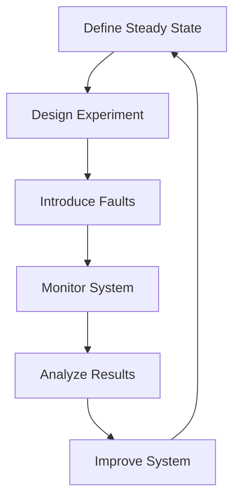

## 16.13 Chaos Engineering in C++ Systems

In the realm of software engineering, ensuring that systems are resilient and robust in the face of unexpected failures is paramount. Chaos engineering is a discipline that helps achieve this by introducing faults into a system to test its ability to withstand and recover from failures. In this section, we will delve into the principles of chaos engineering, its application in C++ systems, and how to effectively implement chaos engineering practices to enhance the resilience of your software.

### Principles of Chaos Engineering

Chaos engineering is based on the principle that systems should be tested under real-world conditions, including failures and unexpected events. The goal is to identify weaknesses and improve system robustness before these issues impact end-users. Here are the core principles:

1. **Build a Hypothesis Around Steady State Behavior**: Define what normal operation looks like for your system. This could be metrics like response time, throughput, or error rates.

2. **Vary Real-World Events**: Introduce faults that mimic real-world events such as server crashes, network latency, or hardware failures.

3. **Run Experiments in Production**: While it may seem counterintuitive, running experiments in a production environment ensures that you are testing the system as it operates under real conditions.

4. **Automate Experiments to Run Continuously**: Automation ensures that chaos experiments are repeatable and can be run frequently to catch regressions.

5. **Minimize Blast Radius**: Start with small-scale experiments to limit the potential impact on users and gradually increase the scope as confidence in the system's resilience grows.

### Implementing Chaos Engineering in C++ Systems

C++ systems, often used in performance-critical applications, can greatly benefit from chaos engineering. Here's how you can implement chaos engineering practices in your C++ projects:

#### 1. **Fault Injection**

Fault injection is a technique used to introduce errors into a system to test its resilience. In C++, this can be achieved through various methods:

- **Code Modifications**: Temporarily alter the code to simulate faults. For example, you can introduce artificial delays or exceptions in critical sections of the code.

- **Fault Injection Libraries**: Use libraries designed for fault injection. These libraries can simulate faults like memory leaks, segmentation faults, or network failures.

```cpp
#include <iostream>
#include <stdexcept>

// Simulate a fault by throwing an exception
void simulateFault() {
    throw std::runtime_error("Simulated fault: Database connection lost");
}

int main() {
    try {
        simulateFault();
    } catch (const std::exception& e) {
        std::cerr << "Caught exception: " << e.what() << std::endl;
        // Handle the fault gracefully
    }
    return 0;
}
```

#### 2. **Monitoring and Observability**

Effective chaos engineering requires robust monitoring and observability to understand the system's behavior during experiments. Implement logging, metrics, and tracing to capture detailed information about system performance and failures.

- **Logging**: Use logging libraries to record events and errors.
- **Metrics**: Collect metrics on system performance, such as CPU usage, memory consumption, and response times.
- **Tracing**: Implement distributed tracing to follow requests through the system and identify bottlenecks or failures.

#### 3. **Automated Chaos Experiments**

Automate chaos experiments to ensure they are repeatable and can be integrated into your continuous integration and deployment (CI/CD) pipeline. Use tools like Chaos Monkey or custom scripts to introduce faults automatically.

```cpp
#include <thread>
#include <chrono>

// Function to simulate network latency
void simulateNetworkLatency() {
    std::this_thread::sleep_for(std::chrono::milliseconds(500)); // 500ms delay
}

int main() {
    std::cout << "Simulating network latency..." << std::endl;
    simulateNetworkLatency();
    std::cout << "Operation completed after delay." << std::endl;
    return 0;
}
```

#### 4. **Minimizing Blast Radius**

Start with small-scale experiments to limit the impact on users. For example, target a single service or component rather than the entire system. Gradually increase the scope as you gain confidence in the system's resilience.

### Applying Chaos Engineering Practices

To effectively apply chaos engineering in C++ systems, follow these best practices:

1. **Start Small**: Begin with small, controlled experiments to minimize risk. Gradually expand the scope as you gain confidence.

2. **Collaborate with Teams**: Work closely with development, operations, and quality assurance teams to design and execute experiments.

3. **Document Experiments**: Keep detailed records of experiments, including hypotheses, methods, results, and lessons learned.

4. **Iterate and Improve**: Use the insights gained from experiments to improve system design and resilience. Continuously refine your chaos engineering practices.

5. **Educate and Train**: Ensure that all team members understand the principles and goals of chaos engineering. Provide training and resources to build expertise.

### Visualizing Chaos Engineering

To better understand how chaos engineering fits into the software development lifecycle, let's visualize the process using a flowchart.



**Figure 1: Chaos Engineering Process Flowchart**

### Key Participants in Chaos Engineering

- **Developers**: Responsible for implementing fault injection and monitoring tools.
- **Operations Team**: Monitors system performance and manages infrastructure.
- **Quality Assurance**: Validates system behavior and resilience.
- **Management**: Supports chaos engineering initiatives and allocates resources.

### Applicability of Chaos Engineering

Chaos engineering is applicable in various scenarios, including:

- **Cloud-Based Systems**: Test resilience against network failures and resource constraints.
- **Microservices Architectures**: Identify weaknesses in service communication and dependencies.
- **High-Availability Systems**: Ensure systems can withstand hardware failures and maintain uptime.
- **Performance-Critical Applications**: Validate system performance under stress and failure conditions.

### Design Considerations

When implementing chaos engineering in C++ systems, consider the following:

- **Safety**: Ensure that experiments do not compromise data integrity or security.
- **Scalability**: Design experiments that can scale with the system.
- **Reproducibility**: Ensure that experiments can be repeated consistently.
- **Integration**: Incorporate chaos engineering into the CI/CD pipeline for continuous testing.

### Differences and Similarities with Other Testing Methods

Chaos engineering is often confused with other testing methods like stress testing or fault tolerance testing. Here's how it differs:

- **Stress Testing**: Focuses on pushing the system to its limits, while chaos engineering introduces faults to test resilience.
- **Fault Tolerance Testing**: Ensures systems can continue operating despite failures, whereas chaos engineering actively introduces failures to identify weaknesses.

### Try It Yourself

To get hands-on experience with chaos engineering in C++ systems, try modifying the code examples provided. Introduce different types of faults, such as memory leaks or segmentation faults, and observe how your system responds. Experiment with different monitoring tools and techniques to gain insights into system behavior.

### References and Links

For further reading on chaos engineering, consider the following resources:

- [Principles of Chaos Engineering](https://principlesofchaos.org/)
- [Chaos Monkey](https://github.com/Netflix/chaosmonkey)
- [The Chaos Engineering Book](https://www.oreilly.com/library/view/chaos-engineering/9781492043863/)

### Knowledge Check

To reinforce your understanding of chaos engineering in C++ systems, consider the following questions:

- What is the primary goal of chaos engineering?
- How can fault injection be implemented in C++ systems?
- What are the key components of a chaos engineering experiment?
- How does chaos engineering differ from stress testing?

### Embrace the Journey

Remember, chaos engineering is a journey of continuous improvement. As you implement these practices, you'll build more resilient and robust C++ systems. Keep experimenting, stay curious, and enjoy the journey!

## Quiz Time!



### What is the primary goal of chaos engineering?

- [x] To identify weaknesses and improve system robustness before issues impact end-users.
- [ ] To increase system performance under normal conditions.
- [ ] To replace traditional testing methods.
- [ ] To reduce the cost of system maintenance.

> **Explanation:** The primary goal of chaos engineering is to identify weaknesses and improve system robustness before issues impact end-users.

### How can fault injection be implemented in C++ systems?

- [x] By temporarily altering the code to simulate faults.
- [x] By using fault injection libraries.
- [ ] By increasing the system's workload.
- [ ] By reducing the system's resource allocation.

> **Explanation:** Fault injection can be implemented by temporarily altering the code to simulate faults or by using fault injection libraries.

### What is a key principle of chaos engineering?

- [x] Build a hypothesis around steady state behavior.
- [ ] Increase system complexity.
- [ ] Reduce system monitoring.
- [ ] Eliminate all faults from the system.

> **Explanation:** A key principle of chaos engineering is to build a hypothesis around steady state behavior to understand what normal operation looks like.

### What is the purpose of minimizing the blast radius in chaos experiments?

- [x] To limit the potential impact on users.
- [ ] To increase the number of faults introduced.
- [ ] To reduce the need for monitoring.
- [ ] To eliminate the need for documentation.

> **Explanation:** Minimizing the blast radius in chaos experiments is important to limit the potential impact on users.

### Which of the following is a difference between chaos engineering and stress testing?

- [x] Chaos engineering introduces faults to test resilience.
- [x] Stress testing focuses on pushing the system to its limits.
- [ ] Both focus on increasing system performance.
- [ ] Both eliminate the need for traditional testing methods.

> **Explanation:** Chaos engineering introduces faults to test resilience, while stress testing focuses on pushing the system to its limits.

### What role do developers play in chaos engineering?

- [x] Implementing fault injection and monitoring tools.
- [ ] Managing infrastructure.
- [ ] Validating system behavior.
- [ ] Allocating resources.

> **Explanation:** Developers are responsible for implementing fault injection and monitoring tools in chaos engineering.

### What is the purpose of running chaos experiments in production?

- [x] To test the system as it operates under real conditions.
- [ ] To reduce the cost of testing.
- [ ] To eliminate the need for monitoring.
- [ ] To increase system complexity.

> **Explanation:** Running chaos experiments in production tests the system as it operates under real conditions.

### What is an important consideration when implementing chaos engineering?

- [x] Ensure that experiments do not compromise data integrity or security.
- [ ] Increase the number of faults introduced.
- [ ] Reduce system monitoring.
- [ ] Eliminate the need for documentation.

> **Explanation:** It is important to ensure that chaos engineering experiments do not compromise data integrity or security.

### What is a benefit of automating chaos experiments?

- [x] Ensures experiments are repeatable and can be integrated into CI/CD pipelines.
- [ ] Reduces the need for monitoring.
- [ ] Increases system complexity.
- [ ] Eliminates the need for documentation.

> **Explanation:** Automating chaos experiments ensures they are repeatable and can be integrated into CI/CD pipelines.

### True or False: Chaos engineering should only be applied to non-production environments.

- [ ] True
- [x] False

> **Explanation:** Chaos engineering should be applied to production environments to test the system as it operates under real conditions.


