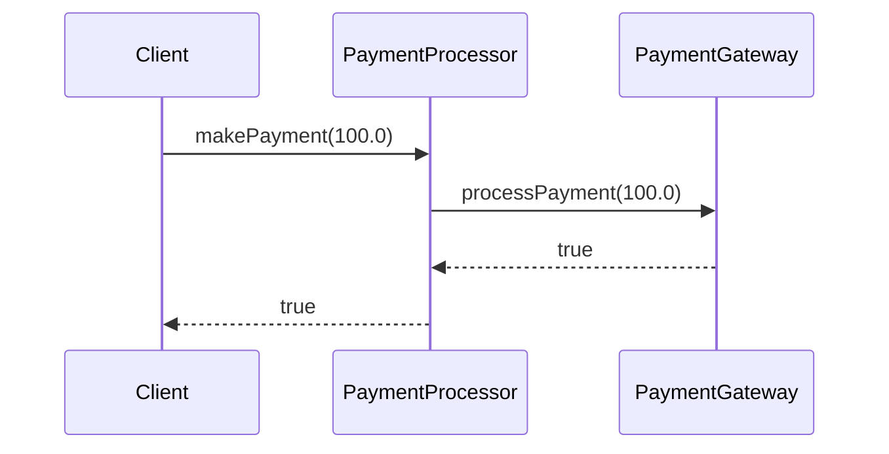

## 16.2 Mock Objects and Stubs

In the realm of software testing, particularly unit testing, the ability to isolate components is crucial. This isolation ensures that tests are focused solely on the functionality of the component under test, without interference from its dependencies. Mock objects and stubs are two powerful techniques that facilitate this isolation. In this section, we will delve into the concepts of mock objects and stubs, explore their applications in C++ testing, and demonstrate how to use Google Mock, a popular mocking framework.

### Understanding Mock Objects and Stubs

#### What Are Mock Objects?

Mock objects are simulated objects that mimic the behavior of real objects in controlled ways. They are primarily used in unit testing to replace real objects that the component under test interacts with. By using mock objects, we can verify that the component interacts with its dependencies as expected.

**Key Characteristics of Mock Objects:**

- **Behavior Verification:** Mock objects allow us to verify the interactions between the component under test and its dependencies. This includes checking whether certain methods were called, how many times they were called, and with what parameters.
- **Controlled Environment:** Mock objects provide a controlled environment where we can simulate different scenarios, such as exceptions or specific return values, to test how the component handles them.

#### What Are Stubs?

Stubs are simplified implementations of interfaces or classes that provide fixed responses to method calls. Unlike mock objects, stubs are not used for behavior verification but rather to provide the necessary environment for the component under test.

**Key Characteristics of Stubs:**

- **State Verification:** Stubs are used to set up the necessary state for the component under test. They provide predefined responses to method calls, allowing the test to focus on the component's behavior.
- **Simplified Implementation:** Stubs are typically simple and focus on returning fixed values or performing minimal logic required for the test.

### Differences Between Mock Objects and Stubs

While both mock objects and stubs are used to isolate components during testing, they serve different purposes:

- **Mock Objects:** Focus on behavior verification by checking interactions between the component and its dependencies.
- **Stubs:** Focus on state verification by providing fixed responses to support the test environment.

### When to Use Mock Objects and Stubs

- **Use Mock Objects:** When you need to verify interactions between the component and its dependencies. Mock objects are ideal for testing complex interactions and ensuring that the component behaves correctly in response to various scenarios.
- **Use Stubs:** When you need to set up a specific environment or state for the component under test. Stubs are useful for providing necessary data or responses without focusing on interactions.

### Implementing Mock Objects and Stubs in C++

To effectively use mock objects and stubs in C++, we need to understand how to create and manage these test doubles. Let's explore how to implement them using a practical example.

#### Example Scenario: Testing a Payment Processor

Consider a simple payment processing system where we need to test the `PaymentProcessor` class. This class interacts with an external `PaymentGateway` to process payments. Our goal is to test the `PaymentProcessor` without relying on the actual `PaymentGateway`.

```cpp
// PaymentGateway.h
class PaymentGateway {
public:
    virtual ~PaymentGateway() = default;
    virtual bool processPayment(double amount) = 0;
};

// PaymentProcessor.h
#include "PaymentGateway.h"

class PaymentProcessor {
public:
    PaymentProcessor(PaymentGateway* gateway) : gateway_(gateway) {}

    bool makePayment(double amount) {
        return gateway_->processPayment(amount);
    }

private:
    PaymentGateway* gateway_;
};
```

#### Creating a Stub for PaymentGateway

To test the `PaymentProcessor`, we can create a stub for the `PaymentGateway` that returns a fixed response.

```cpp
// PaymentGatewayStub.h
#include "PaymentGateway.h"

class PaymentGatewayStub : public PaymentGateway {
public:
    bool processPayment(double amount) override {
        return true; // Always return true for testing
    }
};
```

#### Testing PaymentProcessor with a Stub

Using the `PaymentGatewayStub`, we can test the `PaymentProcessor` without relying on the actual `PaymentGateway`.

```cpp
// PaymentProcessorTest.cpp
#include "PaymentProcessor.h"
#include "PaymentGatewayStub.h"
#include <cassert>

void testPaymentProcessor() {
    PaymentGatewayStub stub;
    PaymentProcessor processor(&stub);

    assert(processor.makePayment(100.0) == true);
}

int main() {
    testPaymentProcessor();
    return 0;
}
```

In this example, the `PaymentProcessor` is tested using a stub that always returns `true`. This allows us to verify that the `PaymentProcessor` correctly calls the `processPayment` method without worrying about the actual implementation of the `PaymentGateway`.

### Introducing Google Mock

Google Mock is a popular C++ framework for creating mock objects. It is part of the Google Test framework and provides powerful features for behavior verification.

#### Setting Up Google Mock

To use Google Mock, you need to include the Google Test and Google Mock libraries in your project. You can download them from the [Google Test GitHub repository](https://github.com/google/googletest).

#### Creating a Mock Object with Google Mock

Let's create a mock object for the `PaymentGateway` using Google Mock.

```cpp
// MockPaymentGateway.h
#include "PaymentGateway.h"
#include <gmock/gmock.h>

class MockPaymentGateway : public PaymentGateway {
public:
    MOCK_METHOD(bool, processPayment, (double amount), (override));
};
```

#### Testing PaymentProcessor with a Mock Object

Using the `MockPaymentGateway`, we can verify the interactions between the `PaymentProcessor` and the `PaymentGateway`.

```cpp
// PaymentProcessorTestWithMock.cpp
#include "PaymentProcessor.h"
#include "MockPaymentGateway.h"
#include <gtest/gtest.h>

TEST(PaymentProcessorTest, MakePayment) {
    MockPaymentGateway mockGateway;
    PaymentProcessor processor(&mockGateway);

    EXPECT_CALL(mockGateway, processPayment(100.0))
        .Times(1)
        .WillOnce(::testing::Return(true));

    EXPECT_TRUE(processor.makePayment(100.0));
}

int main(int argc, char** argv) {
    ::testing::InitGoogleTest(&argc, argv);
    return RUN_ALL_TESTS();
}
```

In this example, we use Google Mock to create a mock object for the `PaymentGateway`. The `EXPECT_CALL` macro is used to specify that the `processPayment` method should be called once with the argument `100.0`, and it should return `true`. The test verifies that the `PaymentProcessor` interacts with the `PaymentGateway` as expected.

### Visualizing the Interaction

To better understand the interaction between the `PaymentProcessor` and the `PaymentGateway`, let's visualize it using a sequence diagram.



This sequence diagram illustrates the flow of a payment request from the client to the `PaymentProcessor`, which then interacts with the `PaymentGateway`.

### Best Practices for Using Mock Objects and Stubs

- **Keep Tests Focused:** Ensure that each test focuses on a specific aspect of the component under test. Avoid testing multiple functionalities in a single test.
- **Use Descriptive Names:** Name your mock objects and stubs clearly to indicate their purpose. This improves readability and maintainability.
- **Verify Interactions:** When using mock objects, verify that the expected interactions occur. Use Google Mock's verification features to ensure that methods are called with the correct parameters.
- **Avoid Over-Mocking:** Use mock objects judiciously. Over-mocking can lead to brittle tests that are difficult to maintain. Prefer stubs when behavior verification is not necessary.
- **Document Test Doubles:** Clearly document the purpose and behavior of each test double. This helps other developers understand the test setup and its intentions.

### Try It Yourself

To deepen your understanding of mock objects and stubs, try modifying the code examples provided:

- **Experiment with Different Return Values:** Modify the `PaymentGatewayStub` to return `false` and observe how the `PaymentProcessor` handles it.
- **Add More Tests:** Create additional tests for the `PaymentProcessor` to cover different scenarios, such as invalid payment amounts.
- **Explore Google Mock Features:** Experiment with other Google Mock features, such as argument matching and action specifications, to create more complex test scenarios.

### References and Further Reading

- [Google Test Documentation](https://github.com/google/googletest/blob/main/docs/primer.md)
- [Google Mock Documentation](https://github.com/google/googletest/blob/main/docs/gmock_for_dummies.md)
- [Martin Fowler's Article on Mocks Aren't Stubs](https://martinfowler.com/articles/mocksArentStubs.html)

### Key Takeaways

- Mock objects and stubs are essential tools for isolating components during testing.
- Mock objects focus on behavior verification, while stubs focus on state verification.
- Google Mock is a powerful framework for creating mock objects in C++.
- Use mock objects and stubs judiciously to create effective and maintainable tests.

### Embrace the Journey

Remember, mastering mock objects and stubs is just one step in your journey to becoming an expert in C++ testing. As you continue to explore and experiment, you'll gain deeper insights into creating robust and reliable software. Keep learning, stay curious, and enjoy the process!

## Quiz Time!



### What is the primary purpose of mock objects in testing?

- [x] Behavior verification
- [ ] State verification
- [ ] Performance testing
- [ ] Code coverage

> **Explanation:** Mock objects are used to verify the interactions between the component under test and its dependencies.

### What is the primary purpose of stubs in testing?

- [ ] Behavior verification
- [x] State verification
- [ ] Performance testing
- [ ] Code coverage

> **Explanation:** Stubs are used to set up the necessary state for the component under test by providing fixed responses.

### Which framework is commonly used for creating mock objects in C++?

- [ ] JUnit
- [x] Google Mock
- [ ] NUnit
- [ ] Mocha

> **Explanation:** Google Mock is a popular framework for creating mock objects in C++.

### In the provided example, what does the `EXPECT_CALL` macro do?

- [x] Specifies expected interactions with the mock object
- [ ] Initializes the Google Test framework
- [ ] Runs all the tests
- [ ] Sets up the test environment

> **Explanation:** The `EXPECT_CALL` macro is used to specify the expected interactions with the mock object.

### What is the difference between mock objects and stubs?

- [x] Mock objects focus on behavior verification, while stubs focus on state verification.
- [ ] Mock objects focus on state verification, while stubs focus on behavior verification.
- [ ] Mock objects and stubs serve the same purpose.
- [ ] Mock objects are used for performance testing, while stubs are used for code coverage.

> **Explanation:** Mock objects focus on behavior verification, while stubs focus on state verification.

### Which of the following is a best practice when using mock objects?

- [x] Verify interactions with dependencies
- [ ] Avoid using descriptive names
- [ ] Over-mock components
- [ ] Test multiple functionalities in a single test

> **Explanation:** It is important to verify interactions with dependencies when using mock objects.

### What is a potential drawback of over-mocking?

- [x] Brittle tests that are difficult to maintain
- [ ] Improved test coverage
- [ ] Increased test speed
- [ ] Simplified test setup

> **Explanation:** Over-mocking can lead to brittle tests that are difficult to maintain.

### What is the role of the `PaymentGatewayStub` in the example?

- [ ] Verify interactions with the `PaymentProcessor`
- [x] Provide a fixed response to support the test environment
- [ ] Measure performance of the `PaymentProcessor`
- [ ] Initialize the Google Test framework

> **Explanation:** The `PaymentGatewayStub` provides a fixed response to support the test environment.

### True or False: Stubs are typically used for behavior verification.

- [ ] True
- [x] False

> **Explanation:** Stubs are used for state verification, not behavior verification.

### True or False: Google Mock is part of the Google Test framework.

- [x] True
- [ ] False

> **Explanation:** Google Mock is indeed part of the Google Test framework.


