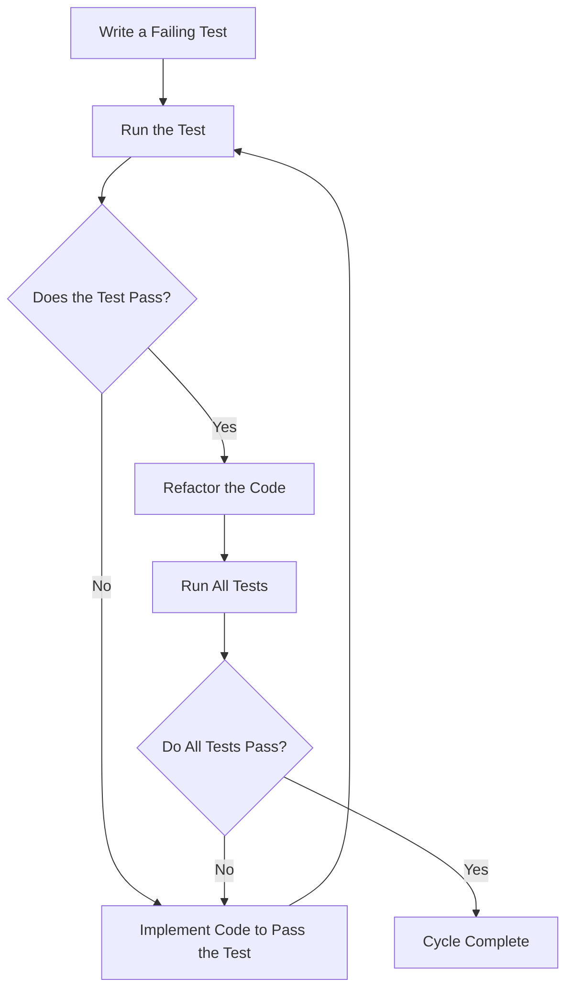

## 16.3 Test-Driven Development (TDD)

Test-Driven Development (TDD) is a software development approach that emphasizes writing tests before writing the actual code. This methodology has gained significant traction in the software engineering community due to its ability to produce more reliable and maintainable code. In this section, we will delve into the principles of TDD, explore its benefits and challenges, and provide practical guidance on implementing TDD in C++ using the Red-Green-Refactor cycle.

### Introduction to Test-Driven Development

Test-Driven Development is a disciplined software development process that involves writing a test for a specific functionality before implementing the code to pass that test. The core idea is to ensure that the software is built incrementally, with each piece of functionality being verified by a corresponding test. This approach not only helps in catching bugs early but also encourages developers to think about the design and requirements of their code upfront.

#### Key Concepts of TDD

1. **Test First**: Write a test before writing the code that fulfills the test.
2. **Red-Green-Refactor Cycle**: A three-step process that guides the development workflow.
3. **Incremental Development**: Build software in small, manageable increments.
4. **Continuous Feedback**: Use tests to provide immediate feedback on code changes.

### The Red-Green-Refactor Cycle

The Red-Green-Refactor cycle is the heart of TDD. It consists of three distinct phases:

1. **Red**: Write a test that defines a function or improvements of a function, which should fail initially because the functionality is not yet implemented.
2. **Green**: Write the minimum amount of code necessary to pass the test.
3. **Refactor**: Clean up the code, ensuring that it adheres to good design principles while keeping all tests passing.

Let's explore each phase in detail.

#### Red Phase: Writing the Test

In the Red phase, we start by writing a test case for the functionality we want to implement. This test should be specific and focused on a single aspect of the functionality. The test should fail initially, indicating that the functionality is not yet implemented.

**Example: Writing a Test in C++**

```cpp
#include <gtest/gtest.h>

// Function prototype
int add(int a, int b);

// Test case for the add function
TEST(AdditionTest, HandlesPositiveNumbers) {
    EXPECT_EQ(add(2, 3), 5);
}
```

In this example, we are writing a test for an `add` function that is supposed to add two integers. Since the function is not implemented yet, this test will fail.

#### Green Phase: Implementing the Code

In the Green phase, our goal is to write just enough code to make the test pass. This often means implementing the simplest solution that fulfills the test requirements.

**Example: Implementing the Code**

```cpp
// Function implementation
int add(int a, int b) {
    return a + b;
}
```

After implementing the `add` function, we run the test again, and it should pass, indicating that the functionality works as expected.

#### Refactor Phase: Improving the Code

Once the test is passing, we enter the Refactor phase. Here, we focus on improving the code's structure and readability without changing its behavior. This may involve renaming variables, extracting methods, or simplifying logic.

**Example: Refactoring the Code**

In our simple example, there might not be much to refactor. However, in more complex scenarios, refactoring could involve:

- Breaking down large functions into smaller, more manageable ones.
- Improving variable names for clarity.
- Removing duplicate code.

### Benefits of Test-Driven Development

TDD offers several benefits that can significantly enhance the software development process:

1. **Improved Code Quality**: By writing tests first, developers are forced to consider the design and requirements of their code upfront, leading to cleaner and more maintainable code.
2. **Early Bug Detection**: Tests catch bugs early in the development process, reducing the cost and effort required to fix them later.
3. **Documentation**: Tests serve as a form of documentation, providing a clear specification of what the code is supposed to do.
4. **Refactoring Confidence**: With a comprehensive suite of tests, developers can refactor code with confidence, knowing that any regressions will be caught by the tests.
5. **Better Design**: TDD encourages developers to write small, focused functions that are easier to understand and maintain.

### Challenges of Test-Driven Development

While TDD offers numerous benefits, it also presents some challenges:

1. **Initial Time Investment**: Writing tests before code can be time-consuming, especially for developers new to TDD.
2. **Learning Curve**: TDD requires a shift in mindset and may be challenging for developers accustomed to traditional development approaches.
3. **Test Maintenance**: As the codebase evolves, tests may need to be updated or rewritten, adding to the maintenance burden.
4. **Overhead for Simple Code**: For very simple code, the overhead of writing tests may not always be justified.

### Implementing TDD in C++

Implementing TDD in C++ involves setting up a testing framework, writing tests, and integrating them into the development workflow. Let's explore these steps in more detail.

#### Setting Up a Testing Framework

To implement TDD in C++, you'll need a testing framework. Popular choices include Google Test, Catch2, and Boost.Test. These frameworks provide the necessary tools to write and run tests efficiently.

**Example: Setting Up Google Test**

1. **Install Google Test**: Follow the installation instructions on the [Google Test GitHub page](https://github.com/google/googletest).
2. **Create a Test File**: Create a new file for your tests, typically with a `.cpp` extension.
3. **Include the Google Test Header**: Include the necessary headers in your test file.

```cpp
#include <gtest/gtest.h>
```

4. **Write Your Tests**: Use the `TEST` macro to define your test cases.

5. **Run Your Tests**: Use the Google Test runner to execute your tests and view the results.

#### Writing Effective Tests

Writing effective tests is crucial for the success of TDD. Here are some best practices to consider:

1. **Focus on One Thing**: Each test should focus on a single aspect of the functionality. This makes tests easier to understand and maintain.
2. **Use Descriptive Names**: Give your tests descriptive names that clearly indicate what they are testing.
3. **Keep Tests Independent**: Ensure that tests do not depend on each other. Each test should be able to run independently of others.
4. **Test Edge Cases**: Consider edge cases and unusual inputs when writing tests to ensure robustness.

#### Integrating TDD into Your Workflow

To fully leverage TDD, integrate it into your development workflow. This involves running tests frequently and using them as a guide for development.

1. **Run Tests Automatically**: Use a continuous integration (CI) system to run tests automatically whenever code changes are made.
2. **Use Tests as a Guide**: Let tests guide your development process, ensuring that each piece of functionality is thoroughly tested before moving on.
3. **Refactor with Confidence**: Use tests to refactor code with confidence, knowing that any regressions will be caught.

### Practical Example: Implementing TDD in a C++ Project

Let's walk through a practical example of implementing TDD in a C++ project. We'll build a simple calculator application using TDD principles.

#### Step 1: Define the Requirements

Before writing any code, we need to define the requirements for our calculator. Let's say our calculator should support basic operations like addition, subtraction, multiplication, and division.

#### Step 2: Write the Tests

We'll start by writing tests for each of the calculator's operations.

**Example: Writing Tests for a Calculator**

```cpp
#include <gtest/gtest.h>
#include "calculator.h" // Include the header for the calculator class

// Test case for addition
TEST(CalculatorTest, HandlesAddition) {
    Calculator calc;
    EXPECT_EQ(calc.add(2, 3), 5);
}

// Test case for subtraction
TEST(CalculatorTest, HandlesSubtraction) {
    Calculator calc;
    EXPECT_EQ(calc.subtract(5, 3), 2);
}

// Test case for multiplication
TEST(CalculatorTest, HandlesMultiplication) {
    Calculator calc;
    EXPECT_EQ(calc.multiply(2, 3), 6);
}

// Test case for division
TEST(CalculatorTest, HandlesDivision) {
    Calculator calc;
    EXPECT_EQ(calc.divide(6, 3), 2);
}
```

#### Step 3: Implement the Code

With the tests in place, we can now implement the calculator class.

**Example: Implementing the Calculator Class**

```cpp
// calculator.h
class Calculator {
public:
    int add(int a, int b);
    int subtract(int a, int b);
    int multiply(int a, int b);
    int divide(int a, int b);
};

// calculator.cpp
#include "calculator.h"

int Calculator::add(int a, int b) {
    return a + b;
}

int Calculator::subtract(int a, int b) {
    return a - b;
}

int Calculator::multiply(int a, int b) {
    return a * b;
}

int Calculator::divide(int a, int b) {
    if (b == 0) throw std::invalid_argument("Division by zero");
    return a / b;
}
```

#### Step 4: Run the Tests

After implementing the code, we run the tests to ensure that all functionality works as expected. If any test fails, we revisit the code and make necessary adjustments.

#### Step 5: Refactor the Code

Once all tests pass, we refactor the code to improve its structure and readability. This might involve renaming variables, extracting methods, or simplifying logic.

### Visualizing the TDD Workflow

To better understand the TDD workflow, let's visualize the Red-Green-Refactor cycle using a flowchart.



This flowchart illustrates the iterative nature of TDD, where each cycle involves writing a test, implementing code to pass the test, and refactoring the code.

### Try It Yourself

To truly grasp the power of TDD, we encourage you to try it yourself. Here are some suggestions for experimentation:

1. **Modify the Calculator**: Add new operations to the calculator, such as modulus or exponentiation, and write tests for them.
2. **Introduce a Bug**: Deliberately introduce a bug in the code and see if your tests catch it.
3. **Refactor the Code**: Refactor the calculator code to improve its design and see if the tests still pass.

### Knowledge Check

To reinforce your understanding of TDD, consider the following questions:

1. What are the key phases of the Red-Green-Refactor cycle?
2. How does TDD improve code quality?
3. What are some challenges associated with TDD?
4. How can you integrate TDD into your development workflow?

### Conclusion

Test-Driven Development is a powerful methodology that can significantly enhance the quality and maintainability of your code. By writing tests before code, you can catch bugs early, improve design, and refactor with confidence. While TDD presents some challenges, the benefits it offers make it a valuable tool for any software engineer.

Remember, this is just the beginning. As you continue to practice TDD, you'll develop a deeper understanding of its principles and become more proficient in applying them to your projects. Keep experimenting, stay curious, and enjoy the journey!

## Quiz Time!



### What is the first step in the Red-Green-Refactor cycle?

- [x] Write a failing test
- [ ] Implement the code
- [ ] Refactor the code
- [ ] Run all tests

> **Explanation:** The first step in the Red-Green-Refactor cycle is to write a failing test that defines the desired functionality.

### What is the primary goal of the Green phase in TDD?

- [x] Implement the minimum code to pass the test
- [ ] Refactor the code
- [ ] Write additional tests
- [ ] Document the code

> **Explanation:** The primary goal of the Green phase is to implement just enough code to make the failing test pass.

### Which of the following is a benefit of TDD?

- [x] Improved code quality
- [x] Early bug detection
- [ ] Increased development time
- [ ] Reduced test coverage

> **Explanation:** TDD improves code quality and helps detect bugs early in the development process.

### What is a common challenge associated with TDD?

- [ ] Reduced code quality
- [x] Initial time investment
- [ ] Lack of documentation
- [ ] Increased bug frequency

> **Explanation:** One common challenge of TDD is the initial time investment required to write tests before code.

### How can TDD improve the design of your code?

- [x] Encouraging small, focused functions
- [ ] Reducing test coverage
- [ ] Increasing code complexity
- [ ] Eliminating the need for refactoring

> **Explanation:** TDD encourages the development of small, focused functions, which leads to better code design.

### What should each test focus on in TDD?

- [x] A single aspect of functionality
- [ ] Multiple functionalities
- [ ] Code performance
- [ ] Code documentation

> **Explanation:** Each test in TDD should focus on a single aspect of functionality to ensure clarity and maintainability.

### What is a best practice for writing tests in TDD?

- [x] Use descriptive names for tests
- [ ] Write tests after code implementation
- [ ] Depend tests on each other
- [ ] Avoid testing edge cases

> **Explanation:** Using descriptive names for tests helps clarify what each test is verifying.

### What is the role of refactoring in the TDD cycle?

- [x] Improve code structure and readability
- [ ] Increase test coverage
- [ ] Implement new features
- [ ] Write additional tests

> **Explanation:** Refactoring in TDD is about improving the code's structure and readability without changing its behavior.

### How does TDD serve as documentation?

- [x] Tests provide a clear specification of code functionality
- [ ] Tests replace the need for comments
- [ ] Tests are written in natural language
- [ ] Tests eliminate the need for user manuals

> **Explanation:** Tests in TDD serve as documentation by providing a clear specification of what the code is supposed to do.

### TDD encourages writing tests before code. True or False?

- [x] True
- [ ] False

> **Explanation:** TDD is based on the principle of writing tests before implementing the corresponding code.


