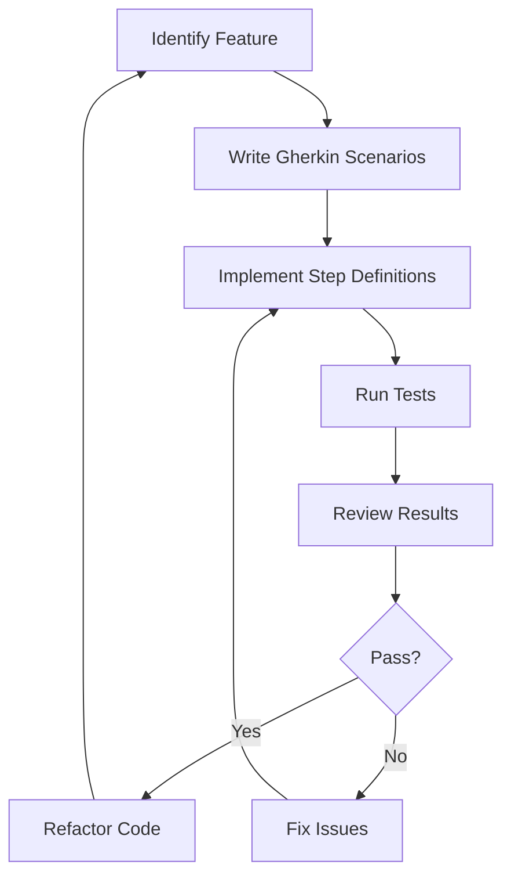

## 16.4 Behavior-Driven Development (BDD)

Behavior-Driven Development (BDD) is a collaborative approach to software development that emphasizes communication between developers, testers, and non-technical stakeholders. By focusing on the behavior of the application from the user's perspective, BDD helps ensure that the software meets the needs of its users. In this section, we will explore how BDD can be implemented in C++ using Cucumber-cpp and Gherkin, and how it aligns tests with requirements to improve software quality.

### Understanding Behavior-Driven Development

#### What is BDD?

Behavior-Driven Development (BDD) is an extension of Test-Driven Development (TDD) that encourages collaboration among developers, QA, and non-technical or business participants in a software project. BDD focuses on obtaining a clear understanding of desired software behavior through discussion with stakeholders. This understanding is then documented in a way that can be automatically tested.

#### Key Principles of BDD

1. **Collaboration**: BDD fosters communication between all parties involved in the development process, ensuring that everyone has a shared understanding of the requirements.
2. **Ubiquitous Language**: BDD promotes the use of a common language that can be understood by all stakeholders, bridging the gap between technical and non-technical team members.
3. **Executable Specifications**: BDD uses examples written in a natural language format to describe the behavior of the system. These examples serve as both documentation and automated tests.

### Introducing Cucumber-cpp and Gherkin

#### What is Cucumber-cpp?

Cucumber-cpp is a C++ implementation of the Cucumber tool, which is widely used for BDD in various programming languages. It allows developers to write BDD tests in C++ using the Gherkin language. Cucumber-cpp integrates with testing frameworks like Google Test or Boost.Test to execute these tests.

#### What is Gherkin?

Gherkin is a domain-specific language used to write BDD test cases. It is designed to be readable by non-technical stakeholders, using a simple syntax to describe the behavior of the system. Gherkin files, typically with a `.feature` extension, contain scenarios that describe how the system should behave in certain situations.

### Writing Gherkin Scenarios

Gherkin scenarios are structured as follows:

- **Feature**: A high-level description of a software feature.
- **Scenario**: A specific example or use case of the feature.
- **Given**: The initial context or state of the system.
- **When**: The action or event that triggers the behavior.
- **Then**: The expected outcome or result.

#### Example Gherkin Scenario

```gherkin
Feature: User login

  Scenario: Successful login with valid credentials
    Given the user is on the login page
    When the user enters valid credentials
    Then the user should be redirected to the dashboard
```

### Implementing BDD in C++ with Cucumber-cpp

#### Setting Up Cucumber-cpp

To use Cucumber-cpp, you need to set up your C++ project with the necessary dependencies. This involves installing Cucumber-cpp and integrating it with a testing framework like Google Test.

1. **Install Cucumber-cpp**: You can install Cucumber-cpp using package managers like Conan or by building it from source.
2. **Integrate with Google Test**: Link Cucumber-cpp with Google Test to execute your BDD scenarios.

#### Writing Step Definitions

Step definitions are C++ functions that implement the steps described in Gherkin scenarios. Each step in a Gherkin scenario corresponds to a step definition that performs the necessary actions and checks.

```cpp
#include <cucumber-cpp/defs.hpp>
#include <gtest/gtest.h>

GIVEN("^the user is on the login page$") {
    // Code to navigate to the login page
}

WHEN("^the user enters valid credentials$") {
    // Code to enter valid credentials
}

THEN("^the user should be redirected to the dashboard$") {
    // Code to verify redirection to the dashboard
    ASSERT_TRUE(isUserOnDashboard());
}
```

### Aligning Tests with Requirements

BDD helps align tests with requirements by ensuring that all scenarios are derived from user stories or requirements. This alignment ensures that the software behaves as expected from the user's perspective.

#### Benefits of Aligning Tests with Requirements

1. **Improved Communication**: BDD encourages collaboration and communication between developers, testers, and stakeholders, ensuring that everyone has a shared understanding of the requirements.
2. **Reduced Misunderstandings**: By using a common language and examples, BDD reduces the risk of misunderstandings between technical and non-technical team members.
3. **Increased Test Coverage**: BDD scenarios cover a wide range of use cases, ensuring that the software is thoroughly tested.

### Visualizing BDD Workflow

To better understand the BDD workflow, let's visualize the process using a flowchart.



**Figure 1**: BDD Workflow in C++ using Cucumber-cpp

### Best Practices for BDD in C++

1. **Collaborate Early and Often**: Engage stakeholders early in the process to gather requirements and write Gherkin scenarios together.
2. **Keep Scenarios Simple**: Write clear and concise scenarios that focus on the behavior of the system.
3. **Automate Tests**: Use Cucumber-cpp to automate the execution of Gherkin scenarios, ensuring that tests are run frequently.
4. **Refactor Regularly**: Refactor both code and tests to maintain readability and reduce technical debt.

### Challenges and Considerations

#### Common Challenges

1. **Complexity**: BDD can introduce complexity, especially in large projects with many stakeholders.
2. **Maintenance**: Keeping Gherkin scenarios and step definitions up-to-date can be challenging as the software evolves.
3. **Integration**: Integrating BDD tools like Cucumber-cpp with existing C++ projects may require additional setup and configuration.

#### Overcoming Challenges

1. **Use Tools and Frameworks**: Leverage tools like Cucumber-cpp to simplify the implementation of BDD in C++.
2. **Encourage Collaboration**: Foster a culture of collaboration and communication among team members to ensure that everyone is aligned.
3. **Invest in Training**: Provide training and resources to help team members understand and adopt BDD practices.

### Try It Yourself

To get hands-on experience with BDD in C++, try the following exercise:

1. **Set Up a C++ Project**: Create a new C++ project and install Cucumber-cpp and Google Test.
2. **Write a Gherkin Scenario**: Write a simple Gherkin scenario for a feature of your choice.
3. **Implement Step Definitions**: Implement the step definitions in C++ to execute the scenario.
4. **Run the Tests**: Use Cucumber-cpp to run the tests and verify that they pass.
5. **Experiment**: Modify the scenario or step definitions to explore different behaviors and outcomes.

### Knowledge Check

To reinforce your understanding of BDD in C++, consider the following questions:

1. What is the primary goal of Behavior-Driven Development?
2. How does Gherkin help in bridging the gap between technical and non-technical stakeholders?
3. What are the key components of a Gherkin scenario?
4. How can Cucumber-cpp be integrated with a C++ project?
5. What are some common challenges associated with BDD, and how can they be addressed?

### Conclusion

Behavior-Driven Development (BDD) is a powerful approach to software development that emphasizes collaboration and communication. By using tools like Cucumber-cpp and Gherkin, C++ developers can align tests with requirements and ensure that their software meets the needs of its users. As you continue to explore BDD, remember to focus on collaboration, simplicity, and automation to achieve the best results.

## Quiz Time!



### What is the primary goal of Behavior-Driven Development (BDD)?

- [x] To improve communication between stakeholders and developers
- [ ] To replace Test-Driven Development (TDD)
- [ ] To eliminate the need for automated testing
- [ ] To focus solely on technical requirements

> **Explanation:** BDD aims to improve communication between stakeholders and developers by using a common language and focusing on the behavior of the application.

### Which language is used to write BDD scenarios?

- [ ] HTML
- [ ] XML
- [x] Gherkin
- [ ] YAML

> **Explanation:** Gherkin is the domain-specific language used to write BDD scenarios, designed to be readable by non-technical stakeholders.

### What is the role of Cucumber-cpp in BDD?

- [ ] It is a testing framework for unit tests
- [x] It is a tool for executing BDD scenarios in C++
- [ ] It is a library for GUI development
- [ ] It is a version control system

> **Explanation:** Cucumber-cpp is a tool that allows developers to execute BDD scenarios written in Gherkin for C++ projects.

### What are the three main components of a Gherkin scenario?

- [x] Given, When, Then
- [ ] Start, Process, End
- [ ] Begin, Execute, Finish
- [ ] Input, Action, Output

> **Explanation:** A Gherkin scenario consists of "Given" (the initial context), "When" (the action), and "Then" (the expected outcome).

### How can BDD help align tests with requirements?

- [x] By using examples derived from user stories
- [ ] By focusing on code coverage
- [ ] By eliminating manual testing
- [ ] By automating deployment processes

> **Explanation:** BDD aligns tests with requirements by using examples derived from user stories, ensuring that the software behaves as expected from the user's perspective.

### What is a common challenge of implementing BDD in large projects?

- [ ] Lack of testing tools
- [ ] Insufficient code coverage
- [x] Complexity and maintenance
- [ ] Limited stakeholder involvement

> **Explanation:** BDD can introduce complexity and maintenance challenges, especially in large projects with many stakeholders and scenarios.

### How can Cucumber-cpp be integrated with a C++ project?

- [x] By linking it with a testing framework like Google Test
- [ ] By using it as a standalone application
- [ ] By replacing the main function
- [ ] By compiling it as a separate binary

> **Explanation:** Cucumber-cpp can be integrated with a C++ project by linking it with a testing framework like Google Test to execute BDD scenarios.

### What is the benefit of using a ubiquitous language in BDD?

- [x] It bridges the gap between technical and non-technical team members
- [ ] It simplifies code syntax
- [ ] It reduces the need for documentation
- [ ] It eliminates the need for meetings

> **Explanation:** A ubiquitous language in BDD helps bridge the gap between technical and non-technical team members, ensuring a shared understanding of requirements.

### What is a step definition in BDD?

- [ ] A unit test case
- [x] A C++ function implementing a Gherkin step
- [ ] A configuration file
- [ ] A database schema

> **Explanation:** A step definition is a C++ function that implements a Gherkin step, performing the necessary actions and checks.

### True or False: BDD scenarios should be written in a technical language.

- [ ] True
- [x] False

> **Explanation:** False. BDD scenarios should be written in a language that is understandable by all stakeholders, including non-technical team members.


