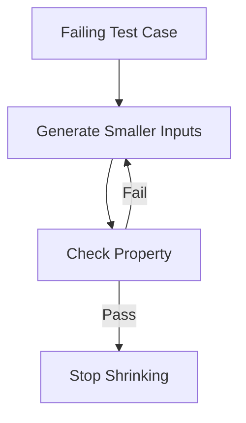

## 16.5 Property-Based Testing

In the realm of software testing, Property-Based Testing (PBT) stands out as a powerful methodology that shifts the focus from individual test cases to the properties that a system should uphold. This approach allows us to generate a wide range of inputs automatically, uncovering edge cases that traditional testing methods might overlook. In this section, we will delve into the concepts of Property-Based Testing, explore its implementation in C++ using frameworks like RapidCheck, and understand how it can be leveraged to discover edge cases effectively.

### Understanding Property-Based Testing

#### What is Property-Based Testing?

Property-Based Testing is a testing paradigm where tests are defined by properties that the software should satisfy, rather than specific input-output pairs. These properties are general statements about the expected behavior of the system. The testing framework then generates a multitude of random inputs to verify that these properties hold true across a broad spectrum of scenarios.

**Key Concepts:**
- **Properties**: Assertions about the behavior of the system that should always be true.
- **Input Generation**: Automatic generation of diverse and random inputs to test properties.
- **Shrinking**: The process of reducing failing test cases to the simplest example that still fails.

#### Benefits of Property-Based Testing

- **Comprehensive Coverage**: By generating a wide range of inputs, PBT can expose edge cases that might be missed by example-based tests.
- **Automation**: Reduces the manual effort required to write extensive test cases.
- **Robustness**: Encourages developers to think about the general properties of their code, leading to more robust implementations.

### Implementing Property-Based Testing in C++

#### Introducing RapidCheck

RapidCheck is a C++ framework for Property-Based Testing inspired by QuickCheck for Haskell. It allows developers to define properties and automatically generates test cases to validate these properties.

**Features of RapidCheck:**
- **Random Input Generation**: Generates random inputs for testing properties.
- **Shrinking**: Automatically simplifies failing test cases to minimal examples.
- **Integration**: Easily integrates with existing testing frameworks like Google Test.

#### Setting Up RapidCheck

To get started with RapidCheck, you need to include it in your project. You can do this by cloning the repository and linking it to your project, or by using a package manager like Conan.

```cpp
#include <rapidcheck.h>
#include <iostream>

// A simple property test
bool isPalindrome(const std::string &str) {
    return std::equal(str.begin(), str.begin() + str.size() / 2, str.rbegin());
}

int main() {
    rc::check("A palindrome should read the same forwards and backwards",
              [](const std::string &str) {
                  RC_ASSERT(isPalindrome(str) == isPalindrome(std::string(str.rbegin(), str.rend())));
              });
    return 0;
}
```

### Generating Inputs to Test Properties

#### Defining Properties

The first step in Property-Based Testing is to define the properties that your system should satisfy. These properties are typically high-level assertions about the behavior of the system.

**Example Property:**
- **Reversibility**: Reversing a string twice should yield the original string.

```cpp
rc::check("Reversing a string twice yields the original string",
          [](const std::string &str) {
              std::string reversed = std::string(str.rbegin(), str.rend());
              RC_ASSERT(str == std::string(reversed.rbegin(), reversed.rend()));
          });
```

#### Input Generators

RapidCheck provides a variety of built-in generators for common types like integers, strings, and containers. You can also define custom generators for more complex types.

**Custom Generator Example:**

```cpp
rc::Gen<std::pair<int, int>> genPair() {
    return rc::gen::arbitrary<int>().pairWith(rc::gen::arbitrary<int>());
}

// Using the custom generator
rc::check("Sum of pair elements should be commutative",
          [](const std::pair<int, int> &p) {
              RC_ASSERT(p.first + p.second == p.second + p.first);
          }, rc::gen::arbitrary<std::pair<int, int>>());
```

### Discovering Edge Cases

#### Shrinking Failing Test Cases

One of the most powerful features of Property-Based Testing is the ability to shrink failing test cases. When a test fails, RapidCheck will attempt to find the smallest input that still causes the failure, making it easier to diagnose the issue.

**Example of Shrinking:**

Suppose we have a property that fails for a specific input:

```cpp
rc::check("Division should be commutative",
          [](int a, int b) {
              RC_PRE(b != 0); // Precondition to avoid division by zero
              RC_ASSERT(a / b == b / a);
          });
```

If this property fails, RapidCheck will shrink the inputs to the smallest pair of integers that still cause the failure, helping you quickly identify the problem.

#### Visualizing the Shrinking Process



### Advanced Usage of RapidCheck

#### Combining Generators

You can combine multiple generators to create complex input scenarios. This is particularly useful when testing functions that operate on multiple types of data.

**Example:**

```cpp
auto genComplexData() {
    return rc::gen::map(rc::gen::arbitrary<std::string>(), rc::gen::arbitrary<int>());
}

rc::check("Complex data property",
          [](const std::map<std::string, int> &data) {
              // Property assertions for complex data
          }, genComplexData());
```

#### Integrating with Other Testing Frameworks

RapidCheck can be integrated with popular testing frameworks like Google Test, allowing you to leverage existing test infrastructure.

**Integration Example:**

```cpp
#include <gtest/gtest.h>
#include <rapidcheck/gtest.h>

RC_GTEST_PROP(MyTestSuite, MyProperty, (const std::vector<int> &vec)) {
    RC_ASSERT(std::is_sorted(vec.begin(), vec.end()));
}
```

### Challenges and Considerations

#### Defining Meaningful Properties

One of the challenges of Property-Based Testing is defining meaningful properties that accurately capture the expected behavior of the system. This requires a deep understanding of the system's requirements and invariants.

#### Performance Considerations

Generating a large number of test cases can be computationally expensive. It's important to balance the thoroughness of testing with the available computational resources.

### Try It Yourself

To get hands-on experience with Property-Based Testing, try modifying the examples provided:

- **Experiment with Custom Generators**: Create generators for complex data types specific to your application domain.
- **Define New Properties**: Think about the invariants in your system and define properties to test them.
- **Integrate with Your Test Suite**: Add Property-Based Tests to your existing test suite and observe how they complement traditional tests.

### Conclusion

Property-Based Testing is a powerful tool in the software testing arsenal, offering a systematic way to uncover edge cases and ensure the robustness of your code. By defining properties and leveraging frameworks like RapidCheck, you can automate the generation of diverse test cases, leading to more comprehensive and reliable testing. As you continue to explore Property-Based Testing, remember to define meaningful properties, experiment with input generators, and integrate this approach into your broader testing strategy.

## Quiz Time!



### What is the primary focus of Property-Based Testing?

- [x] Testing properties that a system should uphold
- [ ] Testing specific input-output pairs
- [ ] Testing only edge cases
- [ ] Testing performance

> **Explanation:** Property-Based Testing focuses on testing properties that should hold true for a system, rather than specific input-output pairs.

### Which framework is commonly used for Property-Based Testing in C++?

- [x] RapidCheck
- [ ] JUnit
- [ ] NUnit
- [ ] PyTest

> **Explanation:** RapidCheck is a popular framework for Property-Based Testing in C++.

### What is the process of reducing failing test cases to the simplest example called?

- [x] Shrinking
- [ ] Minimizing
- [ ] Reducing
- [ ] Simplifying

> **Explanation:** Shrinking is the process of reducing failing test cases to the simplest example that still fails.

### What is a key benefit of Property-Based Testing?

- [x] Comprehensive coverage through random input generation
- [ ] Faster execution time
- [ ] Easier to write than example-based tests
- [ ] Requires no setup

> **Explanation:** Property-Based Testing provides comprehensive coverage by generating a wide range of random inputs.

### What is a challenge of Property-Based Testing?

- [x] Defining meaningful properties
- [ ] Writing test cases
- [ ] Integrating with other frameworks
- [ ] Running tests

> **Explanation:** Defining meaningful properties that accurately capture the expected behavior of the system is a challenge in Property-Based Testing.

### Which of the following is a feature of RapidCheck?

- [x] Random input generation
- [ ] Built-in mocking
- [ ] Performance profiling
- [ ] Code coverage analysis

> **Explanation:** RapidCheck features random input generation for testing properties.

### How can RapidCheck be integrated with Google Test?

- [x] Using RC_GTEST_PROP
- [ ] Using RC_CHECK
- [ ] Using RC_ASSERT
- [ ] Using RC_TEST

> **Explanation:** RapidCheck can be integrated with Google Test using the RC_GTEST_PROP macro.

### What is a common use case for custom generators in RapidCheck?

- [x] Creating complex input scenarios
- [ ] Simplifying test cases
- [ ] Reducing execution time
- [ ] Increasing code coverage

> **Explanation:** Custom generators in RapidCheck are used to create complex input scenarios for testing.

### What is the purpose of the shrinking process in Property-Based Testing?

- [x] To simplify failing test cases
- [ ] To generate more test cases
- [ ] To improve performance
- [ ] To increase code coverage

> **Explanation:** The shrinking process simplifies failing test cases to make it easier to diagnose issues.

### True or False: Property-Based Testing is only useful for testing edge cases.

- [ ] True
- [x] False

> **Explanation:** Property-Based Testing is not only useful for testing edge cases; it tests a wide range of inputs to ensure properties hold true across many scenarios.


