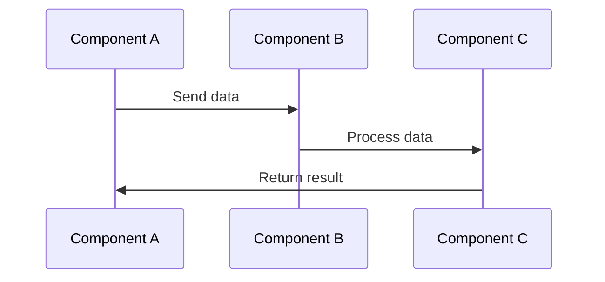

## 16.6 Integration Testing

Integration testing is a critical phase in the software development lifecycle where individual components or units are combined and tested as a group. The primary goal is to expose defects in the interaction between integrated units. This section will delve into the strategies and approaches for effective integration testing, particularly in the context of C++ applications, ensuring that your systems work seamlessly as a whole.

### Understanding Integration Testing

Integration testing is the process of verifying the interactions between different software modules. Unlike unit testing, which focuses on individual components, integration testing evaluates the combined behavior of these components. This type of testing is crucial for identifying issues that arise when components are integrated, such as interface mismatches, data format discrepancies, and incorrect assumptions about component behavior.

#### Why Integration Testing Matters

Integration testing is essential for several reasons:

- **Detecting Interface Defects:** It helps identify issues in the interfaces between components, ensuring that they communicate correctly.
- **Validating System Architecture:** It ensures that the system architecture supports the intended interactions and workflows.
- **Enhancing Reliability:** By catching integration issues early, it contributes to the overall reliability and robustness of the software.
- **Facilitating Incremental Development:** It supports incremental development approaches, such as Agile, by allowing continuous integration and testing of new components.

### Strategies for Effective Integration Testing

To conduct effective integration testing, it's important to adopt a structured approach. Here are some strategies to consider:

#### 1. **Top-Down Integration Testing**

In top-down integration testing, testing begins with the top-level modules and progresses downwards through the control hierarchy. This approach is particularly useful when the top-level modules are well-defined and stable.

- **Advantages:**
  - Early validation of high-level design and architecture.
  - Facilitates early detection of major design flaws.

- **Disadvantages:**
  - Requires stubs for lower-level modules, which can be time-consuming to create.
  - Lower-level modules are not tested until later stages.

```cpp
// Example of a stub in C++
class DatabaseStub {
public:
    bool connect() {
        // Simulate a successful connection
        return true;
    }
    std::string fetchData() {
        // Return mock data
        return "Sample Data";
    }
};
```

#### 2. **Bottom-Up Integration Testing**

Bottom-up integration testing starts with the lower-level modules and progresses upwards. This approach is beneficial when lower-level modules are complex and require thorough testing before integration.

- **Advantages:**
  - Thorough testing of lower-level modules before integration.
  - No need for stubs, as lower-level modules are tested directly.

- **Disadvantages:**
  - Delayed testing of top-level modules and overall system behavior.
  - Integration issues may not be detected until later stages.

```cpp
// Example of a driver in C++
class ApplicationDriver {
public:
    void run() {
        Database db;
        if (db.connect()) {
            std::cout << db.fetchData() << std::endl;
        }
    }
};
```

#### 3. **Sandwich Integration Testing**

Sandwich integration testing, also known as hybrid integration testing, combines top-down and bottom-up approaches. It allows simultaneous testing of top-level and bottom-level modules, meeting in the middle.

- **Advantages:**
  - Balanced approach that tests both high-level and low-level modules early.
  - Reduces the need for stubs and drivers.

- **Disadvantages:**
  - More complex to plan and execute.
  - Requires careful coordination between top-down and bottom-up testing teams.

#### 4. **Big Bang Integration Testing**

In big bang integration testing, all components are integrated simultaneously, and the entire system is tested as a whole. This approach is suitable for small systems with few components.

- **Advantages:**
  - Simple to execute, as all components are tested together.
  - No need for stubs or drivers.

- **Disadvantages:**
  - Difficult to isolate and identify defects.
  - High risk of missing critical integration issues.

### System Testing Approaches

System testing is the next logical step after integration testing. It involves testing the complete system to ensure it meets the specified requirements. Here are some system testing approaches to consider:

#### 1. **Functional Testing**

Functional testing verifies that the system performs its intended functions correctly. It focuses on the output generated in response to specific inputs.

- **Key Considerations:**
  - Ensure all functional requirements are covered.
  - Use real-world scenarios to validate functionality.

```cpp
// Example of a functional test case
void testLoginFunctionality() {
    User user("username", "password");
    assert(user.login() == true);
}
```

#### 2. **Performance Testing**

Performance testing evaluates the system's responsiveness, stability, and scalability under load. It is crucial for identifying bottlenecks and ensuring the system can handle expected user loads.

- **Key Considerations:**
  - Simulate realistic user loads and scenarios.
  - Monitor system metrics such as response time and throughput.

#### 3. **Security Testing**

Security testing assesses the system's ability to protect data and maintain functionality in the face of malicious attacks. It is essential for identifying vulnerabilities and ensuring data integrity.

- **Key Considerations:**
  - Test for common vulnerabilities such as SQL injection and cross-site scripting.
  - Ensure data encryption and secure authentication mechanisms are in place.

#### 4. **Usability Testing**

Usability testing evaluates the system's user interface and overall user experience. It ensures the system is intuitive and easy to use.

- **Key Considerations:**
  - Gather feedback from real users.
  - Focus on ease of navigation and accessibility.

#### 5. **Regression Testing**

Regression testing ensures that new changes do not adversely affect existing functionality. It involves re-running previously executed tests to verify that the system still behaves as expected.

- **Key Considerations:**
  - Automate regression tests to save time and effort.
  - Focus on areas of the system most likely to be affected by changes.

### Integration Testing in C++: Best Practices

When conducting integration testing in C++ applications, consider the following best practices:

#### 1. **Automate Tests**

Automate integration tests to improve efficiency and consistency. Use testing frameworks such as Google Test or Catch2 to streamline the testing process.

```cpp
// Example of an automated test using Google Test
#include <gtest/gtest.h>

TEST(DatabaseTest, Connect) {
    Database db;
    EXPECT_TRUE(db.connect());
}
```

#### 2. **Use Mock Objects**

Mock objects simulate the behavior of real objects, allowing you to test interactions without relying on actual implementations. They are particularly useful for testing components that depend on external systems.

```cpp
// Example of a mock object using Google Mock
#include <gmock/gmock.h>

class MockDatabase : public Database {
public:
    MOCK_METHOD(bool, connect, (), (override));
    MOCK_METHOD(std::string, fetchData, (), (override));
};
```

#### 3. **Focus on Interfaces**

When designing integration tests, focus on testing the interfaces between components. Ensure that data is passed correctly and that components interact as expected.

#### 4. **Test Incrementally**

Integrate and test components incrementally to identify issues early. This approach reduces the complexity of debugging and ensures that defects are caught before they propagate.

#### 5. **Maintain a Test Environment**

Maintain a dedicated test environment that mirrors the production environment as closely as possible. This setup ensures that tests are conducted under realistic conditions.

### Visualizing Integration Testing

To better understand the integration testing process, let's visualize it using a sequence diagram. This diagram illustrates the interactions between components during an integration test.



**Diagram Description:** This sequence diagram shows the flow of data between components A, B, and C during an integration test. Component A sends data to Component B, which processes it and forwards it to Component C. Component C then returns the result to Component A.

### Try It Yourself

To deepen your understanding of integration testing, try modifying the code examples provided. Experiment with creating your own stubs, drivers, and mock objects. Consider integrating additional components and testing their interactions.

### Knowledge Check

Before moving on, let's reinforce what we've learned:

- Explain the difference between top-down and bottom-up integration testing.
- Describe the role of mock objects in integration testing.
- List the key considerations for conducting functional testing.

### Embrace the Journey

Remember, integration testing is a journey, not a destination. As you continue to develop and test your C++ applications, you'll gain valuable insights into the interactions between components and the overall system architecture. Keep experimenting, stay curious, and enjoy the process!

## Quiz Time!



### What is the primary goal of integration testing?

- [x] To expose defects in the interaction between integrated units
- [ ] To test individual components in isolation
- [ ] To evaluate the system's performance under load
- [ ] To verify the system's security measures

> **Explanation:** Integration testing focuses on identifying issues that arise when components are combined and interact with each other.

### Which integration testing strategy involves testing from the top-level modules downwards?

- [x] Top-Down Integration Testing
- [ ] Bottom-Up Integration Testing
- [ ] Sandwich Integration Testing
- [ ] Big Bang Integration Testing

> **Explanation:** Top-Down Integration Testing begins with the top-level modules and progresses downwards through the control hierarchy.

### What is a disadvantage of the Big Bang Integration Testing approach?

- [x] Difficult to isolate and identify defects
- [ ] Requires stubs for lower-level modules
- [ ] Delayed testing of top-level modules
- [ ] More complex to plan and execute

> **Explanation:** In Big Bang Integration Testing, all components are integrated simultaneously, making it challenging to isolate and identify defects.

### What is the purpose of using mock objects in integration testing?

- [x] To simulate the behavior of real objects
- [ ] To automate test execution
- [ ] To test performance under load
- [ ] To verify system security

> **Explanation:** Mock objects simulate the behavior of real objects, allowing testers to focus on interactions without relying on actual implementations.

### Which system testing approach focuses on verifying the system's responsiveness and stability under load?

- [ ] Functional Testing
- [x] Performance Testing
- [ ] Security Testing
- [ ] Usability Testing

> **Explanation:** Performance Testing evaluates the system's responsiveness, stability, and scalability under load.

### Why is it important to maintain a dedicated test environment for integration testing?

- [x] To ensure tests are conducted under realistic conditions
- [ ] To reduce the need for stubs and drivers
- [ ] To simplify the testing process
- [ ] To automate test execution

> **Explanation:** A dedicated test environment that mirrors the production environment ensures that integration tests are conducted under realistic conditions.

### What is a key advantage of using Sandwich Integration Testing?

- [x] Balanced approach that tests both high-level and low-level modules early
- [ ] Simple to execute, as all components are tested together
- [ ] Thorough testing of lower-level modules before integration
- [ ] Early validation of high-level design and architecture

> **Explanation:** Sandwich Integration Testing combines top-down and bottom-up approaches, allowing simultaneous testing of top-level and bottom-level modules.

### What is the role of regression testing in system testing?

- [x] To ensure new changes do not adversely affect existing functionality
- [ ] To verify the system's security measures
- [ ] To evaluate the system's performance under load
- [ ] To test the user interface and overall user experience

> **Explanation:** Regression testing involves re-running previously executed tests to verify that the system still behaves as expected after changes.

### Which integration testing strategy requires the use of stubs for lower-level modules?

- [x] Top-Down Integration Testing
- [ ] Bottom-Up Integration Testing
- [ ] Sandwich Integration Testing
- [ ] Big Bang Integration Testing

> **Explanation:** Top-Down Integration Testing requires stubs for lower-level modules, as testing begins with the top-level modules.

### True or False: Integration testing focuses solely on testing individual components in isolation.

- [ ] True
- [x] False

> **Explanation:** Integration testing evaluates the combined behavior of components, focusing on their interactions rather than testing them in isolation.


