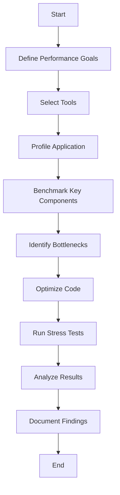

## 16.7 Performance Testing

Performance testing is a critical aspect of software development, especially in C++ programming, where efficiency and speed are paramount. In this section, we will delve into the various facets of performance testing, including profiling, benchmarking, identifying performance regressions, and stress testing. By mastering these techniques, you can ensure that your C++ applications are robust, scalable, and performant.

### Introduction to Performance Testing

Performance testing is the process of evaluating the speed, responsiveness, and stability of a software application under a particular workload. It is crucial for identifying bottlenecks, ensuring that applications meet performance criteria, and providing a baseline for future optimizations.

#### Key Objectives of Performance Testing

- **Identify Bottlenecks**: Detect areas in the code that cause slowdowns.
- **Ensure Scalability**: Verify that the application can handle increased loads.
- **Validate Performance Metrics**: Ensure that the application meets predefined performance goals.
- **Detect Performance Regressions**: Identify any degradation in performance from previous versions.

### Profiling and Benchmarking

Profiling and benchmarking are two fundamental techniques in performance testing. Profiling involves analyzing a program to determine which parts of the code consume the most resources, while benchmarking measures the performance of an application under specific conditions.

#### Profiling

Profiling provides insights into the runtime behavior of a program. It helps identify which functions or methods are consuming the most CPU time or memory. Profilers can be categorized into:

- **Instrumenting Profilers**: Modify the code to insert measurement instructions.
- **Sampling Profilers**: Periodically check the state of the program to gather data.

##### Tools for Profiling in C++

- **gprof**: A GNU profiler that provides a flat profile of the program's execution.
- **Valgrind**: A tool suite for debugging and profiling, particularly useful for memory profiling.
- **Visual Studio Profiler**: An integrated tool for profiling C++ applications on Windows.
- **Perf**: A powerful Linux profiling tool that provides detailed performance metrics.

###### Example: Using gprof

To use gprof, compile your C++ program with the `-pg` flag:

```cpp
g++ -pg -o my_program my_program.cpp
./my_program
gprof my_program gmon.out > analysis.txt
```

This will generate a file `analysis.txt` containing the profiling data.

#### Benchmarking

Benchmarking involves running a program or a part of a program to measure its performance. It provides a quantitative basis for comparing different implementations or configurations.

##### Techniques for Benchmarking

- **Microbenchmarking**: Focuses on small, isolated pieces of code.
- **Macrobenchmarking**: Evaluates the performance of the entire application.

###### Example: Simple Benchmarking in C++

```cpp
#include <iostream>
#include <chrono>

void functionToBenchmark() {
    // Simulate work
    for (volatile int i = 0; i < 1000000; ++i);
}

int main() {
    auto start = std::chrono::high_resolution_clock::now();
    functionToBenchmark();
    auto end = std::chrono::high_resolution_clock::now();
    std::chrono::duration<double> elapsed = end - start;
    std::cout << "Elapsed time: " << elapsed.count() << " seconds\n";
    return 0;
}
```

This example uses the `<chrono>` library to measure the execution time of `functionToBenchmark`.

### Identifying Performance Regressions

Performance regressions occur when changes to the codebase degrade the application's performance. Identifying and addressing these regressions is crucial for maintaining the performance of an application over time.

#### Strategies for Detecting Regressions

- **Automated Performance Tests**: Integrate performance tests into your CI/CD pipeline to catch regressions early.
- **Baseline Comparisons**: Compare current performance metrics against historical data.
- **Version Control Hooks**: Use hooks to trigger performance tests when specific files or directories change.

##### Example: Automated Performance Testing

Integrate performance tests with a CI/CD tool like Jenkins:

```bash
pipeline {
    agent any
    stages {
        stage('Build') {
            steps {
                sh 'make'
            }
        }
        stage('Test') {
            steps {
                sh './run_tests'
            }
        }
        stage('Performance Test') {
            steps {
                sh './run_performance_tests'
            }
        }
    }
}
```

This pipeline ensures that performance tests are run automatically after each build.

### Stress Testing

Stress testing evaluates how a system behaves under extreme conditions. It helps identify the breaking point of an application and ensures that it can handle unexpected spikes in load.

#### Objectives of Stress Testing

- **Determine System Limits**: Identify the maximum capacity of the system.
- **Ensure Graceful Degradation**: Verify that the system fails gracefully under stress.
- **Identify Bottlenecks**: Uncover hidden bottlenecks that only appear under heavy load.

##### Techniques for Stress Testing

- **Load Simulation**: Use tools to simulate high loads on the system.
- **Chaos Engineering**: Introduce failures and observe how the system responds.
- **Spike Testing**: Introduce sudden spikes in load to test system resilience.

###### Example: Stress Testing with Apache JMeter

Apache JMeter is a popular tool for stress testing web applications. Here's a basic setup:

1. **Create a Test Plan**: Define the number of users, ramp-up period, and loop count.
2. **Add Thread Group**: Simulate multiple users.
3. **Add HTTP Request**: Define the requests to be sent to the server.
4. **Add Listeners**: Collect and visualize the results.

### Visualizing Performance Testing

To better understand the process of performance testing, let's visualize the workflow using a flowchart.



*Figure 1: Performance Testing Workflow*

### Best Practices for Performance Testing

- **Define Clear Goals**: Establish specific performance criteria before testing.
- **Use Realistic Scenarios**: Simulate real-world usage patterns.
- **Automate Tests**: Integrate performance tests into your development workflow.
- **Iterate and Optimize**: Continuously refine your code based on test results.
- **Document Everything**: Keep detailed records of tests and findings for future reference.

### Common Challenges in Performance Testing

- **Environmental Variability**: Differences in hardware and software environments can affect test results.
- **Test Data Management**: Ensuring that test data accurately reflects production data.
- **Tool Limitations**: Selecting the right tools that fit your specific needs.
- **Complexity of Distributed Systems**: Testing applications that span multiple servers or services.

### Conclusion

Performance testing is an essential part of the software development lifecycle, particularly for C++ applications where efficiency is critical. By mastering profiling, benchmarking, identifying regressions, and stress testing, you can ensure that your applications perform optimally under various conditions. Remember, performance testing is not a one-time activity but an ongoing process that should be integrated into your development practices.

### Try It Yourself

Experiment with the profiling and benchmarking examples provided. Modify the code to test different functions or algorithms. Use tools like gprof or Valgrind to gather insights into your application's performance. Try creating your own stress tests using Apache JMeter or a similar tool. The more you practice, the more proficient you'll become at identifying and resolving performance issues.

## Quiz Time!



### What is the primary goal of performance testing?

- [x] Identify bottlenecks and ensure scalability
- [ ] Increase code readability
- [ ] Simplify code logic
- [ ] Reduce code size

> **Explanation:** Performance testing aims to identify bottlenecks and ensure that the application can scale to handle increased loads.

### Which tool is commonly used for profiling C++ applications on Linux?

- [x] gprof
- [ ] Visual Studio Profiler
- [ ] JMeter
- [ ] Jenkins

> **Explanation:** gprof is a GNU profiler commonly used for profiling C++ applications on Linux.

### What is the purpose of benchmarking?

- [x] Measure the performance of an application under specific conditions
- [ ] Identify syntax errors in the code
- [ ] Simplify code structure
- [ ] Enhance code readability

> **Explanation:** Benchmarking measures the performance of an application under specific conditions to provide a quantitative basis for comparison.

### What is a common strategy for detecting performance regressions?

- [x] Automated performance tests
- [ ] Manual code review
- [ ] Increasing code comments
- [ ] Reducing code size

> **Explanation:** Automated performance tests help detect performance regressions by comparing current performance metrics against historical data.

### What is the primary objective of stress testing?

- [x] Determine system limits and ensure graceful degradation
- [ ] Improve code readability
- [ ] Simplify code logic
- [ ] Reduce code size

> **Explanation:** Stress testing aims to determine system limits and ensure that the system can degrade gracefully under extreme conditions.

### Which tool is commonly used for stress testing web applications?

- [x] Apache JMeter
- [ ] gprof
- [ ] Valgrind
- [ ] Visual Studio Profiler

> **Explanation:** Apache JMeter is a popular tool for stress testing web applications.

### What is a key challenge in performance testing?

- [x] Environmental variability
- [ ] Code readability
- [ ] Syntax errors
- [ ] Code size

> **Explanation:** Environmental variability, such as differences in hardware and software environments, can affect test results.

### What is the benefit of automating performance tests?

- [x] Integrate tests into the development workflow
- [ ] Increase code readability
- [ ] Simplify code logic
- [ ] Reduce code size

> **Explanation:** Automating performance tests allows them to be integrated into the development workflow, ensuring consistent and timely testing.

### What is the purpose of profiling in performance testing?

- [x] Analyze runtime behavior and resource consumption
- [ ] Identify syntax errors
- [ ] Simplify code structure
- [ ] Enhance code readability

> **Explanation:** Profiling analyzes the runtime behavior of a program to determine which parts of the code consume the most resources.

### True or False: Performance testing is a one-time activity.

- [ ] True
- [x] False

> **Explanation:** Performance testing is an ongoing process that should be integrated into the development lifecycle to ensure continuous optimization.


