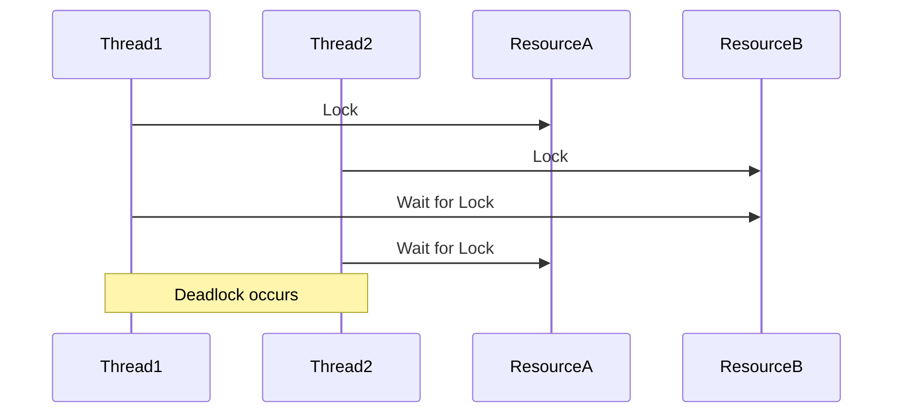

## 16.8 Concurrency Testing

Concurrency testing is a critical aspect of developing robust multithreaded applications in C++. As software engineers and architects, it is essential to ensure that your code is thread-safe and performs efficiently under concurrent execution. In this section, we will delve into the intricacies of concurrency testing, explore common pitfalls such as race conditions and deadlocks, and introduce tools like Thread Sanitizer to aid in the process.

### Understanding Concurrency in C++

Concurrency in C++ allows multiple threads to execute simultaneously, potentially improving the performance of applications by utilizing multi-core processors effectively. However, with this power comes complexity, as concurrent execution can lead to issues such as race conditions, deadlocks, and data corruption if not managed properly.

#### Key Concepts

- **Thread Safety**: Ensuring that shared data is accessed and modified correctly by multiple threads without causing data races or inconsistencies.
- **Race Conditions**: Occur when the outcome of a program depends on the sequence or timing of uncontrollable events such as thread scheduling.
- **Deadlocks**: Situations where two or more threads are unable to proceed because each is waiting for the other to release resources.

### Testing Multithreaded Code

Testing multithreaded code involves simulating concurrent execution to identify and resolve potential issues. This requires a combination of manual testing, automated testing, and specialized tools designed to detect concurrency-related problems.

#### Detecting Race Conditions

Race conditions are notoriously difficult to detect because they may not manifest consistently. They often depend on specific timing and thread scheduling, which can vary between runs. Here are some strategies to detect race conditions:

1. **Code Review and Static Analysis**: Manually reviewing code and using static analysis tools can help identify potential race conditions by highlighting shared data access patterns.

2. **Dynamic Analysis Tools**: Tools like Thread Sanitizer can dynamically analyze running programs to detect race conditions and other concurrency issues.

3. **Stress Testing**: Running the application under high load or with increased thread counts can increase the likelihood of race conditions manifesting.

4. **Instrumentation**: Adding logging or assertions to critical sections of code can help identify unexpected behavior or data corruption.

#### Detecting Deadlocks

Deadlocks occur when two or more threads are waiting indefinitely for resources held by each other. Detecting deadlocks involves:

1. **Lock Hierarchies**: Establishing a consistent order for acquiring locks can prevent circular wait conditions, a common cause of deadlocks.

2. **Timeouts**: Implementing timeouts for lock acquisition can help detect deadlocks by allowing threads to fail gracefully rather than wait indefinitely.

3. **Deadlock Detection Tools**: Tools like Thread Sanitizer can also detect deadlocks by monitoring lock acquisition and release patterns.

### Tools for Concurrency Testing

Several tools are available to aid in concurrency testing, each with its strengths and limitations. Here, we focus on Thread Sanitizer, a popular tool for detecting data races and deadlocks in C++ applications.

#### Thread Sanitizer

Thread Sanitizer (TSan) is a dynamic analysis tool that detects data races, deadlocks, and other concurrency issues in C++ programs. It is part of the LLVM and GCC toolchains and can be enabled with a simple compiler flag.

##### Using Thread Sanitizer

To use Thread Sanitizer, compile your C++ program with the `-fsanitize=thread` flag. For example:

```bash
g++ -fsanitize=thread -g -o my_program my_program.cpp
```

This command compiles `my_program.cpp` with Thread Sanitizer enabled, allowing it to detect concurrency issues at runtime.

##### Interpreting TSan Output

When a race condition or deadlock is detected, TSan provides detailed output, including the location of the issue and a stack trace. Here's an example of TSan output for a data race:

```
==================
WARNING: ThreadSanitizer: data race (pid=12345)
  Write of size 4 at 0x7f8e9c7f8c40 by thread T1:
    #0 MyClass::modifyData() my_program.cpp:42 (my_program+0x00000051c0)
    #1 main my_program.cpp:100 (my_program+0x00000051c0)

  Previous read of size 4 at 0x7f8e9c7f8c40 by thread T2:
    #0 MyClass::readData() my_program.cpp:55 (my_program+0x00000051c0)
    #1 main my_program.cpp:110 (my_program+0x00000051c0)

  Location is global 'sharedData' of size 4 at 0x7f8e9c7f8c40
==================
```

This output indicates a data race between two threads accessing `sharedData`. The stack trace helps pinpoint the exact location in the code where the issue occurs.

### Code Example: Detecting Race Conditions

Let's explore a simple example to demonstrate how race conditions can occur and how Thread Sanitizer can help detect them.

```cpp
#include <iostream>
#include <thread>
#include <vector>

class Counter {
public:
    void increment() {
        ++count;
    }

    int getCount() const {
        return count;
    }

private:
    int count = 0;
};

void incrementCounter(Counter& counter) {
    for (int i = 0; i < 1000; ++i) {
        counter.increment();
    }
}

int main() {
    Counter counter;
    std::vector<std::thread> threads;

    for (int i = 0; i < 10; ++i) {
        threads.emplace_back(incrementCounter, std::ref(counter));
    }

    for (auto& thread : threads) {
        thread.join();
    }

    std::cout << "Final count: " << counter.getCount() << std::endl;
    return 0;
}
```

In this example, multiple threads increment a shared `Counter` object. Running this code with Thread Sanitizer enabled will likely detect a data race, as the `increment` method modifies the shared `count` variable without synchronization.

### Addressing Concurrency Issues

Once concurrency issues are detected, the next step is to address them. Here are some strategies for resolving common concurrency problems:

#### Synchronization Primitives

1. **Mutexes**: Use `std::mutex` to protect shared data and ensure exclusive access by one thread at a time.

   ```cpp
   #include <mutex>

   class Counter {
   public:
       void increment() {
           std::lock_guard<std::mutex> lock(mutex_);
           ++count;
       }

       int getCount() const {
           std::lock_guard<std::mutex> lock(mutex_);
           return count;
       }

   private:
       int count = 0;
       mutable std::mutex mutex_;
   };
   ```

2. **Atomic Operations**: Use `std::atomic` for simple atomic operations that do not require complex locking mechanisms.

   ```cpp
   #include <atomic>

   class AtomicCounter {
   public:
       void increment() {
           ++count;
       }

       int getCount() const {
           return count.load();
       }

   private:
       std::atomic<int> count{0};
   };
   ```

#### Avoiding Deadlocks

1. **Lock Ordering**: Establish a consistent order for acquiring multiple locks to prevent circular wait conditions.

2. **Scoped Locks**: Use `std::lock` with `std::lock_guard` or `std::unique_lock` to acquire multiple locks simultaneously.

   ```cpp
   std::mutex mutex1, mutex2;

   void safeFunction() {
       std::lock(mutex1, mutex2);
       std::lock_guard<std::mutex> lock1(mutex1, std::adopt_lock);
       std::lock_guard<std::mutex> lock2(mutex2, std::adopt_lock);
       // Safe access to shared resources
   }
   ```

3. **Timeouts**: Implement timeouts for lock acquisition to detect and handle deadlocks gracefully.

### Try It Yourself

Experiment with the provided code examples by introducing and resolving race conditions and deadlocks. Modify the `Counter` class to use different synchronization techniques and observe the impact on concurrency issues.

### Visualizing Concurrency Issues

To better understand concurrency issues, let's visualize a simple scenario using a Mermaid.js sequence diagram. This diagram illustrates a potential deadlock situation involving two threads and two resources.



This diagram shows how Thread1 and Thread2 each hold a lock on one resource while waiting for the other, resulting in a deadlock.

### References and Further Reading

- [Thread Sanitizer Documentation](https://clang.llvm.org/docs/ThreadSanitizer.html)
- [C++ Multithreading Documentation](https://en.cppreference.com/w/cpp/thread)
- [Concurrency in C++: A Practical Guide](https://www.boost.org/doc/libs/1_79_0/doc/html/thread.html)

### Knowledge Check

To reinforce your understanding of concurrency testing, consider the following questions and challenges:

- What are the common causes of race conditions, and how can they be detected?
- How can deadlocks be prevented using lock hierarchies and timeouts?
- Experiment with the provided code examples by introducing different synchronization techniques. What impact do they have on concurrency issues?

### Embrace the Journey

Remember, mastering concurrency testing is a journey. As you progress, you'll build more robust and efficient multithreaded applications. Keep experimenting, stay curious, and enjoy the process of learning and improving your skills.

## Quiz Time!



### What is a race condition?

- [x] A situation where the outcome depends on the sequence or timing of uncontrollable events.
- [ ] A situation where two threads are waiting indefinitely for each other.
- [ ] A situation where a thread accesses a resource without proper synchronization.
- [ ] A situation where a program crashes due to a segmentation fault.

> **Explanation:** A race condition occurs when the outcome of a program depends on the sequence or timing of uncontrollable events, such as thread scheduling.

### What tool can be used to detect race conditions in C++?

- [x] Thread Sanitizer
- [ ] Valgrind
- [ ] GDB
- [ ] Clang-Tidy

> **Explanation:** Thread Sanitizer is a dynamic analysis tool that detects data races and other concurrency issues in C++ programs.

### How can deadlocks be prevented?

- [x] By establishing a consistent order for acquiring locks.
- [x] By implementing timeouts for lock acquisition.
- [ ] By using atomic operations.
- [ ] By avoiding multithreading altogether.

> **Explanation:** Deadlocks can be prevented by establishing a consistent order for acquiring locks and implementing timeouts for lock acquisition.

### What is the purpose of a mutex in multithreaded programming?

- [x] To protect shared data and ensure exclusive access by one thread at a time.
- [ ] To increase the execution speed of a program.
- [ ] To detect race conditions.
- [ ] To manage memory allocation.

> **Explanation:** A mutex is used to protect shared data and ensure exclusive access by one thread at a time, preventing data races.

### Which of the following is a benefit of using atomic operations?

- [x] They provide simple atomic operations without complex locking mechanisms.
- [ ] They increase the likelihood of race conditions.
- [ ] They require more memory than mutexes.
- [ ] They are slower than using mutexes.

> **Explanation:** Atomic operations provide simple atomic operations without complex locking mechanisms, making them efficient for certain tasks.

### What does the `-fsanitize=thread` flag do?

- [x] Enables Thread Sanitizer to detect concurrency issues in a C++ program.
- [ ] Optimizes the program for faster execution.
- [ ] Disables multithreading in the program.
- [ ] Compiles the program with debugging symbols.

> **Explanation:** The `-fsanitize=thread` flag enables Thread Sanitizer to detect concurrency issues in a C++ program.

### What is a deadlock?

- [x] A situation where two or more threads are unable to proceed because each is waiting for the other to release resources.
- [ ] A situation where a program crashes due to a segmentation fault.
- [ ] A situation where a thread accesses a resource without proper synchronization.
- [ ] A situation where the outcome depends on the sequence or timing of uncontrollable events.

> **Explanation:** A deadlock occurs when two or more threads are unable to proceed because each is waiting for the other to release resources.

### How can race conditions be detected?

- [x] By using dynamic analysis tools like Thread Sanitizer.
- [x] By manually reviewing code and using static analysis tools.
- [ ] By increasing the execution speed of a program.
- [ ] By avoiding multithreading altogether.

> **Explanation:** Race conditions can be detected by using dynamic analysis tools like Thread Sanitizer and manually reviewing code with static analysis tools.

### What is the role of `std::lock_guard` in C++?

- [x] To automatically acquire and release a mutex, ensuring exception safety.
- [ ] To increase the execution speed of a program.
- [ ] To detect race conditions.
- [ ] To manage memory allocation.

> **Explanation:** `std::lock_guard` automatically acquires and releases a mutex, ensuring exception safety by releasing the mutex when the `lock_guard` goes out of scope.

### True or False: Concurrency testing is only necessary for applications that use more than one thread.

- [ ] True
- [x] False

> **Explanation:** Concurrency testing is necessary for any application that may involve concurrent execution, including those that use asynchronous operations or interact with multithreaded libraries.




