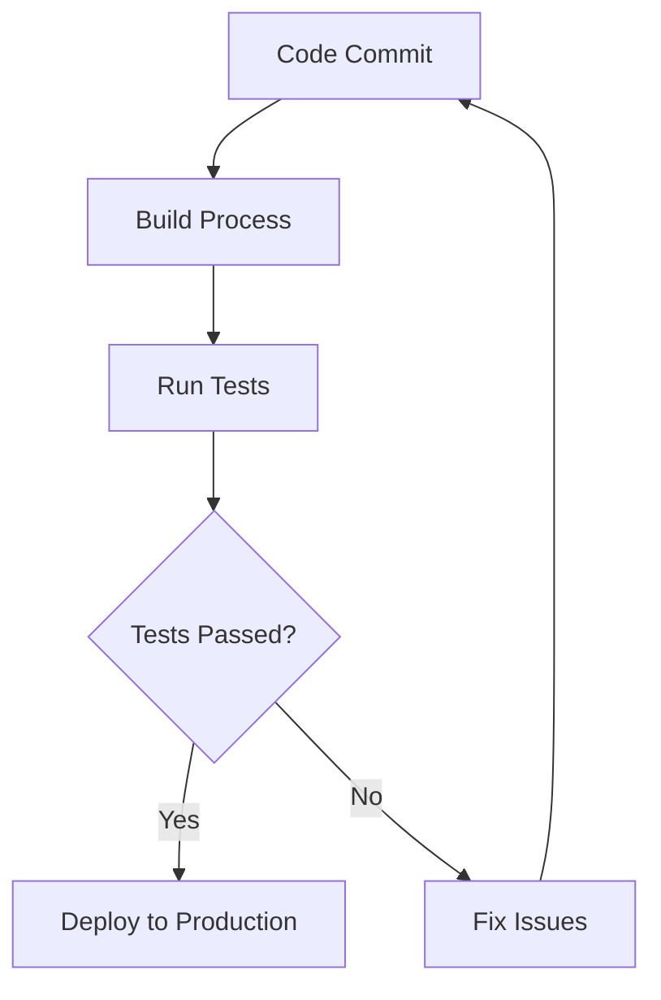

## 16.9 Continuous Testing in CI/CD Pipelines

In the fast-paced world of software development, ensuring the reliability and quality of your applications is paramount. Continuous Testing (CT) within Continuous Integration and Continuous Deployment (CI/CD) pipelines is a crucial practice that enables developers to automate testing processes, integrate changes seamlessly, and deliver robust software efficiently. In this section, we will delve into the concepts, tools, and best practices for implementing continuous testing in CI/CD pipelines, specifically tailored for C++ projects.

### Understanding Continuous Testing in CI/CD

**Continuous Testing** is the practice of executing automated tests as part of the software delivery pipeline to obtain immediate feedback on the business risks associated with a software release candidate. It involves integrating testing activities into every stage of the software development lifecycle, from code commit to production deployment.

**Continuous Integration (CI)** is a development practice where developers frequently integrate code into a shared repository, ideally several times a day. Each integration can then be verified by an automated build and testing process, allowing teams to detect problems early.

**Continuous Deployment (CD)** takes CI a step further by automatically deploying code changes to production once they pass the automated tests, ensuring that new features and bug fixes are delivered to users as soon as they are ready.

### Key Concepts of Continuous Testing

1. **Automation**: Automate as many testing processes as possible, including unit tests, integration tests, and system tests, to ensure quick feedback and reduce manual intervention.
   
2. **Integration**: Seamlessly integrate testing tools with CI/CD pipelines to ensure that tests are executed automatically with each code change.

3. **Reliability**: Ensure that tests are reliable and provide consistent results. Flaky tests can undermine the trust in the testing process and should be addressed promptly.

4. **Scalability**: Design tests and infrastructure to handle increased load as the project grows. This includes parallel test execution and efficient resource management.

5. **Feedback**: Provide immediate and actionable feedback to developers about the quality of their code, enabling them to address issues quickly.

### Setting Up Continuous Testing for C++ Projects

#### Step 1: Choose the Right Tools

Selecting the appropriate tools is crucial for effective continuous testing. Here are some popular tools and frameworks for C++ projects:

- **CMake**: A cross-platform build system that helps manage the build process of software using a compiler-independent method.
- **CTest**: A testing tool that integrates with CMake to automate the execution of tests.
- **Google Test**: A widely-used testing framework for C++ that supports unit testing and provides a rich set of assertions.
- **Catch2**: A modern, C++-native test framework for unit-tests, TDD, and BDD.
- **Jenkins**: An open-source automation server that supports building, deploying, and automating any project.
- **GitLab CI/CD**: A powerful CI/CD tool integrated with GitLab repositories.
- **Travis CI**: A hosted continuous integration service used to build and test software projects hosted on GitHub.

#### Step 2: Automate the Build Process

Automating the build process is the foundation of CI/CD pipelines. Use CMake to define the build configuration and dependencies for your C++ project. Here's a simple example of a `CMakeLists.txt` file:

```cmake
cmake_minimum_required(VERSION 3.10)

project(MyProject VERSION 1.0)

set(CMAKE_CXX_STANDARD 17)
set(CMAKE_CXX_STANDARD_REQUIRED True)

add_executable(MyExecutable main.cpp)

add_library(MyLibrary STATIC mylibrary.cpp)

target_link_libraries(MyExecutable PRIVATE MyLibrary)

enable_testing()

add_test(NAME MyTest COMMAND MyExecutable)
```

#### Step 3: Implement Automated Testing

Integrate testing frameworks like Google Test or Catch2 to write unit tests for your C++ code. Here's an example of a simple test using Google Test:

```cpp
#include <gtest/gtest.h>
#include "mylibrary.h"

TEST(MyLibraryTest, Addition) {
    EXPECT_EQ(add(2, 3), 5);
}

TEST(MyLibraryTest, Subtraction) {
    EXPECT_EQ(subtract(5, 3), 2);
}
```

Compile and run your tests using CTest:

```bash
cmake --build .

ctest --output-on-failure
```

#### Step 4: Integrate with CI/CD Tools

Integrate your build and test processes with CI/CD tools like Jenkins or GitLab CI/CD. Here's an example of a `.gitlab-ci.yml` configuration file for GitLab CI/CD:

```yaml
stages:
  - build
  - test

build:
  stage: build
  script:
    - cmake .
    - cmake --build .

test:
  stage: test
  script:
    - ctest --output-on-failure
```

#### Step 5: Ensure Test Reliability

Test reliability is crucial for continuous testing. Flaky tests can lead to false positives or negatives, undermining the trust in the testing process. Here are some strategies to ensure test reliability:

- **Isolate Tests**: Ensure that tests do not depend on each other or on external systems. Use mock objects or stubs to isolate dependencies.
- **Use Stable Data**: Avoid using live data in tests. Instead, use stable, controlled datasets to ensure consistent results.
- **Address Flaky Tests**: Identify and fix flaky tests promptly. Common causes include timing issues, race conditions, and reliance on external systems.

### Visualizing Continuous Testing in CI/CD Pipelines

To better understand the flow of continuous testing in CI/CD pipelines, let's visualize the process using a Mermaid.js flowchart:



**Figure 1: Continuous Testing Workflow in CI/CD Pipelines**

This flowchart illustrates the typical workflow of continuous testing in CI/CD pipelines. After a code commit, the build process is triggered, followed by automated tests. If the tests pass, the code is deployed to production. If not, issues are fixed, and the process starts again.

### Best Practices for Continuous Testing in CI/CD

1. **Maintain a Fast Feedback Loop**: Ensure that tests run quickly to provide immediate feedback to developers. This can be achieved by optimizing test execution time and running tests in parallel.

2. **Prioritize Tests**: Run critical tests first to catch major issues early. Use a test prioritization strategy to determine which tests should be executed first.

3. **Monitor Test Results**: Continuously monitor test results and trends to identify patterns and areas for improvement. Use dashboards and reports to visualize test outcomes.

4. **Implement Code Coverage**: Measure code coverage to ensure that tests adequately cover the codebase. Tools like `gcov` and `lcov` can be used to generate coverage reports for C++ projects.

5. **Foster a Testing Culture**: Encourage a culture of testing within your team. Promote the importance of writing and maintaining tests as an integral part of the development process.

### Try It Yourself

To gain hands-on experience with continuous testing in CI/CD pipelines, try the following exercises:

1. **Set Up a Simple CI/CD Pipeline**: Create a new C++ project and set up a CI/CD pipeline using GitLab CI/CD or Jenkins. Automate the build and test processes, and ensure that tests run automatically with each code commit.

2. **Write and Run Unit Tests**: Use Google Test or Catch2 to write unit tests for your C++ code. Integrate these tests into your CI/CD pipeline and ensure they run automatically.

3. **Optimize Test Execution Time**: Analyze the execution time of your tests and identify bottlenecks. Implement strategies to reduce test execution time, such as parallel test execution or test prioritization.

4. **Address Flaky Tests**: Identify any flaky tests in your project and investigate their causes. Implement solutions to stabilize these tests and ensure consistent results.

### References and Further Reading

- [Google Test Documentation](https://github.com/google/googletest)
- [Catch2 Documentation](https://github.com/catchorg/Catch2)
- [CMake Documentation](https://cmake.org/documentation/)
- [Jenkins Documentation](https://www.jenkins.io/doc/)
- [GitLab CI/CD Documentation](https://docs.gitlab.com/ee/ci/)

### Knowledge Check

1. **What is Continuous Testing, and why is it important in CI/CD pipelines?**

2. **How can you ensure test reliability in a CI/CD pipeline?**

3. **What are some popular tools for automating tests in C++ projects?**

4. **Explain the role of CMake and CTest in automating the build and test processes.**

5. **How can you visualize the workflow of continuous testing in CI/CD pipelines?**

### Embrace the Journey

Remember, mastering continuous testing in CI/CD pipelines is an ongoing journey. As you progress, you'll discover new tools, techniques, and strategies to enhance your testing processes. Keep experimenting, stay curious, and enjoy the journey!

## Quiz Time!



### What is the primary goal of continuous testing in CI/CD pipelines?

- [x] To provide immediate feedback on the business risks associated with a software release candidate.
- [ ] To ensure that all code is written in C++.
- [ ] To automate the deployment process.
- [ ] To eliminate the need for manual testing.

> **Explanation:** Continuous testing aims to provide immediate feedback on the risks associated with a software release, ensuring that issues are identified and addressed early in the development process.

### Which tool is commonly used for unit testing in C++ projects?

- [ ] Jenkins
- [x] Google Test
- [ ] CMake
- [ ] GitLab CI/CD

> **Explanation:** Google Test is a widely-used framework for unit testing in C++ projects, providing a rich set of assertions and tools for writing and running tests.

### What is a flaky test?

- [x] A test that produces inconsistent results.
- [ ] A test that always passes.
- [ ] A test that never runs.
- [ ] A test that is only used for integration testing.

> **Explanation:** A flaky test is one that produces inconsistent results, sometimes passing and sometimes failing, often due to timing issues or dependencies on external systems.

### How can you improve test execution time in a CI/CD pipeline?

- [x] By running tests in parallel.
- [ ] By writing more tests.
- [ ] By using live data in tests.
- [ ] By ignoring test failures.

> **Explanation:** Running tests in parallel can significantly reduce test execution time, providing faster feedback to developers.

### Which of the following is a best practice for continuous testing?

- [x] Prioritizing critical tests to run first.
- [ ] Running all tests at the end of the development cycle.
- [ ] Using live data for all tests.
- [ ] Ignoring flaky tests.

> **Explanation:** Prioritizing critical tests ensures that major issues are caught early, providing valuable feedback to developers.

### What is the role of CMake in a CI/CD pipeline?

- [x] To define the build configuration and dependencies for a C++ project.
- [ ] To deploy code to production.
- [ ] To monitor test results.
- [ ] To write unit tests.

> **Explanation:** CMake is used to define the build configuration and manage dependencies for C++ projects, automating the build process in CI/CD pipelines.

### How can you measure code coverage in a C++ project?

- [x] By using tools like `gcov` and `lcov`.
- [ ] By manually reviewing the code.
- [ ] By writing more tests.
- [ ] By using Jenkins.

> **Explanation:** Tools like `gcov` and `lcov` can be used to generate code coverage reports, helping ensure that tests adequately cover the codebase.

### What is the benefit of integrating testing tools with CI/CD pipelines?

- [x] It ensures that tests are executed automatically with each code change.
- [ ] It eliminates the need for manual testing.
- [ ] It guarantees that all tests will pass.
- [ ] It allows developers to skip writing tests.

> **Explanation:** Integrating testing tools with CI/CD pipelines ensures that tests are automatically executed with each code change, providing immediate feedback on code quality.

### What is the purpose of using mock objects in tests?

- [x] To isolate dependencies and ensure tests do not depend on external systems.
- [ ] To increase test execution time.
- [ ] To replace all real objects in the codebase.
- [ ] To ensure tests always pass.

> **Explanation:** Mock objects are used to isolate dependencies, ensuring that tests do not rely on external systems and can run consistently.

### True or False: Continuous Deployment automatically deploys code changes to production once they pass automated tests.

- [x] True
- [ ] False

> **Explanation:** Continuous Deployment extends Continuous Integration by automatically deploying code changes to production once they pass automated tests, ensuring that new features and bug fixes are delivered to users as soon as they are ready.


