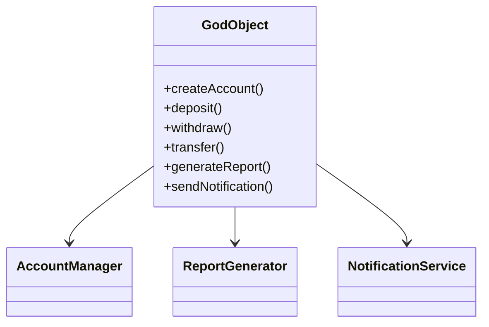
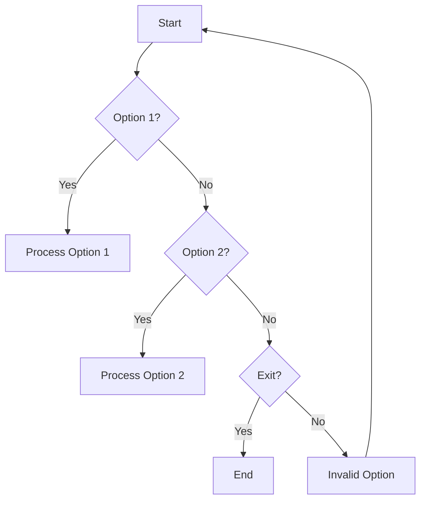
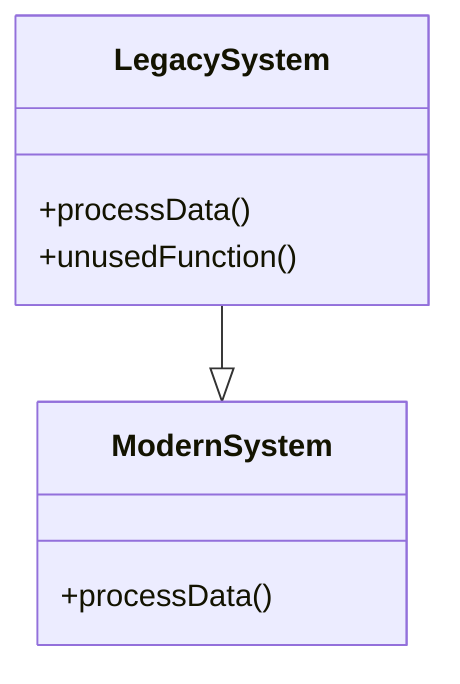
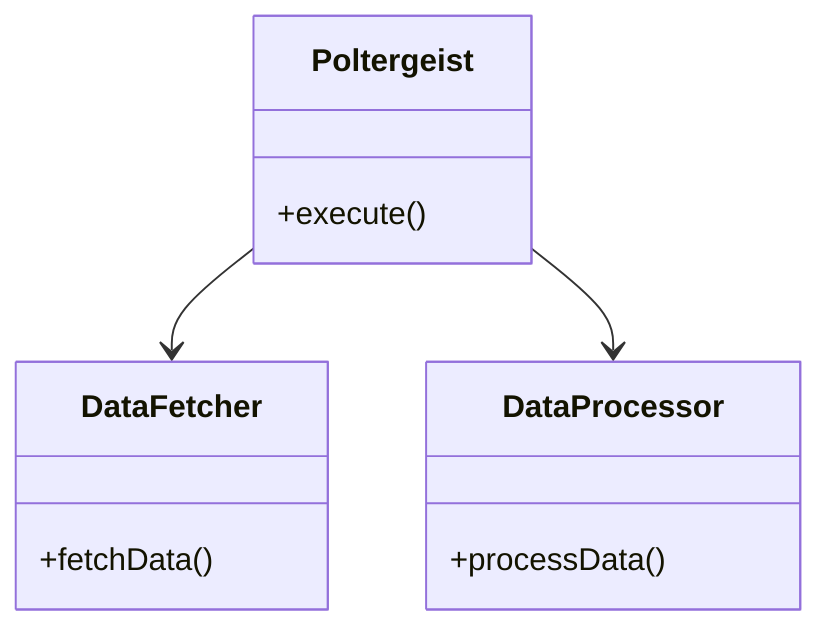

## 17.1 Recognizing Common Anti-Patterns

In the journey of mastering C++ design patterns, it is crucial to recognize and understand common anti-patterns. Anti-patterns are recurring solutions to common problems that are ineffective and counterproductive. They often arise from poor design choices and can lead to code that is difficult to maintain, understand, and extend. In this section, we will delve into some of the most prevalent anti-patterns in C++ development: God Object, Spaghetti Code, Lava Flow, and Poltergeist Classes. By understanding these anti-patterns, you can learn to identify and avoid them, leading to cleaner, more maintainable code.

### God Object

#### Intent

The God Object anti-pattern occurs when a single class takes on too many responsibilities, becoming overly complex and difficult to manage. This class often knows too much about the system and interacts with many other components, leading to tight coupling and reduced modularity.

#### Key Characteristics

- **Overloaded Responsibilities**: The class handles multiple unrelated tasks.
- **High Coupling**: The class is tightly coupled with many other classes.
- **Difficult to Maintain**: Changes in the class can have widespread effects.
- **Reduced Reusability**: The class cannot be easily reused in other contexts.

#### Code Example

Consider the following example of a God Object in a simple banking application:

```cpp
class BankSystem {
public:
    void createAccount(const std::string& name, double initialDeposit);
    void deposit(int accountId, double amount);
    void withdraw(int accountId, double amount);
    void transfer(int fromAccountId, int toAccountId, double amount);
    void generateReport();
    void sendNotification(const std::string& message);
    // Many more responsibilities...
};

// Usage
BankSystem bankSystem;
bankSystem.createAccount("Alice", 1000.0);
bankSystem.deposit(1, 500.0);
bankSystem.generateReport();
```

In this example, the `BankSystem` class is responsible for account management, transactions, reporting, and notifications. This violates the Single Responsibility Principle (SRP) and makes the class difficult to maintain and extend.

#### Design Considerations

To refactor a God Object, consider breaking it down into smaller, more focused classes that adhere to the SRP. For example:

```cpp
class AccountManager {
public:
    void createAccount(const std::string& name, double initialDeposit);
    void deposit(int accountId, double amount);
    void withdraw(int accountId, double amount);
};

class ReportGenerator {
public:
    void generateReport();
};

class NotificationService {
public:
    void sendNotification(const std::string& message);
};

// Usage
AccountManager accountManager;
accountManager.createAccount("Alice", 1000.0);
accountManager.deposit(1, 500.0);

ReportGenerator reportGenerator;
reportGenerator.generateReport();
```

By decomposing the `BankSystem` class into `AccountManager`, `ReportGenerator`, and `NotificationService`, we achieve better separation of concerns and improved maintainability.

### Spaghetti Code

#### Intent

Spaghetti Code refers to code with a complex and tangled control structure, often resulting from excessive use of goto statements, deep nesting, and lack of coherent structure. This anti-pattern makes the code difficult to follow and understand.

#### Key Characteristics

- **Lack of Structure**: The code lacks a clear and logical flow.
- **High Complexity**: The control flow is convoluted and difficult to trace.
- **Difficult to Debug**: Identifying and fixing bugs becomes challenging.
- **Poor Readability**: The code is hard to read and understand.

#### Code Example

Consider the following example of Spaghetti Code in a simple menu-driven application:

```cpp
#include <iostream>

void showMenu() {
    std::cout << "1. Option 1\n";
    std::cout << "2. Option 2\n";
    std::cout << "3. Exit\n";
}

void processOption(int option) {
    if (option == 1) {
        // Do something for option 1
        std::cout << "Processing Option 1\n";
        // More nested logic...
    } else if (option == 2) {
        // Do something for option 2
        std::cout << "Processing Option 2\n";
        // More nested logic...
    } else if (option == 3) {
        std::cout << "Exiting...\n";
        return;
    } else {
        std::cout << "Invalid option\n";
    }
}

int main() {
    int option;
    while (true) {
        showMenu();
        std::cout << "Enter option: ";
        std::cin >> option;
        processOption(option);
        if (option == 3) break;
    }
    return 0;
}
```

In this example, the control flow is tangled with nested if-else statements, making it difficult to follow and maintain.

#### Design Considerations

To refactor Spaghetti Code, aim to simplify the control flow and improve readability. Consider using functions or classes to encapsulate related logic:

```cpp
#include <iostream>
#include <unordered_map>
#include <functional>

void option1() {
    std::cout << "Processing Option 1\n";
    // Logic for option 1
}

void option2() {
    std::cout << "Processing Option 2\n";
    // Logic for option 2
}

int main() {
    std::unordered_map<int, std::function<void()>> options = {
        {1, option1},
        {2, option2}
    };

    int option;
    while (true) {
        std::cout << "1. Option 1\n";
        std::cout << "2. Option 2\n";
        std::cout << "3. Exit\n";
        std::cout << "Enter option: ";
        std::cin >> option;

        if (option == 3) {
            std::cout << "Exiting...\n";
            break;
        }

        auto it = options.find(option);
        if (it != options.end()) {
            it->second();
        } else {
            std::cout << "Invalid option\n";
        }
    }
    return 0;
}
```

This refactored code uses a map to associate options with functions, reducing complexity and improving readability.

### Lava Flow

#### Intent

Lava Flow refers to code that is difficult to remove or refactor because it is intertwined with other parts of the system. This often occurs when code is hastily written and lacks documentation, leading to "fossilized" code that remains in the system.

#### Key Characteristics

- **Intertwined Code**: The code is deeply embedded in the system.
- **Lack of Documentation**: The purpose and functionality of the code are unclear.
- **Difficult to Refactor**: Removing or changing the code is risky.
- **Accumulation of Dead Code**: Unused code remains in the system.

#### Code Example

Consider the following example of Lava Flow in a legacy system:

```cpp
class LegacySystem {
public:
    void processData() {
        // Complex and undocumented logic
        // ...
    }

    void unusedFunction() {
        // Code that is no longer used
        // ...
    }
};

// Usage
LegacySystem legacySystem;
legacySystem.processData();
```

In this example, the `LegacySystem` class contains undocumented and unused code, making it difficult to refactor or remove.

#### Design Considerations

To address Lava Flow, focus on improving documentation and gradually refactoring the code. Consider the following steps:

1. **Document the Code**: Add comments and documentation to clarify the purpose and functionality of the code.
2. **Identify Dead Code**: Use tools to identify and remove unused code.
3. **Refactor Incrementally**: Break down the code into smaller, manageable pieces and refactor them gradually.

```cpp
class ModernSystem {
public:
    void processData() {
        // Refactored and documented logic
        // ...
    }
};

// Usage
ModernSystem modernSystem;
modernSystem.processData();
```

By documenting and refactoring the code, we can transform a legacy system into a more maintainable and understandable one.

### Poltergeist Classes

#### Intent

Poltergeist Classes are classes that are short-lived and serve no real purpose, often acting as intermediaries between other classes. They add unnecessary complexity and can be eliminated without affecting the system.

#### Key Characteristics

- **Short-Lived**: The class is created and destroyed quickly.
- **Lack of Purpose**: The class does not add significant value.
- **Intermediary Role**: The class acts as a middleman between other classes.
- **Increased Complexity**: The class adds unnecessary complexity to the system.

#### Code Example

Consider the following example of a Poltergeist Class in a simple application:

```cpp
class DataFetcher {
public:
    std::string fetchData() {
        // Fetch data from a source
        return "data";
    }
};

class DataProcessor {
public:
    void processData(const std::string& data) {
        // Process the data
    }
};

class Poltergeist {
public:
    void execute() {
        DataFetcher fetcher;
        std::string data = fetcher.fetchData();
        DataProcessor processor;
        processor.processData(data);
    }
};

// Usage
Poltergeist poltergeist;
poltergeist.execute();
```

In this example, the `Poltergeist` class serves as an unnecessary intermediary between `DataFetcher` and `DataProcessor`.

#### Design Considerations

To eliminate Poltergeist Classes, consider integrating their functionality directly into the classes they interact with:

```cpp
class DataFetcher {
public:
    std::string fetchData() {
        // Fetch data from a source
        return "data";
    }
};

class DataProcessor {
public:
    void processData() {
        DataFetcher fetcher;
        std::string data = fetcher.fetchData();
        // Process the data
    }
};

// Usage
DataProcessor processor;
processor.processData();
```

By integrating the functionality of the `Poltergeist` class into `DataProcessor`, we reduce complexity and improve the design.

### Visualizing Anti-Patterns

To better understand the relationships and issues associated with these anti-patterns, let's visualize them using Mermaid.js diagrams.

#### God Object Diagram



**Description**: This diagram illustrates the God Object pattern, where a single class (`GodObject`) is responsible for multiple unrelated tasks. The refactored design separates these responsibilities into distinct classes (`AccountManager`, `ReportGenerator`, `NotificationService`).

#### Spaghetti Code Diagram



**Description**: This flowchart represents the tangled control flow of Spaghetti Code. The refactored design simplifies the flow by using a map to associate options with functions.

#### Lava Flow Diagram



**Description**: This diagram shows the transition from a legacy system with Lava Flow to a modern system with refactored and documented code.

#### Poltergeist Classes Diagram



**Description**: This diagram illustrates the Poltergeist Class pattern, where a class (`Poltergeist`) acts as an unnecessary intermediary. The refactored design integrates its functionality directly into `DataProcessor`.

### Try It Yourself

To deepen your understanding of these anti-patterns, try refactoring the provided code examples. Experiment with breaking down the God Object into smaller classes, simplifying the control flow of Spaghetti Code, documenting and refactoring Lava Flow, and eliminating Poltergeist Classes. By doing so, you'll gain practical experience in recognizing and addressing these common anti-patterns.

### Knowledge Check

- **Question**: What is the primary issue with a God Object?
  - [ ] It uses too many resources.
  - [x] It takes on too many responsibilities.
  - [ ] It is difficult to instantiate.
  - [ ] It lacks a user interface.

- **Question**: How can you refactor Spaghetti Code?
  - [x] Simplify the control flow and use functions or classes to encapsulate logic.
  - [ ] Add more comments to explain the code.
  - [ ] Increase the use of goto statements.
  - [ ] Use more global variables.

- **Question**: What is a key characteristic of Lava Flow?
  - [ ] It is well-documented.
  - [ ] It is easy to refactor.
  - [x] It is deeply embedded in the system.
  - [ ] It is highly efficient.

- **Question**: How can Poltergeist Classes be eliminated?
  - [ ] By adding more methods to them.
  - [x] By integrating their functionality into other classes.
  - [ ] By making them singleton classes.
  - [ ] By increasing their lifespan.

### Summary

Recognizing and addressing common anti-patterns is crucial for writing clean, maintainable C++ code. By understanding the characteristics and consequences of God Object, Spaghetti Code, Lava Flow, and Poltergeist Classes, you can improve your code's design and avoid common pitfalls. Remember, this is just the beginning. As you progress, you'll build more robust and scalable applications. Keep experimenting, stay curious, and enjoy the journey!

## Quiz Time!



### What is the primary issue with a God Object?

- [x] It takes on too many responsibilities.
- [ ] It uses too many resources.
- [ ] It is difficult to instantiate.
- [ ] It lacks a user interface.

> **Explanation:** A God Object takes on too many responsibilities, violating the Single Responsibility Principle and making the class difficult to maintain and extend.

### How can you refactor Spaghetti Code?

- [x] Simplify the control flow and use functions or classes to encapsulate logic.
- [ ] Add more comments to explain the code.
- [ ] Increase the use of goto statements.
- [ ] Use more global variables.

> **Explanation:** Refactoring Spaghetti Code involves simplifying the control flow and using functions or classes to encapsulate related logic, improving readability and maintainability.

### What is a key characteristic of Lava Flow?

- [ ] It is well-documented.
- [ ] It is easy to refactor.
- [x] It is deeply embedded in the system.
- [ ] It is highly efficient.

> **Explanation:** Lava Flow is characterized by code that is deeply embedded in the system, making it difficult to remove or refactor.

### How can Poltergeist Classes be eliminated?

- [ ] By adding more methods to them.
- [x] By integrating their functionality into other classes.
- [ ] By making them singleton classes.
- [ ] By increasing their lifespan.

> **Explanation:** Poltergeist Classes can be eliminated by integrating their functionality directly into the classes they interact with, reducing complexity.

### Which of the following is NOT a characteristic of Spaghetti Code?

- [ ] Lack of Structure
- [x] Modular Design
- [ ] High Complexity
- [ ] Poor Readability

> **Explanation:** Spaghetti Code is characterized by a lack of structure, high complexity, and poor readability, not modular design.

### What is the main problem with a God Object in terms of coupling?

- [x] It is tightly coupled with many other classes.
- [ ] It is loosely coupled with other classes.
- [ ] It has no coupling with other classes.
- [ ] It only couples with user interfaces.

> **Explanation:** A God Object is tightly coupled with many other classes, leading to reduced modularity and maintainability.

### What is the impact of Lava Flow on code refactoring?

- [x] It makes refactoring difficult and risky.
- [ ] It simplifies the refactoring process.
- [ ] It has no impact on refactoring.
- [ ] It makes refactoring unnecessary.

> **Explanation:** Lava Flow makes refactoring difficult and risky due to the intertwined nature of the code and lack of documentation.

### Why is Spaghetti Code difficult to debug?

- [x] The control flow is convoluted and difficult to trace.
- [ ] It has too many comments.
- [ ] It uses too many functions.
- [ ] It is written in a low-level language.

> **Explanation:** Spaghetti Code is difficult to debug because the control flow is convoluted and difficult to trace, making it hard to identify and fix bugs.

### What is a common consequence of Poltergeist Classes?

- [x] Increased complexity in the system.
- [ ] Improved performance.
- [ ] Reduced memory usage.
- [ ] Enhanced security.

> **Explanation:** Poltergeist Classes increase complexity in the system by acting as unnecessary intermediaries.

### True or False: A God Object adheres to the Single Responsibility Principle.

- [ ] True
- [x] False

> **Explanation:** False. A God Object violates the Single Responsibility Principle by taking on multiple unrelated responsibilities.


