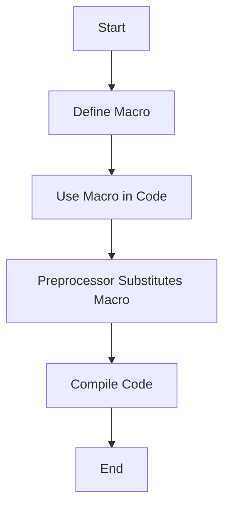

## 17.10 Overuse of Macros

In the realm of C++ programming, macros have long been a tool of convenience and power, allowing developers to define code snippets that can be reused throughout a program. However, with great power comes great responsibility. Overusing macros can lead to code that is difficult to read, debug, and maintain. In this section, we will delve into the risks associated with macros and explore safer, more efficient alternatives such as inline functions and templates.

### Understanding Macros in C++

Macros are a feature of the C++ preprocessor, which allows developers to define code that can be inserted into other parts of a program. They are defined using the `#define` directive and can be used to create constants, functions, and even complex code structures.

```cpp
#define PI 3.14159
#define SQUARE(x) ((x) * (x))
```

In the above example, `PI` is a macro that represents a constant value, while `SQUARE(x)` is a macro function that calculates the square of a number.

#### Key Characteristics of Macros

- **Textual Substitution**: Macros perform a simple text substitution before the actual compilation process begins. This means they do not respect C++ scope rules and can lead to unexpected behavior if not used carefully.
- **No Type Checking**: Macros do not perform type checking, which can lead to errors that are difficult to diagnose.
- **Global Scope**: Macros are globally scoped, which means they can interfere with other parts of the program if not named carefully.

### Risks Associated with Macros

While macros can be useful, they come with several risks that can lead to problematic code.

#### Lack of Type Safety

Macros do not perform type checking, which can lead to subtle bugs. Consider the following macro:

```cpp
#define MAX(a, b) ((a) > (b) ? (a) : (b))
```

If `MAX` is used with different types, it can lead to unexpected behavior or compilation errors.

#### Unexpected Side Effects

Macros can lead to unexpected side effects due to their textual substitution nature. For example:

```cpp
#define INCREMENT(x) (x + 1)

int a = 5;
int b = INCREMENT(a++);
```

In this case, `b` will not be `6` as one might expect, but `7`, because the macro expands to `(a++ + 1)`, incrementing `a` twice.

#### Debugging Challenges

Macros can make debugging difficult because they do not appear in the compiled code. This can make it challenging to trace errors back to their source in the macro definition.

#### Code Readability and Maintainability

Macros can obscure the intent of the code, making it harder for other developers to understand and maintain. This is especially true for complex macros that perform multiple operations.

### Alternatives to Macros

To mitigate the risks associated with macros, C++ offers several alternatives that provide better type safety, readability, and maintainability.

#### Inline Functions

Inline functions are a safer alternative to macro functions. They provide type checking and scope rules, making them more predictable and easier to debug.

```cpp
inline int square(int x) {
    return x * x;
}
```

Inline functions are expanded at compile time, similar to macros, but they respect C++'s type system and scoping rules.

#### Templates

Templates are another powerful alternative to macros, especially for generic programming. They allow you to write type-safe, reusable code that can work with any data type.

```cpp
template <typename T>
T max(T a, T b) {
    return (a > b) ? a : b;
}
```

Templates provide compile-time type checking and can be used to create complex, type-safe abstractions.

### When to Use Macros

While macros have their drawbacks, there are situations where they can be useful:

- **Conditional Compilation**: Macros are often used for conditional compilation, allowing code to be included or excluded based on certain conditions.

```cpp
#ifdef DEBUG
#define LOG(x) std::cout << x << std::endl
#else
#define LOG(x)
#endif
```

- **Header Guards**: Macros are commonly used to prevent multiple inclusions of a header file.

```cpp
#ifndef MY_HEADER_H
#define MY_HEADER_H

// Header content

#endif // MY_HEADER_H
```

### Design Considerations

When deciding whether to use macros, consider the following:

- **Complexity**: Avoid using macros for complex operations. Use inline functions or templates instead.
- **Readability**: Ensure that macros are well-documented and easy to understand.
- **Scope**: Be mindful of the global scope of macros and choose names that are unlikely to conflict with other parts of the program.

### Differences and Similarities

Macros are often compared to inline functions and templates. While they share some similarities, such as compile-time expansion, they differ in several key ways:

- **Type Safety**: Inline functions and templates provide type safety, while macros do not.
- **Scope**: Inline functions and templates respect C++ scope rules, while macros do not.
- **Debugging**: Inline functions and templates are easier to debug because they appear in the compiled code, unlike macros.

### Code Examples

Let's explore some code examples to illustrate the differences between macros, inline functions, and templates.

#### Macro Example

```cpp
#define ADD(x, y) ((x) + (y))

int main() {
    int result = ADD(5, 3);
    std::cout << "Result: " << result << std::endl;
    return 0;
}
```

#### Inline Function Example

```cpp
inline int add(int x, int y) {
    return x + y;
}

int main() {
    int result = add(5, 3);
    std::cout << "Result: " << result << std::endl;
    return 0;
}
```

#### Template Example

```cpp
template <typename T>
T add(T x, T y) {
    return x + y;
}

int main() {
    int result = add(5, 3);
    std::cout << "Result: " << result << std::endl;
    return 0;
}
```

### Visualizing Macro Expansion

To better understand how macros work, let's visualize the process of macro expansion using a flowchart.



**Figure 1**: The process of macro expansion in C++.

### Try It Yourself

Experiment with the code examples provided. Try modifying the macro, inline function, and template examples to see how they behave with different types and operations. Consider the following challenges:

- Modify the `SQUARE` macro to handle negative numbers correctly.
- Implement a template function that calculates the maximum of three values.
- Use an inline function to perform a complex mathematical operation.

### References and Links

For further reading on macros and their alternatives, consider the following resources:

- [C++ Reference: Preprocessor Directives](https://en.cppreference.com/w/cpp/preprocessor)
- [C++ Templates: The Complete Guide](https://www.amazon.com/Cpp-Templates-Complete-Guide/dp/0321714121)
- [Effective C++: 55 Specific Ways to Improve Your Programs and Designs](https://www.amazon.com/Effective-Specific-Improve-Programs-Designs/dp/0321334876)

### Knowledge Check

- What are the main risks associated with using macros in C++?
- How do inline functions provide better type safety compared to macros?
- In what situations are macros still useful in modern C++ programming?

### Embrace the Journey

Remember, mastering C++ is a journey, not a destination. By understanding the risks associated with macros and embracing safer alternatives like inline functions and templates, you'll be well on your way to writing robust, maintainable code. Keep experimenting, stay curious, and enjoy the journey!

## Quiz Time!



### What is a primary risk of using macros in C++?

- [x] Lack of type safety
- [ ] Increased compilation time
- [ ] Reduced code readability
- [ ] Limited functionality

> **Explanation:** Macros do not perform type checking, which can lead to subtle bugs and unexpected behavior.

### Which alternative to macros provides type safety?

- [x] Inline functions
- [ ] Preprocessor directives
- [ ] Conditional compilation
- [ ] Global variables

> **Explanation:** Inline functions provide type safety by respecting C++'s type system and scoping rules.

### What is a common use case for macros in C++?

- [x] Conditional compilation
- [ ] Memory management
- [ ] Function overloading
- [ ] Exception handling

> **Explanation:** Macros are often used for conditional compilation, allowing code to be included or excluded based on certain conditions.

### How do templates differ from macros?

- [x] Templates provide type safety
- [ ] Templates are faster to compile
- [ ] Templates have global scope
- [ ] Templates are easier to debug

> **Explanation:** Templates provide type safety and are expanded at compile time, unlike macros which are simple text substitutions.

### What is a benefit of using inline functions over macros?

- [x] Better readability and maintainability
- [ ] Faster execution time
- [ ] Reduced memory usage
- [ ] Increased code complexity

> **Explanation:** Inline functions improve readability and maintainability by providing type safety and respecting scope rules.

### Which of the following is not a characteristic of macros?

- [x] Type checking
- [ ] Textual substitution
- [ ] Global scope
- [ ] Lack of debugging support

> **Explanation:** Macros do not perform type checking, which is a key characteristic of inline functions and templates.

### What is a potential side effect of using macros?

- [x] Unexpected behavior due to lack of scope rules
- [ ] Increased execution time
- [ ] Reduced code modularity
- [ ] Improved error messages

> **Explanation:** Macros can lead to unexpected behavior because they do not respect C++ scope rules.

### When is it appropriate to use macros?

- [x] For header guards
- [ ] For complex mathematical operations
- [ ] For memory management
- [ ] For exception handling

> **Explanation:** Macros are commonly used for header guards to prevent multiple inclusions of a header file.

### How do inline functions improve code compared to macros?

- [x] By providing type safety and scope rules
- [ ] By reducing compilation time
- [ ] By increasing execution speed
- [ ] By simplifying syntax

> **Explanation:** Inline functions provide type safety and respect C++ scope rules, making them safer and more predictable than macros.

### True or False: Macros are expanded at runtime.

- [ ] True
- [x] False

> **Explanation:** Macros are expanded at compile time, not runtime, as they are processed by the preprocessor before the actual compilation.


