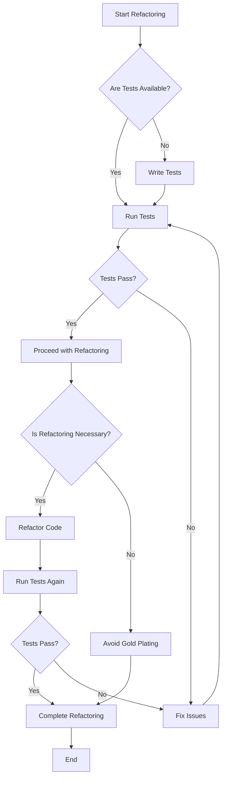

## 17.11 Refactoring Anti-Patterns

Refactoring is a critical practice in software development that involves restructuring existing code without changing its external behavior. It aims to improve the non-functional attributes of the software, such as readability, maintainability, and performance. However, when done improperly, refactoring can introduce new problems, leading to what are known as "refactoring anti-patterns." In this section, we will delve into common refactoring anti-patterns in C++ development, focusing on big refactoring without tests and gold plating. We will also explore strategies for improving code quality effectively.

### Understanding Refactoring Anti-Patterns

Refactoring anti-patterns are practices that developers might fall into during the refactoring process, which can lead to negative outcomes. These anti-patterns often arise from a lack of planning, insufficient testing, or an overzealous approach to improving code. Recognizing and avoiding these anti-patterns is crucial for maintaining the integrity and quality of the software.

### Big Refactoring Without Tests

#### The Pitfall

Big refactoring without tests is a common anti-pattern where developers undertake extensive code changes without having a comprehensive suite of tests to ensure that the refactored code behaves as expected. This approach is risky because it can introduce subtle bugs that are difficult to detect and fix.

#### Why It Happens

- **Lack of Testing Culture**: In some development environments, there may be a lack of emphasis on writing tests, leading to insufficient test coverage.
- **Time Pressure**: Developers may feel pressured to deliver changes quickly, leading them to skip writing or updating tests.
- **Overconfidence**: Developers might be overconfident in their understanding of the codebase, assuming that their changes won't introduce errors.

#### Consequences

- **Increased Bugs**: Without tests, it's challenging to verify that the refactored code works correctly, leading to an increased likelihood of bugs.
- **Regression Issues**: Changes might inadvertently break existing functionality, causing regression issues.
- **Difficult Debugging**: Without tests, identifying and fixing bugs in the refactored code becomes more challenging.

#### Strategies to Avoid This Anti-Pattern

1. **Adopt Test-Driven Development (TDD)**: Encourage a culture of writing tests before making code changes. TDD helps ensure that tests are in place to verify the correctness of the code.

2. **Incremental Refactoring**: Break down the refactoring process into smaller, manageable changes. This approach allows for testing each change individually, reducing the risk of introducing bugs.

3. **Automated Testing Tools**: Utilize automated testing tools to run tests continuously. This practice helps catch errors early in the development process.

4. **Code Coverage Analysis**: Use tools to analyze code coverage and identify areas lacking tests. Aim to improve test coverage before undertaking significant refactoring efforts.

5. **Peer Reviews and Pair Programming**: Engage in peer reviews and pair programming to ensure that code changes are scrutinized and tested thoroughly.

#### Example: Refactoring Without Tests

Consider a scenario where a developer decides to refactor a complex algorithm in a C++ application without having adequate tests in place. The following code snippet illustrates a simple algorithm before refactoring:

```cpp
#include <iostream>
#include <vector>
#include <algorithm>

// Original function to find the maximum element in a vector
int findMax(const std::vector<int>& numbers) {
    int max = numbers[0];
    for (size_t i = 1; i < numbers.size(); ++i) {
        if (numbers[i] > max) {
            max = numbers[i];
        }
    }
    return max;
}

int main() {
    std::vector<int> numbers = {3, 1, 4, 1, 5, 9, 2, 6, 5};
    std::cout << "Maximum: " << findMax(numbers) << std::endl;
    return 0;
}
```

The developer decides to refactor the `findMax` function using the `std::max_element` algorithm:

```cpp
#include <iostream>
#include <vector>
#include <algorithm>

// Refactored function to find the maximum element in a vector
int findMax(const std::vector<int>& numbers) {
    return *std::max_element(numbers.begin(), numbers.end());
}

int main() {
    std::vector<int> numbers = {3, 1, 4, 1, 5, 9, 2, 6, 5};
    std::cout << "Maximum: " << findMax(numbers) << std::endl;
    return 0;
}
```

Without tests, the developer cannot verify that the refactored function behaves the same as the original. If there are edge cases or specific conditions not accounted for, the refactored code might introduce bugs.

### Gold Plating

#### The Pitfall

Gold plating refers to the practice of adding unnecessary features or enhancements to the code that do not provide significant value to the end-user or the business. This anti-pattern often results from a desire to perfect the code or implement features that developers find interesting but are not required.

#### Why It Happens

- **Perfectionism**: Developers may have a strong desire to perfect the code, leading them to add features that are not essential.
- **Miscommunication**: A lack of clear requirements or communication with stakeholders can lead to developers implementing features that are not needed.
- **Feature Creep**: Over time, as developers work on a project, they might add features that were not part of the original scope.

#### Consequences

- **Increased Complexity**: Adding unnecessary features increases the complexity of the codebase, making it harder to maintain and understand.
- **Higher Costs**: More time and resources are spent developing and maintaining features that do not add value.
- **Potential Bugs**: Each additional feature introduces potential points of failure, increasing the likelihood of bugs.

#### Strategies to Avoid This Anti-Pattern

1. **Clear Requirements**: Ensure that requirements are well-defined and communicated to all team members. This clarity helps prevent the implementation of unnecessary features.

2. **Prioritize Features**: Work with stakeholders to prioritize features based on their value to the business and users. Focus on delivering the most valuable features first.

3. **Regular Reviews**: Conduct regular reviews of the project scope and features to ensure alignment with business goals. Remove or defer features that do not provide significant value.

4. **Agile Methodologies**: Adopt agile methodologies that emphasize delivering value incrementally. Agile practices help keep the focus on delivering features that meet user needs.

5. **Feedback Loops**: Establish feedback loops with users and stakeholders to gather input on the features being developed. Use this feedback to guide feature development.

#### Example: Gold Plating

Consider a scenario where a developer is working on a simple calculator application. The initial requirement is to implement basic arithmetic operations. However, the developer decides to add advanced features like graph plotting and equation solving without consulting stakeholders.

```cpp
#include <iostream>

// Basic calculator functions
int add(int a, int b) {
    return a + b;
}

int subtract(int a, int b) {
    return a - b;
}

// Unnecessary advanced feature
void plotGraph() {
    std::cout << "Plotting graph..." << std::endl;
}

int main() {
    int a = 5, b = 3;
    std::cout << "Addition: " << add(a, b) << std::endl;
    std::cout << "Subtraction: " << subtract(a, b) << std::endl;
    
    // Gold plating: adding a feature not required
    plotGraph();

    return 0;
}
```

The `plotGraph` function is an example of gold plating. It adds complexity to the code without providing value to the user, as it was not part of the original requirements.

### Strategies for Improving Code Quality

Improving code quality is an ongoing process that involves adopting best practices, tools, and methodologies. Here are some strategies to enhance code quality effectively:

#### 1. Code Reviews

- **Purpose**: Code reviews help identify issues, ensure adherence to coding standards, and facilitate knowledge sharing among team members.
- **Best Practices**: Establish a code review process that includes guidelines for reviewers and authors. Encourage constructive feedback and focus on learning and improvement.

#### 2. Automated Testing

- **Purpose**: Automated tests verify that the code behaves as expected and helps catch regressions early in the development process.
- **Best Practices**: Develop a comprehensive suite of unit, integration, and system tests. Use continuous integration tools to run tests automatically on code changes.

#### 3. Static Analysis Tools

- **Purpose**: Static analysis tools analyze code for potential errors, code smells, and adherence to coding standards without executing the code.
- **Best Practices**: Integrate static analysis tools into the development workflow. Use tools like Clang-Tidy, SonarQube, and Cppcheck to identify and fix issues.

#### 4. Refactoring Practices

- **Purpose**: Regular refactoring helps improve code readability, maintainability, and performance.
- **Best Practices**: Refactor code incrementally and ensure that tests cover the refactored areas. Focus on simplifying complex code and removing duplication.

#### 5. Documentation

- **Purpose**: Documentation provides context and understanding of the code, making it easier for developers to work with and maintain.
- **Best Practices**: Maintain up-to-date documentation that includes code comments, API documentation, and design documents. Use tools like Doxygen to generate documentation automatically.

#### 6. Continuous Learning

- **Purpose**: Staying informed about new tools, techniques, and best practices helps developers improve their skills and code quality.
- **Best Practices**: Encourage team members to attend workshops, conferences, and training sessions. Foster a culture of learning and experimentation.

### Visualizing Refactoring Anti-Patterns

To better understand the impact of refactoring anti-patterns, let's visualize the process using a flowchart. This diagram illustrates the decision-making process involved in refactoring and highlights potential pitfalls.



**Diagram Description**: This flowchart represents the refactoring process, starting with checking for available tests. If tests are not available, the process involves writing tests before proceeding. The diagram also emphasizes the importance of verifying the necessity of refactoring to avoid gold plating.

### Try It Yourself

To reinforce your understanding of refactoring anti-patterns, try the following exercises:

1. **Refactor with Tests**: Take a piece of code from a project you're working on and refactor it. Ensure that you have tests in place before making changes. Observe how tests help catch potential issues.

2. **Identify Gold Plating**: Review a codebase and identify any instances of gold plating. Discuss with your team whether these features provide value and decide whether to keep or remove them.

3. **Conduct a Code Review**: Participate in a code review session. Focus on identifying areas for improvement and providing constructive feedback. Reflect on the insights gained from the review process.

### Conclusion

Refactoring is a powerful tool for improving code quality, but it must be approached with care to avoid anti-patterns like big refactoring without tests and gold plating. By adopting best practices such as test-driven development, incremental refactoring, and clear communication with stakeholders, developers can enhance the quality and maintainability of their code. Remember, refactoring is not just about changing code; it's about making thoughtful improvements that add value to the software and its users.

## Quiz Time!



### What is a common consequence of big refactoring without tests?

- [x] Increased likelihood of bugs
- [ ] Improved code readability
- [ ] Faster development time
- [ ] Enhanced user experience

> **Explanation:** Big refactoring without tests can lead to an increased likelihood of bugs because there is no safety net to ensure that the refactored code behaves as expected.

### Which strategy helps avoid the gold plating anti-pattern?

- [x] Clear requirements
- [ ] Adding more features
- [ ] Reducing code complexity
- [ ] Increasing test coverage

> **Explanation:** Clear requirements help avoid gold plating by ensuring that developers focus on implementing necessary features that provide value.

### What is the purpose of code reviews in improving code quality?

- [x] Identify issues and ensure adherence to coding standards
- [ ] Increase the number of features
- [ ] Reduce code complexity
- [ ] Enhance user experience

> **Explanation:** Code reviews help identify issues, ensure adherence to coding standards, and facilitate knowledge sharing among team members.

### Which tool is used for static analysis in C++?

- [x] Clang-Tidy
- [ ] Google Test
- [ ] Jenkins
- [ ] Doxygen

> **Explanation:** Clang-Tidy is a static analysis tool used to analyze C++ code for potential errors and adherence to coding standards.

### What is a benefit of using automated testing tools?

- [x] Catch errors early in the development process
- [ ] Increase code complexity
- [ ] Reduce the number of features
- [ ] Enhance user experience

> **Explanation:** Automated testing tools help catch errors early in the development process, ensuring that the code behaves as expected.

### What is the main focus of agile methodologies?

- [x] Delivering value incrementally
- [ ] Adding more features
- [ ] Reducing code complexity
- [ ] Increasing test coverage

> **Explanation:** Agile methodologies focus on delivering value incrementally, ensuring that the most valuable features are delivered first.

### Which practice helps ensure that refactoring does not introduce bugs?

- [x] Test-Driven Development (TDD)
- [ ] Gold plating
- [ ] Feature creep
- [ ] Code duplication

> **Explanation:** Test-Driven Development (TDD) helps ensure that refactoring does not introduce bugs by writing tests before making code changes.

### What is the purpose of using feedback loops with users and stakeholders?

- [x] Gather input on features being developed
- [ ] Increase code complexity
- [ ] Reduce the number of features
- [ ] Enhance user experience

> **Explanation:** Feedback loops with users and stakeholders help gather input on the features being developed, ensuring that they meet user needs.

### Which practice involves restructuring existing code without changing its external behavior?

- [x] Refactoring
- [ ] Gold plating
- [ ] Feature creep
- [ ] Code duplication

> **Explanation:** Refactoring involves restructuring existing code without changing its external behavior to improve its non-functional attributes.

### True or False: Gold plating adds unnecessary features that do not provide significant value.

- [x] True
- [ ] False

> **Explanation:** Gold plating involves adding unnecessary features or enhancements that do not provide significant value to the end-user or the business.


