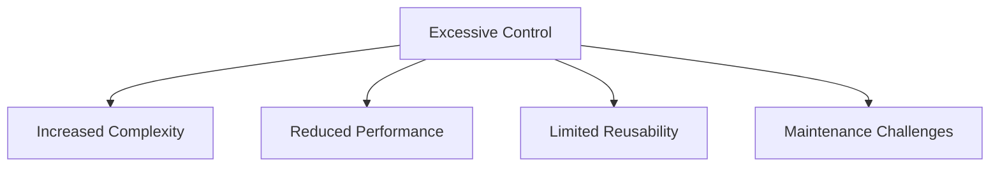

## 17.12 Control Freak

In the realm of software engineering, particularly in C++ programming, the **Control Freak** anti-pattern emerges when developers exert excessive control over parameters and engage in overly defensive programming. This section delves into the intricacies of this anti-pattern, exploring its causes, consequences, and strategies for mitigation. By understanding the Control Freak anti-pattern, expert software engineers and architects can create more efficient, maintainable, and scalable C++ applications.

### Understanding the Control Freak Anti-Pattern

The Control Freak anti-pattern manifests when developers impose unnecessary constraints and checks on parameters, often driven by a desire to prevent errors or misuse. While defensive programming aims to enhance code robustness, excessive control can lead to code that is difficult to maintain, understand, and extend.

#### Key Characteristics

1. **Excessive Parameter Validation**: Implementing numerous checks and validations on input parameters, even when they are unnecessary or redundant.
2. **Overly Defensive Code**: Writing code that anticipates every possible misuse or error, leading to complex and cluttered logic.
3. **Lack of Trust in Collaborators**: Assuming that other components or developers will misuse the code, resulting in excessive safeguards.
4. **Reduced Flexibility**: Creating rigid interfaces that limit the adaptability and extensibility of the code.

### Causes of the Control Freak Anti-Pattern

Understanding the root causes of the Control Freak anti-pattern is crucial for addressing it effectively. Here are some common factors that contribute to its emergence:

1. **Fear of Errors**: Developers may fear that errors will occur if they do not tightly control inputs and interactions.
2. **Lack of Trust**: A lack of trust in other developers or components can lead to excessive defensive measures.
3. **Misunderstanding of Defensive Programming**: Misinterpreting defensive programming principles can result in over-application of checks and validations.
4. **Over-Engineering**: A tendency to over-engineer solutions can lead to unnecessary complexity and control.

### Consequences of the Control Freak Anti-Pattern

The Control Freak anti-pattern can have several negative impacts on software development and maintenance:

1. **Increased Complexity**: Excessive control and defensive measures can make the codebase more complex and harder to understand.
2. **Reduced Performance**: Unnecessary checks and validations can degrade performance, especially in performance-critical applications.
3. **Limited Reusability**: Rigid interfaces and excessive constraints can hinder code reuse and adaptability.
4. **Maintenance Challenges**: Complex and cluttered code can be difficult to maintain, leading to increased technical debt.

### Identifying the Control Freak Anti-Pattern

To effectively address the Control Freak anti-pattern, it is essential to identify its presence in the codebase. Here are some indicators to watch for:

1. **Redundant Checks**: Look for multiple checks that validate the same condition or parameter.
2. **Complex Conditionals**: Identify complex conditional logic that attempts to handle every possible scenario.
3. **Overly Detailed Error Handling**: Examine error handling code for excessive detail and specificity.
4. **Rigid Interfaces**: Assess interfaces for unnecessary constraints and lack of flexibility.

### Refactoring the Control Freak Anti-Pattern

Once the Control Freak anti-pattern is identified, refactoring efforts can help mitigate its impact. Here are some strategies for refactoring:

1. **Simplify Parameter Validation**: Focus on essential validations and remove redundant or unnecessary checks.
2. **Embrace Trust and Collaboration**: Trust other components and developers to handle their responsibilities appropriately.
3. **Adopt a Minimalist Approach**: Apply defensive programming principles judiciously, avoiding over-application.
4. **Enhance Flexibility**: Design interfaces that are adaptable and extensible, allowing for future changes and enhancements.

### Code Example: Identifying and Refactoring the Control Freak Anti-Pattern

Let's explore a code example that demonstrates the Control Freak anti-pattern and its refactoring:

```cpp
#include <iostream>
#include <stdexcept>

// Control Freak Anti-Pattern: Excessive parameter validation
class ControlFreak {
public:
    void process(int value) {
        if (value < 0) {
            throw std::invalid_argument("Value must be non-negative");
        }
        if (value > 100) {
            throw std::invalid_argument("Value must be less than or equal to 100");
        }
        if (value == 50) {
            throw std::invalid_argument("Value cannot be 50");
        }
        // Additional unnecessary checks...
        std::cout << "Processing value: " << value << std::endl;
    }
};

// Refactored Code: Simplified parameter validation
class SimplifiedControl {
public:
    void process(int value) {
        if (value < 0 || value > 100) {
            throw std::invalid_argument("Value must be between 0 and 100");
        }
        // Removed unnecessary checks
        std::cout << "Processing value: " << value << std::endl;
    }
};

int main() {
    SimplifiedControl control;
    try {
        control.process(25); // Valid input
        control.process(150); // Invalid input
    } catch (const std::invalid_argument& e) {
        std::cerr << "Error: " << e.what() << std::endl;
    }
    return 0;
}
```

In the refactored code, we simplified parameter validation by consolidating checks into a single condition. This approach reduces complexity and enhances code readability.

### Visualizing the Control Freak Anti-Pattern

To better understand the Control Freak anti-pattern, let's visualize its impact on code complexity and maintainability.



**Diagram Description**: This diagram illustrates the consequences of excessive control in code, leading to increased complexity, reduced performance, limited reusability, and maintenance challenges.

### Design Considerations

When addressing the Control Freak anti-pattern, consider the following design considerations:

1. **Balance Control and Flexibility**: Strive for a balance between control and flexibility, ensuring that code is robust yet adaptable.
2. **Focus on Essential Validations**: Prioritize essential validations that enhance code safety without introducing unnecessary complexity.
3. **Promote Collaboration**: Encourage collaboration and trust among developers, fostering a culture of shared responsibility.
4. **Iterate and Refactor**: Continuously iterate and refactor code to address emerging issues and improve maintainability.

### Differences and Similarities with Other Anti-Patterns

The Control Freak anti-pattern shares similarities with other anti-patterns, such as:

- **Over-Engineering**: Both involve unnecessary complexity, but Control Freak focuses on excessive control over parameters.
- **Defensive Programming**: While defensive programming aims to enhance robustness, Control Freak takes it to an extreme, leading to negative consequences.

### Try It Yourself

To deepen your understanding of the Control Freak anti-pattern, try the following exercises:

1. **Identify Redundant Checks**: Review a codebase and identify instances of redundant parameter checks. Refactor the code to simplify validations.
2. **Enhance Flexibility**: Take a rigid interface and redesign it to be more flexible and adaptable. Consider future enhancements and extensions.
3. **Collaborative Refactoring**: Work with a team to refactor a codebase, focusing on reducing excessive control and promoting collaboration.

### Knowledge Check

Before we conclude, let's reinforce key concepts with a knowledge check:

- What are the key characteristics of the Control Freak anti-pattern?
- How can excessive control impact code performance and maintainability?
- What strategies can be used to refactor the Control Freak anti-pattern?
- How does the Control Freak anti-pattern differ from over-engineering?

### Embrace the Journey

Remember, addressing the Control Freak anti-pattern is a journey towards creating more efficient and maintainable code. As you progress, you'll gain valuable insights into balancing control and flexibility, fostering collaboration, and enhancing code quality. Keep experimenting, stay curious, and enjoy the journey!

## Quiz Time!



### What is a key characteristic of the Control Freak anti-pattern?

- [x] Excessive parameter validation
- [ ] Minimalist error handling
- [ ] Lack of defensive programming
- [ ] Simplified interfaces

> **Explanation:** The Control Freak anti-pattern is characterized by excessive parameter validation, leading to complex and cluttered code.

### What is a common consequence of the Control Freak anti-pattern?

- [x] Increased complexity
- [ ] Improved performance
- [ ] Enhanced flexibility
- [ ] Simplified maintenance

> **Explanation:** The Control Freak anti-pattern often results in increased complexity, making the code harder to understand and maintain.

### Which strategy can help refactor the Control Freak anti-pattern?

- [x] Simplify parameter validation
- [ ] Add more defensive checks
- [ ] Increase interface rigidity
- [ ] Reduce code readability

> **Explanation:** Simplifying parameter validation helps reduce unnecessary complexity and enhances code readability.

### How does the Control Freak anti-pattern differ from over-engineering?

- [x] Focuses on excessive control over parameters
- [ ] Involves unnecessary complexity
- [ ] Enhances code flexibility
- [ ] Reduces code performance

> **Explanation:** The Control Freak anti-pattern specifically focuses on excessive control over parameters, while over-engineering involves unnecessary complexity in general.

### What is an effective way to enhance code flexibility?

- [x] Design adaptable interfaces
- [ ] Implement rigid constraints
- [ ] Increase parameter checks
- [ ] Limit code reuse

> **Explanation:** Designing adaptable interfaces enhances code flexibility, allowing for future changes and extensions.

### What is a common cause of the Control Freak anti-pattern?

- [x] Fear of errors
- [ ] Trust in other developers
- [ ] Minimalist approach
- [ ] Simplified logic

> **Explanation:** Fear of errors can lead developers to impose excessive control over parameters, resulting in the Control Freak anti-pattern.

### What is a benefit of promoting collaboration among developers?

- [x] Reduces excessive control
- [ ] Increases code rigidity
- [ ] Enhances parameter validation
- [ ] Limits code flexibility

> **Explanation:** Promoting collaboration fosters trust and reduces the need for excessive control, leading to more maintainable code.

### What should be prioritized when refactoring the Control Freak anti-pattern?

- [x] Essential validations
- [ ] Detailed error handling
- [ ] Complex conditionals
- [ ] Rigid interfaces

> **Explanation:** Prioritizing essential validations helps streamline code and reduce unnecessary complexity.

### How can the Control Freak anti-pattern impact performance?

- [x] Degrades performance due to unnecessary checks
- [ ] Improves performance through detailed validations
- [ ] Enhances performance by reducing complexity
- [ ] Has no impact on performance

> **Explanation:** The Control Freak anti-pattern can degrade performance due to unnecessary checks and validations.

### True or False: The Control Freak anti-pattern enhances code maintainability.

- [ ] True
- [x] False

> **Explanation:** The Control Freak anti-pattern reduces code maintainability by increasing complexity and clutter.


