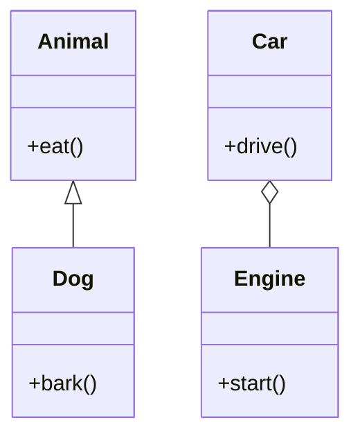

## 17.2 Overuse of Inheritance

Inheritance is a fundamental concept in object-oriented programming (OOP) that allows developers to create a new class based on an existing class, inheriting its properties and behaviors. While inheritance can be a powerful tool for code reuse and polymorphism, it is often overused or misused, leading to complex and fragile codebases. In this section, we will explore the pitfalls of overusing inheritance in C++ and discuss why composition is often a better choice. We will also provide practical examples and guidelines to help you make informed design decisions.

### Understanding Inheritance

Inheritance allows a class (called a subclass or derived class) to inherit the properties and methods of another class (called a superclass or base class). This relationship is often described as an "is-a" relationship, where the subclass is a specialized version of the superclass.

```cpp
class Animal {
public:
    void eat() {
        std::cout << "Eating..." << std::endl;
    }
};

class Dog : public Animal {
public:
    void bark() {
        std::cout << "Barking..." << std::endl;
    }
};

int main() {
    Dog dog;
    dog.eat();  // Inherited from Animal
    dog.bark(); // Defined in Dog
    return 0;
}
```

In this example, `Dog` is a subclass of `Animal`, inheriting its `eat` method. The `Dog` class also introduces a new method, `bark`.

### Pitfalls of Overusing Inheritance

While inheritance can simplify code by promoting reuse, it can also introduce several challenges and pitfalls when overused:

#### 1. Fragile Base Class Problem

When a base class is modified, all derived classes are affected. This can lead to unexpected behaviors and bugs, especially in large codebases where the base class is widely used.

#### 2. Inflexibility

Inheritance creates a tight coupling between the base and derived classes. This makes it difficult to change the base class without impacting all derived classes, reducing flexibility and adaptability.

#### 3. Violation of Encapsulation

Inheritance exposes the internal implementation details of the base class to derived classes. This can lead to a violation of encapsulation, as derived classes may become dependent on the internal workings of the base class.

#### 4. Difficulty in Understanding and Maintaining Code

Complex inheritance hierarchies can be difficult to understand and maintain. It can be challenging to track which class is responsible for a particular behavior, especially when multiple levels of inheritance are involved.

#### 5. Inappropriate Use of the "is-a" Relationship

Inheritance should only be used when there is a clear "is-a" relationship between the base and derived classes. Overusing inheritance can lead to inappropriate class hierarchies that do not accurately represent the problem domain.

### Prefer Composition Over Inheritance

Composition is an alternative to inheritance that involves building classes by combining objects of other classes. This approach is often described as a "has-a" relationship, where a class contains instances of other classes.

#### Benefits of Composition

1. **Flexibility**: Composition allows for more flexible designs, as components can be easily replaced or modified without affecting the entire system.

2. **Encapsulation**: Composition promotes encapsulation by keeping the internal details of components hidden from the containing class.

3. **Reusability**: Components can be reused across different classes, promoting code reuse without the drawbacks of inheritance.

4. **Simplicity**: Composition often leads to simpler and more understandable code, as it avoids the complexities of deep inheritance hierarchies.

#### Example of Composition

Let's revisit the previous example using composition instead of inheritance:

```cpp
class Animal {
public:
    void eat() {
        std::cout << "Eating..." << std::endl;
    }
};

class Dog {
private:
    Animal animal; // Composition: Dog "has-a" Animal

public:
    void eat() {
        animal.eat(); // Delegate to Animal
    }

    void bark() {
        std::cout << "Barking..." << std::endl;
    }
};

int main() {
    Dog dog;
    dog.eat();  // Delegated to Animal
    dog.bark(); // Defined in Dog
    return 0;
}
```

In this example, `Dog` contains an instance of `Animal`, allowing it to reuse the `eat` method without inheriting from `Animal`. This approach provides greater flexibility and encapsulation.

### Design Considerations

When deciding between inheritance and composition, consider the following guidelines:

1. **Use Inheritance for "is-a" Relationships**: Only use inheritance when there is a clear "is-a" relationship between the base and derived classes.

2. **Favor Composition for Flexibility**: Use composition when you need flexibility and the ability to change components independently.

3. **Avoid Deep Inheritance Hierarchies**: Keep inheritance hierarchies shallow to reduce complexity and improve maintainability.

4. **Encapsulate Implementation Details**: Use composition to encapsulate implementation details and promote encapsulation.

5. **Consider Design Patterns**: Many design patterns, such as the Strategy and Decorator patterns, leverage composition to achieve flexibility and reuse.

### Differences and Similarities

Inheritance and composition are both mechanisms for code reuse, but they have different characteristics and trade-offs. Understanding these differences can help you choose the right approach for your design:

- **Inheritance**: Promotes code reuse through a hierarchical relationship, but can lead to tight coupling and reduced flexibility.
- **Composition**: Promotes code reuse through object composition, offering greater flexibility and encapsulation.

### Code Examples

#### Inheritance Example

```cpp
class Vehicle {
public:
    virtual void drive() {
        std::cout << "Driving vehicle..." << std::endl;
    }
};

class Car : public Vehicle {
public:
    void drive() override {
        std::cout << "Driving car..." << std::endl;
    }
};

int main() {
    Car car;
    car.drive(); // Outputs: Driving car...
    return 0;
}
```

#### Composition Example

```cpp
class Engine {
public:
    void start() {
        std::cout << "Starting engine..." << std::endl;
    }
};

class Car {
private:
    Engine engine; // Composition: Car "has-a" Engine

public:
    void drive() {
        engine.start(); // Delegate to Engine
        std::cout << "Driving car..." << std::endl;
    }
};

int main() {
    Car car;
    car.drive(); // Outputs: Starting engine... Driving car...
    return 0;
}
```

### Visualizing Inheritance vs. Composition

Below is a diagram illustrating the difference between inheritance and composition:



**Caption**: The diagram shows an inheritance relationship between `Animal` and `Dog`, and a composition relationship between `Car` and `Engine`.

### Try It Yourself

Experiment with the code examples provided by modifying the classes and methods. Try adding new behaviors or components to see how inheritance and composition affect the design. Consider the following challenges:

1. **Add a new method to the `Animal` class** and observe how it affects the `Dog` class in both the inheritance and composition examples.

2. **Create a new class, `Cat`,** that shares some behaviors with `Dog`. Implement it using both inheritance and composition, and compare the results.

3. **Refactor the `Car` class** to include additional components, such as `Transmission` and `Wheels`, using composition. Observe how this affects the flexibility and maintainability of the code.

### Knowledge Check

Before we wrap up, let's review some key takeaways:

- Inheritance is useful for creating hierarchical relationships but can lead to tight coupling and reduced flexibility if overused.
- Composition offers greater flexibility and encapsulation by building classes from components.
- Use inheritance for clear "is-a" relationships and composition for "has-a" relationships.
- Avoid deep inheritance hierarchies to reduce complexity and improve maintainability.
- Consider design patterns that leverage composition for flexible and reusable designs.

### Embrace the Journey

Remember, mastering C++ design patterns is a journey. As you continue to explore and apply these concepts, you'll develop a deeper understanding of how to create robust, scalable, and maintainable software. Keep experimenting, stay curious, and enjoy the process of learning and growing as a software engineer.

## Quiz Time!



### What is a common pitfall of overusing inheritance in C++?

- [x] Fragile base class problem
- [ ] Improved encapsulation
- [ ] Increased flexibility
- [ ] Simplified code maintenance

> **Explanation:** Overusing inheritance can lead to the fragile base class problem, where changes in the base class affect all derived classes.

### What is a key benefit of using composition over inheritance?

- [x] Greater flexibility
- [ ] Tight coupling
- [ ] Violation of encapsulation
- [ ] Complex code

> **Explanation:** Composition offers greater flexibility by allowing components to be easily replaced or modified without affecting the entire system.

### Which relationship is best represented by inheritance?

- [x] "is-a" relationship
- [ ] "has-a" relationship
- [ ] "uses-a" relationship
- [ ] "contains-a" relationship

> **Explanation:** Inheritance is best used for "is-a" relationships, where the derived class is a specialized version of the base class.

### What is a disadvantage of deep inheritance hierarchies?

- [x] Increased complexity
- [ ] Improved code reuse
- [ ] Enhanced readability
- [ ] Better encapsulation

> **Explanation:** Deep inheritance hierarchies can increase complexity and make the code difficult to understand and maintain.

### Which design pattern leverages composition for flexibility?

- [x] Strategy pattern
- [ ] Singleton pattern
- [ ] Factory pattern
- [ ] Template method pattern

> **Explanation:** The Strategy pattern leverages composition to achieve flexibility by allowing algorithms to be selected at runtime.

### What is a key characteristic of composition?

- [x] Promotes encapsulation
- [ ] Creates tight coupling
- [ ] Requires deep hierarchies
- [ ] Violates encapsulation

> **Explanation:** Composition promotes encapsulation by keeping the internal details of components hidden from the containing class.

### How does composition affect code reusability?

- [x] Enhances reusability
- [ ] Reduces reusability
- [ ] Has no impact on reusability
- [ ] Complicates reusability

> **Explanation:** Composition enhances reusability by allowing components to be reused across different classes.

### What should be avoided when using inheritance?

- [x] Deep inheritance hierarchies
- [ ] Shallow inheritance hierarchies
- [ ] Encapsulation
- [ ] Code reuse

> **Explanation:** Deep inheritance hierarchies should be avoided to reduce complexity and improve maintainability.

### Which of the following is a benefit of using composition?

- [x] Simplicity
- [ ] Tight coupling
- [ ] Increased complexity
- [ ] Violation of encapsulation

> **Explanation:** Composition often leads to simpler and more understandable code, as it avoids the complexities of deep inheritance hierarchies.

### True or False: Inheritance should be used for "has-a" relationships.

- [ ] True
- [x] False

> **Explanation:** Inheritance should be used for "is-a" relationships, while composition is more suitable for "has-a" relationships.




