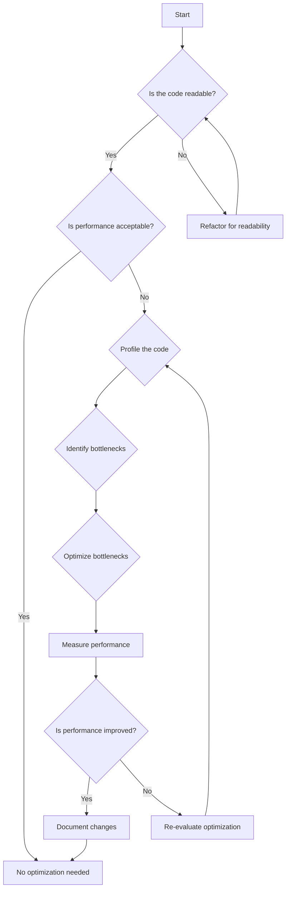

## 17.3 Premature Optimization

Premature optimization is a common pitfall in software development, particularly in a language as powerful and complex as C++. It refers to the practice of making code optimizations before they are necessary, often at the expense of code readability and maintainability. This section will delve into the concept of premature optimization, its implications, and how to balance performance with code clarity.

### Understanding Premature Optimization

Premature optimization is famously described by Donald Knuth as the "root of all evil" in programming. This statement underscores the idea that focusing too early on optimizing code can lead to significant problems down the line. Let's break down why premature optimization is considered detrimental:

1. **Complexity Overhead**: Optimizations often introduce complexity. Complex code is harder to read, understand, and maintain. This complexity can lead to bugs and make future enhancements difficult.

2. **Misallocation of Resources**: Developers might spend time optimizing parts of the code that are not performance bottlenecks, leading to inefficient use of time and resources.

3. **Neglect of Functionality**: Focusing on optimization can divert attention from the primary goal of software development: delivering functional and reliable software.

4. **Inflexibility**: Optimized code can be less flexible, making it harder to adapt to changing requirements or to refactor.

### The Balance Between Readability and Performance

In C++, achieving a balance between readability and performance is crucial. Here are some guidelines to help maintain this balance:

- **Prioritize Readability**: Write clear and understandable code first. Use descriptive variable names, consistent formatting, and well-structured logic. Code that is easy to read is easier to debug and maintain.

- **Measure Before Optimizing**: Use profiling tools to identify actual performance bottlenecks. Optimize only those parts of the code that significantly impact performance.

- **Iterative Optimization**: Optimize in small, manageable increments. This approach allows you to measure the impact of each change and ensures that optimizations do not introduce new bugs.

- **Leverage C++ Features**: Use C++ features like templates, smart pointers, and the Standard Template Library (STL) to write efficient code without sacrificing readability.

### Code Example: Readability vs. Optimization

Consider a simple example where we need to sum the elements of a vector. Here is a straightforward implementation:

```cpp
#include <vector>
#include <numeric> // For std::accumulate

int sumVector(const std::vector<int>& vec) {
    return std::accumulate(vec.begin(), vec.end(), 0);
}
```

This code is clear and concise, leveraging the STL's `std::accumulate` function. Now, let's consider an optimized version that uses manual loop unrolling:

```cpp
#include <vector>

int sumVectorOptimized(const std::vector<int>& vec) {
    int sum = 0;
    size_t i = 0;
    size_t size = vec.size();

    // Unroll the loop for optimization
    for (; i + 4 <= size; i += 4) {
        sum += vec[i] + vec[i + 1] + vec[i + 2] + vec[i + 3];
    }

    // Handle remaining elements
    for (; i < size; ++i) {
        sum += vec[i];
    }

    return sum;
}
```

While the optimized version may offer performance benefits for large vectors, it is more complex and harder to read. This complexity should only be introduced if profiling shows that the original implementation is a bottleneck.

### Visualizing the Impact of Premature Optimization

Let's visualize the decision-making process involved in optimizing code using a flowchart. This flowchart will help you decide when to optimize and when to focus on readability.



### Key Considerations in C++ Optimization

When optimizing C++ code, consider the following:

- **Algorithmic Efficiency**: Choose the right algorithms and data structures. Often, algorithmic improvements yield more significant performance gains than low-level optimizations.

- **Memory Management**: Efficient memory usage can significantly impact performance. Use smart pointers and avoid unnecessary allocations.

- **Concurrency**: Utilize C++'s concurrency features to improve performance in multi-threaded applications. However, ensure that concurrency does not introduce complexity that outweighs its benefits.

- **Compiler Optimizations**: Leverage compiler flags and settings to optimize code. Modern compilers offer a range of optimization levels that can improve performance without altering the source code.

### Try It Yourself: Experiment with Optimization

To better understand the impact of optimization, try modifying the `sumVectorOptimized` function. Experiment with different loop unrolling factors and measure the performance impact on vectors of varying sizes. Use a profiler to identify the optimal unrolling factor for your specific use case.

### References and Further Reading

For more information on optimization and best practices in C++, consider the following resources:

- [Effective C++ by Scott Meyers](https://www.amazon.com/Effective-Specific-Improve-Programs-Designs/dp/0321334876)
- [C++ High Performance by Björn Andrist and Viktor Sehr](https://www.amazon.com/C-High-Performance-optimization-techniques/dp/1787120953)
- [CppCon Talks on YouTube](https://www.youtube.com/user/CppCon)

### Knowledge Check

Before moving on, let's test your understanding of premature optimization with a few questions:

- What is premature optimization, and why is it considered harmful?
- How can you balance readability and performance in C++ code?
- What tools can you use to identify performance bottlenecks in your code?

### Embrace the Journey

Remember, premature optimization is a journey, not a destination. Focus on writing clear, maintainable code first. As you gain experience, you'll develop an intuition for when optimization is necessary and how to implement it effectively. Keep experimenting, stay curious, and enjoy the process of mastering C++ design patterns and optimization techniques.

## Quiz Time!



### What is premature optimization?

- [x] Optimizing code before identifying actual performance bottlenecks
- [ ] Optimizing code after profiling
- [ ] Writing code without considering performance
- [ ] Refactoring code for readability

> **Explanation:** Premature optimization involves optimizing code without first identifying performance bottlenecks, often leading to unnecessary complexity.

### Why is premature optimization considered harmful?

- [x] It introduces unnecessary complexity
- [ ] It always improves performance
- [ ] It simplifies code
- [ ] It reduces code readability

> **Explanation:** Premature optimization can introduce unnecessary complexity, making code harder to read and maintain without guaranteed performance benefits.

### What should you prioritize before optimizing code?

- [x] Code readability
- [ ] Algorithmic complexity
- [ ] Compiler optimizations
- [ ] Memory usage

> **Explanation:** Prioritizing code readability ensures that the code is maintainable and understandable before considering optimizations.

### Which tool is used to identify performance bottlenecks?

- [x] Profiler
- [ ] Compiler
- [ ] Debugger
- [ ] Text editor

> **Explanation:** Profilers are used to identify performance bottlenecks by analyzing the execution of code.

### What is the first step in the optimization process?

- [x] Measure performance
- [ ] Optimize code
- [ ] Refactor code
- [ ] Write tests

> **Explanation:** Measuring performance is the first step to identify areas that need optimization.

### How can you ensure that optimizations do not introduce new bugs?

- [x] Optimize in small increments
- [ ] Optimize all at once
- [ ] Avoid testing
- [ ] Use complex algorithms

> **Explanation:** Optimizing in small increments allows you to measure the impact of each change and ensure that no new bugs are introduced.

### What is a common pitfall when optimizing C++ code?

- [x] Overcomplicating code
- [ ] Improving readability
- [ ] Reducing complexity
- [ ] Simplifying algorithms

> **Explanation:** A common pitfall is overcomplicating code, which can make it harder to read and maintain.

### What C++ feature can help write efficient code without sacrificing readability?

- [x] Standard Template Library (STL)
- [ ] Macros
- [ ] Goto statements
- [ ] Global variables

> **Explanation:** The STL provides efficient data structures and algorithms that help maintain readability.

### Which of the following is NOT a benefit of focusing on readability first?

- [x] Immediate performance improvement
- [ ] Easier debugging
- [ ] Better maintainability
- [ ] Simpler code structure

> **Explanation:** Focusing on readability first does not guarantee immediate performance improvement but aids in maintainability and debugging.

### True or False: Premature optimization should be avoided to ensure code maintainability.

- [x] True
- [ ] False

> **Explanation:** Premature optimization should be avoided because it can lead to complex and less maintainable code.


