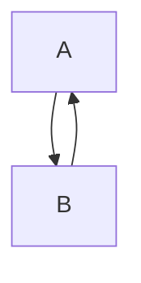

## 17.5 Circular Dependencies

Circular dependencies are a common issue in software design, particularly in large-scale C++ projects. They occur when two or more modules or classes depend on each other directly or indirectly, creating a loop in the dependency graph. This can lead to various problems, such as compilation errors, increased coupling, and difficulties in code maintenance and testing. In this section, we will explore the concept of circular dependencies, their impact on software design, and strategies to manage and avoid them effectively.

### Understanding Circular Dependencies

Circular dependencies arise when two or more components in a software system depend on each other, either directly or indirectly. This creates a cycle in the dependency graph, which can lead to several issues:

- **Compilation Errors**: In C++, circular dependencies can cause compilation errors because the compiler needs to know the complete definition of a class before it can use it. If two classes depend on each other, the compiler may not be able to determine the order in which to compile them.
- **Increased Coupling**: Circular dependencies increase the coupling between components, making the system more rigid and harder to change. Changes in one component may require changes in the dependent components, leading to a ripple effect.
- **Difficulties in Testing and Maintenance**: Circular dependencies can make it difficult to isolate components for testing, as they are tightly coupled with other components. This also makes maintenance more challenging, as changes in one part of the system can affect other parts.

### Identifying Circular Dependencies

To effectively manage circular dependencies, it's essential to identify them in your codebase. Here are some techniques to help you spot circular dependencies:

1. **Dependency Graphs**: Visualizing the dependencies between components using a dependency graph can help identify cycles. Tools like Doxygen can generate such graphs from your codebase.
2. **Static Analysis Tools**: Use static analysis tools to detect circular dependencies automatically. These tools analyze your code and report any cycles in the dependency graph.
3. **Code Reviews**: Regular code reviews can help identify circular dependencies early in the development process. Encourage your team to look for potential cycles during reviews.

### Managing Circular Dependencies

Once you've identified circular dependencies, the next step is to manage them effectively. Here are some strategies to consider:

#### 1. Use Forward Declarations

Forward declarations allow you to declare a class or function without defining it. This can help break circular dependencies by allowing you to declare a dependency without including the full definition. Here's an example:

```cpp
// Forward declaration
class B;

class A {
public:
    void setB(B* b);
private:
    B* b_;
};

class B {
public:
    void setA(A* a);
private:
    A* a_;
};
```

In this example, `class B` is forward-declared before being used in `class A`. This breaks the circular dependency by allowing `A` to reference `B` without needing its full definition.

#### 2. Use Interfaces or Abstract Classes

Another way to manage circular dependencies is to use interfaces or abstract classes. By defining an interface or abstract class that both components depend on, you can decouple the components and break the cycle. Here's an example:

```cpp
class IB {
public:
    virtual void doSomething() = 0;
};

class A {
public:
    void setB(IB* b);
private:
    IB* b_;
};

class B : public IB {
public:
    void doSomething() override;
};
```

In this example, `class A` depends on the `IB` interface instead of directly depending on `class B`. This breaks the circular dependency and allows `A` and `B` to be developed independently.

#### 3. Restructure Your Code

Sometimes, the best way to manage circular dependencies is to restructure your code. This may involve breaking up large classes into smaller, more focused classes or moving functionality into separate modules. By reducing the size and complexity of your components, you can often eliminate circular dependencies naturally.

#### 4. Use Dependency Injection

Dependency injection is a design pattern that allows you to inject dependencies into a component rather than having the component create them itself. This can help break circular dependencies by allowing you to control the dependencies from outside the component. Here's an example:

```cpp
class A {
public:
    A(IB* b) : b_(b) {}
private:
    IB* b_;
};

class B : public IB {
public:
    void doSomething() override;
};

// Dependency injection
B b;
A a(&b);
```

In this example, `class A` receives its dependency on `IB` through its constructor, allowing you to inject any implementation of `IB` at runtime.

### Avoiding Circular Dependencies

The best way to manage circular dependencies is to avoid them in the first place. Here are some best practices to help you design your code to minimize the risk of circular dependencies:

- **Design for Loose Coupling**: Aim to design your components to be loosely coupled, with minimal dependencies between them. This will make it easier to avoid circular dependencies and improve the maintainability of your code.
- **Use Dependency Inversion**: The dependency inversion principle states that high-level modules should not depend on low-level modules. Both should depend on abstractions. By following this principle, you can reduce the risk of circular dependencies.
- **Modularize Your Code**: Break your code into small, focused modules with well-defined interfaces. This will make it easier to manage dependencies and avoid circular dependencies.
- **Regularly Review Your Code**: Regular code reviews can help identify potential circular dependencies early in the development process. Encourage your team to look for cycles during reviews and refactor code as needed.

### Visualizing Circular Dependencies

To better understand circular dependencies, let's visualize them using a dependency graph. Below is a simple example of a circular dependency between two classes, `A` and `B`.



In this graph, `A` depends on `B`, and `B` depends on `A`, creating a cycle. By breaking this cycle using one of the strategies discussed earlier, you can eliminate the circular dependency.

### Code Example: Breaking a Circular Dependency

Let's walk through a code example that demonstrates how to break a circular dependency using forward declarations and interfaces.

```cpp
#include <iostream>

// Forward declaration
class B;

// Interface
class IB {
public:
    virtual void doSomething() = 0;
};

class A {
public:
    A(IB* b) : b_(b) {}
    void performAction() {
        b_->doSomething();
    }
private:
    IB* b_;
};

class B : public IB {
public:
    void doSomething() override {
        std::cout << "B is doing something!" << std::endl;
    }
};

int main() {
    B b;
    A a(&b);
    a.performAction();
    return 0;
}
```

In this example, `class A` depends on the `IB` interface instead of directly depending on `class B`. This breaks the circular dependency and allows `A` and `B` to be developed independently. The `main` function demonstrates how to use dependency injection to provide `A` with an instance of `B`.

### Try It Yourself

To reinforce your understanding of circular dependencies, try modifying the code example above. Here are some suggestions:

- Add a new class `C` that also implements the `IB` interface and provide `A` with an instance of `C` instead of `B`.
- Implement additional methods in the `IB` interface and update `A` and `B` to use them.
- Experiment with different ways to inject dependencies into `A`, such as using setter methods or a dependency injection framework.

### References and Further Reading

To deepen your understanding of circular dependencies and how to manage them, consider exploring the following resources:

- [C++ Core Guidelines](https://isocpp.github.io/CppCoreGuidelines/CppCoreGuidelines)
- [Design Patterns: Elements of Reusable Object-Oriented Software](https://en.wikipedia.org/wiki/Design_Patterns) by Erich Gamma, Richard Helm, Ralph Johnson, and John Vlissides
- [Dependency Injection in C++](https://www.boost.org/doc/libs/1_75_0/doc/html/di.html) (Boost.DI)
- [Doxygen](http://www.doxygen.nl/) for generating documentation and dependency graphs

### Knowledge Check

Before moving on, take a moment to reflect on what you've learned about circular dependencies. Consider the following questions:

- What are circular dependencies, and why are they problematic in C++?
- How can forward declarations help break circular dependencies?
- What role do interfaces and abstract classes play in managing circular dependencies?
- How can dependency injection be used to avoid circular dependencies?

### Embrace the Journey

Remember, mastering circular dependencies is just one step in your journey to becoming an expert C++ developer. As you continue to learn and grow, you'll encounter new challenges and opportunities to apply your knowledge. Keep experimenting, stay curious, and enjoy the journey!

## Quiz Time!



### What is a circular dependency?

- [x] A situation where two or more components depend on each other directly or indirectly.
- [ ] A dependency that is only used in a single module.
- [ ] A dependency that is not required for the program to compile.
- [ ] A dependency that is resolved at runtime.

> **Explanation:** A circular dependency occurs when two or more components depend on each other, creating a cycle in the dependency graph.

### Why are circular dependencies problematic in C++?

- [x] They can cause compilation errors and increase coupling.
- [ ] They make the code run faster.
- [ ] They simplify the code structure.
- [ ] They are necessary for polymorphism.

> **Explanation:** Circular dependencies can lead to compilation errors and increase coupling, making the code harder to maintain and test.

### How can forward declarations help break circular dependencies?

- [x] By allowing you to declare a class or function without defining it.
- [ ] By eliminating the need for dependencies altogether.
- [ ] By automatically resolving dependencies at runtime.
- [ ] By increasing the coupling between components.

> **Explanation:** Forward declarations allow you to declare a class or function without defining it, which can help break circular dependencies.

### What is the role of interfaces in managing circular dependencies?

- [x] They decouple components by providing a common interface.
- [ ] They increase the coupling between components.
- [ ] They eliminate the need for dependencies.
- [ ] They are only used in runtime polymorphism.

> **Explanation:** Interfaces decouple components by providing a common interface, allowing components to depend on abstractions rather than concrete implementations.

### How can dependency injection help avoid circular dependencies?

- [x] By allowing you to inject dependencies into a component rather than having the component create them itself.
- [ ] By eliminating the need for dependencies altogether.
- [ ] By automatically resolving dependencies at runtime.
- [ ] By increasing the coupling between components.

> **Explanation:** Dependency injection allows you to inject dependencies into a component, reducing coupling and helping to avoid circular dependencies.

### What is a dependency graph?

- [x] A visual representation of the dependencies between components.
- [ ] A list of all the functions in a program.
- [ ] A table of variable values.
- [ ] A chart of program execution times.

> **Explanation:** A dependency graph is a visual representation of the dependencies between components, helping to identify cycles.

### What is the dependency inversion principle?

- [x] High-level modules should not depend on low-level modules. Both should depend on abstractions.
- [ ] Low-level modules should depend on high-level modules.
- [ ] Modules should not depend on each other at all.
- [ ] Dependencies should be resolved at runtime.

> **Explanation:** The dependency inversion principle states that high-level modules should not depend on low-level modules. Both should depend on abstractions, reducing the risk of circular dependencies.

### What is the benefit of modularizing code?

- [x] It reduces the risk of circular dependencies and improves maintainability.
- [ ] It increases the coupling between components.
- [ ] It makes the code harder to understand.
- [ ] It eliminates the need for dependencies.

> **Explanation:** Modularizing code reduces the risk of circular dependencies and improves maintainability by breaking the code into small, focused modules with well-defined interfaces.

### What is the purpose of static analysis tools?

- [x] To detect circular dependencies and other code issues automatically.
- [ ] To compile the code faster.
- [ ] To generate random test cases.
- [ ] To optimize the code for performance.

> **Explanation:** Static analysis tools analyze your code and report issues such as circular dependencies, helping to improve code quality.

### True or False: Circular dependencies are always unavoidable in large projects.

- [ ] True
- [x] False

> **Explanation:** Circular dependencies are not always unavoidable. By following best practices such as using forward declarations, interfaces, and dependency injection, you can manage and avoid circular dependencies effectively.


