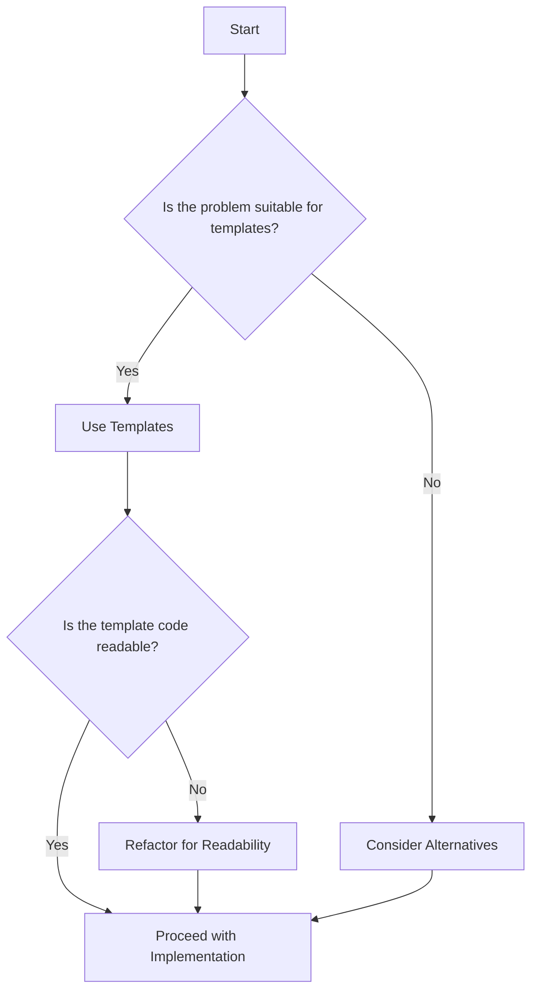

## 17.6 Template Overcomplication

In the realm of C++ programming, templates provide a powerful mechanism for creating generic and reusable code. However, with great power comes great responsibility. The misuse or overuse of templates can lead to overly complex code that is difficult to read, understand, and maintain. This section explores the concept of template overcomplication, its causes, and strategies to avoid it while balancing readability and the benefits of metaprogramming.

### Understanding Templates in C++

Templates in C++ allow developers to write generic and type-safe code. They enable the creation of functions and classes that work with any data type, promoting code reuse and flexibility. However, the complexity of template syntax and the intricacies of template instantiation can lead to code that is difficult to decipher.

#### Basic Template Syntax

Let's start with a simple example of a function template:

```cpp
template <typename T>
T add(T a, T b) {
    return a + b;
}

int main() {
    int result1 = add(5, 3); // Instantiates add<int>
    double result2 = add(2.5, 3.5); // Instantiates add<double>
    return 0;
}
```

In this example, the `add` function template can operate on any type `T` that supports the `+` operator. The compiler generates specific instances of the function for each type used.

### The Pitfalls of Template Overcomplication

While templates offer flexibility, they can also lead to several issues if not used judiciously:

1. **Readability Issues**: Complex template code can be hard to read and understand, especially for developers unfamiliar with advanced template techniques.
2. **Error Messages**: Template errors can produce verbose and cryptic compiler messages, making debugging challenging.
3. **Compilation Time**: Extensive use of templates can increase compilation time due to the generation of multiple template instances.
4. **Code Bloat**: Overuse of templates can lead to code bloat, as each template instantiation generates new code.

### Causes of Template Overcomplication

Several factors contribute to template overcomplication:

- **Overuse of Template Metaprogramming**: While template metaprogramming is powerful, it can lead to convoluted code when overused.
- **Lack of Abstraction**: Failing to abstract complex template logic into simpler components can result in tangled code.
- **Inappropriate Use Cases**: Applying templates to problems that don't benefit from generic programming can complicate the code unnecessarily.

### Balancing Readability and Metaprogramming

To avoid template overcomplication, it's essential to strike a balance between readability and the advantages of metaprogramming. Here are some strategies:

#### 1. Use Templates Judiciously

Evaluate whether templates are the best solution for a given problem. If type safety and code reuse are not critical, consider alternative approaches like polymorphism or function overloading.

#### 2. Simplify Template Syntax

Use clear and concise template syntax. Avoid overly complex template parameters and prefer simple, self-explanatory names.

```cpp
template <typename T>
class SimpleContainer {
    T value;
public:
    SimpleContainer(T v) : value(v) {}
    T getValue() const { return value; }
};
```

#### 3. Leverage Type Traits and Concepts

Type traits and concepts (introduced in C++20) can simplify template code by providing constraints and type information at compile time.

```cpp
#include <type_traits>

template <typename T>
typename std::enable_if<std::is_integral<T>::value, T>::type
increment(T value) {
    return value + 1;
}
```

#### 4. Modularize Template Code

Break down complex template logic into smaller, manageable components. This approach enhances readability and maintainability.

```cpp
template <typename T>
class Matrix {
    // Matrix implementation
};

template <typename T>
Matrix<T> multiply(const Matrix<T>& a, const Matrix<T>& b) {
    // Multiplication logic
}
```

### Code Example: Avoiding Template Overcomplication

Let's consider a practical example where template overcomplication can be avoided by using concepts and modularization:

```cpp
#include <iostream>
#include <concepts>

// Define a concept for arithmetic types
template<typename T>
concept Arithmetic = std::is_arithmetic_v<T>;

// Simple arithmetic operations class
template <Arithmetic T>
class ArithmeticOperations {
public:
    static T add(T a, T b) {
        return a + b;
    }

    static T multiply(T a, T b) {
        return a * b;
    }
};

int main() {
    std::cout << "Add: " << ArithmeticOperations<int>::add(3, 4) << std::endl;
    std::cout << "Multiply: " << ArithmeticOperations<double>::multiply(2.5, 4.0) << std::endl;
    return 0;
}
```

In this example, we use the `Arithmetic` concept to constrain the template to arithmetic types, simplifying the code and enhancing readability.

### Visualizing Template Overcomplication

To better understand the impact of template overcomplication, let's visualize a simple flowchart depicting the decision-making process for using templates:



This flowchart emphasizes the importance of evaluating the suitability of templates and ensuring readability before proceeding with implementation.

### Try It Yourself: Experiment with Templates

To deepen your understanding, try modifying the code examples provided. Experiment with different types and operations, and observe how the template system handles various scenarios. Consider creating your own concepts and type traits to enforce constraints and simplify template logic.

### References and Further Reading

For more information on templates and metaprogramming, consider the following resources:

- [C++ Templates: The Complete Guide](https://www.amazon.com/C-Templates-Complete-Guide-2nd/dp/0321714121) by David Vandevoorde and Nicolai M. Josuttis
- [C++20 Concepts: The Complete Guide](https://www.amazon.com/C-20-Concepts-Complete-Guide/dp/0136875560) by Nicolai M. Josuttis
- [Modern C++ Design: Generic Programming and Design Patterns Applied](https://www.amazon.com/Modern-Design-Generic-Programming-Patterns/dp/0201704315) by Andrei Alexandrescu

### Knowledge Check

To reinforce your understanding, consider the following questions:

1. What are the primary benefits of using templates in C++?
2. How can template overcomplication impact code readability and maintainability?
3. What strategies can be employed to avoid template overcomplication?
4. How do type traits and concepts help simplify template code?
5. What are some common pitfalls to avoid when using templates?

### Embrace the Journey

Remember, mastering templates and metaprogramming in C++ is a journey. As you progress, you'll gain a deeper understanding of how to leverage templates effectively while maintaining code readability and simplicity. Keep experimenting, stay curious, and enjoy the process of learning and applying these powerful tools in your software development endeavors.

## Quiz Time!



### What is a primary benefit of using templates in C++?

- [x] Code reuse and type safety
- [ ] Increased runtime performance
- [ ] Simplified syntax
- [ ] Reduced compilation time

> **Explanation:** Templates allow for code reuse and type safety by enabling generic programming, which can work with any data type.

### Which of the following is a common issue caused by template overcomplication?

- [x] Readability issues
- [ ] Improved runtime performance
- [ ] Reduced code size
- [ ] Faster compilation

> **Explanation:** Template overcomplication can lead to readability issues, making the code difficult to understand and maintain.

### How can type traits and concepts help in template programming?

- [x] By providing constraints and type information at compile time
- [ ] By reducing runtime errors
- [ ] By increasing the speed of template instantiation
- [ ] By simplifying the syntax of templates

> **Explanation:** Type traits and concepts provide constraints and type information at compile time, which can simplify template code and enhance readability.

### What is a strategy to avoid template overcomplication?

- [x] Modularize template code
- [ ] Use templates for all functions
- [ ] Avoid using type traits
- [ ] Increase the number of template parameters

> **Explanation:** Modularizing template code helps break down complex logic into smaller, manageable components, enhancing readability and maintainability.

### What is a potential downside of overusing templates?

- [x] Code bloat
- [ ] Improved readability
- [ ] Faster runtime execution
- [ ] Simplified debugging

> **Explanation:** Overusing templates can lead to code bloat, as each template instantiation generates new code, increasing the overall code size.

### Which C++ feature can be used to constrain template parameters?

- [x] Concepts
- [ ] Macros
- [ ] Inline functions
- [ ] Namespaces

> **Explanation:** Concepts, introduced in C++20, can be used to constrain template parameters, ensuring that they meet specific criteria.

### What is a benefit of using concepts in template programming?

- [x] Enhanced readability and maintainability
- [ ] Faster runtime performance
- [ ] Reduced compilation time
- [ ] Simplified syntax

> **Explanation:** Concepts enhance readability and maintainability by providing clear constraints on template parameters, making the code easier to understand.

### What is a common pitfall when using templates?

- [x] Overcomplicating the code
- [ ] Reducing code reuse
- [ ] Decreasing type safety
- [ ] Increasing runtime errors

> **Explanation:** A common pitfall when using templates is overcomplicating the code, which can lead to readability and maintainability issues.

### What is the purpose of the `std::enable_if` in template programming?

- [x] To enable or disable template instantiation based on a condition
- [ ] To increase runtime performance
- [ ] To simplify template syntax
- [ ] To reduce code size

> **Explanation:** `std::enable_if` is used to enable or disable template instantiation based on a condition, allowing for more flexible and constrained template code.

### True or False: Templates always improve the readability of C++ code.

- [ ] True
- [x] False

> **Explanation:** False. While templates can enhance code reuse and flexibility, they can also lead to readability issues if overcomplicated or misused.




