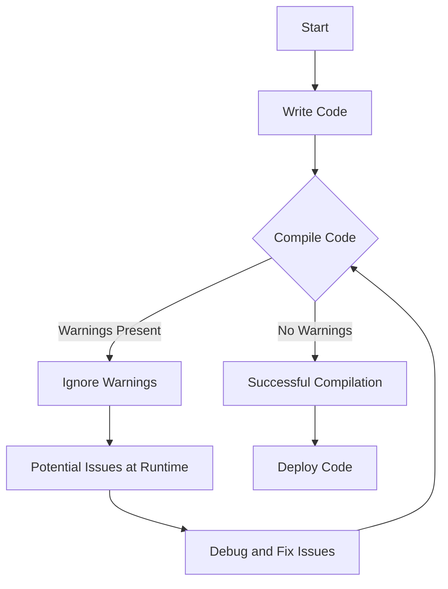

## 17.7 Ignoring Compiler Warnings

In the realm of C++ programming, compiler warnings serve as invaluable indicators of potential issues in code. While they do not prevent a program from compiling, ignoring these warnings can lead to significant problems down the line. In this section, we will explore the importance of addressing compiler warnings, the risks associated with ignoring them, and best practices for treating warnings as errors to ensure robust and maintainable code.

### Understanding Compiler Warnings

Compiler warnings are messages generated by the compiler to indicate potential issues in the code that may not necessarily prevent the program from compiling but could lead to unexpected behavior at runtime. These warnings can range from unused variables and deprecated functions to more serious issues like type mismatches and potential data loss.

#### Common Types of Compiler Warnings

1. **Unused Variables**: Variables declared but never used in the code.
2. **Type Mismatches**: Assigning values of one type to a variable of another type without explicit casting.
3. **Deprecated Functions**: Usage of functions that are outdated and may be removed in future versions.
4. **Unreachable Code**: Code that will never be executed due to logical errors or control flow issues.
5. **Potential Data Loss**: Implicit type conversions that may result in data truncation or loss.

### The Risks of Ignoring Compiler Warnings

Ignoring compiler warnings can lead to several risks, including:

1. **Undefined Behavior**: Warnings often indicate code that may lead to undefined behavior, which can cause crashes or unpredictable results.
2. **Security Vulnerabilities**: Ignored warnings can hide security flaws, such as buffer overflows or improper input validation.
3. **Maintenance Challenges**: Code with unresolved warnings is harder to maintain and understand, increasing the likelihood of introducing bugs during future development.
4. **Portability Issues**: Code that compiles with warnings on one platform may not compile or behave correctly on another due to differences in compiler implementations.

### Treating Warnings as Errors

One effective strategy to ensure clean code is to treat warnings as errors. This approach forces developers to address all warnings before the code can be compiled successfully. Most modern compilers, including GCC and Clang, provide flags to enable this behavior.

#### Enabling Warnings as Errors

- **GCC/Clang**: Use the `-Werror` flag to treat all warnings as errors.
- **MSVC**: Use the `/WX` flag to achieve the same effect.

```cpp
// Example: Enabling warnings as errors with GCC
g++ -Wall -Werror -o my_program my_program.cpp
```

### Best Practices for Handling Compiler Warnings

1. **Regular Code Reviews**: Conduct regular code reviews to catch and address warnings early in the development process.
2. **Continuous Integration (CI)**: Integrate warning checks into your CI pipeline to ensure that code with warnings is not merged into the main codebase.
3. **Use Compiler Flags**: Utilize compiler flags to enable all warnings and treat them as errors.
4. **Refactor Code**: Regularly refactor code to address warnings and improve code quality.
5. **Stay Updated**: Keep up with compiler updates and changes to warning messages to ensure your code remains clean and compliant.

### Code Example: Addressing Common Warnings

Let's explore a simple example that demonstrates how to address common compiler warnings.

```cpp
#include <iostream>

// Warning: Unused variable
void exampleFunction() {
    int unusedVariable; // Unused variable warning
}

// Warning: Type mismatch
void typeMismatchExample() {
    double pi = 3.14159;
    int truncatedPi = pi; // Warning: implicit conversion from 'double' to 'int'
    std::cout << "Truncated Pi: " << truncatedPi << std::endl;
}

// Warning: Deprecated function
[[deprecated("Use newFunction() instead")]]
void oldFunction() {
    std::cout << "This function is deprecated." << std::endl;
}

void newFunction() {
    std::cout << "This is the new function." << std::endl;
}

int main() {
    exampleFunction();
    typeMismatchExample();
    oldFunction(); // Warning: 'oldFunction' is deprecated
    newFunction();
    return 0;
}
```

#### Addressing the Warnings

1. **Unused Variable**: Remove or use the variable.
2. **Type Mismatch**: Use explicit casting to avoid implicit conversions.
3. **Deprecated Function**: Replace calls to deprecated functions with their newer counterparts.

### Visualizing the Impact of Ignoring Warnings

To better understand the impact of ignoring warnings, let's visualize the process of code compilation with and without addressing warnings using a flowchart.



**Description**: This flowchart illustrates the potential pitfalls of ignoring compiler warnings. Ignoring warnings can lead to runtime issues, requiring additional debugging and fixes, whereas addressing warnings leads to successful compilation and deployment.

### Try It Yourself

Experiment with the code example provided above. Try enabling the `-Werror` flag and observe how the compiler enforces the resolution of warnings. Modify the code to address each warning and ensure it compiles without errors.

### References and Further Reading

- [GCC Warning Options](https://gcc.gnu.org/onlinedocs/gcc/Warning-Options.html)
- [Clang Diagnostics Reference](https://clang.llvm.org/docs/DiagnosticsReference.html)
- [MSVC Compiler Warnings](https://learn.microsoft.com/en-us/cpp/error-messages/compiler-warnings/compiler-warnings-by-compiler-version)

### Knowledge Check

- Why is it important to address compiler warnings?
- What are the risks of ignoring warnings in C++ code?
- How can treating warnings as errors improve code quality?

### Embrace the Journey

Remember, addressing compiler warnings is not just about achieving a clean compilation. It's about ensuring the reliability, security, and maintainability of your code. As you continue to develop your skills in C++ programming, make it a habit to treat warnings as opportunities for improvement. Keep experimenting, stay curious, and enjoy the journey!

## Quiz Time!



### What is a common risk of ignoring compiler warnings?

- [x] Undefined behavior
- [ ] Faster compilation
- [ ] Improved performance
- [ ] Increased code readability

> **Explanation:** Ignoring compiler warnings can lead to undefined behavior, which can cause crashes or unpredictable results.


### Which compiler flag treats warnings as errors in GCC?

- [x] -Werror
- [ ] -Wall
- [ ] -Wextra
- [ ] -Wpedantic

> **Explanation:** The `-Werror` flag in GCC treats all warnings as errors, forcing developers to address them before compilation.


### What does the `[[deprecated]]` attribute indicate?

- [x] A function or feature is outdated and may be removed in future versions
- [ ] A function is optimized for performance
- [ ] A variable is unused
- [ ] A type mismatch is present

> **Explanation:** The `[[deprecated]]` attribute indicates that a function or feature is outdated and may be removed in future versions.


### How can compiler warnings improve code maintainability?

- [x] By highlighting potential issues early
- [ ] By reducing code size
- [ ] By increasing execution speed
- [ ] By simplifying algorithms

> **Explanation:** Compiler warnings highlight potential issues early, making it easier to maintain and understand the code.


### Which of the following is NOT a common type of compiler warning?

- [ ] Unused variables
- [ ] Type mismatches
- [ ] Deprecated functions
- [x] Syntax errors

> **Explanation:** Syntax errors prevent code from compiling and are not considered warnings.


### What is the benefit of using the `-Wall` flag in GCC?

- [x] It enables all standard warnings
- [ ] It treats warnings as errors
- [ ] It suppresses all warnings
- [ ] It optimizes the code for speed

> **Explanation:** The `-Wall` flag in GCC enables all standard warnings, helping developers catch potential issues.


### What is a potential consequence of ignoring deprecated function warnings?

- [x] Future compatibility issues
- [ ] Improved code readability
- [ ] Faster execution
- [ ] Reduced memory usage

> **Explanation:** Ignoring deprecated function warnings can lead to future compatibility issues as these functions may be removed.


### How can continuous integration help with compiler warnings?

- [x] By integrating warning checks into the pipeline
- [ ] By reducing compilation time
- [ ] By automating code refactoring
- [ ] By simplifying code logic

> **Explanation:** Continuous integration can help by integrating warning checks into the pipeline, ensuring that code with warnings is not merged.


### What is the purpose of explicit casting in C++?

- [x] To avoid implicit type conversions
- [ ] To increase code complexity
- [ ] To suppress compiler warnings
- [ ] To improve execution speed

> **Explanation:** Explicit casting is used to avoid implicit type conversions, which can lead to warnings and potential data loss.


### True or False: Ignoring compiler warnings can lead to security vulnerabilities.

- [x] True
- [ ] False

> **Explanation:** Ignoring compiler warnings can hide security flaws, such as buffer overflows or improper input validation, leading to vulnerabilities.


