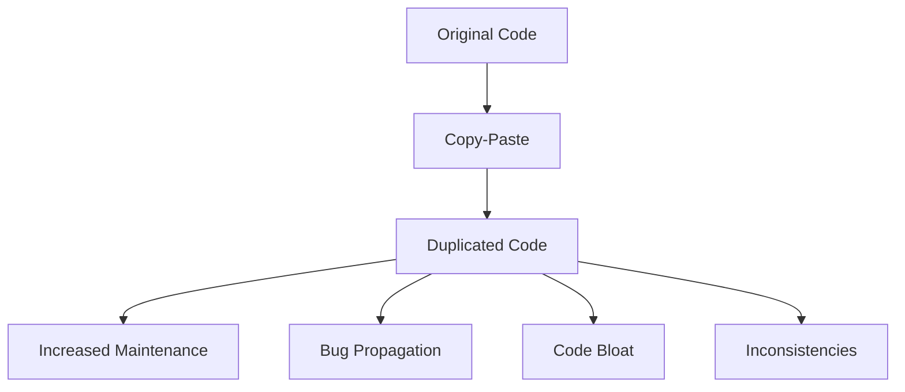

## 17.8 Copy-Paste Programming

Copy-paste programming is a common practice where developers duplicate existing code to reuse it in different parts of a program. While it might seem like a quick and easy way to implement functionality, it often leads to significant issues in software development, particularly in C++. In this section, we'll explore the risks associated with copy-paste programming, how it affects code quality, and strategies for promoting proper code reuse.

### Understanding Copy-Paste Programming

Copy-paste programming involves taking a block of code from one part of a program and inserting it into another, often with minimal or no modification. This practice can be tempting, especially when under tight deadlines or when a developer is unfamiliar with the codebase. However, it introduces several risks and challenges:

- **Code Duplication**: Copy-pasting leads to multiple copies of the same code, which can increase the maintenance burden and the likelihood of introducing bugs.
- **Inconsistency**: If a bug or improvement is made in one copy of the code, it may not be applied to other copies, leading to inconsistent behavior.
- **Increased Complexity**: As the codebase grows, managing and understanding duplicated code becomes more challenging, reducing overall code clarity.

### Risks of Duplicated Code

Duplicated code can have far-reaching consequences on software projects. Let's delve into some of the key risks:

#### 1. **Maintenance Overhead**

When code is duplicated, any changes, such as bug fixes or feature enhancements, must be applied to each instance of the code. This increases the maintenance workload and the risk of errors, as developers may overlook some instances.

#### 2. **Bug Propagation**

If a bug exists in the original code, it will be replicated in every copy. Fixing the bug requires identifying and updating all instances, which is error-prone and time-consuming.

#### 3. **Code Bloat**

Duplicated code contributes to code bloat, making the codebase larger and more difficult to navigate. This can lead to longer compile times and increased resource consumption.

#### 4. **Reduced Code Quality**

Copy-paste programming often results in poorly structured code, as developers may not take the time to refactor or optimize the duplicated code. This can lead to technical debt and reduced code quality over time.

#### 5. **Increased Risk of Inconsistencies**

When code is duplicated, there is a risk that changes made to one copy will not be applied to others, leading to inconsistent behavior across the application.

### Promoting Proper Code Reuse

To mitigate the risks of copy-paste programming, developers should focus on promoting proper code reuse. This involves creating reusable components and leveraging C++ features to enhance code modularity and maintainability.

#### 1. **Use Functions and Classes**

Encapsulate reusable code in functions or classes. This not only reduces duplication but also enhances code readability and maintainability.

```cpp
// Example of encapsulating reusable code in a function
int calculateSum(int a, int b) {
    return a + b;
}

int main() {
    int result1 = calculateSum(5, 10);
    int result2 = calculateSum(20, 30);
    return 0;
}
```

#### 2. **Leverage Templates**

C++ templates allow for generic programming, enabling code reuse across different data types. This reduces duplication and enhances code flexibility.

```cpp
// Example of using templates for code reuse
template <typename T>
T add(T a, T b) {
    return a + b;
}

int main() {
    int intResult = add(5, 10);
    double doubleResult = add(5.5, 10.5);
    return 0;
}
```

#### 3. **Implement Design Patterns**

Design patterns provide proven solutions to common software design problems. By implementing design patterns, developers can create reusable and maintainable code structures.

- **Singleton Pattern**: Ensures a class has only one instance and provides a global point of access to it.
- **Factory Pattern**: Provides an interface for creating objects, allowing subclasses to alter the type of objects that will be created.

#### 4. **Use Libraries and Frameworks**

Leverage existing libraries and frameworks to avoid reinventing the wheel. Many libraries offer well-tested and optimized solutions for common programming tasks.

#### 5. **Refactor Regularly**

Regularly refactor code to eliminate duplication and improve structure. Refactoring helps maintain code quality and reduces technical debt.

### Code Example: Refactoring to Eliminate Duplicated Code

Let's consider a scenario where a developer has duplicated code for calculating the area of different shapes. We'll refactor the code to eliminate duplication and promote reuse.

```cpp
// Original duplicated code
double calculateRectangleArea(double width, double height) {
    return width * height;
}

double calculateCircleArea(double radius) {
    return 3.14159 * radius * radius;
}

// Refactored code using a base class and inheritance
class Shape {
public:
    virtual double area() const = 0;
};

class Rectangle : public Shape {
private:
    double width, height;
public:
    Rectangle(double w, double h) : width(w), height(h) {}
    double area() const override {
        return width * height;
    }
};

class Circle : public Shape {
private:
    double radius;
public:
    Circle(double r) : radius(r) {}
    double area() const override {
        return 3.14159 * radius * radius;
    }
};

int main() {
    Rectangle rect(5, 10);
    Circle circ(7);
    std::cout << "Rectangle area: " << rect.area() << std::endl;
    std::cout << "Circle area: " << circ.area() << std::endl;
    return 0;
}
```

### Visualizing the Impact of Copy-Paste Programming

To better understand the impact of copy-paste programming, let's visualize the flow of code duplication and its consequences using a Mermaid.js diagram.



**Diagram Description**: This diagram illustrates how copy-paste programming leads to duplicated code, resulting in increased maintenance, bug propagation, code bloat, and inconsistencies.

### Try It Yourself: Refactor Duplicated Code

To practice refactoring duplicated code, try the following exercise:

1. Identify a piece of duplicated code in your current project.
2. Refactor the code to eliminate duplication by creating a reusable function, class, or template.
3. Test the refactored code to ensure it functions correctly.

### Knowledge Check

- **Question**: What are the primary risks associated with copy-paste programming?
- **Exercise**: Refactor a piece of duplicated code in a sample project to enhance code reuse.

### Embrace the Journey

Remember, eliminating copy-paste programming is a journey. As you progress, you'll develop more efficient and maintainable code. Keep experimenting, stay curious, and enjoy the journey!

### References and Further Reading

- [C++ Templates: The Complete Guide](https://www.cppreference.com)
- [Design Patterns: Elements of Reusable Object-Oriented Software](https://en.wikipedia.org/wiki/Design_Patterns)
- [Refactoring: Improving the Design of Existing Code](https://martinfowler.com/books/refactoring.html)

## Quiz Time!



### What is a primary risk of copy-paste programming?

- [x] Increased maintenance overhead
- [ ] Improved code readability
- [ ] Enhanced performance
- [ ] Reduced code complexity

> **Explanation:** Copy-paste programming leads to increased maintenance overhead because changes must be applied to each instance of duplicated code.

### How can templates help in reducing code duplication?

- [x] By allowing generic programming
- [ ] By increasing code complexity
- [ ] By making code less readable
- [ ] By enforcing strict type checks

> **Explanation:** Templates allow for generic programming, enabling code reuse across different data types, thus reducing duplication.

### Which design pattern ensures a class has only one instance?

- [x] Singleton Pattern
- [ ] Factory Pattern
- [ ] Observer Pattern
- [ ] Strategy Pattern

> **Explanation:** The Singleton Pattern ensures a class has only one instance and provides a global point of access to it.

### What is the benefit of using libraries and frameworks?

- [x] They offer well-tested and optimized solutions
- [ ] They increase code duplication
- [ ] They reduce code readability
- [ ] They complicate the codebase

> **Explanation:** Libraries and frameworks offer well-tested and optimized solutions for common programming tasks, reducing the need for duplicated code.

### What is a common consequence of code duplication?

- [x] Bug propagation
- [ ] Improved performance
- [ ] Reduced maintenance
- [ ] Simplified codebase

> **Explanation:** Code duplication leads to bug propagation, as bugs in the original code are replicated in every copy.

### What is a key strategy for promoting proper code reuse?

- [x] Encapsulating reusable code in functions or classes
- [ ] Copying code from online sources
- [ ] Writing code without comments
- [ ] Avoiding the use of design patterns

> **Explanation:** Encapsulating reusable code in functions or classes promotes proper code reuse and enhances maintainability.

### How does refactoring help in eliminating duplicated code?

- [x] By improving code structure and reducing duplication
- [ ] By increasing code complexity
- [ ] By making code less readable
- [ ] By introducing more bugs

> **Explanation:** Refactoring helps improve code structure and eliminate duplication, leading to better maintainability.

### What is a potential downside of not refactoring duplicated code?

- [x] Increased technical debt
- [ ] Reduced code size
- [ ] Improved performance
- [ ] Enhanced readability

> **Explanation:** Not refactoring duplicated code can lead to increased technical debt, making future maintenance more challenging.

### How can design patterns aid in code reuse?

- [x] By providing proven solutions to common design problems
- [ ] By increasing code duplication
- [ ] By complicating the codebase
- [ ] By reducing code readability

> **Explanation:** Design patterns provide proven solutions to common design problems, promoting code reuse and maintainability.

### True or False: Copy-paste programming is a recommended practice for quick development.

- [ ] True
- [x] False

> **Explanation:** Copy-paste programming is not recommended as it leads to code duplication, increased maintenance, and potential bugs.


