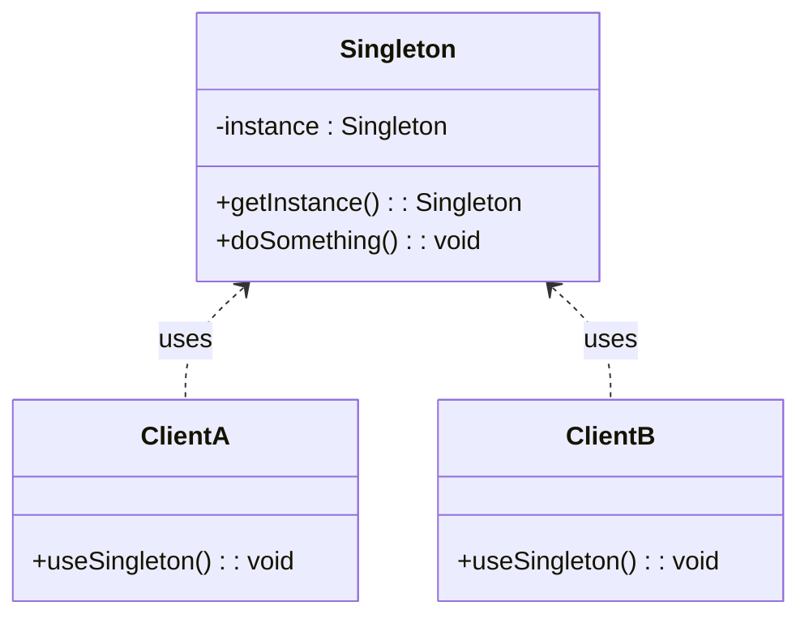

## 17.9 Singleton Overuse

The Singleton pattern is one of the most well-known design patterns in software engineering. It ensures that a class has only one instance and provides a global point of access to it. While the Singleton pattern can be useful in certain scenarios, its overuse can lead to several issues, particularly in C++ programming. In this section, we will explore the drawbacks of Singleton overuse, focusing on global state and testability issues, and provide guidance on how to mitigate these challenges.

### Understanding the Singleton Pattern

Before delving into the pitfalls of Singleton overuse, let's briefly review the Singleton pattern itself.

#### Intent

The intent of the Singleton pattern is to restrict the instantiation of a class to a single object and provide a global point of access to that object. This is useful when exactly one object is needed to coordinate actions across the system.

#### Key Participants

- **Singleton Class**: The class that is responsible for creating and managing its single instance.
- **Instance Method**: A static method that provides access to the Singleton instance.
- **Private Constructor**: Ensures that no other class can instantiate the Singleton class.

#### Sample Code Snippet

Here is a basic implementation of the Singleton pattern in C++:

```cpp
#include <iostream>
#include <mutex>

class Singleton {
public:
    // Static method to provide access to the Singleton instance
    static Singleton& getInstance() {
        static Singleton instance; // Guaranteed to be destroyed and instantiated on first use
        return instance;
    }

    // Delete copy constructor and assignment operator to prevent copies
    Singleton(const Singleton&) = delete;
    Singleton& operator=(const Singleton&) = delete;

    void doSomething() {
        std::cout << "Doing something with the Singleton instance." << std::endl;
    }

private:
    // Private constructor to prevent instantiation
    Singleton() {
        std::cout << "Singleton instance created." << std::endl;
    }
};

int main() {
    Singleton& singleton = Singleton::getInstance();
    singleton.doSomething();
    return 0;
}
```

In this example, the Singleton class ensures that only one instance of the class is created. The `getInstance()` method provides global access to this instance.

### Drawbacks of Singleton Overuse

While the Singleton pattern can be useful, its overuse can lead to several issues that can negatively impact software design and architecture. Let's explore these drawbacks in detail.

#### 1. Global State

One of the primary issues with Singleton overuse is that it introduces global state into the application. A Singleton instance is essentially a global variable, which can lead to several problems:

- **Hidden Dependencies**: Singleton instances can create hidden dependencies between classes, making it difficult to understand the relationships and interactions within the codebase.
- **Tight Coupling**: Classes that rely on a Singleton instance become tightly coupled to it, making it challenging to modify or replace the Singleton without affecting other parts of the system.
- **Difficult Debugging**: Global state can make debugging more challenging, as changes to the Singleton instance can have widespread and unexpected effects throughout the application.

#### 2. Testability Issues

Singletons can also hinder testability, particularly in unit testing:

- **Mocking Challenges**: Since Singleton instances are globally accessible, it can be difficult to replace them with mock objects during testing. This can lead to tests that are not isolated and may depend on the actual Singleton implementation.
- **State Leakage**: Tests that rely on Singleton instances may inadvertently affect each other due to shared state, leading to flaky tests that pass or fail unpredictably.
- **Limited Flexibility**: The rigid structure of Singletons can limit the flexibility of tests, making it challenging to test different scenarios or configurations.

#### 3. Violation of the Single Responsibility Principle

The Singleton pattern can lead to a violation of the Single Responsibility Principle (SRP), one of the SOLID principles of object-oriented design. A Singleton class often takes on multiple responsibilities, such as managing its own instance and providing business logic, which can lead to a bloated and difficult-to-maintain class.

#### 4. Performance Concerns

In some cases, the Singleton pattern can introduce performance bottlenecks:

- **Contention**: If multiple threads frequently access the Singleton instance, contention can occur, leading to performance degradation.
- **Lazy Initialization Overhead**: While lazy initialization can be beneficial, it can also introduce a slight overhead, particularly if the Singleton instance is accessed frequently.

### Design Considerations and Alternatives

Given the drawbacks of Singleton overuse, it's important to consider alternative approaches and design patterns that can achieve similar goals without the associated issues.

#### 1. Dependency Injection

Dependency Injection (DI) is a design pattern that can help mitigate the issues associated with Singleton overuse. By injecting dependencies into a class rather than relying on global state, DI promotes loose coupling and improves testability.

```cpp
#include <iostream>
#include <memory>

class Service {
public:
    void performAction() {
        std::cout << "Performing action in Service." << std::endl;
    }
};

class Client {
public:
    Client(std::shared_ptr<Service> service) : service_(service) {}

    void execute() {
        service_->performAction();
    }

private:
    std::shared_ptr<Service> service_;
};

int main() {
    auto service = std::make_shared<Service>();
    Client client(service);
    client.execute();
    return 0;
}
```

In this example, the `Client` class receives a `Service` instance through its constructor, allowing for greater flexibility and testability.

#### 2. Factory Pattern

The Factory pattern can be used to manage the creation of objects, providing a centralized point for object creation without relying on global state.

```cpp
#include <iostream>
#include <memory>

class Product {
public:
    virtual void use() = 0;
};

class ConcreteProduct : public Product {
public:
    void use() override {
        std::cout << "Using ConcreteProduct." << std::endl;
    }
};

class Factory {
public:
    static std::unique_ptr<Product> createProduct() {
        return std::make_unique<ConcreteProduct>();
    }
};

int main() {
    auto product = Factory::createProduct();
    product->use();
    return 0;
}
```

The Factory pattern allows for the creation of `Product` instances without exposing the creation logic to the client code.

#### 3. Scoped Singleton

In some cases, a scoped Singleton can be a suitable alternative. This approach limits the lifetime and scope of the Singleton instance, reducing the impact of global state.

```cpp
#include <iostream>
#include <memory>

class ScopedSingleton {
public:
    static std::unique_ptr<ScopedSingleton> createInstance() {
        return std::make_unique<ScopedSingleton>();
    }

    void doSomething() {
        std::cout << "Doing something with ScopedSingleton." << std::endl;
    }

private:
    ScopedSingleton() {
        std::cout << "ScopedSingleton instance created." << std::endl;
    }
};

int main() {
    auto scopedSingleton = ScopedSingleton::createInstance();
    scopedSingleton->doSomething();
    return 0;
}
```

In this example, the `ScopedSingleton` instance is created and managed within a specific scope, reducing the potential for global state issues.

### Visualizing Singleton Overuse

To better understand the impact of Singleton overuse, let's visualize the relationships and dependencies that can arise in a system that heavily relies on Singletons.



In this diagram, `ClientA` and `ClientB` both rely on the `Singleton` instance, creating a tight coupling between these classes and the Singleton. This can lead to the issues discussed earlier, such as hidden dependencies and testability challenges.

### Differences and Similarities with Other Patterns

The Singleton pattern is often compared to other creational patterns, such as the Factory and Builder patterns. While these patterns share some similarities, they serve different purposes:

- **Singleton vs. Factory**: The Singleton pattern focuses on ensuring a single instance, while the Factory pattern is concerned with object creation without specifying the exact class of object that will be created.
- **Singleton vs. Builder**: The Builder pattern is used to construct complex objects step by step, whereas the Singleton pattern ensures a single instance of a class.

### When to Use the Singleton Pattern

Despite its drawbacks, there are scenarios where the Singleton pattern can be appropriate:

- **Resource Management**: When managing a shared resource, such as a configuration file or a logging service, a Singleton can ensure that only one instance is used.
- **Global Access**: When global access to a single instance is necessary, such as in a GUI application where a single window manager is required.

However, it's crucial to carefully consider the potential drawbacks and explore alternative patterns before deciding to use a Singleton.

### Mitigating Singleton Overuse

To mitigate the issues associated with Singleton overuse, consider the following strategies:

- **Limit Scope**: Restrict the scope and lifetime of Singleton instances to minimize global state.
- **Use Dependency Injection**: Leverage DI to decouple classes and improve testability.
- **Refactor**: Regularly review and refactor code to identify and address unnecessary Singleton usage.
- **Educate**: Educate team members about the potential pitfalls of Singleton overuse and encourage the use of alternative patterns.

### Conclusion

While the Singleton pattern can be a useful tool in certain scenarios, its overuse can lead to significant issues, particularly in C++ programming. By understanding the drawbacks of Singleton overuse and exploring alternative design patterns, developers can create more flexible, maintainable, and testable software systems.

Remember, this is just the beginning. As you progress in your software development journey, you'll encounter more complex design challenges. Keep experimenting, stay curious, and enjoy the journey!

## Quiz Time!



### What is the primary intent of the Singleton pattern?

- [x] To ensure a class has only one instance and provide a global point of access to it.
- [ ] To create families of related objects without specifying their concrete classes.
- [ ] To define a family of algorithms and make them interchangeable.
- [ ] To compose objects into tree structures to represent part-whole hierarchies.

> **Explanation:** The Singleton pattern's primary intent is to ensure a class has only one instance and provide a global point of access to it.

### What is a major drawback of Singleton overuse?

- [x] It introduces global state, leading to hidden dependencies and tight coupling.
- [ ] It makes object creation more complex and less efficient.
- [ ] It requires extensive use of inheritance and polymorphism.
- [ ] It limits the ability to create multiple instances of a class.

> **Explanation:** Singleton overuse introduces global state, leading to hidden dependencies and tight coupling, which can complicate debugging and maintenance.

### How can Dependency Injection help mitigate Singleton overuse?

- [x] By promoting loose coupling and improving testability through injected dependencies.
- [ ] By ensuring that only one instance of a class is created.
- [ ] By providing a centralized point for object creation.
- [ ] By encapsulating complex object construction processes.

> **Explanation:** Dependency Injection promotes loose coupling and improves testability by injecting dependencies, reducing reliance on global state.

### Which pattern can be used as an alternative to Singleton for managing object creation?

- [x] Factory Pattern
- [ ] Observer Pattern
- [ ] Strategy Pattern
- [ ] Command Pattern

> **Explanation:** The Factory pattern can manage object creation without relying on global state, serving as an alternative to Singleton.

### What is a potential performance concern with Singleton overuse?

- [x] Contention from multiple threads accessing the Singleton instance.
- [ ] Increased memory usage due to multiple instances.
- [ ] Slower object creation times.
- [ ] Excessive use of inheritance and polymorphism.

> **Explanation:** Singleton overuse can lead to contention if multiple threads frequently access the Singleton instance, degrading performance.

### What is a scoped Singleton?

- [x] A Singleton whose lifetime and scope are limited to reduce global state impact.
- [ ] A Singleton that uses lazy initialization to improve performance.
- [ ] A Singleton that is created using a Factory pattern.
- [ ] A Singleton that manages multiple instances of a class.

> **Explanation:** A scoped Singleton limits its lifetime and scope, reducing the impact of global state.

### What is a common issue with testing code that uses Singletons?

- [x] Difficulty in replacing Singletons with mock objects during testing.
- [ ] Increased complexity in object creation.
- [ ] Limited ability to use inheritance and polymorphism.
- [ ] Difficulty in managing multiple instances of a class.

> **Explanation:** Testing code that uses Singletons can be challenging because it's difficult to replace them with mock objects, affecting test isolation.

### How can the Factory pattern improve software design compared to Singleton?

- [x] By centralizing object creation without relying on global state.
- [ ] By ensuring only one instance of a class is created.
- [ ] By encapsulating complex object construction processes.
- [ ] By defining a family of algorithms and making them interchangeable.

> **Explanation:** The Factory pattern centralizes object creation without relying on global state, improving software design flexibility.

### What is a key difference between Singleton and Builder patterns?

- [x] Singleton ensures a single instance, while Builder constructs complex objects step by step.
- [ ] Singleton creates families of related objects, while Builder defines a family of algorithms.
- [ ] Singleton provides a global point of access, while Builder manages object creation.
- [ ] Singleton uses inheritance, while Builder uses polymorphism.

> **Explanation:** Singleton ensures a single instance, while Builder constructs complex objects step by step, serving different purposes.

### True or False: The Singleton pattern is always the best choice for managing shared resources.

- [ ] True
- [x] False

> **Explanation:** False. While Singleton can manage shared resources, it may not always be the best choice due to potential drawbacks like global state and testability issues.


