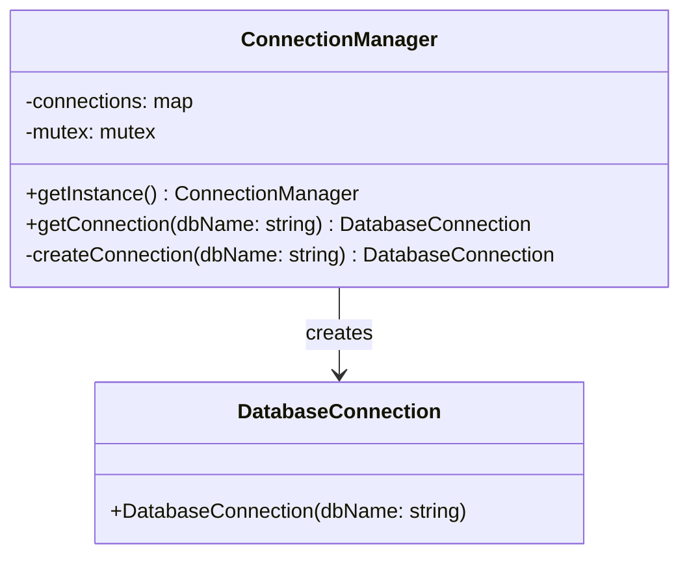

## 18.1 Combining Patterns Effectively

In the world of software design, leveraging design patterns is akin to using a well-stocked toolkit. Each pattern addresses specific design challenges, but the true power of design patterns emerges when they are combined effectively to solve complex problems. In this section, we will delve into the art of integrating multiple design patterns in C++, exploring how to harness their synergies, navigate potential conflicts, and apply them in sophisticated systems.

### Understanding Pattern Synergy

Design patterns are not isolated solutions; they often complement each other, creating a synergy that enhances the overall architecture of a system. By combining patterns, we can address multiple design concerns simultaneously, leading to more robust and flexible solutions.

#### Example: Combining Factory and Singleton Patterns

Consider a scenario where we need to manage a collection of database connections. We can use the **Factory Pattern** to encapsulate the creation logic of connections and the **Singleton Pattern** to ensure that only one instance of the connection manager exists.

```cpp
#include <iostream>
#include <memory>
#include <mutex>
#include <map>

// Singleton ConnectionManager
class ConnectionManager {
public:
    static ConnectionManager& getInstance() {
        static ConnectionManager instance;
        return instance;
    }

    std::shared_ptr<DatabaseConnection> getConnection(const std::string& dbName) {
        std::lock_guard<std::mutex> lock(mutex_);
        if (connections_.find(dbName) == connections_.end()) {
            connections_[dbName] = createConnection(dbName);
        }
        return connections_[dbName];
    }

private:
    ConnectionManager() = default;
    std::map<std::string, std::shared_ptr<DatabaseConnection>> connections_;
    std::mutex mutex_;

    std::shared_ptr<DatabaseConnection> createConnection(const std::string& dbName) {
        // Factory method to create a new database connection
        return std::make_shared<DatabaseConnection>(dbName);
    }
};
```

In this example, the Singleton pattern ensures a single instance of `ConnectionManager`, while the Factory method encapsulates the creation logic of `DatabaseConnection` objects.

### Navigating Pattern Conflicts

While combining patterns can be powerful, it can also lead to conflicts if not managed carefully. Conflicts often arise due to overlapping responsibilities or incompatible interfaces.

#### Example: Observer and Mediator Patterns

Both the **Observer** and **Mediator** patterns deal with communication between objects. However, using them together without clear boundaries can lead to confusion and tightly coupled code.

To avoid conflicts, clearly define the roles of each pattern. Use the Mediator to centralize complex communication logic, while the Observer can handle simple notifications.

```cpp
#include <iostream>
#include <vector>
#include <memory>

// Mediator interface
class Mediator {
public:
    virtual void notify(const std::string& event) = 0;
};

// Concrete Mediator
class ConcreteMediator : public Mediator {
public:
    void addObserver(std::shared_ptr<Observer> observer) {
        observers_.push_back(observer);
    }

    void notify(const std::string& event) override {
        for (auto& observer : observers_) {
            observer->update(event);
        }
    }

private:
    std::vector<std::shared_ptr<Observer>> observers_;
};

// Observer interface
class Observer {
public:
    virtual void update(const std::string& event) = 0;
};

// Concrete Observer
class ConcreteObserver : public Observer {
public:
    void update(const std::string& event) override {
        std::cout << "Observer received event: " << event << std::endl;
    }
};
```

In this setup, the `ConcreteMediator` manages the communication between observers, ensuring that the system remains decoupled and maintainable.

### Applying Patterns in Complex Systems

When designing complex systems, it's crucial to consider the interactions between patterns and how they contribute to the overall architecture. Let's explore a few scenarios where combining patterns can lead to elegant solutions.

#### Case Study: Building a Plugin Architecture

In a plugin architecture, we need to dynamically load and manage plugins at runtime. This requires a combination of several patterns:

- **Factory Pattern**: To create plugin instances.
- **Singleton Pattern**: To manage the plugin registry.
- **Observer Pattern**: To notify the system of plugin events.

```cpp
#include <iostream>
#include <map>
#include <memory>
#include <vector>

// Plugin interface
class Plugin {
public:
    virtual void execute() = 0;
};

// Factory for creating plugins
class PluginFactory {
public:
    std::shared_ptr<Plugin> createPlugin(const std::string& pluginName) {
        // Logic to create and return a plugin instance
    }
};

// Singleton PluginManager
class PluginManager {
public:
    static PluginManager& getInstance() {
        static PluginManager instance;
        return instance;
    }

    void registerPlugin(const std::string& name, std::shared_ptr<Plugin> plugin) {
        plugins_[name] = plugin;
    }

    void notifyPlugins() {
        for (auto& [name, plugin] : plugins_) {
            plugin->execute();
        }
    }

private:
    PluginManager() = default;
    std::map<std::string, std::shared_ptr<Plugin>> plugins_;
};

// Observer for plugin events
class PluginObserver {
public:
    void onPluginLoaded(const std::string& pluginName) {
        std::cout << "Plugin loaded: " << pluginName << std::endl;
    }
};
```

In this example, the PluginManager uses the Singleton pattern to manage plugins, the Factory pattern to create them, and the Observer pattern to handle plugin events.

### Visualizing Pattern Interactions

To better understand how patterns interact, let's visualize the relationships between them using a class diagram.



This diagram illustrates how the Singleton and Factory patterns collaborate in the `ConnectionManager` class to manage database connections.

### Design Considerations

When combining patterns, consider the following design considerations:

1. **Cohesion and Coupling**: Aim for high cohesion within components and low coupling between them. Patterns should enhance modularity, not hinder it.

2. **Responsibility Separation**: Clearly define the responsibilities of each pattern. Avoid overlapping functionalities that can lead to confusion and maintenance challenges.

3. **Scalability and Flexibility**: Ensure that the combined patterns support scalability and flexibility. This is particularly important in systems that need to adapt to changing requirements.

4. **Performance Implications**: Be mindful of the performance implications of combining patterns. Some patterns may introduce overhead, so it's essential to balance design elegance with performance efficiency.

### Differences and Similarities

While combining patterns, it's crucial to understand their differences and similarities to avoid common pitfalls:

- **Observer vs. Mediator**: Both patterns deal with communication, but the Observer is more suited for simple notifications, while the Mediator handles complex interactions.

- **Factory vs. Builder**: The Factory pattern focuses on object creation, while the Builder pattern is ideal for constructing complex objects step by step.

- **Singleton vs. Multiton**: The Singleton pattern ensures a single instance, whereas the Multiton pattern manages a limited number of instances.

### Try It Yourself

To reinforce your understanding, try modifying the provided examples:

1. **Extend the Plugin Architecture**: Add a new pattern, such as the Decorator, to dynamically add functionality to plugins.

2. **Experiment with Different Patterns**: Replace the Observer pattern with the Mediator pattern in the plugin architecture and observe the changes in communication flow.

### Knowledge Check

- **What are the benefits of combining design patterns?**
- **How can you avoid conflicts when integrating multiple patterns?**
- **What considerations should you keep in mind when combining patterns in complex systems?**

### Embrace the Journey

Remember, mastering the art of combining design patterns is a journey. As you gain experience, you'll develop an intuition for selecting and integrating patterns that best suit your design challenges. Keep experimenting, stay curious, and enjoy the process of crafting elegant and efficient software architectures.

## Quiz Time!



### What is the primary benefit of combining design patterns?

- [x] To address multiple design concerns simultaneously
- [ ] To increase code complexity
- [ ] To reduce the number of classes
- [ ] To eliminate the need for documentation

> **Explanation:** Combining design patterns allows you to address multiple design concerns simultaneously, leading to more robust and flexible solutions.

### Which patterns are combined in the plugin architecture example?

- [x] Factory, Singleton, Observer
- [ ] Factory, Builder, Decorator
- [ ] Singleton, Adapter, Strategy
- [ ] Observer, Mediator, Command

> **Explanation:** The plugin architecture example combines the Factory, Singleton, and Observer patterns to manage plugins effectively.

### How can you avoid conflicts when combining patterns?

- [x] Clearly define the roles and responsibilities of each pattern
- [ ] Use as many patterns as possible
- [ ] Avoid using patterns altogether
- [ ] Focus only on performance

> **Explanation:** To avoid conflicts, it's essential to clearly define the roles and responsibilities of each pattern, ensuring they complement rather than conflict with each other.

### What is a key consideration when combining patterns?

- [x] Cohesion and coupling
- [ ] Increasing the number of classes
- [ ] Reducing code readability
- [ ] Eliminating all dependencies

> **Explanation:** When combining patterns, aim for high cohesion within components and low coupling between them to enhance modularity.

### Which pattern is more suited for simple notifications?

- [x] Observer
- [ ] Mediator
- [ ] Command
- [ ] Strategy

> **Explanation:** The Observer pattern is more suited for simple notifications, while the Mediator handles complex interactions.

### What should you consider regarding performance when combining patterns?

- [x] Balance design elegance with performance efficiency
- [ ] Focus solely on design elegance
- [ ] Ignore performance implications
- [ ] Prioritize performance over design

> **Explanation:** It's essential to balance design elegance with performance efficiency, as some patterns may introduce overhead.

### What is the difference between Factory and Builder patterns?

- [x] Factory focuses on object creation, while Builder constructs complex objects step by step
- [ ] Factory is for complex objects, Builder is for simple objects
- [ ] Factory and Builder are the same
- [ ] Builder is used for singleton instances

> **Explanation:** The Factory pattern focuses on object creation, while the Builder pattern is ideal for constructing complex objects step by step.

### How does the Singleton pattern differ from the Multiton pattern?

- [x] Singleton ensures a single instance, Multiton manages a limited number of instances
- [ ] Singleton manages multiple instances, Multiton ensures a single instance
- [ ] Both patterns are identical
- [ ] Multiton is a type of Singleton

> **Explanation:** The Singleton pattern ensures a single instance, whereas the Multiton pattern manages a limited number of instances.

### True or False: The Observer pattern is more suited for complex interactions than the Mediator pattern.

- [ ] True
- [x] False

> **Explanation:** False. The Mediator pattern is more suited for complex interactions, while the Observer pattern is better for simple notifications.


