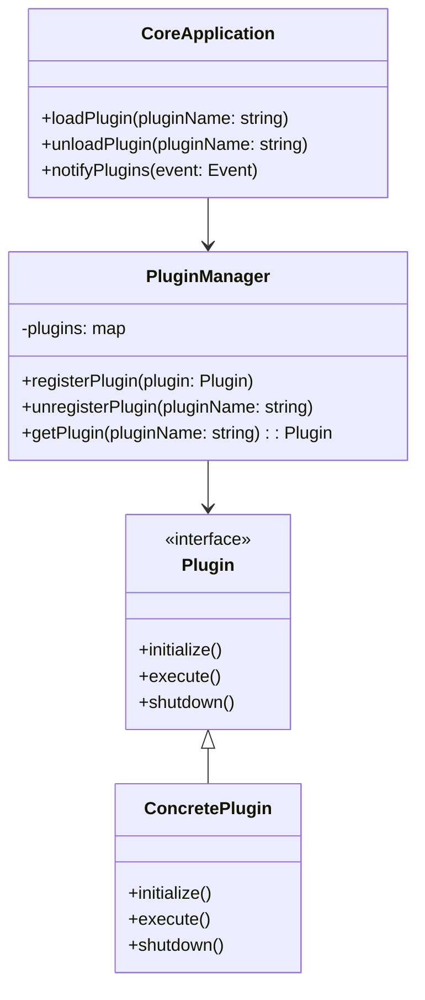
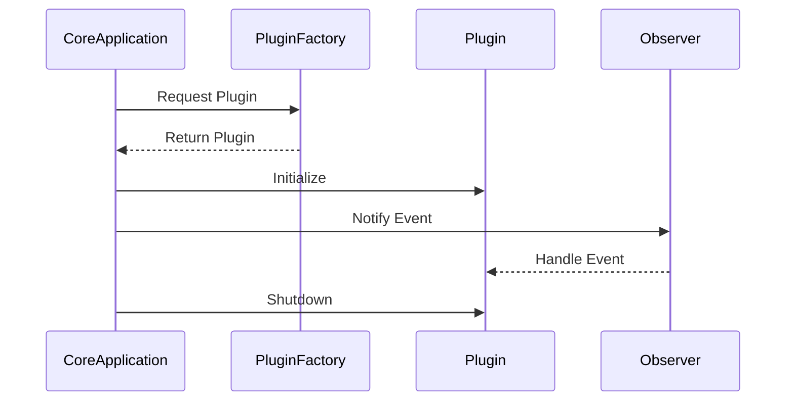

## 18.2 Case Study: Building a Plugin Architecture

In this case study, we delve into the intricacies of building a plugin architecture using C++ design patterns. By integrating the Factory, Singleton, and Observer patterns, we can create a system that is both extensible and modular. This approach allows for dynamic loading and unloading of plugins, facilitating a flexible and scalable software architecture.

### Introduction to Plugin Architectures

A plugin architecture is a software design that allows the addition of new features or functionalities without altering the core system. This is achieved by loading external modules, or "plugins," at runtime. Such architectures are prevalent in applications like web browsers, IDEs, and media players, where user customization and extensibility are paramount.

### Key Design Patterns

To build an effective plugin architecture, we will employ the following design patterns:

- **Factory Pattern**: This pattern provides an interface for creating objects in a superclass but allows subclasses to alter the type of objects that will be created. It is crucial for creating plugin instances dynamically.
  
- **Singleton Pattern**: Ensures a class has only one instance and provides a global point of access to it. This pattern is essential for managing shared resources or configurations across plugins.
  
- **Observer Pattern**: Defines a one-to-many dependency between objects so that when one object changes state, all its dependents are notified and updated automatically. This pattern is useful for communication between the core application and plugins.

### Designing the Plugin Architecture

#### Overview

The architecture consists of a core application that interacts with various plugins. Each plugin implements a specific interface, allowing the core application to communicate with it seamlessly. The core application uses a plugin manager to load, unload, and manage plugins dynamically.

#### Diagram: Plugin Architecture Overview



### Implementing the Factory Pattern

The Factory Pattern is used to create instances of plugins. This pattern decouples the instantiation process from the core application, allowing new plugins to be added without modifying existing code.

#### Code Example: Plugin Factory

```cpp
#include <iostream>
#include <map>
#include <memory>
#include <string>

// Plugin interface
class Plugin {
public:
    virtual ~Plugin() = default;
    virtual void initialize() = 0;
    virtual void execute() = 0;
    virtual void shutdown() = 0;
};

// Concrete Plugin
class ConcretePlugin : public Plugin {
public:
    void initialize() override {
        std::cout << "ConcretePlugin initialized." << std::endl;
    }
    void execute() override {
        std::cout << "ConcretePlugin executing." << std::endl;
    }
    void shutdown() override {
        std::cout << "ConcretePlugin shutting down." << std::endl;
    }
};

// Plugin Factory
class PluginFactory {
public:
    using CreatorFunc = std::unique_ptr<Plugin>(*)();

    static PluginFactory& getInstance() {
        static PluginFactory instance;
        return instance;
    }

    void registerPlugin(const std::string& name, CreatorFunc creator) {
        creators[name] = creator;
    }

    std::unique_ptr<Plugin> createPlugin(const std::string& name) {
        if (creators.find(name) != creators.end()) {
            return creators[name]();
        }
        return nullptr;
    }

private:
    std::map<std::string, CreatorFunc> creators;
    PluginFactory() = default;
};

// Plugin registration function
std::unique_ptr<Plugin> createConcretePlugin() {
    return std::make_unique<ConcretePlugin>();
}

int main() {
    PluginFactory& factory = PluginFactory::getInstance();
    factory.registerPlugin("ConcretePlugin", createConcretePlugin);

    std::unique_ptr<Plugin> plugin = factory.createPlugin("ConcretePlugin");
    if (plugin) {
        plugin->initialize();
        plugin->execute();
        plugin->shutdown();
    }

    return 0;
}
```

### Implementing the Singleton Pattern

The Singleton Pattern ensures that there is only one instance of the PluginFactory, which manages the creation of plugin instances.

#### Key Considerations

- **Thread Safety**: Ensure that the Singleton instance is thread-safe, especially in a multithreaded environment.
- **Lazy Initialization**: The Singleton instance should be created only when it is first needed.

### Implementing the Observer Pattern

The Observer Pattern is used to notify plugins of events occurring within the core application. This allows plugins to react to changes or actions initiated by the user or other plugins.

#### Code Example: Event Notification

```cpp
#include <iostream>
#include <vector>
#include <string>

// Observer interface
class Observer {
public:
    virtual ~Observer() = default;
    virtual void onNotify(const std::string& event) = 0;
};

// Concrete Observer (Plugin)
class ConcreteObserver : public Observer {
public:
    void onNotify(const std::string& event) override {
        std::cout << "ConcreteObserver received event: " << event << std::endl;
    }
};

// Subject (Core Application)
class Subject {
public:
    void addObserver(Observer* observer) {
        observers.push_back(observer);
    }

    void removeObserver(Observer* observer) {
        observers.erase(std::remove(observers.begin(), observers.end(), observer), observers.end());
    }

    void notify(const std::string& event) {
        for (Observer* observer : observers) {
            observer->onNotify(event);
        }
    }

private:
    std::vector<Observer*> observers;
};

int main() {
    Subject subject;
    ConcreteObserver observer;

    subject.addObserver(&observer);
    subject.notify("PluginLoaded");

    subject.removeObserver(&observer);
    subject.notify("PluginUnloaded");

    return 0;
}
```

### Integrating the Patterns

By integrating these patterns, we create a cohesive plugin architecture that is both flexible and scalable. The Factory Pattern handles the creation of plugin instances, the Singleton Pattern ensures a single point of management, and the Observer Pattern facilitates communication between the core application and plugins.

#### Diagram: Integrated Plugin Architecture



### Design Considerations

- **Extensibility**: The architecture should allow new plugins to be added with minimal changes to the core application.
- **Modularity**: Each plugin should operate independently, minimizing dependencies on other plugins or the core application.
- **Performance**: Consider the impact of loading and unloading plugins on application performance.
- **Security**: Ensure that plugins are sandboxed to prevent malicious actions or data breaches.

### Differences and Similarities

- **Factory vs. Singleton**: While both patterns deal with object creation, the Factory Pattern focuses on creating multiple instances, whereas the Singleton Pattern ensures a single instance.
- **Observer vs. Singleton**: The Observer Pattern deals with communication between objects, while the Singleton Pattern manages a single instance of a class.
- **Factory vs. Observer**: The Factory Pattern creates objects, while the Observer Pattern manages the interaction between objects.

### Try It Yourself

Now that we've covered the theory and provided examples, it's time to experiment. Try modifying the code examples to:

- Add a new type of plugin and register it with the factory.
- Implement a new event and notify plugins of this event.
- Ensure thread safety in the Singleton implementation.

### Knowledge Check

- What are the benefits of using a plugin architecture?
- How does the Factory Pattern contribute to extensibility?
- Why is the Singleton Pattern important in a plugin architecture?
- How does the Observer Pattern facilitate communication between the core application and plugins?

### Embrace the Journey

Building a plugin architecture is a rewarding endeavor that enhances the flexibility and scalability of your software. Remember, this is just the beginning. As you progress, you'll discover new ways to optimize and extend your architecture. Keep experimenting, stay curious, and enjoy the journey!

## Quiz Time!



### What is the primary benefit of using a plugin architecture?

- [x] Extensibility and modularity
- [ ] Improved performance
- [ ] Simplified codebase
- [ ] Enhanced security

> **Explanation:** A plugin architecture allows for extensibility and modularity by enabling the addition of new features without altering the core system.

### Which design pattern is used to ensure a class has only one instance?

- [x] Singleton Pattern
- [ ] Factory Pattern
- [ ] Observer Pattern
- [ ] Adapter Pattern

> **Explanation:** The Singleton Pattern ensures a class has only one instance and provides a global point of access to it.

### How does the Factory Pattern contribute to a plugin architecture?

- [x] By creating plugin instances dynamically
- [ ] By managing shared resources
- [ ] By notifying plugins of events
- [ ] By simplifying the codebase

> **Explanation:** The Factory Pattern is used to create instances of plugins dynamically, allowing new plugins to be added without modifying existing code.

### What role does the Observer Pattern play in a plugin architecture?

- [x] It facilitates communication between the core application and plugins.
- [ ] It manages the creation of plugin instances.
- [ ] It ensures a single instance of a class.
- [ ] It simplifies the codebase.

> **Explanation:** The Observer Pattern defines a one-to-many dependency between objects, allowing plugins to be notified of events occurring within the core application.

### Which pattern is essential for managing shared resources across plugins?

- [x] Singleton Pattern
- [ ] Factory Pattern
- [ ] Observer Pattern
- [ ] Decorator Pattern

> **Explanation:** The Singleton Pattern is essential for managing shared resources or configurations across plugins by ensuring only one instance of a resource manager exists.

### What is a key design consideration for a plugin architecture?

- [x] Extensibility
- [ ] Code duplication
- [ ] Hardcoding plugin types
- [ ] Ignoring security

> **Explanation:** Extensibility is a key design consideration, allowing new plugins to be added with minimal changes to the core application.

### How can you ensure thread safety in a Singleton implementation?

- [x] Use mutexes or locks
- [ ] Use global variables
- [ ] Ignore thread safety
- [ ] Use multiple instances

> **Explanation:** Ensuring thread safety in a Singleton implementation can be achieved by using mutexes or locks to control access to the instance.

### What is the main difference between the Factory and Observer patterns?

- [x] Factory creates objects, Observer manages interactions.
- [ ] Factory manages interactions, Observer creates objects.
- [ ] Both create objects.
- [ ] Both manage interactions.

> **Explanation:** The Factory Pattern focuses on creating objects, while the Observer Pattern manages the interaction between objects.

### Which pattern is used to notify plugins of events?

- [x] Observer Pattern
- [ ] Factory Pattern
- [ ] Singleton Pattern
- [ ] Strategy Pattern

> **Explanation:** The Observer Pattern is used to notify plugins of events occurring within the core application.

### True or False: The Singleton Pattern is used to create multiple instances of plugins.

- [ ] True
- [x] False

> **Explanation:** False. The Singleton Pattern ensures a class has only one instance, not multiple instances.


