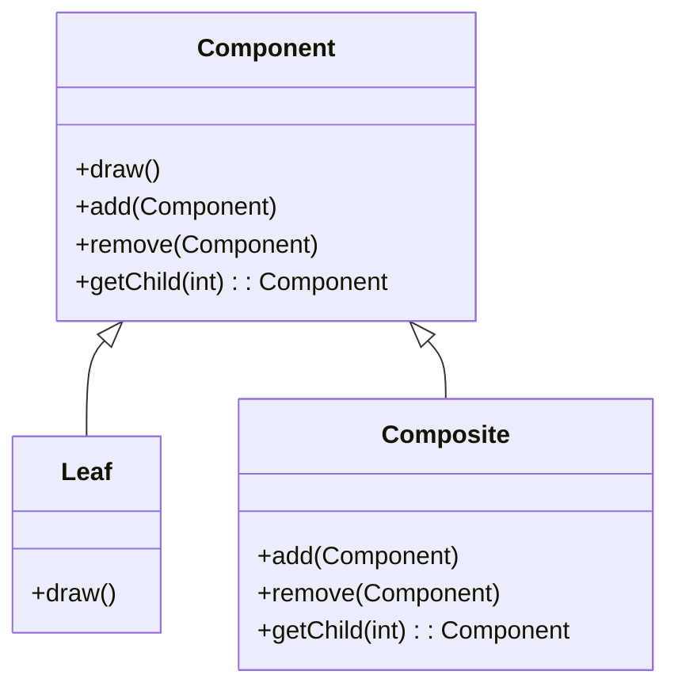
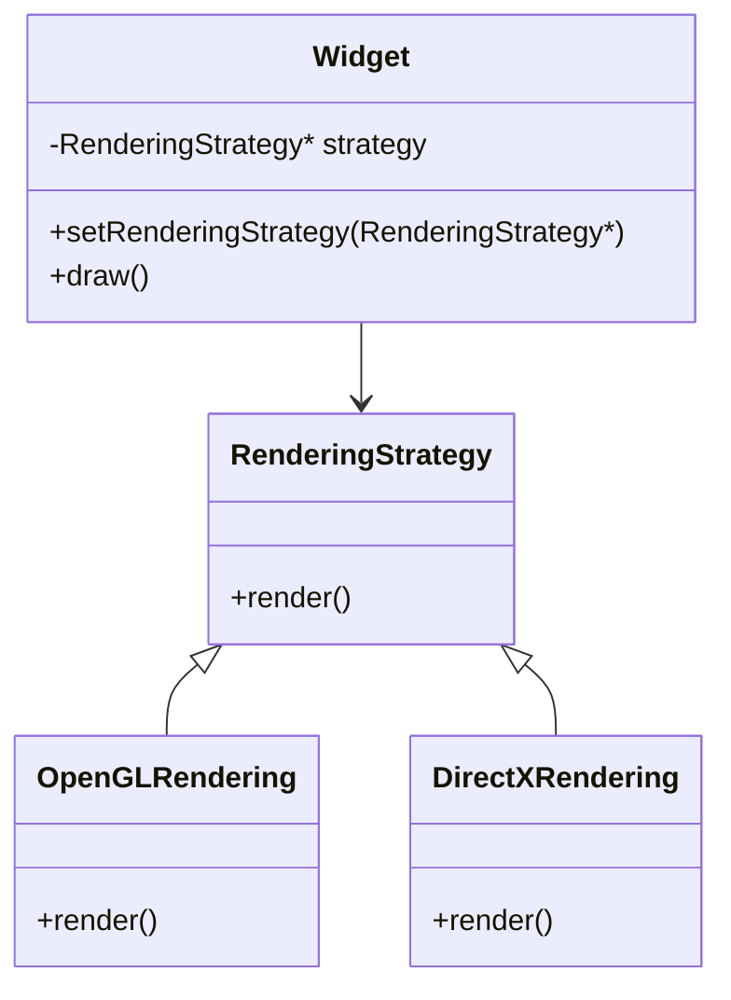
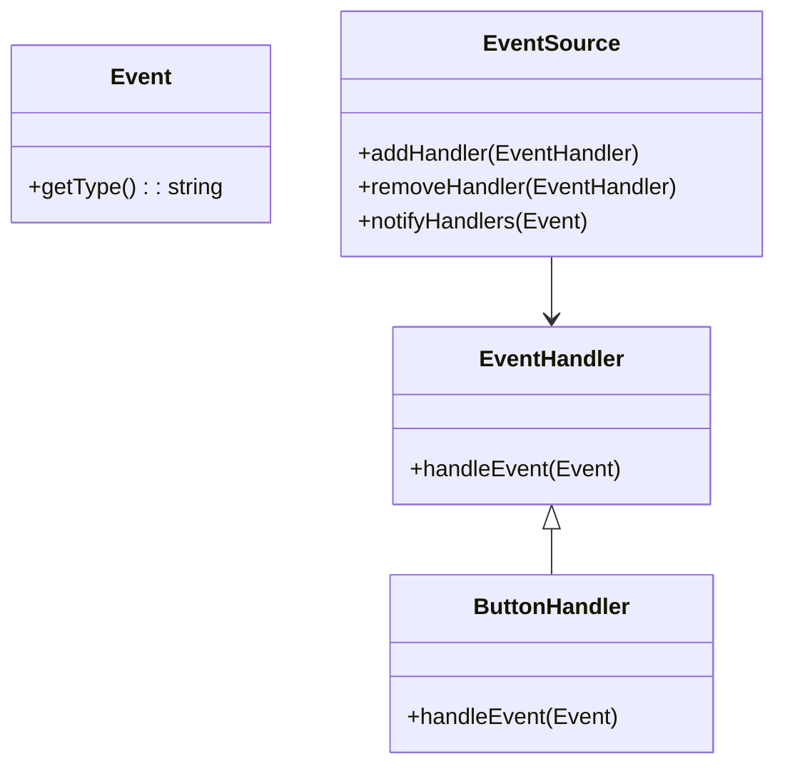
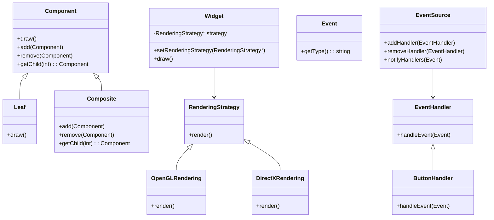

## 18.3 Case Study: Designing a GUI Framework

In this comprehensive case study, we will delve into the design and implementation of a Graphical User Interface (GUI) framework using C++. This framework will leverage the Composite, Strategy, and Event Handling patterns to achieve a clean separation of concerns, making it robust, scalable, and maintainable. By the end of this guide, you will have a deep understanding of how these design patterns can be applied to create a sophisticated GUI framework.

### Introduction to GUI Frameworks

A GUI framework is a software library that provides a structured way to build graphical user interfaces. It abstracts the complexities of handling user inputs, rendering graphics, and managing application states. In C++, designing a GUI framework requires careful consideration of design patterns to ensure that the framework is both flexible and efficient.

### Key Design Patterns

Before diving into the implementation, let's briefly review the key design patterns we will use:

#### Composite Pattern

**Intent:** The Composite pattern allows you to compose objects into tree structures to represent part-whole hierarchies. It lets clients treat individual objects and compositions of objects uniformly.

**Applicability:** Use the Composite pattern when you want to represent part-whole hierarchies of objects, or when you want clients to be able to ignore the difference between compositions of objects and individual objects.

#### Strategy Pattern

**Intent:** The Strategy pattern defines a family of algorithms, encapsulates each one, and makes them interchangeable. It lets the algorithm vary independently from clients that use it.

**Applicability:** Use the Strategy pattern when you have many related classes that differ only in their behavior, or when you need different variants of an algorithm.

#### Event Handling Pattern

**Intent:** Event Handling is a pattern used to manage user interactions and other events in a system. It decouples the event source from the event handler, allowing for flexible and dynamic event management.

**Applicability:** Use Event Handling when you need to manage complex user interactions or asynchronous events in a decoupled manner.

### Designing the GUI Framework

Our GUI framework will consist of several key components: a widget hierarchy, rendering strategies, and an event handling system. Let's explore each component in detail.

#### Widget Hierarchy with Composite Pattern

The widget hierarchy is the backbone of our GUI framework. It represents the visual elements of the interface, such as buttons, labels, and panels. We'll use the Composite pattern to build this hierarchy, allowing us to treat individual widgets and compositions of widgets uniformly.

**Key Participants:**

- **Component:** The base class for all widgets.
- **Leaf:** Represents individual widgets, such as buttons and labels.
- **Composite:** Represents composite widgets, such as panels that can contain other widgets.

**Class Diagram:**



**Implementation:**

```cpp
#include <iostream>
#include <vector>
#include <memory>

// Component class
class Component {
public:
    virtual ~Component() = default;
    virtual void draw() const = 0;
    virtual void add(std::shared_ptr<Component> component) {}
    virtual void remove(std::shared_ptr<Component> component) {}
    virtual std::shared_ptr<Component> getChild(int index) { return nullptr; }
};

// Leaf class
class Button : public Component {
public:
    void draw() const override {
        std::cout << "Drawing a button" << std::endl;
    }
};

// Composite class
class Panel : public Component {
private:
    std::vector<std::shared_ptr<Component>> children;
public:
    void draw() const override {
        std::cout << "Drawing a panel" << std::endl;
        for (const auto& child : children) {
            child->draw();
        }
    }
    void add(std::shared_ptr<Component> component) override {
        children.push_back(component);
    }
    void remove(std::shared_ptr<Component> component) override {
        children.erase(std::remove(children.begin(), children.end(), component), children.end());
    }
    std::shared_ptr<Component> getChild(int index) override {
        return children.at(index);
    }
};
```

**Explanation:**

In this implementation, `Component` is the base class for all widgets. `Button` is a `Leaf` class that represents an individual widget, while `Panel` is a `Composite` class that can contain other widgets. This structure allows us to treat individual widgets and compositions of widgets uniformly.

#### Rendering Strategies with Strategy Pattern

Rendering is a critical aspect of any GUI framework. Different widgets may require different rendering strategies. We'll use the Strategy pattern to encapsulate these rendering strategies, allowing us to change them dynamically at runtime.

**Key Participants:**

- **Strategy:** The interface for rendering strategies.
- **ConcreteStrategy:** Implements a specific rendering strategy.
- **Context:** Maintains a reference to a Strategy object and delegates rendering to it.

**Class Diagram:**



**Implementation:**

```cpp
#include <iostream>
#include <memory>

// Strategy interface
class RenderingStrategy {
public:
    virtual ~RenderingStrategy() = default;
    virtual void render() const = 0;
};

// ConcreteStrategy for OpenGL
class OpenGLRendering : public RenderingStrategy {
public:
    void render() const override {
        std::cout << "Rendering with OpenGL" << std::endl;
    }
};

// ConcreteStrategy for DirectX
class DirectXRendering : public RenderingStrategy {
public:
    void render() const override {
        std::cout << "Rendering with DirectX" << std::endl;
    }
};

// Context class
class Widget {
private:
    std::shared_ptr<RenderingStrategy> strategy;
public:
    void setRenderingStrategy(std::shared_ptr<RenderingStrategy> newStrategy) {
        strategy = newStrategy;
    }
    void draw() const {
        if (strategy) {
            strategy->render();
        }
    }
};
```

**Explanation:**

In this implementation, `RenderingStrategy` is the interface for rendering strategies. `OpenGLRendering` and `DirectXRendering` are concrete strategies that implement specific rendering techniques. `Widget` is the context class that maintains a reference to a `RenderingStrategy` object and delegates rendering to it.

#### Event Handling System

Event handling is crucial for managing user interactions in a GUI framework. We'll design an event handling system that decouples event sources from event handlers, allowing for flexible and dynamic event management.

**Key Participants:**

- **EventSource:** The source of events.
- **EventHandler:** The interface for handling events.
- **ConcreteEventHandler:** Implements specific event handling logic.

**Class Diagram:**



**Implementation:**

```cpp
#include <iostream>
#include <vector>
#include <memory>
#include <string>

// Event class
class Event {
public:
    virtual ~Event() = default;
    virtual std::string getType() const = 0;
};

// Concrete Event class
class ClickEvent : public Event {
public:
    std::string getType() const override {
        return "ClickEvent";
    }
};

// EventHandler interface
class EventHandler {
public:
    virtual ~EventHandler() = default;
    virtual void handleEvent(const Event& event) = 0;
};

// Concrete EventHandler class
class ButtonHandler : public EventHandler {
public:
    void handleEvent(const Event& event) override {
        if (event.getType() == "ClickEvent") {
            std::cout << "Button clicked!" << std::endl;
        }
    }
};

// EventSource class
class EventSource {
private:
    std::vector<std::shared_ptr<EventHandler>> handlers;
public:
    void addHandler(std::shared_ptr<EventHandler> handler) {
        handlers.push_back(handler);
    }
    void removeHandler(std::shared_ptr<EventHandler> handler) {
        handlers.erase(std::remove(handlers.begin(), handlers.end(), handler), handlers.end());
    }
    void notifyHandlers(const Event& event) {
        for (const auto& handler : handlers) {
            handler->handleEvent(event);
        }
    }
};
```

**Explanation:**

In this implementation, `Event` is the base class for all events. `ClickEvent` is a concrete event class. `EventHandler` is the interface for handling events, and `ButtonHandler` is a concrete event handler. `EventSource` manages a list of event handlers and notifies them when an event occurs.

### Separation of Concerns

Separation of concerns is a design principle that promotes the division of a program into distinct sections, each addressing a separate concern. In our GUI framework, we achieve separation of concerns by using design patterns to encapsulate different aspects of the framework:

- **Composite Pattern:** Manages the widget hierarchy, separating the structure of the interface from its behavior.
- **Strategy Pattern:** Handles rendering strategies, allowing different rendering techniques to be used interchangeably.
- **Event Handling Pattern:** Manages user interactions, decoupling event sources from event handlers.

### Try It Yourself

Now that we've covered the design and implementation of our GUI framework, it's time to experiment with the code. Here are some suggestions for modifications you can try:

- **Add New Widgets:** Implement additional widgets, such as sliders or text fields, and integrate them into the widget hierarchy.
- **Implement New Rendering Strategies:** Create new rendering strategies, such as Vulkan or Metal, and test them with different widgets.
- **Extend Event Handling:** Add new event types, such as key presses or mouse movements, and implement corresponding event handlers.

### Visualizing the GUI Framework

To better understand the architecture of our GUI framework, let's visualize the relationships between components using a class diagram.

**Class Diagram:**



### Conclusion

Designing a GUI framework is a complex task that requires careful consideration of design patterns and architectural principles. By leveraging the Composite, Strategy, and Event Handling patterns, we have created a framework that is both flexible and efficient. Remember, this is just the beginning. As you progress, you'll build more complex and interactive applications. Keep experimenting, stay curious, and enjoy the journey!

### Further Reading

For more information on design patterns and GUI frameworks, consider the following resources:

- [Design Patterns: Elements of Reusable Object-Oriented Software](https://en.wikipedia.org/wiki/Design_Patterns) by Erich Gamma, Richard Helm, Ralph Johnson, and John Vlissides.
- [Qt Documentation](https://doc.qt.io/): A comprehensive guide to using the Qt framework for GUI development.
- [Boost C++ Libraries](https://www.boost.org/): A collection of peer-reviewed portable C++ source libraries.

## Quiz Time!



### What is the primary purpose of the Composite pattern in a GUI framework?

- [x] To allow treating individual objects and compositions of objects uniformly.
- [ ] To encapsulate rendering strategies.
- [ ] To manage user interactions.
- [ ] To separate event sources from event handlers.

> **Explanation:** The Composite pattern allows you to compose objects into tree structures to represent part-whole hierarchies, treating individual objects and compositions of objects uniformly.

### Which pattern is used to encapsulate rendering strategies in the GUI framework?

- [ ] Composite Pattern
- [x] Strategy Pattern
- [ ] Event Handling Pattern
- [ ] Observer Pattern

> **Explanation:** The Strategy pattern is used to encapsulate rendering strategies, allowing them to be interchangeable.

### What is the role of the EventSource class in the event handling system?

- [ ] To define event types.
- [x] To manage and notify event handlers.
- [ ] To implement specific event handling logic.
- [ ] To encapsulate rendering strategies.

> **Explanation:** The EventSource class manages a list of event handlers and notifies them when an event occurs.

### How does the Strategy pattern benefit the rendering system in the GUI framework?

- [x] It allows for dynamic changes in rendering techniques.
- [ ] It simplifies the widget hierarchy.
- [ ] It manages user interactions.
- [ ] It separates event sources from event handlers.

> **Explanation:** The Strategy pattern allows different rendering techniques to be used interchangeably, providing flexibility in the rendering system.

### What is the benefit of using the Composite pattern for the widget hierarchy?

- [x] It allows for a uniform treatment of individual and composite widgets.
- [ ] It encapsulates rendering strategies.
- [ ] It manages user interactions.
- [ ] It separates event sources from event handlers.

> **Explanation:** The Composite pattern allows individual widgets and compositions of widgets to be treated uniformly, simplifying the management of the widget hierarchy.

### Which class in the event handling system is responsible for implementing specific event handling logic?

- [ ] EventSource
- [ ] Event
- [x] EventHandler
- [ ] RenderingStrategy

> **Explanation:** The EventHandler class is responsible for implementing specific event handling logic.

### What is the main advantage of using the Strategy pattern in the GUI framework?

- [x] It allows algorithms to vary independently from clients that use them.
- [ ] It manages the widget hierarchy.
- [ ] It handles user interactions.
- [ ] It separates event sources from event handlers.

> **Explanation:** The Strategy pattern allows algorithms to vary independently from clients that use them, providing flexibility in the framework.

### How does the Event Handling pattern contribute to the GUI framework?

- [x] It decouples event sources from event handlers.
- [ ] It encapsulates rendering strategies.
- [ ] It manages the widget hierarchy.
- [ ] It simplifies the rendering system.

> **Explanation:** The Event Handling pattern decouples event sources from event handlers, allowing for flexible and dynamic event management.

### What is the role of the Composite class in the widget hierarchy?

- [x] To represent composite widgets that can contain other widgets.
- [ ] To define rendering strategies.
- [ ] To handle user interactions.
- [ ] To notify event handlers.

> **Explanation:** The Composite class represents composite widgets that can contain other widgets, forming part of the widget hierarchy.

### True or False: The Composite pattern is used to manage user interactions in the GUI framework.

- [ ] True
- [x] False

> **Explanation:** The Composite pattern is used to manage the widget hierarchy, not user interactions.


