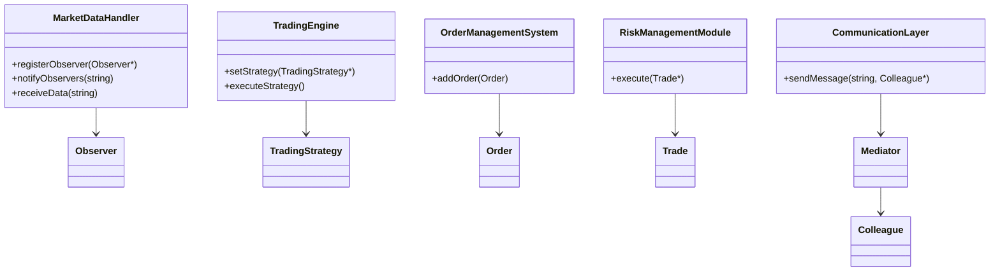

## 18.4 Case Study: Developing a Real-Time Trading System

In the fast-paced world of financial markets, real-time trading systems play a crucial role in executing trades with minimal latency. These systems require a robust architecture that can handle high-frequency data, ensure reliability, and maintain performance under heavy loads. In this case study, we will explore how to develop a real-time trading system using modern C++ design patterns. We will focus on combining multiple patterns to achieve performance and reliability, with a particular emphasis on handling concurrency and state management.

### Introduction to Real-Time Trading Systems

Real-time trading systems are designed to process and execute trades within milliseconds. They must handle a continuous stream of market data, make quick decisions based on predefined strategies, and execute trades while managing risk. The key challenges in developing such systems include:

- **Low Latency**: Minimizing the time between receiving market data and executing trades.
- **High Throughput**: Handling a large number of transactions per second.
- **Reliability**: Ensuring the system operates correctly under all conditions.
- **Scalability**: Adapting to increasing volumes of data and transactions.

To address these challenges, we will leverage several design patterns in C++ to build a scalable and efficient trading system.

### System Architecture Overview

Before diving into the design patterns, let's outline the architecture of our real-time trading system. The system consists of several key components:

1. **Market Data Handler**: Receives and processes real-time market data.
2. **Trading Engine**: Implements trading strategies and executes trades.
3. **Order Management System (OMS)**: Manages orders and maintains their state.
4. **Risk Management Module**: Ensures trades comply with risk policies.
5. **Communication Layer**: Facilitates communication between components.

The architecture is designed to be modular, allowing each component to be developed and tested independently. This modularity also enables us to apply different design patterns to each component as needed.

### Applying Design Patterns

In this section, we will explore how various design patterns can be applied to the components of our trading system. We will focus on patterns that address concurrency, state management, and performance optimization.

#### 1. Market Data Handler

The Market Data Handler is responsible for receiving and processing real-time market data. It must handle a high volume of data with minimal latency. To achieve this, we can use the **Observer Pattern** and **Reactor Pattern**.

**Observer Pattern**

The Observer Pattern is ideal for handling real-time data updates. It allows the Market Data Handler to notify multiple components (e.g., trading strategies, risk management) whenever new data is received.

```cpp
#include <iostream>
#include <vector>
#include <string>

// Observer interface
class Observer {
public:
    virtual void update(const std::string& data) = 0;
};

// MarketDataHandler class
class MarketDataHandler {
    std::vector<Observer*> observers;
public:
    void registerObserver(Observer* observer) {
        observers.push_back(observer);
    }

    void notifyObservers(const std::string& data) {
        for (auto observer : observers) {
            observer->update(data);
        }
    }

    void receiveData(const std::string& data) {
        // Simulate receiving market data
        std::cout << "Received data: " << data << std::endl;
        notifyObservers(data);
    }
};

// Example observer
class TradingStrategy : public Observer {
public:
    void update(const std::string& data) override {
        std::cout << "TradingStrategy received data: " << data << std::endl;
    }
};

int main() {
    MarketDataHandler handler;
    TradingStrategy strategy;
    handler.registerObserver(&strategy);

    handler.receiveData("Market data update");
    return 0;
}
```

**Reactor Pattern**

The Reactor Pattern is useful for handling multiple I/O events concurrently. It allows the Market Data Handler to efficiently manage incoming data streams.

```cpp
#include <iostream>
#include <thread>
#include <chrono>
#include <functional>
#include <vector>

// Event handler interface
class EventHandler {
public:
    virtual void handleEvent() = 0;
};

// Concrete event handler
class MarketDataEventHandler : public EventHandler {
public:
    void handleEvent() override {
        std::cout << "Handling market data event" << std::endl;
    }
};

// Reactor class
class Reactor {
    std::vector<EventHandler*> handlers;
public:
    void registerHandler(EventHandler* handler) {
        handlers.push_back(handler);
    }

    void run() {
        while (true) {
            for (auto handler : handlers) {
                handler->handleEvent();
            }
            std::this_thread::sleep_for(std::chrono::seconds(1));
        }
    }
};

int main() {
    Reactor reactor;
    MarketDataEventHandler handler;
    reactor.registerHandler(&handler);

    std::thread reactorThread([&reactor]() { reactor.run(); });
    reactorThread.join();
    return 0;
}
```

#### 2. Trading Engine

The Trading Engine is the core component that implements trading strategies and executes trades. It must be highly responsive and capable of handling concurrent operations. Here, we can use the **Strategy Pattern** and **Command Pattern**.

**Strategy Pattern**

The Strategy Pattern allows us to define different trading strategies and switch between them dynamically.

```cpp
#include <iostream>
#include <memory>

// Strategy interface
class TradingStrategy {
public:
    virtual void execute() = 0;
};

// Concrete strategy
class MeanReversionStrategy : public TradingStrategy {
public:
    void execute() override {
        std::cout << "Executing Mean Reversion Strategy" << std::endl;
    }
};

// Trading engine
class TradingEngine {
    std::unique_ptr<TradingStrategy> strategy;
public:
    void setStrategy(std::unique_ptr<TradingStrategy> newStrategy) {
        strategy = std::move(newStrategy);
    }

    void executeStrategy() {
        if (strategy) {
            strategy->execute();
        }
    }
};

int main() {
    TradingEngine engine;
    engine.setStrategy(std::make_unique<MeanReversionStrategy>());
    engine.executeStrategy();
    return 0;
}
```

**Command Pattern**

The Command Pattern encapsulates trading actions as objects, allowing for flexible execution and undo functionality.

```cpp
#include <iostream>
#include <vector>
#include <memory>

// Command interface
class Command {
public:
    virtual void execute() = 0;
};

// Concrete command
class BuyCommand : public Command {
    std::string stock;
    int quantity;
public:
    BuyCommand(const std::string& stock, int quantity) : stock(stock), quantity(quantity) {}

    void execute() override {
        std::cout << "Buying " << quantity << " shares of " << stock << std::endl;
    }
};

// Trading engine
class TradingEngine {
    std::vector<std::unique_ptr<Command>> commandQueue;
public:
    void addCommand(std::unique_ptr<Command> command) {
        commandQueue.push_back(std::move(command));
    }

    void executeCommands() {
        for (auto& command : commandQueue) {
            command->execute();
        }
        commandQueue.clear();
    }
};

int main() {
    TradingEngine engine;
    engine.addCommand(std::make_unique<BuyCommand>("AAPL", 100));
    engine.executeCommands();
    return 0;
}
```

#### 3. Order Management System (OMS)

The OMS manages the lifecycle of orders and maintains their state. It must ensure consistency and handle concurrent modifications. The **State Pattern** and **Singleton Pattern** can be applied here.

**State Pattern**

The State Pattern allows the OMS to manage the state transitions of orders.

```cpp
#include <iostream>
#include <memory>

// Forward declaration
class Order;

// State interface
class OrderState {
public:
    virtual void handle(Order* order) = 0;
};

// Order class
class Order {
    std::unique_ptr<OrderState> state;
public:
    Order(std::unique_ptr<OrderState> initialState) : state(std::move(initialState)) {}

    void setState(std::unique_ptr<OrderState> newState) {
        state = std::move(newState);
    }

    void process() {
        if (state) {
            state->handle(this);
        }
    }
};

// Concrete states
class NewOrderState : public OrderState {
public:
    void handle(Order* order) override {
        std::cout << "Processing new order" << std::endl;
        // Transition to next state
        order->setState(std::make_unique<ProcessedOrderState>());
    }
};

class ProcessedOrderState : public OrderState {
public:
    void handle(Order* order) override {
        std::cout << "Order already processed" << std::endl;
    }
};

int main() {
    Order order(std::make_unique<NewOrderState>());
    order.process();
    order.process();
    return 0;
}
```

**Singleton Pattern**

The Singleton Pattern ensures that the OMS has a single instance managing all orders.

```cpp
#include <iostream>
#include <memory>
#include <vector>

// Order class
class Order {
    std::string id;
public:
    Order(const std::string& id) : id(id) {}
    std::string getId() const { return id; }
};

// Order Management System (OMS) singleton
class OrderManagementSystem {
    std::vector<Order> orders;
    OrderManagementSystem() {}
public:
    static OrderManagementSystem& getInstance() {
        static OrderManagementSystem instance;
        return instance;
    }

    void addOrder(const Order& order) {
        orders.push_back(order);
        std::cout << "Order added: " << order.getId() << std::endl;
    }
};

int main() {
    OrderManagementSystem& oms = OrderManagementSystem::getInstance();
    oms.addOrder(Order("Order1"));
    oms.addOrder(Order("Order2"));
    return 0;
}
```

#### 4. Risk Management Module

The Risk Management Module ensures that all trades comply with predefined risk policies. It must be able to evaluate trades quickly and efficiently. The **Decorator Pattern** can be used to add risk checks dynamically.

**Decorator Pattern**

The Decorator Pattern allows us to add risk checks to trades without modifying the core trading logic.

```cpp
#include <iostream>
#include <memory>

// Trade interface
class Trade {
public:
    virtual void execute() = 0;
};

// Concrete trade
class BasicTrade : public Trade {
public:
    void execute() override {
        std::cout << "Executing basic trade" << std::endl;
    }
};

// Decorator base class
class TradeDecorator : public Trade {
protected:
    std::unique_ptr<Trade> trade;
public:
    TradeDecorator(std::unique_ptr<Trade> trade) : trade(std::move(trade)) {}
};

// Risk check decorator
class RiskCheckDecorator : public TradeDecorator {
public:
    RiskCheckDecorator(std::unique_ptr<Trade> trade) : TradeDecorator(std::move(trade)) {}

    void execute() override {
        std::cout << "Performing risk check" << std::endl;
        trade->execute();
    }
};

int main() {
    std::unique_ptr<Trade> trade = std::make_unique<BasicTrade>();
    std::unique_ptr<Trade> riskCheckedTrade = std::make_unique<RiskCheckDecorator>(std::move(trade));
    riskCheckedTrade->execute();
    return 0;
}
```

#### 5. Communication Layer

The Communication Layer facilitates communication between components. It must be efficient and reliable. The **Mediator Pattern** can be used to centralize communication and reduce coupling.

**Mediator Pattern**

The Mediator Pattern centralizes communication between components, reducing direct dependencies.

```cpp
#include <iostream>
#include <string>
#include <vector>

// Forward declaration
class Colleague;

// Mediator interface
class Mediator {
public:
    virtual void sendMessage(const std::string& message, Colleague* colleague) = 0;
};

// Colleague interface
class Colleague {
protected:
    Mediator* mediator;
public:
    Colleague(Mediator* mediator) : mediator(mediator) {}
    virtual void receiveMessage(const std::string& message) = 0;
};

// Concrete colleague
class TradingColleague : public Colleague {
public:
    TradingColleague(Mediator* mediator) : Colleague(mediator) {}

    void sendMessage(const std::string& message) {
        mediator->sendMessage(message, this);
    }

    void receiveMessage(const std::string& message) override {
        std::cout << "TradingColleague received: " << message << std::endl;
    }
};

// Concrete mediator
class TradingMediator : public Mediator {
    std::vector<Colleague*> colleagues;
public:
    void addColleague(Colleague* colleague) {
        colleagues.push_back(colleague);
    }

    void sendMessage(const std::string& message, Colleague* sender) override {
        for (auto colleague : colleagues) {
            if (colleague != sender) {
                colleague->receiveMessage(message);
            }
        }
    }
};

int main() {
    TradingMediator mediator;
    TradingColleague colleague1(&mediator);
    TradingColleague colleague2(&mediator);

    mediator.addColleague(&colleague1);
    mediator.addColleague(&colleague2);

    colleague1.sendMessage("Trade executed");
    return 0;
}
```

### Handling Concurrency and State Management

Concurrency and state management are critical aspects of a real-time trading system. Let's explore how to handle these aspects effectively.

#### Concurrency

Concurrency is essential for achieving high throughput and low latency. C++ provides several features and libraries to manage concurrency, such as `std::thread`, `std::mutex`, and `std::async`.

- **Thread Management**: Use `std::thread` to create and manage threads. Ensure proper synchronization using `std::mutex` and `std::lock_guard`.

```cpp
#include <iostream>
#include <thread>
#include <mutex>

std::mutex mtx;

void processTrade(int tradeId) {
    std::lock_guard<std::mutex> lock(mtx);
    std::cout << "Processing trade: " << tradeId << std::endl;
}

int main() {
    std::thread t1(processTrade, 1);
    std::thread t2(processTrade, 2);

    t1.join();
    t2.join();
    return 0;
}
```

- **Asynchronous Tasks**: Use `std::async` to execute tasks asynchronously and retrieve results using `std::future`.

```cpp
#include <iostream>
#include <future>

int calculateRisk(int tradeId) {
    std::cout << "Calculating risk for trade: " << tradeId << std::endl;
    return tradeId * 10; // Simulated risk calculation
}

int main() {
    std::future<int> result = std::async(std::launch::async, calculateRisk, 1);
    std::cout << "Risk value: " << result.get() << std::endl;
    return 0;
}
```

#### State Management

State management is crucial for maintaining the consistency of orders and trades. The **State Pattern** and **Singleton Pattern** can be used to manage state transitions and ensure a single source of truth.

- **State Pattern**: Use the State Pattern to encapsulate state transitions and logic within state classes.

- **Singleton Pattern**: Use the Singleton Pattern to ensure a single instance of the OMS manages all orders.

### Visualizing the System Architecture

To better understand the architecture of our real-time trading system, let's visualize the components and their interactions using a class diagram.



### Try It Yourself

Now that we've explored the design patterns and architecture of a real-time trading system, it's time to experiment with the code. Here are some suggestions for modifications:

- **Implement Additional Strategies**: Add more trading strategies to the Trading Engine and switch between them dynamically.
- **Enhance Risk Management**: Add more risk checks using the Decorator Pattern.
- **Improve Concurrency**: Experiment with different concurrency models, such as thread pools or task-based parallelism.
- **Extend the OMS**: Add more states to the Order Management System and handle complex state transitions.

### Knowledge Check

To reinforce your understanding of the concepts covered in this case study, consider the following questions:

- How does the Observer Pattern help in handling real-time data updates?
- What are the benefits of using the Strategy Pattern in a trading engine?
- How does the State Pattern facilitate state management in an Order Management System?
- Why is the Singleton Pattern useful in managing a single instance of the OMS?
- How can concurrency be effectively managed in a real-time trading system?

### Conclusion

Developing a real-time trading system requires careful consideration of design patterns, concurrency, and state management. By leveraging modern C++ design patterns, we can build a scalable and efficient system that meets the demands of high-frequency trading. Remember, this is just the beginning. As you progress, you'll build more complex and interactive systems. Keep experimenting, stay curious, and enjoy the journey!

## Quiz Time!



### How does the Observer Pattern help in handling real-time data updates?

- [x] It allows multiple components to be notified of data changes.
- [ ] It processes data updates sequentially.
- [ ] It stores data updates for later processing.
- [ ] It prevents data updates from being lost.

> **Explanation:** The Observer Pattern allows multiple components to be notified of data changes, enabling real-time updates.

### What is the primary benefit of using the Strategy Pattern in a trading engine?

- [x] It allows dynamic switching between different trading strategies.
- [ ] It ensures all trades are executed in the same manner.
- [ ] It simplifies the trading engine's architecture.
- [ ] It reduces the number of trading strategies needed.

> **Explanation:** The Strategy Pattern allows dynamic switching between different trading strategies, providing flexibility.

### How does the State Pattern facilitate state management in an Order Management System?

- [x] It encapsulates state transitions and logic within state classes.
- [ ] It uses a single state for all orders.
- [ ] It eliminates the need for state management.
- [ ] It handles state transitions automatically.

> **Explanation:** The State Pattern encapsulates state transitions and logic within state classes, making state management more organized.

### Why is the Singleton Pattern useful in managing a single instance of the OMS?

- [x] It ensures there is only one instance of the OMS managing all orders.
- [ ] It allows multiple instances of the OMS to manage orders.
- [ ] It simplifies the OMS's architecture.
- [ ] It eliminates the need for order management.

> **Explanation:** The Singleton Pattern ensures there is only one instance of the OMS managing all orders, providing a single source of truth.

### How can concurrency be effectively managed in a real-time trading system?

- [x] By using threads and synchronization mechanisms.
- [ ] By processing all tasks sequentially.
- [ ] By avoiding the use of threads.
- [ ] By using a single thread for all operations.

> **Explanation:** Concurrency can be effectively managed by using threads and synchronization mechanisms to handle multiple tasks simultaneously.

### What role does the Decorator Pattern play in the Risk Management Module?

- [x] It adds risk checks dynamically to trades.
- [ ] It simplifies the risk management logic.
- [ ] It eliminates the need for risk checks.
- [ ] It ensures all trades pass risk checks.

> **Explanation:** The Decorator Pattern adds risk checks dynamically to trades, enhancing the flexibility of the risk management module.

### What is the purpose of the Mediator Pattern in the Communication Layer?

- [x] It centralizes communication between components.
- [ ] It allows direct communication between components.
- [ ] It eliminates the need for communication.
- [ ] It simplifies the communication protocol.

> **Explanation:** The Mediator Pattern centralizes communication between components, reducing direct dependencies.

### How does the Reactor Pattern help in handling I/O events?

- [x] It efficiently manages multiple I/O events concurrently.
- [ ] It processes I/O events sequentially.
- [ ] It stores I/O events for later processing.
- [ ] It prevents I/O events from being lost.

> **Explanation:** The Reactor Pattern efficiently manages multiple I/O events concurrently, improving performance.

### What is the advantage of using `std::async` for asynchronous tasks?

- [x] It allows tasks to be executed asynchronously and results to be retrieved later.
- [ ] It ensures tasks are executed sequentially.
- [ ] It eliminates the need for task execution.
- [ ] It simplifies task management.

> **Explanation:** `std::async` allows tasks to be executed asynchronously and results to be retrieved later, providing flexibility.

### True or False: The Singleton Pattern can be used to manage multiple instances of a component.

- [ ] True
- [x] False

> **Explanation:** False. The Singleton Pattern is used to ensure there is only one instance of a component.


